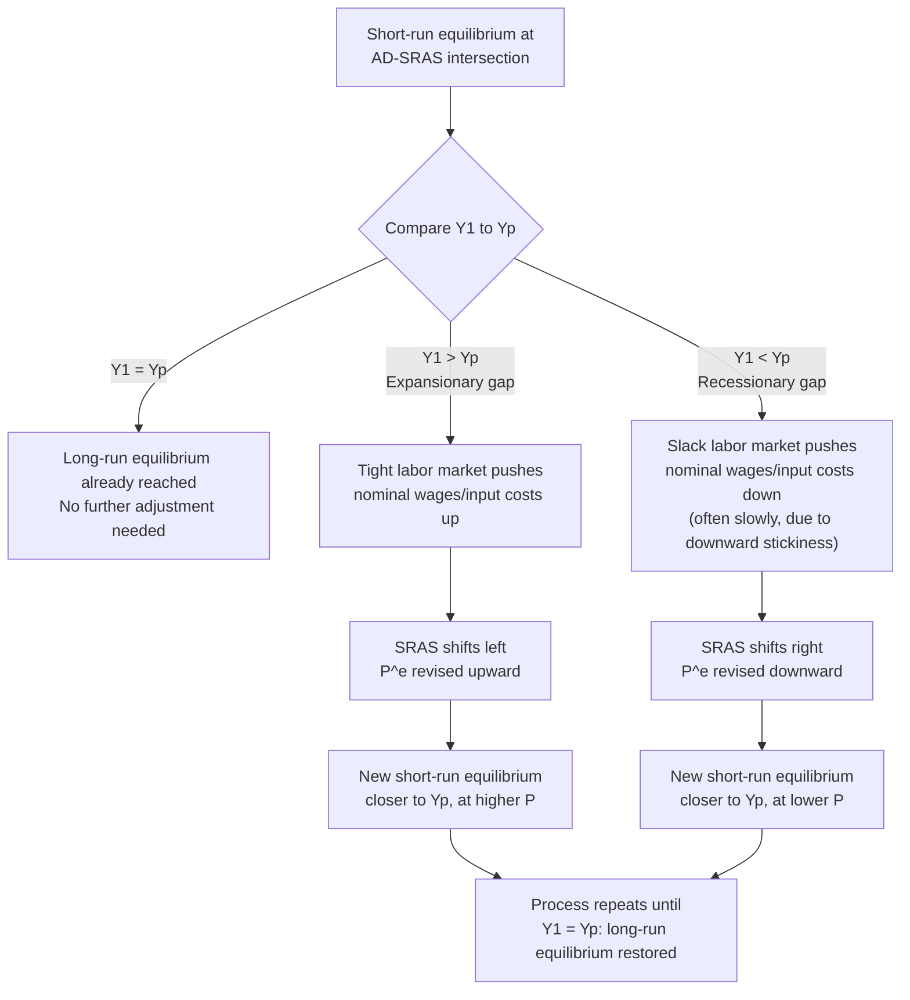

## Short-Run Equilibrium in the AD-AS Model

### Overview

Short-run equilibrium in the AD-AS model occurs at the price level and output level where the aggregate demand (AD) curve intersects the short-run aggregate supply (SRAS) curve. This equilibrium determines the economy's actual output and price level *before* full wage/price adjustment has occurred, and it is the central analytical tool for evaluating the immediate impact of demand-side and supply-side shocks, as well as fiscal and monetary policy actions.

### Defining Short-Run Equilibrium

**Key Points**

- Short-run equilibrium is the unique point $(Y_1, P_1)$ where the quantity of real output demanded (from AD) exactly equals the quantity of real output supplied (from SRAS).
- This equilibrium need **not** coincide with potential output $Y_p$ — the economy can be in short-run equilibrium while simultaneously operating above, at, or below its long-run capacity.
- Short-run equilibrium is inherently a temporary resting point: unless $Y_1 = Y_p$, the economy will experience further adjustment (via changing expectations and input costs) until it converges to long-run equilibrium.

Formally, equilibrium requires:

$$Y^{AD}(P) = Y^{SRAS}(P)$$

Solved simultaneously for the equilibrium price level $P_1$ and output $Y_1$.

### The Three Possible Short-Run Equilibrium States

#### 1. Equilibrium at Potential Output (Long-Run Equilibrium Coincides)

$Y_1 = Y_p$. The economy is simultaneously in short-run *and* long-run equilibrium — SRAS, AD, and LRAS all intersect at a single point. There is no tendency for further adjustment absent a new shock; this is often called a state of **full employment equilibrium**.

#### 2. Expansionary (Inflationary) Gap

$Y_1 > Y_p$. Output exceeds potential; unemployment is below the natural rate. This occurs when AD is relatively high (or SRAS relatively favorable) such that the SRAS-AD intersection lies to the right of the vertical LRAS line.

#### 3. Recessionary Gap

$Y_1 < Y_p$. Output falls short of potential; unemployment exceeds the natural rate. This occurs when AD is relatively low (or SRAS relatively unfavorable) such that the SRAS-AD intersection lies to the left of the vertical LRAS line.

### Diagram: The Three Equilibrium Cases

<svg viewBox="0 0 760 520" xmlns="http://www.w3.org/2000/svg" font-family="Arial, sans-serif">
<text x="380" y="26" font-size="16" font-weight="bold" text-anchor="middle">Short-Run Equilibrium: Three Possible Cases (svg_diagram)</text>
<!-- Axes -->
<line x1="90" y1="460" x2="700" y2="460" stroke="black" stroke-width="2"/>
<line x1="90" y1="460" x2="90" y2="80" stroke="black" stroke-width="2"/>
<text x="710" y="465" font-size="13">Real GDP (Y)</text>
<text x="45" y="75" font-size="13">Price Level (P)</text>
<!-- LRAS vertical -->
<line x1="400" y1="440" x2="400" y2="100" stroke="#7f8c8d" stroke-width="2" stroke-dasharray="6,4"/>
<text x="405" y="115" font-size="13" fill="#7f8c8d" font-weight="bold">LRAS (Yp)</text>
<!-- SRAS -->
<path d="M 150 420 Q 300 300 550 150" stroke="#2980b9" stroke-width="3" fill="none"/>
<text x="555" y="150" font-size="13" fill="#2980b9" font-weight="bold">SRAS</text>
<!-- AD1: intersects left of LRAS (recessionary gap) -->
<path d="M 200 130 Q 280 250 340 420" stroke="#c0392b" stroke-width="2.5" fill="none"/>
<text x="180" y="120" font-size="12" fill="#c0392b">AD (recessionary)</text>
<circle cx="325" cy="330" r="5" fill="#c0392b"/>
<!-- AD2: intersects exactly at LRAS -->
<path d="M 260 130 Q 350 260 420 420" stroke="#27ae60" stroke-width="2.5" fill="none"/>
<text x="440" y="140" font-size="12" fill="#27ae60">AD (full employment)</text>
<circle cx="400" cy="270" r="5" fill="#27ae60"/>
<!-- AD3: intersects right of LRAS (expansionary gap) -->
<path d="M 330 130 Q 430 240 500 420" stroke="#8e44ad" stroke-width="2.5" fill="none"/>
<text x="510" y="200" font-size="12" fill="#8e44ad">AD (expansionary)</text>
<circle cx="460" cy="215" r="5" fill="#8e44ad"/>
<!-- Labels for gaps -->

<text x="270" y="480" font-size="12" fill="`#c0392b`">Recessionary gap: Y < Yp</text>

<text x="440" y="480" font-size="12" fill="`#8e44ad`">Expansionary gap: Y > Yp</text>

</svg>

### Solving for Short-Run Equilibrium Algebraically

Using the simplified linear forms developed elsewhere in this framework:

$$\text{AD: } Y = \frac{MV}{P} \quad \text{(or, more generally, a downward-sloping function of } P\text{)}$$

$$\text{SRAS: } Y = Y_p + \alpha(P - P^e)$$

Setting them equal to solve for equilibrium $P_1$ requires the specific functional forms; a common simplified linear approximation for classroom use replaces the AD hyperbola with a linear approximation around the relevant range:

$$Y^{AD} = A - bP$$

Where $A$ is an autonomous spending/AD position parameter and $b > 0$ is AD's sensitivity to the price level. Setting $Y^{AD} = Y^{SRAS}$:

$$A - bP = Y_p + \alpha(P - P^e)$$

Solving for $P_1$:

$$P_1 = \frac{A - Y_p + \alpha P^e}{b + \alpha}$$

And substituting back to find $Y_1$ from either equation.

### Numerical Example

Let $A = 2500$, $b = 5$, $Y_p = 2000$, $\alpha = 40$, and $P^e = 100$.

$$P_1 = \frac{2500 - 2000 + 40(100)}{5+40} = \frac{500 + 4000}{45} = \frac{4500}{45} = 100$$

Substituting into SRAS: $Y_1 = 2000 + 40(100-100) = 2000$.

In this case, $Y_1 = Y_p = 2000$: the economy happens to be in **full-employment equilibrium**, with $P_1 = P^e$, consistent with agents having correctly anticipated the price level.

**Now suppose AD rises unexpectedly** (e.g., due to expansionary fiscal policy), with $A$ rising to 2900 while $P^e$ remains at 100 (expectations have not yet adjusted):

$$P_1 = \frac{2900 - 2000 + 40(100)}{45} = \frac{900+4000}{45} = \frac{4900}{45} \approx 108.9$$

$$Y_1 = 2000 + 40(108.9-100) = 2000 + 356 = 2356$$

The new short-run equilibrium has $Y_1 = 2356 > Y_p = 2000$: an **expansionary gap** has opened up, with the price level also rising from 100 to approximately 108.9.

### Adjustment Toward Long-Run Equilibrium

### Comparative Statics: Effects of Shifting AD or SRAS

| Shock | Effect on $P_1$ | Effect on $Y_1$ | Resulting Gap |
| --- | --- | --- | --- |
| AD increases (rightward shift) | Rises | Rises | Expansionary gap (if starting from $Y_p$) |
| AD decreases (leftward shift) | Falls | Falls | Recessionary gap |
| SRAS increases/favorable (rightward shift) | Falls | Rises | Expansionary gap |
| SRAS decreases/adverse (leftward shift) | Rises | Falls | Recessionary gap (stagflation if starting from $Y_p$) |
| Simultaneous AD increase and adverse SRAS shift | Ambiguous magnitude, generally rises | Ambiguous — depends on relative magnitudes | Depends on relative shift sizes |

**Key Points**

- A rightward AD shift and a rightward SRAS shift both raise output but move the price level in *opposite* directions — this is the standard diagnostic for distinguishing demand-driven versus supply-driven output changes discussed in supply-shock analysis.
- When both curves shift simultaneously (a common real-world scenario, e.g., pandemic-era combined demand stimulus and supply-chain disruption), the net effect on $P_1$ and $Y_1$ becomes ambiguous without knowing the *relative magnitudes* of each shift — a key reason real-time diagnosis of economic conditions is empirically difficult.

### The Special Role of Unanticipated vs. Anticipated Shocks

**[Inference]** Under the imperfect-information/Lucas-style SRAS microfoundation specifically, only *unanticipated* AD shifts move short-run equilibrium away from $Y_p$; a fully anticipated AD change would already be embedded in $P^e$, leaving the SRAS curve's *position* — and hence the short-run equilibrium output — unaffected by the change (Policy Ineffectiveness Proposition). Under sticky-wage or sticky-price microfoundations, by contrast, even *anticipated* AD or policy changes can still generate a temporary gap, because existing wage or price contracts remain fixed for their contracted duration regardless of what firms and workers correctly anticipate happening to the price level in the interim.

### Short-Run Equilibrium and the Business Cycle

**Key Points**

- The sequence of short-run equilibria over time, as AD and SRAS repeatedly shift due to shocks and gradually converge back toward $Y_p$, *is* the formal AD-AS-based description of the business cycle: alternating expansions (expansionary gaps) and recessions (recessionary gaps) around the long-run trend of potential output.
- The **output gap**, $Y_1 - Y_p$ (often expressed as a percentage of $Y_p$), is the standard summary statistic used to describe how far a given short-run equilibrium deviates from long-run capacity, and is closely related to the **unemployment gap** via Okun's Law.
- Because recessionary and expansionary gaps generally correct via *different* speed mechanisms (downward wage/price stickiness typically making the recessionary adjustment process slower than the expansionary one), the resulting business cycle is generally **asymmetric**: recessions can be sharp but slow to self-correct, while overheating episodes may resolve more quickly through rising costs and tightening SRAS.

### Common Misconceptions

- **Misconception**: Short-run equilibrium always equals potential output. **Correction**: short-run equilibrium is wherever AD and SRAS happen to intersect at a given moment — it coincides with $Y_p$ only when $P = P^e$, which is a special case, not the general rule.
- **Misconception**: The economy instantly jumps to a new short-run equilibrium and stays there. **Correction**: short-run equilibrium is itself a moving target as SRAS continuously shifts in response to evolving expectations, so "the" short-run equilibrium at any moment is really one point along an ongoing adjustment path toward long-run equilibrium.
- **Misconception**: An expansionary gap is straightforwardly "good" because output is higher. **Correction**: an expansionary gap reflects output above sustainable potential, generally associated with rising inflationary pressure and, per standard analysis, tends to be temporary and self-reversing as costs rise — it is not treated as a costless or persistently desirable state in standard macroeconomic theory.

**Related Topics**

- Deriving the aggregate demand curve
- Deriving the aggregate supply curve
- Short-run versus long-run aggregate supply
- Supply shocks and their macroeconomic effects
- Output gap and Okun's Law
- Self-correction mechanism and long-run adjustment
- Business cycle phases and dating
- Fiscal and monetary policy effects on short-run equilibrium