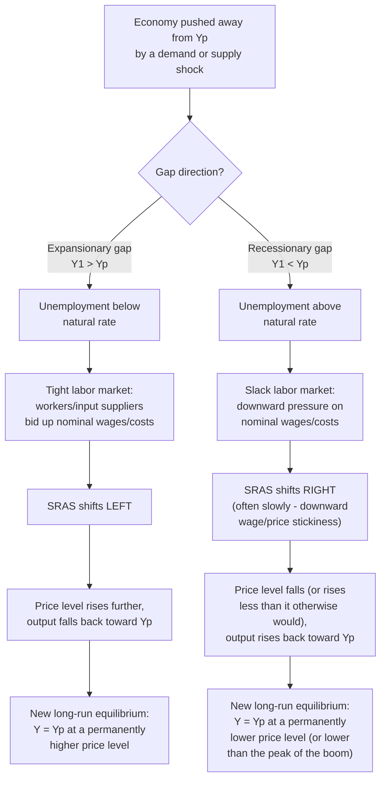

## Long-Run Equilibrium and Self-Correction

### Overview

The self-correction mechanism describes the process by which an economy, disturbed away from potential output by a demand or supply shock, automatically returns to long-run equilibrium — output equal to potential ($Y = Y_p$) — without requiring deliberate policy intervention. This mechanism operates entirely through the gradual adjustment of the SRAS curve, driven by changing input costs and expectations, and represents one of the central theoretical claims distinguishing classical/self-correcting views of the macroeconomy from Keynesian views emphasizing the potential need for active stabilization policy.

### Defining Long-Run Equilibrium

**Key Points**

- Long-run equilibrium occurs where AD, SRAS, and LRAS **all three** intersect at a single point: $Y = Y_p$.
- At long-run equilibrium, the actual price level equals the expected price level ($P = P^e$), so there is no further incentive for wages, prices, or expectations to change — the economy is at rest absent a new shock.
- Short-run equilibrium (AD intersecting SRAS) can occur at many different output levels; long-run equilibrium is a *specific* subset of short-run equilibria — namely, those that also lie on the vertical LRAS line.

### The Self-Correction Mechanism: General Logic

### Case 1: Self-Correction from an Expansionary Gap

#### Step-by-Step Process

1. AD increases (e.g., due to a demand shock or expansionary policy), moving the economy along SRAS to $Y_1 > Y_p$.
2. Unemployment falls below the natural rate; labor and other input markets tighten.
3. Workers, recognizing that unexpectedly high inflation has eroded their real wages relative to what they targeted, negotiate higher nominal wages at the next opportunity (contract renewal, informal renegotiation).
4. Rising nominal wages raise firms' production costs, shifting SRAS **leftward**.
5. As SRAS shifts left, the economy moves along the (now fixed) AD curve to a higher price level and lower output — continuing until output returns exactly to $Y_p$.
6. The final long-run equilibrium has $Y = Y_p$, but at a **permanently higher price level** than before the original shock — the "one-time inflationary cost" of the demand expansion has become embedded once expectations and wages fully catch up.

#### Diagram: Expansionary Gap Self-Correction

<svg xmlns="http://www.w3.org/2000/svg" viewBox="0 0 740 500" font-family="Arial, sans-serif">
<text x="370" y="26" font-size="16" font-weight="bold" text-anchor="middle">Self-Correction from an Expansionary Gap (svg_diagram)</text>
<line x1="90" y1="440" x2="680" y2="440" stroke="black" stroke-width="2" />
<line x1="90" y1="440" x2="90" y2="80" stroke="black" stroke-width="2" />
<text x="690" y="445" font-size="13">Real GDP (Y)</text>
<text x="45" y="75" font-size="13">Price Level (P)</text>

<line x1="400" y1="420" x2="400" y2="100" stroke="#7f8c8d" stroke-width="2" stroke-dasharray="6,4" />
<text x="405" y="115" font-size="13" fill="#7f8c8d" font-weight="bold">LRAS</text>

<path d="M 150 400 Q 300 300 550 150" stroke="#2980b9" stroke-width="2.5" fill="none" />
<text x="555" y="150" font-size="12" fill="#2980b9">SRAS0</text>

<path d="M 130 350 Q 250 260 400 120" stroke="#8e44ad" stroke-width="2.5" fill="none" stroke-dasharray="6,3" />
<text x="150" y="115" font-size="12" fill="#8e44ad">SRAS1 (after wage rise)</text>

<path d="M 250 130 Q 400 260 560 400" stroke="#c0392b" stroke-width="2.5" fill="none" />
<text x="565" y="402" font-size="12" fill="#c0392b">AD</text>

<circle cx="480" cy="230" r="5" fill="black" />
<text x="490" y="225" font-size="12">Initial short-run: Y &gt; Yp</text>

<circle cx="400" cy="180" r="5" fill="#8e44ad" />
<text x="230" y="175" font-size="12" fill="#8e44ad">Final: Y = Yp, higher P</text>
</svg>

### Case 2: Self-Correction from a Recessionary Gap

#### Step-by-Step Process

1. AD decreases (e.g., due to a fall in consumer confidence or contractionary policy), moving the economy along SRAS to $Y_1 < Y_p$.
2. Unemployment rises above the natural rate; labor markets slacken.
3. In principle, workers should accept lower nominal wages to restore full employment, and firms' costs should fall, shifting SRAS **rightward**.
4. **[Inference]** In practice, this downward adjustment tends to be considerably slower than the upward adjustment in Case 1, due to **downward nominal wage rigidity** — factors such as minimum wage laws, long-term contracts, union bargaining power, and worker resistance to nominal pay cuts (even when real purchasing power might be preserved through other means) make it politically and practically difficult for firms to cut nominal wages.
5. Eventually, if and when wages and other costs do fall (or, alternatively, if productivity growth allows real costs to fall without nominal wage cuts), SRAS shifts rightward, and the economy moves along AD to a lower price level and output returning to $Y_p$.
6. The final long-run equilibrium again has $Y = Y_p$, generally at a **lower price level** than the short-run recessionary equilibrium — though the *speed* of this correction is a central point of theoretical and policy disagreement.

### The Central Debate: How Fast Does Self-Correction Actually Work?

| View | Position on Self-Correction Speed | Policy Implication |
| --- | --- | --- |
| Classical / New Classical | Self-correction is relatively fast; wages and prices adjust quickly, particularly under rational expectations | Minimal need for active stabilization policy; "hands-off" approach preferred |
| Keynesian / New Keynesian | Self-correction, especially from recessionary gaps, can be slow and painful due to downward wage/price stickiness | Active fiscal/monetary stabilization policy justified to speed up the return to $Y_p$ and reduce unemployment/output losses in the interim |
| Monetarist | Self-correction works but with variable, often long and unpredictable lags; monetary policy should focus on steady, rule-based growth in the money supply rather than discretionary fine-tuning | Rules-based policy preferred over discretionary countercyclical intervention |

**[Inference]** This disagreement over the *speed* (not the ultimate existence) of self-correction is one of the most enduring and consequential debates in macroeconomics, directly shaping the case for or against activist stabilization policy: if self-correction is fast, the costs of "waiting it out" during a recession are small, and activist policy risks doing more harm than good (e.g., through mistimed intervention or induced inflation); if self-correction is slow, the costs of waiting (prolonged unemployment, lost output) can be substantial, strengthening the case for policy intervention to accelerate the return to potential output.

### Numerical Illustration of the Full Self-Correction Path

Using the SRAS equation $Y = Y_p + \alpha(P - P^e)$ with $Y_p = 2000$, $\alpha = 40$:

**Period 0 (initial long-run equilibrium):** $P = P^e = 100$, $Y = 2000$.

**Period 1 (AD falls unexpectedly):** New short-run equilibrium found where AD intersects SRAS (with $P^e$ still at 100) gives $P_1 = 92$, $Y_1 = 2000 + 40(92-100) = 2000 - 320 = 1680$ — a recessionary gap of $-320$.

**Period 2 (partial wage/price adjustment as $P^e$ falls toward $P_1$):** Suppose $P^e$ adjusts halfway, to 96. New short-run equilibrium (solving simultaneously with unchanged AD) might yield $P_2 = 94$, $Y_2 = 2000+40(94-96) = 2000-80=1920$ — the gap has narrowed substantially, from $-320$ to $-80$.

**Period 3 (full adjustment):** $P^e$ converges to the new equilibrium price level $P_3 = 93$ (illustrative), giving $Y_3 = 2000+40(93-93) = 2000$. Output has fully returned to $Y_p$, at a permanently lower price level than the original 100 — the deflationary/disinflationary consequence of the demand contraction has been fully absorbed into the new long-run price level.

**[Inference]** The *number of periods* this convergence takes in the numerical example is illustrative and stylized; in reality, the pace of convergence depends on the specific institutional speed of wage/price adjustment in the economy under study (contract lengths, degree of indexation, monetary policy credibility) and is not pinned down by the simple algebraic framework alone.

### Self-Correction and the Role of Expectations

**Key Points**

- The entire self-correction mechanism operates through the *updating of $P^e$* — it is fundamentally a story about how expectations (and the wage/price contracts built on them) eventually catch up with reality.
- Under rational expectations combined with fully flexible wages/prices (the New Classical extreme), self-correction could in principle be nearly instantaneous for *anticipated* shocks, since $P^e$ would already reflect the shock's expected effects before it even occurs.
- Under adaptive expectations (where $P^e$ is formed by extrapolating recent past inflation) combined with sticky wages/prices, self-correction is inherently gradual and backward-looking, since $P^e$ only catches up with actual outcomes over successive periods as new information accumulates.

### Self-Correction versus Hysteresis: A Key Complication

**[Inference]** The standard self-correction narrative assumes that $Y_p$ itself remains fixed throughout the adjustment process — the economy eventually returns to the *same* potential output level that prevailed before the shock. The hysteresis hypothesis (discussed in the context of supply shocks) challenges this assumption for sufficiently deep or prolonged recessionary gaps: if the recession is severe or long enough, it may itself permanently damage productive capacity (via skill atrophy among the long-term unemployed, reduced investment, or reduced innovation), lowering $Y_p$ itself. In this case, the economy technically still "self-corrects" in the sense of returning to *a* long-run equilibrium where $Y = Y_p$, but $Y_p$ is now permanently lower than it would otherwise have been — a considerably less benign outcome than the standard textbook self-correction story implies.

### Policy Implications

- The existence of a self-correction mechanism does not by itself settle the question of whether policy intervention is *desirable* — it depends on the mechanism's *speed* relative to the social costs of waiting (unemployment, lost output, potential hysteresis effects).
- A key argument for active stabilization policy is that it can *substitute for*, or *accelerate*, the self-correction process by shifting AD directly (rather than waiting for SRAS to shift via slow wage/price adjustment) — effectively closing the gap faster than the automatic mechanism would on its own.
- A key argument against active stabilization policy (or for caution in using it) is that self-correction, even if slow, is automatic and does not carry the risks of policy mistiming, incorrect diagnosis of the shock, or unintended long-run consequences (e.g., embedding permanently higher inflation expectations) that discretionary intervention can introduce.

### Common Misconceptions

- **Misconception**: Self-correction means the economy always returns to exactly the same price level it started at. **Correction**: self-correction returns output to $Y_p$, but the price level generally settles at a *different* (higher, following an expansionary gap; lower, following a recessionary gap) level than before the shock — only output, not the price level, returns to its original position.
- **Misconception**: Self-correction happens at the same speed regardless of the direction of the gap. **Correction**: due to downward wage/price stickiness, the self-correction process from a recessionary gap is generally slower and more asymmetric than from an expansionary gap in most standard treatments.
- **Misconception**: If self-correction eventually works, active policy is always unnecessary. **Correction**: the debate is precisely about whether the "eventually" is fast enough to make waiting preferable to the potential costs (and risks) of intervention — this remains a genuinely contested empirical and theoretical question, not one resolved simply by the existence of the mechanism.

**Related Topics**

- Short-run versus long-run aggregate supply
- Short-run equilibrium in the AD-AS model
- Supply shocks and their macroeconomic effects (hysteresis discussion)
- Sticky wage models of aggregate supply
- Rational versus adaptive expectations
- Fiscal and monetary stabilization policy debates
- Output gap and Okun's Law
- New Keynesian Phillips curve derivation