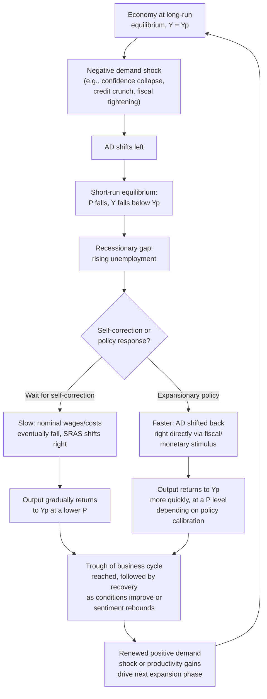

## Demand Shocks and Business Cycle Fluctuations

### Overview

A demand shock is a sudden, often unanticipated change in one or more components of aggregate expenditure ($C$, $I$, $G$, or $NX$) that shifts the entire AD curve, distinct from a supply shock, which shifts SRAS or LRAS. Demand shocks are widely regarded as the primary driver of most conventional business cycle fluctuations, and their signature co-movement pattern — price level and output moving in the *same* direction — is a key empirical marker used to identify them relative to supply-side disturbances.

### Classification of Demand Shocks

**Key Points**

- **Positive (expansionary) demand shocks** shift AD rightward, raising both the price level and output in the short run.
- **Negative (contractionary) demand shocks** shift AD leftward, lowering both the price level and output in the short run — this is the standard textbook description of the onset of a **recession**.
- Demand shocks can originate from private-sector behavior (autonomous changes in consumer or business sentiment) or from policy actions (deliberate fiscal or monetary stimulus/contraction).

### Sources of Demand Shocks by Expenditure Component

#### Consumption ($C$) Shocks

- Sudden shifts in consumer confidence or sentiment (e.g., following a financial crisis, geopolitical event, or pandemic).
- Wealth effects from asset price movements (stock market booms/crashes, housing price swings) that are *independent* of the domestic price level.
- Changes in household access to credit (credit availability shocks).
- Tax policy changes affecting disposable income.

#### Investment ($I$) Shocks

- Shifts in business confidence and expected future profitability ("animal spirits," in the Keynesian tradition).
- Changes in the cost of capital driven by monetary policy (deliberate interest rate changes, distinct from the price-level-induced real money supply channel).
- Technological changes that alter the expected return on new capital investment.
- Financial market disruptions affecting firms' access to credit for investment financing.

#### Government Purchases ($G$) Shocks

- Discretionary fiscal policy changes (deliberate spending increases or cuts).
- Automatic changes tied to economic conditions (e.g., unemployment insurance payouts, though these are more precisely automatic stabilizers than exogenous shocks).
- Large one-time events requiring substantial government spending (wars, natural disaster response, major infrastructure programs).

#### Net Export ($NX$) Shocks

- Changes in foreign income/growth affecting demand for a country's exports.
- Exchange rate movements driven by capital flows, foreign monetary policy, or shifts in investor sentiment (independent of the domestic price level channel already embedded in the AD curve's downward slope).
- Trade policy changes (tariffs, quotas, trade agreements).

### Diagrammatic Analysis: Positive and Negative Demand Shocks

<svg xmlns="http://www.w3.org/2000/svg" viewBox="0 0 740 500" font-family="Arial, sans-serif">
<text x="370" y="26" font-size="16" font-weight="bold" text-anchor="middle">Demand Shocks: AD Shifts and Short-Run Effects (svg_diagram)</text>
<line x1="90" y1="440" x2="680" y2="440" stroke="black" stroke-width="2" />
<line x1="90" y1="440" x2="90" y2="80" stroke="black" stroke-width="2" />
<text x="690" y="445" font-size="13">Real GDP (Y)</text>
<text x="45" y="75" font-size="13">Price Level (P)</text>

<line x1="400" y1="420" x2="400" y2="100" stroke="#7f8c8d" stroke-width="2" stroke-dasharray="6,4" />
<text x="405" y="115" font-size="12" fill="#7f8c8d">LRAS</text>

<path d="M 140 400 Q 300 280 580 140" stroke="#2980b9" stroke-width="2.5" fill="none" />
<text x="585" y="140" font-size="12" fill="#2980b9">SRAS</text>

<path d="M 260 130 Q 380 260 470 400" stroke="black" stroke-width="2.5" fill="none" />
<text x="270" y="120" font-size="12">AD0 (original)</text>

<path d="M 170 150 Q 280 280 360 400" stroke="#c0392b" stroke-width="2.5" fill="none" stroke-dasharray="6,3" />
<text x="110" y="145" font-size="12" fill="#c0392b">AD1 (negative shock)</text>

<path d="M 340 130 Q 460 260 570 400" stroke="#27ae60" stroke-width="2.5" fill="none" stroke-dasharray="6,3" />
<text x="580" y="400" font-size="12" fill="#27ae60">AD2 (positive shock)</text>

<circle cx="400" cy="270" r="5" fill="black" />
<circle cx="330" cy="330" r="5" fill="#c0392b" />
<circle cx="470" cy="215" r="5" fill="#27ae60" />
</svg>

### The Business Cycle as a Sequence of Demand-Driven Fluctuations

### Demand Shocks and the Business Cycle Phases

| Phase | AD Behavior | Price Level | Output | Unemployment |
| --- | --- | --- | --- | --- |
| Expansion | AD rising (positive shocks) | Rising (or stable) | Rising, approaching/exceeding $Y_p$ | Falling toward/below natural rate |
| Peak | AD growth decelerating | Often elevated | At or above $Y_p$ | At or below natural rate |
| Contraction/Recession | AD falling (negative shock) | Falling or disinflating | Falling below $Y_p$ | Rising above natural rate |
| Trough | AD stabilizing | Stabilizing | At its cyclical low | At its cyclical peak |
| Recovery | AD resuming growth | Gradual pickup | Returning toward $Y_p$ | Gradually falling |

**Key Points**

- The conventional business cycle narrative — alternating booms and recessions around a rising long-run trend of potential output — is most naturally explained within the AD-AS framework as a sequence of demand shocks (both positive and negative) that repeatedly push the economy away from, and back toward, its evolving $Y_p$.
- This is distinct from, though not mutually exclusive with, supply-shock-driven fluctuations (discussed separately), and from real business cycle (RBC) theory, which attributes most fluctuations to shocks affecting $Y_p$ itself (productivity shocks to LRAS) rather than shocks to AD.

### Distinguishing Demand-Driven from Supply-Driven Recessions

| Indicator | Demand-Driven Recession | Supply-Driven Recession |
| --- | --- | --- |
| Price level behavior | Falls or disinflates alongside falling output | Rises (or stays elevated) while output falls |
| Typical policy response | Expansionary fiscal/monetary policy can address both symptoms simultaneously | Genuine policy tradeoff — no single tool fixes both inflation and output |
| Historical examples often cited | 2008 Global Financial Crisis (demand collapse via financial-sector deleveraging), early COVID-19 demand-side effects | 1973 and 1979 oil price shocks, COVID-era supply-chain disruptions |

**[Inference]** Real-world recessions frequently combine both demand- and supply-side elements simultaneously (a notable example widely discussed by economists is the 2020-2022 period, which involved both a sharp initial demand collapse followed by demand-side stimulus, alongside significant supply-chain and labor-supply disruptions), making the clean "pure demand shock" versus "pure supply shock" distinction more of an analytical simplification than a description of most actual historical episodes.

### Numerical Illustration: Tracing a Negative Demand Shock

Using linearized AD ($Y = A - bP$) and SRAS ($Y = Y_p + \alpha(P-P^e)$) with $b=5$, $\alpha=40$, $Y_p = 2000$, $P^e=100$:

**Initial long-run equilibrium:** solve $A - 5P = 2000+40(P-100)$ for $A=2500$ gives $P=100$, $Y=2000$ (consistent with earlier derivations).

**Negative demand shock: $A$ falls from 2500 to 2100** (a substantial autonomous contraction in spending):

$$2100 - 5P = 2000+40(P-100)$$

$$2100-5P = 2000+40P-4000$$

$$2100-5P = 40P - 2000$$

$$4100 = 45P$$

$$P_1 \approx 91.1$$

$$Y_1 = 2100 - 5(91.1) \approx 2100 - 455.6 = 1644.4$$

The economy moves to a recessionary gap of approximately $1644 - 2000 = -356$ (about a 17.8% output gap), with the price level falling from 100 to roughly 91.1 — both $P$ and $Y$ have fallen together, the defining signature of a demand-driven contraction.

### Amplification and Propagation Mechanisms

**Key Points**

- Demand shocks are often **amplified** by feedback mechanisms within the economy rather than remaining isolated, one-time events:
  - **Multiplier effects**: an initial fall in spending reduces income, which reduces further spending (via the marginal propensity to consume), compounding the initial shock's magnitude.
  - **Financial accelerator effects**: falling asset prices and tightening credit conditions during a demand-driven downturn can further restrict investment and consumption, deepening the contraction beyond the initial shock.
  - **Inventory and production adjustment dynamics**: firms facing falling demand may initially draw down inventories before cutting production and employment, creating lagged and sometimes exaggerated cyclical swings in measured output.
- **[Inference]** These amplification mechanisms are a major reason why observed business cycle fluctuations are often considerably larger in magnitude and more persistent than the initial "primitive" shock alone (e.g., an initial drop in business confidence) might suggest, and are central to why many economists view early, decisive policy responses to negative demand shocks as valuable in limiting cumulative economic damage.

### Policy Implications

- Because demand shocks move $P$ and $Y$ in the *same* direction, a single policy lever (expansionary fiscal or monetary policy in response to a negative shock, contractionary policy in response to a positive/overheating shock) can, in principle, simultaneously address both the output and price-level symptoms — unlike the genuine tradeoff faced with supply shocks.
- **Automatic stabilizers** (progressive taxation, unemployment insurance) provide some built-in dampening of demand shocks without requiring discretionary policy action, since they automatically increase net government transfers (effectively boosting disposable income) during downturns and reduce them during expansions.
- **Policy lags** (recognition lag, decision lag, implementation lag, and impact lag) mean that discretionary demand-side policy responses to a shock often arrive with considerable delay, which is a key argument both for relying more heavily on automatic stabilizers and for central bank frameworks that aim to respond quickly and predictably to emerging demand-side conditions.

### Common Misconceptions

- **Misconception**: All recessions are caused by supply-side disruptions (e.g., oil shocks). **Correction**: most historical recessions, particularly in advanced economies, have primarily been demand-driven (financial crises, collapses in confidence or investment), with supply shocks being a less frequent, though still historically significant, alternative cause.
- **Misconception**: Demand shocks only come from government policy. **Correction**: the majority of demand shocks in practice originate from private-sector behavior — shifts in consumer and business confidence, financial market disruptions, and changes in wealth — with deliberate fiscal/monetary policy changes representing only one subset of possible demand-shock sources.
- **Misconception**: A positive demand shock is unambiguously good with no downside. **Correction**: a sufficiently large positive demand shock pushes output above sustainable potential, generating inflationary pressure that, per the self-correction mechanism, tends to be at least partially reversed — often at the cost of a higher permanent price level.

**Related Topics**

- Deriving the aggregate demand curve
- Short-run equilibrium in the AD-AS model
- Long-run equilibrium and self-correction
- Supply shocks and their macroeconomic effects
- Fiscal policy multipliers and automatic stabilizers
- Monetary policy transmission mechanism
- Real business cycle (RBC) theory as an alternative explanation
- Financial accelerator and credit market amplification of shocks