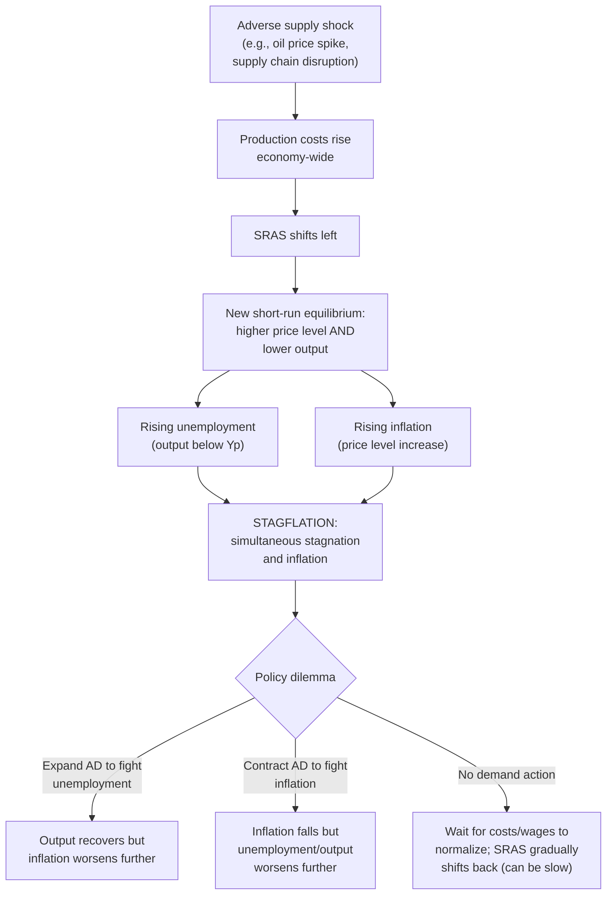

## Supply Shocks and Stagflation

### Overview

Stagflation refers to the simultaneous occurrence of economic stagnation (falling output, rising unemployment) and elevated inflation — a combination that early Keynesian demand-management models struggled to explain, since a standard downward-sloping short-run Phillips Curve implies inflation and unemployment should move in *opposite* directions. Stagflation arises specifically from adverse supply shocks, which shift SRAS leftward, moving the price level and output in opposite directions and thereby producing the "worst of both worlds" combination that defines the term.

### The Historical Origin of the Concept

**[Inference]** The term "stagflation" (a portmanteau of "stagnation" and "inflation") rose to prominence in economic discourse during the 1970s, when advanced economies — most notably the United States and the United Kingdom — experienced episodes of simultaneously high inflation and high unemployment following major oil price shocks, an outcome that the prevailing simple Phillips Curve framework of the era had not predicted was possible and that prompted substantial revision of macroeconomic theory (including the development of the expectations-augmented Phillips Curve and, subsequently, the New Classical and New Keynesian supply-side frameworks).

### The Mechanics of Stagflation

**Key Points**

- Stagflation is produced by an **adverse (negative) supply shock**: a leftward shift of SRAS caused by rising input costs, reduced productivity, or reduced resource availability.
- The leftward SRAS shift simultaneously raises the equilibrium price level and lowers equilibrium output — the opposite co-movement pattern from a demand shock, where price and output move together.
- Because output falls, unemployment rises above the natural rate at the same time that the price level (and often the inflation rate) is rising — the defining dual symptom of stagflation.

### Diagrammatic Analysis

<svg xmlns="http://www.w3.org/2000/svg" viewBox="0 0 740 500" font-family="Arial, sans-serif">
<text x="370" y="26" font-size="16" font-weight="bold" text-anchor="middle">Stagflation: Adverse Supply Shock Effect (svg_diagram)</text>
<line x1="90" y1="440" x2="680" y2="440" stroke="black" stroke-width="2" />
<line x1="90" y1="440" x2="90" y2="80" stroke="black" stroke-width="2" />
<text x="690" y="445" font-size="13">Real GDP (Y)</text>
<text x="45" y="75" font-size="13">Price Level (P)</text>

<line x1="400" y1="420" x2="400" y2="100" stroke="#7f8c8d" stroke-width="2" stroke-dasharray="6,4" />
<text x="405" y="115" font-size="12" fill="#7f8c8d">LRAS</text>

<path d="M 150 400 Q 300 300 550 150" stroke="#2980b9" stroke-width="2.5" fill="none" />
<text x="555" y="150" font-size="12" fill="#2980b9">SRAS0</text>

<path d="M 100 400 Q 220 280 380 130" stroke="#c0392b" stroke-width="2.5" fill="none" />
<text x="100" y="120" font-size="12" fill="#c0392b">SRAS1 (adverse shock)</text>

<path d="M 250 130 Q 380 260 530 400" stroke="#27ae60" stroke-width="2.5" fill="none" />
<text x="535" y="402" font-size="12" fill="#27ae60">AD</text>

<circle cx="400" cy="250" r="5" fill="black" />
<text x="408" y="245" font-size="12">E0: Y = Yp</text>

<circle cx="310" cy="185" r="5" fill="#c0392b" />
<text x="150" y="180" font-size="12" fill="#c0392b">E1: higher P, lower Y (stagflation)</text>
<line x1="310" y1="185" x2="310" y2="440" stroke="#c0392b" stroke-dasharray="2,2" />
</svg>

### The Historical Case Study: 1970s Oil Shocks

**[Unverified]** Two major oil price disruptions are widely cited in economic history as the canonical real-world examples of adverse supply shocks producing stagflation:

- **The 1973 oil crisis**: following an OPEC oil embargo, crude oil prices rose sharply, dramatically raising energy costs across the global economy.
- **The 1979 oil crisis**: following the Iranian Revolution and subsequent disruption to oil production and exports, oil prices rose sharply for a second time within the decade.

Both episodes are commonly associated in the historical record with simultaneous increases in inflation and unemployment across many advanced economies, providing the primary real-world backdrop against which the term "stagflation" and the modified Phillips Curve framework were developed and popularized.

**[Inference]** Economic historians generally note that the *severity and persistence* of the resulting stagflation in different countries also depended significantly on each country's monetary policy response — economies whose central banks accommodated the oil shock with expansionary monetary policy are generally argued to have experienced more persistent inflation, while those that resisted accommodation experienced sharper but potentially shorter-lived output/employment costs — illustrating that the *policy response* to a supply shock, not just the shock itself, shapes the ultimate stagflationary outcome.

### The Policy Dilemma in Detail

| Policy Response to Adverse Supply Shock | Effect on Inflation | Effect on Output/Unemployment | Key Risk |
| --- | --- | --- | --- |
| Accommodate (expand AD) | Inflation rises further | Output/employment recover toward $Y_p$ | Risk of embedding higher inflation expectations, potential wage-price spiral |
| Do not accommodate (hold or contract AD) | Inflation falls back sooner | Output/employment losses persist or deepen | Risk of prolonged recession, higher cumulative unemployment costs |
| No demand-side action (wait for self-correction) | Inflation persists until SRAS shifts back | Recession persists until wages/costs adjust | Risk of a slow, painful adjustment process, especially with downward wage stickiness |

**Key Points**

- Unlike a demand shock, where a single policy direction can address both symptoms simultaneously, an adverse supply shock presents a genuine **tradeoff**: no single demand-side policy choice can simultaneously reduce both inflation and unemployment in the short run.
- This dilemma is the central reason stagflation is considered a particularly difficult macroeconomic challenge — it exposes the limits of conventional demand-management (Keynesian) policy tools, which are well-suited to addressing demand shocks but structurally unable to costlessly resolve a supply-side dilemma.

### Wage-Price Spirals

**Key Points**

- A particularly concerning dynamic that can prolong or worsen a stagflationary episode is the **wage-price spiral**: rising prices (from the initial supply shock) lead workers to demand higher nominal wages to preserve real purchasing power; higher wages raise firms' production costs further, causing additional SRAS leftward shifts and further price increases; this in turn prompts further wage demands, and the cycle can become self-reinforcing.
- **[Inference]** Whether an initial supply shock triggers a genuine, self-sustaining wage-price spiral (rather than a one-time, self-limiting price-level jump) is widely regarded as depending heavily on the degree of wage indexation in the economy (e.g., prevalence of cost-of-living-adjustment clauses in labor contracts) and, critically, on the credibility of the central bank's commitment to price stability — if inflation expectations remain well-anchored despite the initial shock, workers and firms are less likely to build persistently higher inflation into their wage and pricing decisions, limiting the spiral.

### Numerical Illustration: Wage-Price Spiral Dynamics

Using the SRAS relationship $P = P_0 + \beta(Y-Y_p) + c$ from the general supply-shock framework, suppose an initial cost-push shock of $c_0 = 6$ raises $P$ from 100 to approximately 104 (holding AD roughly fixed, with some output decline). If workers, observing the 4-point price increase, demand a compensating nominal wage increase that itself raises production costs by an additional $c_1 = 3$ in the following period:

$$P_2 = 104 + \beta(Y_2-Y_p) + 3 \approx 105.5\text{ (illustrative)}$$

**[Inference]** If this pattern continues — each round of price increases prompting a further round of wage demands, each contributing an additional (though possibly diminishing) cost-push increment — the cumulative price level rise can substantially exceed the magnitude of the *initial* supply shock alone, illustrating why credible monetary policy anchoring of inflation expectations is often emphasized as critical to preventing a single supply shock from generating a much larger and more persistent inflationary episode than the shock's direct cost impact alone would suggest.

### Distinguishing Stagflation from Ordinary Recession

| Feature | Ordinary (Demand-Driven) Recession | Stagflation |
| --- | --- | --- |
| Price level | Falls or disinflates | Rises |
| Inflation rate | Typically falls | Typically rises (at least initially) |
| Underlying shock | AD contraction | Adverse SRAS shift |
| Standard Phillips Curve relationship | Consistent with the standard downward-sloping short-run tradeoff | Appears to violate/shift the standard short-run Phillips Curve outward |
| Appropriate single-tool policy fix | Expansionary AD policy addresses both symptoms | No single AD tool fixes both symptoms |

### Modern Relevance: Post-Pandemic Supply Disruptions

**[Unverified]** The 2021-2023 period following the COVID-19 pandemic saw renewed public and academic discussion of stagflation risk, associated with global supply-chain disruptions, labor market dislocations, and energy price volatility (notably following Russia's invasion of Ukraine and its effects on European energy markets) occurring alongside substantial fiscal and monetary stimulus that had been deployed during the pandemic's demand-collapse phase. Economists have debated the relative contribution of demand-side stimulus versus genuine supply-side constraints to the resulting inflationary episode, with some emphasizing supply-chain and energy-driven cost-push factors consistent with a stagflation-style analysis, and others emphasizing excess aggregate demand relative to a supply-constrained economy — a debate illustrating the ongoing practical difficulty of cleanly separating demand- and supply-side contributions to any specific real-world inflationary episode, as also noted under demand-shock and supply-shock analysis generally.

### Policy Lessons and Central Bank Responses

- **Credibility and anchored expectations** are widely regarded by modern central banks as the single most important defense against a supply shock evolving into a sustained stagflationary or wage-price-spiral episode, since well-anchored expectations limit the pass-through of a one-time cost shock into persistent, self-reinforcing inflation.
- **Distinguishing "core" from "headline" inflation** (excluding volatile food and energy components, which are frequently the direct source of supply shocks) is a standard tool central banks use to assess whether an observed inflation spike reflects a likely-transitory supply shock or broader, more persistent underlying inflationary pressure requiring a policy response.
- **Supply-side policy responses** (strategic reserves release, temporary tax relief on affected goods, efforts to resolve specific supply-chain bottlenecks) can, in principle, directly address the SRAS-side source of the problem without requiring the AD-side tradeoff that monetary/fiscal tools face — though such targeted supply-side interventions are often narrower in scope and slower to implement than broad demand-management tools.

### Common Misconceptions

- **Misconception**: Stagflation proves the Phillips Curve is entirely wrong. **Correction**: stagflation is fully consistent with the *expectations-augmented* Phillips Curve (or equivalently, the AD-AS framework with SRAS shocks) — it only contradicts the older, simple *static* Phillips Curve that omitted supply shocks and expectations shifts entirely.
- **Misconception**: Stagflation can be fixed with a single, correctly calibrated demand-side policy move. **Correction**: by construction, an adverse supply shock creates a genuine tradeoff between inflation and output/employment that no single demand-side policy setting can eliminate — policymakers must choose which cost to prioritize, or rely on (often slower) supply-side or self-correction mechanisms.
- **Misconception**: Any period combining elevated inflation and elevated unemployment is definitionally stagflation from a supply shock. **Correction**: similar symptom combinations can, in principle, also arise from a combination of overlapping demand and supply disturbances, or from poorly anchored inflation expectations interacting with an otherwise moderate shock — careful diagnosis of the underlying cause matters for appropriate policy response.

**Related Topics**

- Supply shocks and their macroeconomic effects
- Demand shocks and business cycle fluctuations
- New Keynesian Phillips curve derivation
- Expectations-augmented Phillips Curve
- Central bank credibility and anchored inflation expectations
- Core versus headline inflation measurement
- Wage indexation and cost-of-living adjustments
- Sacrifice ratio and the costs of disinflation