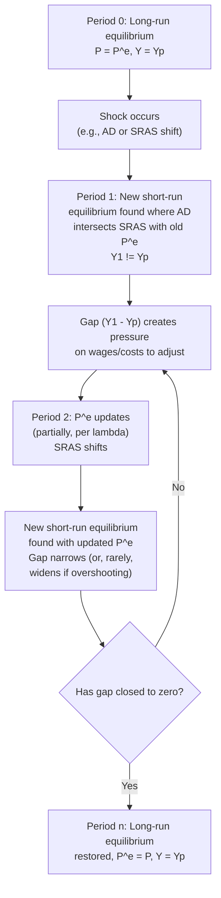

## Adjustment Dynamics Back to Potential Output

### Overview

Adjustment dynamics describe the specific time path an economy follows as it moves from a short-run equilibrium away from potential output back toward long-run equilibrium at $Y_p$. While the concept of "self-correction" establishes *that* the economy tends to return to potential, adjustment dynamics focus on *how* — the sequence, speed, and shape of the transition path — including how expectations, wages, and the SRAS curve evolve period by period, and what factors determine whether this path is smooth, prolonged, oscillatory, or subject to overshooting.

### The General Adjustment Framework

**Key Points**

- Adjustment dynamics are driven by the gap between actual output and potential output (or equivalently, actual and expected price levels) at each point in time, which generates pressure on nominal wages and other input costs to change.
- The rate of adjustment depends on the **speed of expectation revision** — how quickly $P^e$ updates toward the actual price level $P$ — which in turn depends on the specific expectations-formation mechanism assumed (adaptive, rational, or some hybrid).
- The path is generally **not instantaneous**: it unfolds over multiple periods, contract-renewal cycles, or planning horizons, distinguishing short-run dynamics from the (often depicted as instantaneous) comparative-static jump directly to long-run equilibrium in simplified textbook diagrams.

### Modeling the Adjustment Path: A Difference Equation Approach

A standard way to formalize the adjustment process combines the SRAS equation with an expectations-updating rule.

#### The SRAS Relationship

$$Y_t = Y_p + \alpha(P_t - P_t^e)$$

#### Adaptive Expectations Updating Rule

$$P_t^e = P_{t-1}^e + \lambda(P_{t-1} - P_{t-1}^e)$$

Where $\lambda \in (0,1]$ is the speed of adjustment parameter: how much of last period's forecast error gets incorporated into this period's expectation.

**Interpretation**: if $\lambda = 1$, expectations fully catch up to the previous period's actual price level in a single step (fast adjustment). If $\lambda$ is small (e.g., 0.2), expectations adjust only gradually, incorporating just 20% of each period's forecast error, producing a slower, more protracted convergence.

### The Adjustment Path: Period-by-Period Trace

### Numerical Simulation: Tracing the Full Path

Using $Y_p = 2000$, $\alpha = 40$, $\lambda = 0.5$ (50% adaptive expectations adjustment speed), and a linear AD curve $Y = 2700 - 5P$ following a positive demand shock (raising the AD intercept from an original 2500 to 2700):

**Period 0 (pre-shock long-run equilibrium):** $P_0^e = 100$, and solving $2500-5P=2000+40(P-100)$ gives $P=100$, $Y=2000$.

**Period 1 (shock hits; $P_1^e$ still at 100):** Solve $2700-5P_1 = 2000+40(P_1-100)$:

$$2700-5P_1 = 40P_1 - 2000$$

$$4700 = 45P_1$$

$$P_1 \approx 104.4$$

$$Y_1 = 2700-5(104.4) \approx 2178$$

Expansionary gap: $Y_1 - Y_p = 178$.

**Period 2 (expectations update):** $P_2^e = 100 + 0.5(104.4-100) = 102.2$. Solve $2700-5P_2 = 2000+40(P_2-102.2)$:

$$2700-5P_2 = 40P_2 - 2000+4088$$

$$2700-5P_2 = 40P_2+2088$$

$$612 = 45P_2$$

$$P_2 \approx 106.0$$

Wait — **[Inference]** this illustrates a subtlety: as $P_2^e$ rises, SRAS shifts *left*, which — holding AD fixed — pushes the new short-run equilibrium to a *higher* price level than period 1, while output moves back toward (though possibly not monotonically arriving exactly at) $Y_p$:

$$Y_2 = 2700-5(106.0) = 2170$$

The gap has narrowed only slightly (178 to 170) in this illustrative pass — reflecting that with $\lambda=0.5$, convergence, while underway, still requires several further periods.

**Subsequent periods:** as $P^e_t$ continues updating toward the eventual new long-run price level (which can itself be solved directly as $P_{LR}$ where $Y=Y_p$ and $P=P^e$: $2700-5P=2000 \Rightarrow P_{LR}=140$), the gap $(Y_t - Y_p)$ shrinks progressively each period, asymptotically approaching zero as $P_t^e \to 140$.

**[Inference]** This numerical trace illustrates the general property that adaptive-expectations-driven adjustment paths typically converge *monotonically* (steadily narrowing the gap each period without oscillation) for standard, well-behaved parameter combinations, though the *specific* path and speed depend heavily on the assumed values of $\alpha$, $b$ (AD slope), and $\lambda$.

### Diagram: The Convergence Path in P-Y Space

<svg xmlns="http://www.w3.org/2000/svg" viewBox="0 0 740 500" font-family="Arial, sans-serif">
<text x="370" y="26" font-size="16" font-weight="bold" text-anchor="middle">Adjustment Path: Successive Short-Run Equilibria (svg_diagram)</text>
<line x1="90" y1="440" x2="680" y2="440" stroke="black" stroke-width="2" />
<line x1="90" y1="440" x2="90" y2="80" stroke="black" stroke-width="2" />
<text x="690" y="445" font-size="13">Real GDP (Y)</text>
<text x="45" y="75" font-size="13">Price Level (P)</text>

<line x1="470" y1="420" x2="470" y2="100" stroke="#7f8c8d" stroke-width="2" stroke-dasharray="6,4" />
<text x="475" y="115" font-size="12" fill="#7f8c8d">LRAS (Yp)</text>

<path d="M 250 110 Q 420 260 620 420" stroke="#27ae60" stroke-width="2.5" fill="none" />
<text x="625" y="422" font-size="12" fill="#27ae60">AD (post-shock)</text>

<path d="M 150 400 Q 300 280 550 130" stroke="#2980b9" stroke-width="2" fill="none" />
<text x="555" y="130" font-size="11" fill="#2980b9">SRAS0</text>

<path d="M 200 400 Q 340 270 560 110" stroke="#8e44ad" stroke-width="2" fill="none" stroke-dasharray="5,3" />
<text x="565" y="112" font-size="11" fill="#8e44ad">SRAS1</text>

<path d="M 260 400 Q 380 260 470 100" stroke="#c0392b" stroke-width="2.5" fill="none" stroke-dasharray="3,2" />
<text x="330" y="95" font-size="11" fill="#c0392b">SRAS_final</text>

<circle cx="560" cy="230" r="5" fill="#2980b9" />
<text x="530" y="220" font-size="11" fill="#2980b9">E1</text>
<circle cx="530" cy="200" r="5" fill="#8e44ad" />
<text x="500" y="190" font-size="11" fill="#8e44ad">E2</text>
<circle cx="470" cy="160" r="5" fill="#c0392b" />
<text x="420" y="150" font-size="11" fill="#c0392b">E_final (Y=Yp)</text>

<path d="M 560 230 L 530 200 L 470 160" stroke="black" stroke-width="1.5" stroke-dasharray="2,2" fill="none" />
</svg>

### Factors Determining Adjustment Speed

| Factor | Effect on Adjustment Speed | Mechanism |
| --- | --- | --- |
| Wage/price contract length | Longer contracts → slower adjustment | Nominal wages/prices cannot change until renewal, regardless of $P^e$ updates |
| Degree of wage indexation (COLA clauses) | Higher indexation → faster adjustment | Automatic wage adjustment reduces the gap between $W$ and its real-wage-consistent level without waiting for renegotiation |
| Central bank credibility | Higher credibility → faster adjustment | Expectations can jump quickly toward a credible announced target rather than adjusting only via slow backward-looking observation |
| Degree of downward wage/price rigidity | Higher rigidity (especially for negative gaps) → slower adjustment | Asymmetric resistance to nominal cuts prolongs recessionary-gap convergence relative to expansionary-gap convergence |
| Menu cost magnitude | Higher menu costs → slower price adjustment | Firms tolerate larger and more persistent gaps between actual and optimal prices before paying the adjustment cost |
| Information diffusion speed | Faster diffusion → faster adjustment | Producers/workers incorporate new aggregate price-level information into decisions sooner |

### Asymmetric Adjustment: Expansionary versus Recessionary Gaps

**[Inference]** A well-documented asymmetry in adjustment dynamics, discussed in the context of self-correction generally, is that the convergence path from an *expansionary* gap (requiring nominal wages/prices to rise) typically proceeds faster than convergence from a *recessionary* gap (requiring nominal wages/prices to fall), due to the empirically observed greater resistance to nominal wage and price cuts than to increases. In terms of the difference-equation framework above, this can be modeled as an asymmetric $\lambda$ — a larger effective adjustment speed when the required wage/price movement is upward, and a smaller effective speed when the required movement is downward — though standard introductory treatments often abstract from this asymmetry for simplicity by using a single symmetric $\lambda$.

### Overshooting and Oscillatory Dynamics

**[Inference]** While the standard adaptive-expectations adjustment process illustrated above typically converges smoothly and monotonically for conventional parameter ranges, certain combinations of expectation-formation assumptions, policy feedback rules, and structural parameters can, in principle, generate **overshooting** (where the adjustment process moves past the new long-run equilibrium before correcting back) or even **oscillatory** convergence (successive periods alternating between overshoot and undershoot before settling). Such dynamics are more commonly explored in advanced dynamic macroeconomic models (e.g., incorporating explicit policy reaction functions or more complex expectations mechanisms such as certain rational-expectations specifications with information lags) than in the introductory adaptive-expectations framework presented here, but they represent an important qualification to the simplified, always-smooth convergence picture often shown in basic AD-AS textbook diagrams.

### Rational Expectations and the Speed Limit Case

Under **fully rational expectations** combined with fully flexible prices (the theoretical limiting case), and assuming the underlying shock is *anticipated* in advance, $P^e$ would already equal the eventual $P$ *before* the shock even materializes, implying the adjustment process collapses to a single instantaneous jump with no observable transition dynamics at all — consistent with the Policy Ineffectiveness Proposition discussed in the context of the Lucas supply function. **[Inference]** Most modern macroeconomic models used for practical policy analysis instead combine rational expectations with some form of nominal rigidity (sticky wages or sticky prices, as in New Keynesian DSGE frameworks), which restores a genuine, multi-period adjustment dynamic even under otherwise fully rational expectation formation, since existing wage/price contracts still constrain how quickly the *realized* nominal wage or price level can respond even when the *expected* future path is well understood.

### Policy Implications for Adjustment Speed

- Policies and institutional arrangements that speed up the adjustment process (greater central bank credibility and transparency, reduced structural barriers to wage/price flexibility, well-anchored inflation expectations) reduce the cumulative output and employment costs associated with any given shock, by shortening the time spent away from potential output.
- Conversely, policies or institutional features that slow adjustment (rigid long-term contracts, weak central bank credibility requiring a costly track record to establish, structural downward wage rigidity from legal or bargaining sources) tend to prolong the transition period and increase the cumulative welfare costs of a given shock — strengthening the case, in such environments, for active countercyclical policy to substitute for a slow automatic adjustment process.
- Understanding the *specific* adjustment path (not just the eventual endpoint) is essential for real-time policy calibration, since policymakers generally need to assess not only where the economy is heading in the long run but how quickly it is likely to get there absent intervention, in order to judge whether active stabilization is warranted.

### Common Misconceptions

- **Misconception**: Adjustment back to potential output happens in a single discrete jump. **Correction**: except in the idealized fully-rational-expectations/fully-flexible-price limiting case, adjustment is a genuinely dynamic, multi-period process traced out by the interaction of successive short-run equilibria and gradually updating expectations.
- **Misconception**: The adjustment path is always smooth and monotonic. **Correction**: while smooth monotonic convergence is the standard textbook case under simple adaptive expectations, more complex expectation-formation or policy-feedback structures can in principle generate overshooting or oscillatory dynamics.
- **Misconception**: The speed of adjustment is a fixed, universal constant. **Correction**: adjustment speed depends on institutional features (contract length, indexation, central bank credibility) that vary across countries, time periods, and specific labor/product market structures — it is not a single number applicable to all economies or all shocks.

**Related Topics**

- Long-run equilibrium and self-correction
- Short-run equilibrium in the AD-AS model
- Sticky wage models of aggregate supply
- Adaptive versus rational expectations formation
- New Keynesian Phillips curve derivation
- Central bank credibility and anchored inflation expectations
- Demand shocks and business cycle fluctuations
- Supply shocks and stagflation