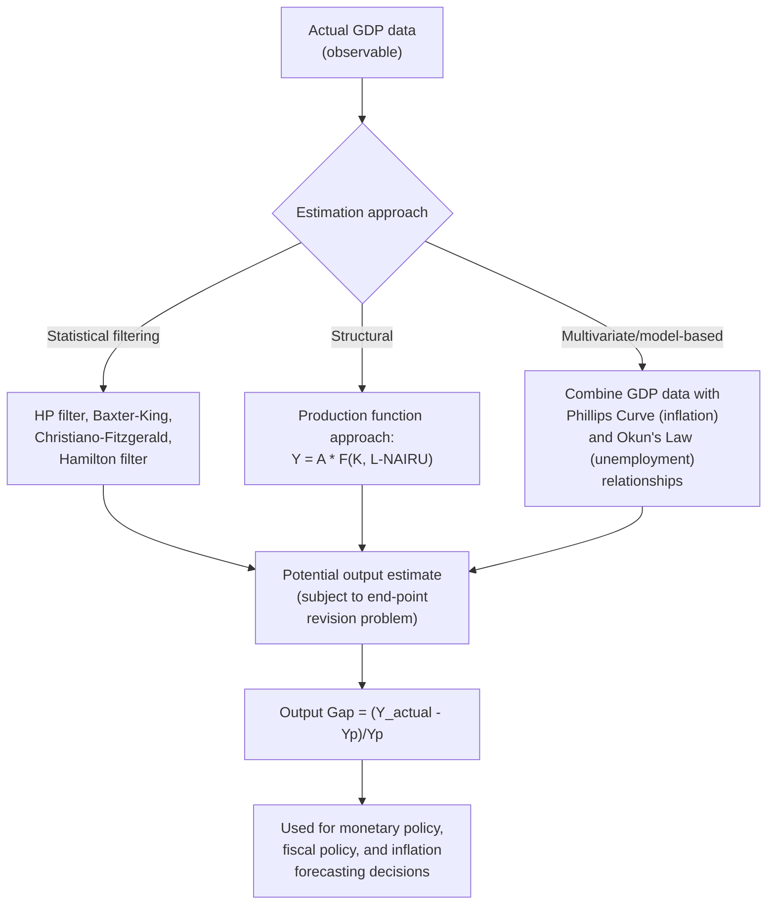

## Output Gap Concept and Measurement

### Overview

The output gap is the difference between an economy's actual real GDP and its potential (or natural-rate) GDP at a given point in time. It is one of the most widely used summary statistics in macroeconomics for assessing where an economy sits in the business cycle, and it serves as a key input to monetary policy decisions, fiscal policy design, and inflation forecasting. Despite its conceptual simplicity, the output gap is notoriously difficult to *measure* in practice, since potential output itself is unobservable and must be estimated.

### Defining the Output Gap

**Key Points**

- The output gap is most commonly expressed as a percentage of potential output:

$$\text{Output Gap} (\%) = \frac{Y_{actual} - Y_p}{Y_p} \times 100$$

- A **positive output gap** (also called an inflationary or expansionary gap) indicates actual output exceeds potential — the economy is "overheating," typically associated with unemployment below the natural rate and rising inflationary pressure.
- A **negative output gap** (also called a recessionary gap) indicates actual output falls short of potential — the economy has slack capacity, typically associated with unemployment above the natural rate and disinflationary or deflationary pressure.
- A **zero output gap** indicates the economy is operating exactly at potential — the long-run equilibrium condition discussed in the self-correction framework.

### Diagram: Output Gap Over the Business Cycle

<svg xmlns="http://www.w3.org/2000/svg" viewBox="0 0 740 480" font-family="Arial, sans-serif">
<text x="370" y="26" font-size="16" font-weight="bold" text-anchor="middle">Output Gap Across the Business Cycle (svg_diagram)</text>
<line x1="80" y1="260" x2="700" y2="260" stroke="black" stroke-width="1.5" />
<text x="705" y="265" font-size="12">Time</text>

<path d="M 80 300 Q 300 260 500 220 Q 620 195 700 175" stroke="#7f8c8d" stroke-width="2.5" stroke-dasharray="6,4" fill="none" />
<text x="550" y="165" font-size="12" fill="#7f8c8d" font-weight="bold">Potential Output (Yp) trend</text>

<path d="M 80 320 Q 150 200 230 190 Q 320 180 360 300 Q 420 400 480 340 Q 560 260 620 180 Q 660 140 700 190" stroke="#2980b9" stroke-width="3" fill="none" />
<text x="90" y="345" font-size="12" fill="#2980b9" font-weight="bold">Actual Output (Y)</text>

<path d="M 150 200 Q 230 190 320 182 L 320 260 Q 230 260 150 300 Z" fill="#27ae60" opacity="0.25" />
<text x="180" y="230" font-size="11" fill="#196f3d">Positive gap</text>

<path d="M 360 300 Q 420 400 480 340 L 480 260 Q 420 260 360 260 Z" fill="#c0392b" opacity="0.25" />
<text x="380" y="350" font-size="11" fill="#922b21">Negative gap</text>
</svg>

### Why Measuring the Output Gap Is Difficult

**Key Points**

- Actual output ($Y_{actual}$) is directly and reliably observable via national income accounting (GDP statistics), though subject to measurement revisions.
- Potential output ($Y_p$) is fundamentally **unobservable** — it is a theoretical construct representing the output level consistent with full utilization of resources at the natural rate of unemployment, and must be *estimated* using one of several competing methodologies, each with meaningfully different assumptions and results.
- Because different estimation methods can produce materially different estimates of $Y_p$ for the same actual GDP data, output gap estimates are subject to substantial uncertainty and frequent, sometimes large, revision as new data becomes available — a well-documented practical limitation for real-time policy use.

### Major Estimation Approaches

#### 1. Statistical (Univariate Filtering) Methods

These methods treat potential output as a smoothed, statistically extracted trend component of the actual GDP time series, without reference to underlying economic structure.

- **Hodrick-Prescott (HP) filter**: separates a GDP time series into a smooth trend component (treated as potential output) and a cyclical component (the output gap), by minimizing a weighted combination of the trend's deviation from the actual series and the trend's smoothness (curvature).
- **[Inference]** The HP filter is widely used for its computational simplicity but is well known among practitioners for its **end-point problem** — estimates near the end of the available data sample (i.e., the most recent, policy-relevant periods) are the least reliable and subject to the largest subsequent revisions as new data arrives, since the filter's smoothing depends on data both before *and* after each point.
- **Other statistical filters**: the Baxter-King filter, Christiano-Fitzgerald filter, and Hamilton filter (a more recently proposed alternative specifically designed to address some of the HP filter's known statistical shortcomings) represent alternative purely statistical trend-extraction approaches.

#### 2. Production Function Approach

This structural approach directly estimates potential output from the underlying production function, combining estimates of the "full-employment" or "non-inflationary" levels of the key inputs:

$$Y_p = A \cdot F(K, L^*)$$

Where $A$ is estimated trend total factor productivity, $K$ is the actual (or trend) capital stock, and $L^*$ is the labor input consistent with the **NAIRU** (Non-Accelerating Inflation Rate of Unemployment) — the unemployment rate at which inflation is expected to remain stable rather than accelerating or decelerating.

**[Inference]** This approach is generally regarded as more economically grounded than pure statistical filtering, since it explicitly incorporates labor market and productivity fundamentals, but it introduces its own substantial estimation challenges — particularly around estimating the NAIRU itself, which (like potential output) is unobservable and must be inferred, often via a Phillips-Curve-based statistical relationship between unemployment and inflation.

#### 3. Multivariate / Structural (Model-Based) Filters

More advanced approaches (used by many central banks and international institutions such as the **IMF**, **OECD**, and various national central banks) combine statistical filtering with additional economic information — commonly, the observed relationship between the output gap and inflation via a Phillips-Curve-style equation, and between the output gap and unemployment via **Okun's Law** — to jointly estimate potential output and the output gap in a way that is more consistent with observed inflation dynamics than a purely mechanical statistical filter.

### The Real-Time Data Revision Problem

**Key Points**

- Output gap estimates made in **real time** (using only data available up to the current period) are frequently revised substantially once subsequent GDP data becomes available and re-estimation incorporates it — this is distinct from ordinary GDP data revisions and reflects a structural feature of most estimation methodologies (especially the end-point problem inherent to statistical filters).
- **[Unverified]** Studies comparing real-time versus subsequently revised (final, historical) output gap estimates for major economies have often found that real-time estimates can differ substantially in both magnitude and even *sign* from later, better-informed estimates of the same historical period — a finding with significant implications for the reliability of output-gap-based policy rules implemented in real time.
- **[Inference]** This measurement uncertainty is one of the central practical arguments cited by some economists for caution in relying too heavily on estimated output gaps as a primary guide for active monetary or fiscal policy, since a policy calibrated to a mis-estimated gap could push the economy in the wrong direction relative to its true cyclical position.

### Numerical Illustration: Computing the Output Gap

Suppose actual real GDP is $21.5 trillion, and estimated potential output is $21.0 trillion:

$$\text{Output Gap} = \frac{21.5 - 21.0}{21.0} \times 100 = \frac{0.5}{21.0} \times 100 \approx 2.38\%$$

A positive output gap of approximately 2.38% suggests the economy is operating above potential, consistent with an expansionary gap and (per standard theory) likely upward pressure on inflation.

Now suppose subsequent data revision lowers the potential output estimate to $20.7 trillion (as sometimes occurs with real-time HP-filter estimates near the sample end-point):

$$\text{Output Gap} = \frac{21.5-20.7}{20.7} \times 100 = \frac{0.8}{20.7} \times 100 \approx 3.86\%$$

**Interpretation**: the *same* actual GDP figure, combined with a revised potential output estimate, produces a materially different output gap conclusion (2.38% versus 3.86%) — illustrating concretely why output gap uncertainty is a genuine practical challenge for policymakers relying on such estimates in real time.

### The Output Gap and Okun's Law

The output gap is closely linked to the **unemployment gap** (actual unemployment rate minus the natural rate) via **Okun's Law**, an empirical regularity relating cyclical unemployment to the output gap:

$$\frac{Y_{actual}-Y_p}{Y_p} \approx -c \, (u - u_n)$$

Where $u$ is the actual unemployment rate, $u_n$ is the natural rate of unemployment, and $c$ is the Okun's Law coefficient (commonly cited historical estimates for the U.S. economy have clustered around 2, though **[Unverified]** the precise coefficient varies by country, time period, and specific estimation methodology). This relationship allows the output gap to be cross-checked against, or in some model-based approaches jointly estimated alongside, labor market data — providing an important sanity check given the inherent uncertainty of GDP-based potential output estimation alone.

### Uses of the Output Gap in Policy

| Application | How the Output Gap Is Used |
| --- | --- |
| Monetary policy (Taylor Rule) | The output gap is a standard input alongside the inflation gap in determining the appropriate policy interest rate setting |
| Fiscal policy / structural budget balance | Governments and international institutions use the output gap to distinguish the "cyclical" component of the budget deficit (which shrinks automatically as the economy recovers) from the "structural" component (requiring deliberate policy action) |
| Inflation forecasting | A positive output gap is generally associated with rising inflationary pressure (per the Phillips Curve/SRAS relationship), making it a standard input to inflation forecasting models |
| Business cycle dating and analysis | The sign and magnitude of the output gap is used descriptively to characterize where an economy currently sits within the business cycle |

### Common Misconceptions

- **Misconception**: The output gap is a directly observed, precisely known economic statistic like GDP itself. **Correction**: because potential output is unobservable and must be estimated using one of several competing (and sometimes materially divergent) methodologies, the output gap carries substantial inherent estimation uncertainty, unlike directly measured GDP.
- **Misconception**: A positive output gap is unambiguously desirable since it means "more output." **Correction**: a positive output gap reflects output above *sustainable* capacity, generally associated with inflationary pressure and, per the self-correction mechanism, tends to be temporary and eventually reversed — it is not treated as a stable, costlessly desirable state.
- **Misconception**: All output gap estimation methods produce essentially the same number for a given economy and period. **Correction**: statistical filtering methods, production function approaches, and multivariate model-based methods can and often do produce meaningfully different output gap estimates for the identical underlying GDP data, particularly for the most recent, policy-relevant periods.

**Related Topics**

- Short-run versus long-run aggregate supply
- Long-run equilibrium and self-correction
- Okun's Law and the unemployment-output relationship
- NAIRU (Non-Accelerating Inflation Rate of Unemployment)
- Taylor Rule and monetary policy reaction functions
- Structural versus cyclical budget balance
- New Keynesian Phillips curve derivation
- Real-time data revisions and policy uncertainty