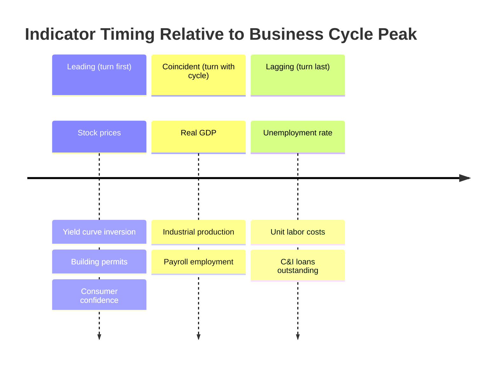

## Business Cycle Dating and Stylized Facts

### Definition and Scope

A business cycle refers to the recurrent but non-periodic fluctuations in aggregate economic activity, measured primarily through real GDP, but corroborated by employment, industrial production, income, and sales data. The word "cycle" is somewhat misleading: business cycles are not regular, predictable oscillations like a sine wave. They vary substantially in duration and amplitude, which is why the field distinguishes between *dating* the cycle (identifying turning points) and characterizing its *stylized facts* (regularities that appear across cycles despite this irregularity).

The classical definition, attributed to Arthur Burns and Wesley Mitchell (1946), describes business cycles as:

> A type of fluctuation found in the aggregate economic activity of nations that organize their work mainly in business enterprises: a cycle consists of expansions occurring at about the same time in many economic activities, followed by similarly general recessions, contractions, and revivals which merge into the expansion phase of the next cycle.

Three defining features emerge from this definition:

- **Comovement**: Many macroeconomic series move together, not just GDP.
- **Persistence**: Expansions and contractions last for extended periods (not day-to-day noise).
- **Non-periodicity**: Cycles differ in length and severity, ruling out simple deterministic models.

### The Phases of a Business Cycle

- **Trough**: The lowest point of economic activity before recovery begins.
- **Expansion**: The period of rising output, employment, and income, from trough to peak.
- **Peak**: The highest point of economic activity before decline begins.
- **Contraction (Recession)**: The period of falling output, employment, and income, from peak to trough.

A full cycle is measured trough-to-trough or peak-to-peak. Modern usage sometimes further subdivides the expansion into "recovery" (return to the previous peak level) and "expansion proper" (growth beyond the previous peak).

### Visualizing a Stylized Cycle Around Trend

The following SVG illustrates the two competing conceptual approaches to a cycle: deviations from a smooth trend (classical framing) versus deviations from a smooth trend with the trend itself extracted from the series (growth cycle framing).

<svg xmlns="http://www.w3.org/2000/svg" viewBox="0 0 760 340">
<text x="380" y="24" text-anchor="middle" font-size="16" font-weight="bold" fill="#1a1a1a">Business Cycle Fluctuations Around Trend (svg_diagram)</text>
<line x1="60" y1="290" x2="720" y2="290" stroke="#333" stroke-width="1.5" />
<line x1="60" y1="290" x2="60" y2="50" stroke="#333" stroke-width="1.5" />
<text x="390" y="320" text-anchor="middle" font-size="13" fill="#333">Time</text>
<text x="30" y="170" text-anchor="middle" font-size="13" fill="#333" transform="rotate(-90 30 170)">Real GDP (log)</text>
<line x1="70" y1="250" x2="710" y2="110" stroke="#999" stroke-width="2" stroke-dasharray="6,4" />
<text x="600" y="130" font-size="12" fill="#777">Long-run trend (potential GDP)</text>
<path d="M 70 240 Q 130 150 190 180 T 310 130 T 430 220 T 550 150 T 630 190 T 710 120" fill="none" stroke="#c0392b" stroke-width="3" />
<circle cx="190" cy="180" r="4" fill="#2980b9" />
<text x="190" y="165" text-anchor="middle" font-size="11" fill="#2980b9">Peak</text>
<circle cx="430" cy="220" r="4" fill="#2980b9" />
<text x="430" y="240" text-anchor="middle" font-size="11" fill="#2980b9">Trough</text>
<circle cx="550" cy="150" r="4" fill="#2980b9" />
<text x="550" y="135" text-anchor="middle" font-size="11" fill="#2980b9">Peak</text>
<text x="250" y="155" font-size="12" fill="#c0392b" font-style="italic">Expansion</text>
<text x="480" y="195" font-size="12" fill="#c0392b" font-style="italic">Contraction</text>
</svg>

### Dating Methodology: The NBER Approach

In the United States, the **National Bureau of Economic Research (NBER) Business Cycle Dating Committee** is the de facto authority for identifying peaks and troughs. Its methodology differs sharply from the popular shorthand "two consecutive quarters of negative GDP growth."

**Key features of NBER dating:**

- **No fixed rule.** The committee does not use a single indicator or a mechanical rule; it exercises judgment based on the depth, diffusion, and duration of a downturn ("three Ds").
- **Multiple indicators.** Rather than relying solely on real GDP, the committee examines a range of monthly series: nonfarm payroll employment, real personal income less transfers, real personal consumption expenditures, wholesale-retail sales adjusted for price changes, and industrial production. GDP and GDI (gross domestic income) are considered at the quarterly frequency.
- **Monthly, not quarterly, precision.** Because monthly indicators are used, the NBER dates peaks and troughs to specific months, not quarters.
- **Retrospective determination.** The committee typically announces a recession's start only well after it has begun (often 6–12+ months later), once sufficient data (including revisions) are available to be confident. This means "we are in a recession" or "the recession ended" is often stated only in hindsight.
- **Definition of recession**: A significant decline in economic activity spread across the economy, lasting more than a few months, normally visible in production, employment, real income, and other indicators.

**Why "two consecutive quarters of GDP decline" is a heuristic, not the definition:**

- It ignores employment, income, and sales entirely.
- It can miss short but severe downturns (e.g., a single very deep quarter followed by a rebound).
- It can falsely signal a recession when GDP dips slightly for two quarters without broad-based weakness (lacks the "diffusion" criterion).
- The COVID-19 recession (Feb–Apr 2020) lasted only two months by NBER dating — far shorter than one full quarter — illustrating how the informal rule would have completely misdated it.

### U.S. Historical Cycle Data (Illustrative)

| Peak | Trough | Contraction (months) | Following Expansion (months) |
| --- | --- | --- | --- |
| Aug 1929 | Mar 1933 | 43 | 50 |
| May 1937 | Jun 1938 | 13 | 80 |
| Nov 1973 | Mar 1975 | 16 | 58 |
| Jul 1981 | Nov 1982 | 16 | 92 |
| Jul 1990 | Mar 1991 | 8 | 120 |
| Mar 2001 | Nov 2001 | 8 | 73 |
| Dec 2007 | Jun 2009 | 18 | 128 |
| Feb 2020 | Apr 2020 | 2 | ongoing (as of source data) |

[Unverified] Exact month counts for expansions/contractions should be cross-checked against the current NBER chronology, as historical dates are occasionally subject to committee revision.

**Key empirical regularity**: Post-WWII expansions have generally lengthened over time (the 1990s and 2009–2020 expansions were the longest on record), while contractions have generally shortened, a pattern often attributed to improved monetary and fiscal stabilization policy, financial market development, and structural shifts toward services. [Inference] The causal weight of each of these factors is debated among macroeconomists and is not settled by the dating data alone.

### Stylized Fact 1: Comovement (Procyclicality and Countercyclicality)

A central empirical regularity is that many macroeconomic variables move together with the cycle, though not all in the same direction.

**Procyclical variables** (rise in expansions, fall in recessions):

- Real GDP, consumption, investment (investment is the most volatile component)
- Employment, hours worked
- Corporate profits
- Imports
- Inflation (with a lag, historically — the strength of this relationship has weakened since the 1980s)
- Stock prices
- Interest rates (short-term rates are strongly procyclical; behavior varies by monetary regime)

**Countercyclical variables** (rise in recessions, fall in expansions):

- Unemployment rate
- Inventory-to-sales ratios (in some specifications)
- Bankruptcy filings
- Government transfer payments (automatic stabilizers)
- Risk spreads / credit spreads

**Acyclical variables** (show no strong systematic relationship):

- Government purchases (in many, though not all, historical periods)
- Some categories of prices, depending on the era and shock composition

### Stylized Fact 2: Relative Volatility

Not all procyclical variables fluctuate with equal intensity. A robust ranking of volatility (measured typically via the standard deviation of the cyclical, i.e., HP-filtered, component) is:

$$\sigma_{\text{investment}} > \sigma_{\text{GDP}} > \sigma_{\text{consumption}} > \sigma_{\text{government spending}}$$

- **Investment** is roughly 3 to 5 times as volatile as GDP. This is explained by the accelerator mechanism, adjustment costs, and the fact that investment responds to expected *future* profitability, making it sensitive to revisions in expectations.
- **Consumption** is smoother than GDP, especially consumption of nondurables and services. This is consistent with the permanent income hypothesis / life-cycle hypothesis: households smooth consumption relative to transitory income fluctuations. Durable goods consumption, by contrast, behaves more like investment (highly volatile) since it has a discretionary, postponable character.
- **Government spending** volatility depends heavily on the historical episode (wartime spikes dominate long time series).

### Stylized Fact 3: Lead-Lag Relationships (Leading, Lagging, Coincident Indicators)

Variables are classified by their timing relative to the reference cycle (peaks/troughs in aggregate activity):

**Leading indicators** (turn before the aggregate cycle):

- Stock market indices
- New orders for durable goods / manufacturers' new orders
- Building permits for new housing
- Average weekly hours in manufacturing
- Yield curve spread (term spread), especially the 10-year minus 3-month or 10-year minus 2-year Treasury spread — inversion has historically preceded most U.S. recessions
- Consumer/business confidence indices
- Money supply growth (in some monetarist-influenced frameworks)

**Coincident indicators** (move roughly in sync with the cycle):

- Real GDP
- Industrial production
- Nonfarm payroll employment
- Real personal income less transfers
- Manufacturing and trade sales

**Lagging indicators** (turn after the aggregate cycle):

- Unemployment rate (often continues rising for several months after a trough — a hallmark of "jobless recoveries")
- Labor cost per unit of output
- Outstanding commercial and industrial loans
- Inventory levels relative to sales
- Duration of unemployment

The Conference Board's Composite Index of Leading Economic Indicators (LEI) aggregates several leading series into a single index used for forecasting turning points, though its predictive reliability [Inference] is contested, particularly regarding false positives in recent decades.

### Diagrammatic Summary: Leads and Lags Around a Reference Cycle

### Stylized Fact 4: Asymmetry Between Expansions and Contractions

Empirically, contractions tend to be shorter and steeper, while expansions tend to be longer and more gradual. This asymmetry has several implications:

- The distribution of output growth rates is *not* symmetric or Gaussian around trend — recessions exhibit sharper, more negatively skewed drops.
- This motivated Markov-switching / regime-switching models of the business cycle (e.g., Hamilton 1989), which allow the mean growth rate and volatility to differ discretely across "recession" and "expansion" regimes, rather than treating the cycle as a smooth, symmetric deviation from trend.
- [Inference] Some economists interpret this asymmetry as evidence against purely linear real business cycle (RBC) models, which by construction generate symmetric responses to symmetric shocks, and as support for models incorporating financial frictions, credit constraints, or nonlinear propagation mechanisms.

### Stylized Fact 5: Okun's Law (Output-Unemployment Relationship)

A robust empirical regularity links output gaps to unemployment gaps:

$$u_t - u_t^{*} \approx -\beta \left( \frac{Y_t - Y_t^{*}}{Y_t^{*}} \right)$$

where $u_t$ is the actual unemployment rate, $u_t^{*}$ the natural rate, $Y_t$ actual output, $Y_t^{*}$ potential output, and $\beta$ (Okun's coefficient) is empirically estimated around 0.4–0.5 for the postwar U.S., meaning a 1-percentage-point rise in the output gap is associated with roughly a 0.4–0.5 percentage-point *fall* in the unemployment gap. [Unverified] The exact coefficient varies by country, time period, and estimation method, and has reportedly shifted since the 1980s due to changes in labor market institutions and firms' labor-hoarding behavior.

### Filtering Techniques Used to Extract the Cyclical Component

To measure "the cycle" empirically, raw GDP data must be separated into trend and cyclical components. Standard methods include:

- **Hodrick-Prescott (HP) filter**: Minimizes a weighted sum of the squared deviations from trend and the smoothness of the trend itself:

  $$\min_{\{\tau_t\}} \sum_{t=1}^{T} (y_t - \tau_t)^2 + \lambda \sum_{t=2}^{T-1} \left[ (\tau_{t+1} - \tau_t) - (\tau_t - \tau_{t-1}) \right]^2$$

  where $\lambda$ controls the smoothness penalty (conventionally $\lambda = 1600$ for quarterly data). [Inference] The HP filter is widely used but has known end-of-sample bias and can generate spurious cycles, a criticism formalized by Hamilton (2018), who proposed a regression-based alternative.
- **Baxter-King and Christiano-Fitzgerald band-pass filters**: Isolate fluctuations within a specified frequency band (typically 6 to 32 quarters, matching the conventional definition of business-cycle-length fluctuations), trimming both very short-run noise and very long-run trend.
- **Beveridge-Nelson decomposition**: Decomposes a time series into a permanent (random walk) component and a transitory (cyclical) component based on an ARIMA representation.
- **Hamilton's regression filter** (2018): Regresses $y_{t+h}$ on lagged values of $y_t$ to extract the cyclical residual, addressing HP filter critiques.

### International and Cross-Country Considerations

- **Growth cycles vs. classical cycles**: Many countries, especially fast-growing emerging economies, rarely experience absolute declines in GDP. Analysts there often study "growth cycles" — deviations of the growth *rate* from trend growth — rather than classical peak-to-trough declines in the *level* of output.
- **Synchronization**: Business cycles across advanced economies show meaningful, though imperfect, comovement (international business cycle synchronization), attributed to trade linkages, global financial conditions, and common shocks (e.g., oil price shocks, global financial crises).
- **Emerging market volatility**: [Inference] Developing economies generally exhibit more volatile business cycles than advanced economies, often attributed to weaker institutions, greater exposure to terms-of-trade shocks, and more procyclical fiscal and credit policy ("when it rains, it pours").

### Common Misconceptions

- **Misconception**: A recession requires two consecutive quarters of negative GDP growth. **Correction**: This is a popular rule of thumb, not the NBER's operative definition, which considers depth, diffusion, and duration across multiple monthly indicators.
- **Misconception**: Business cycles are periodic (i.e., occur at fixed intervals). **Correction**: Cycle lengths are highly irregular; no reliable fixed periodicity has been empirically established.
- **Misconception**: All macro variables lag or lead uniformly. **Correction**: Timing classifications (leading/coincident/lagging) are statistical regularities across many historical cycles, not deterministic rules for any single cycle.

### Next Steps

- **Related Topics**:
  - Potential output and the output gap
  - Okun's Law in depth (derivation, cross-country estimates, structural breaks)
  - The Hodrick-Prescott filter and its critiques (Hamilton 2018)
  - Real Business Cycle (RBC) theory
  - New Keynesian business cycle models and nominal rigidities
  - Markov-switching models of GDP growth (Hamilton 1989)
  - The yield curve as a recession predictor
  - Financial accelerator and credit cycle theories
  - The Great Moderation and its reversal after 2007–2009
  - Sudden stops and business cycles in emerging markets