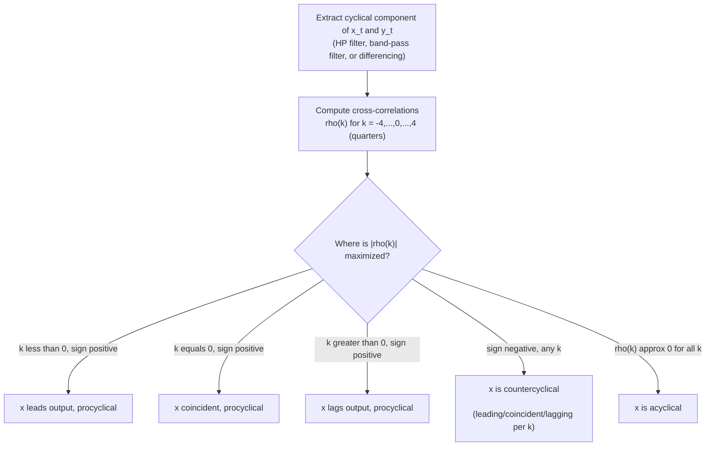
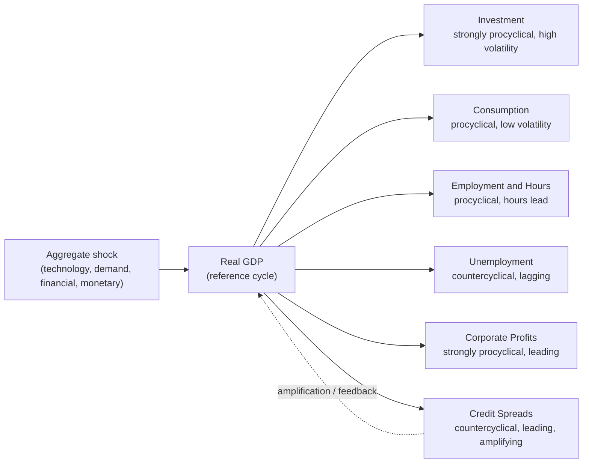

## Comovement of Macroeconomic Variables Over the Cycle

### Definition and Conceptual Framework

Comovement refers to the tendency of macroeconomic time series to fluctuate together in a systematic way around business cycle turning points. It is one of the three defining features of the business cycle (alongside persistence and non-periodicity) identified in the Burns-Mitchell tradition. Rather than treating GDP as the sole object of interest, comovement analysis asks: *which variables rise and fall with output, which move opposite to it, which lead or lag it, and how strongly?*

Comovement is formally measured using three statistical properties of the cyclical component of each series (typically extracted via HP filter, band-pass filter, or first-differencing):

1. **Cyclicality (sign of correlation)** — does the variable move with or against output?
2. **Volatility (relative standard deviation)** — how much does it fluctuate relative to output?
3. **Phase (timing/lead-lag)** — does it turn before, with, or after output?

### The Correlation Coefficient as the Core Metric

The standard measure of comovement between a variable $x_t$ and output $y_t$ is the **cross-correlation coefficient** at lag $k$:

$$\rho(k) = \text{corr}(x_{t+k}, y_t) = \frac{\text{cov}(x_{t+k}, y_t)}{\sigma_{x} \sigma_{y}}$$

- If $\rho(0)$ is close to $+1$: strongly **procyclical**.
- If $\rho(0)$ is close to $-1$: strongly **countercyclical**.
- If $\rho(0)$ is close to $0$: **acyclical**.
- If $\rho(k)$ is maximized at $k > 0$: $x$ **lags** output (turns after).
- If $\rho(k)$ is maximized at $k < 0$: $x$ **leads** output (turns before).
- If $\rho(k)$ is maximized at $k = 0$: $x$ is **coincident** with output.

This single framework (sign, magnitude, and lag of $\rho(k)$) organizes essentially the entire empirical literature on business cycle stylized facts.

### Visualizing the Cross-Correlation Function

### Classification of Key Variables by Comovement Pattern

**Strongly procyclical, coincident:**

- Real GDP (the reference series by construction)
- Industrial production
- Employment and total hours worked
- Capacity utilization
- Corporate profits (highly procyclical, often leading slightly)
- Imports (rise with domestic demand)

**Strongly procyclical, leading:**

- Stock market returns / equity prices
- New orders for durable goods
- Housing starts and building permits
- Average weekly hours (often the first labor input adjusted, before headcount)
- Term spread / yield curve slope (long minus short rates) — inversion or flattening tends to precede downturns
- Consumer and business confidence indices

**Strongly procyclical, lagging:**

- Labor productivity in some specifications (rises late in expansion as firms fully utilize labor)
- Inflation (historically lagged the cycle, per the traditional Phillips curve view; this relationship has weakened and become less reliable since the 1980s–1990s, a phenomenon linked to the "missing disinflation/inflation" puzzles)
- Unit labor costs

**Countercyclical:**

- Unemployment rate (the canonical countercyclical, lagging series)
- Layoffs and initial unemployment insurance claims (countercyclical, often leading slightly since layoffs precede measured unemployment increases)
- Bankruptcy and default rates
- Credit spreads (e.g., BAA–AAA spread, or corporate–Treasury spreads) — widen sharply in downturns, often leading
- Personal savings rate (rises in downturns as precautionary saving increases)
- Government transfer payments (automatic stabilizers)

**Acyclical or ambiguous:**

- Government purchases (historically acyclical in peacetime U.S. data, though this varies by country and era)
- Real wages [Inference] — theoretically ambiguous and empirically weak/mixed across studies; classical models predict procyclical real wages via the labor demand curve, while some New Keynesian and search-and-matching models can generate near-acyclical or even mildly countercyclical patterns depending on wage-setting frictions
- Some price indices, depending on whether demand or supply shocks dominate the sample period

### Volatility Ranking (Relative Standard Deviations)

Comovement analysis is typically summarized in a table reporting $\sigma_x / \sigma_y$ (standard deviation of variable relative to output) alongside $\rho(0)$. A canonical ordering for the U.S. postwar economy:

| Variable | Relative Volatility ($\sigma_x/\sigma_y$) | Contemporaneous Correlation with GDP | Cyclical Classification |
| --- | --- | --- | --- |
| Investment (fixed + inventory) | ~3.0–5.0 | High positive (~0.8–0.9) | Strongly procyclical |
| Durable consumption | ~2.0–3.0 | High positive | Strongly procyclical |
| Real GDP | 1.0 (reference) | 1.0 | — |
| Nondurable + services consumption | ~0.5–0.7 | Positive, moderate | Procyclical, smooth |
| Employment | ~0.6–0.8 | High positive, slightly lagging | Procyclical |
| Average hours worked | ~0.4–0.5 | Positive, leading | Procyclical, leading |
| Government purchases | ~0.5–1.0 (era-dependent) | Near zero | Acyclical |
| Unemployment rate | ~1.0–1.5 (as level, not %) | Strong negative | Countercyclical |
| Inflation | Variable | Weak, era-dependent | Weakly procyclical (lagged), historically |
| Stock prices | ~4.0–8.0 | Positive, strongly leading | Procyclical, leading |

[Unverified] Exact numerical magnitudes vary meaningfully by country, sample period, detrending method (HP filter vs. band-pass vs. linear trend), and data vintage; the table above reflects commonly cited orders of magnitude in the RBC and DSGE literature rather than a single definitive estimate.

### Theoretical Explanations for Comovement Patterns

**Why is investment so much more volatile than consumption?**

- The **accelerator mechanism**: desired capital stock depends on the *level* of expected output, so small changes in expected future demand translate into large swings in the *flow* of investment needed to adjust the capital stock.
- **Adjustment costs and irreversibility**: because investment is costly to install and hard to reverse, firms delay or accelerate investment in bursts rather than smoothing it, amplifying volatility relative to a smooth consumption path.
- **Permanent income / life-cycle consumption smoothing**: households facing transitory income fluctuations optimally smooth nondurable consumption via saving and borrowing, muting its response to short-run output fluctuations (this is the demand-side counterpart explaining low consumption volatility).

**Why is the real wage weakly procyclical rather than strongly so?**

- [Inference] In a simple competitive labor market model driven purely by supply shocks (as in early RBC theory), productivity shocks shift labor demand along a fixed labor supply curve, predicting strongly procyclical real wages. However, empirical real wage cyclicality is much weaker than early RBC models predicted, motivating alternative explanations: implicit contract theory, efficiency wages, and search-and-matching frictions that decouple the wage paid from the shadow value of labor, generating "wage rigidity" that dampens real wage comovement with output.

**Why do credit spreads lead and widen countercyclically?**

- Financial accelerator theory (Bernanke-Gertler-Gilchrist) argues that deteriorating borrower net worth in downturns raises external finance premia, which *amplifies* and *propagates* the initial shock — meaning credit spreads are not just a symptom but an active transmission channel, which is why they show strong leading, countercyclical behavior, particularly around financial crises (e.g., 2007–2009).

**Why does employment lag output while hours lead?**

- **Labor hoarding**: firms are reluctant to lay off workers immediately when demand falls (due to hiring/training costs), so they first cut hours, then overtime, before reducing headcount — explaining why average weekly hours adjust earlier and more sharply (leading, highly procyclical) than total employment (lagging, procyclical but smoother). This also explains measured labor productivity's mild procyclicality early in a downturn (labor is hoarded, so output per worker falls) and countercyclicality-in-recovery patterns in some specifications.

### Comovement and the Propagation of Shocks: A Schematic

### Comovement Across Sectors and Countries

- **Sectoral comovement**: Most industries expand and contract together during a national business cycle, though durable goods manufacturing and construction display far greater amplitude than services, which explains why aggregate volatility has [Inference] arguably declined somewhat as advanced economies have shifted output composition toward services (one candidate explanation among several offered for the "Great Moderation" of the mid-1980s to mid-2000s).
- **International comovement**: Business cycles across trading partners and financially integrated economies show positive cross-country correlation, driven by trade linkages, common global shocks (oil prices, global financial conditions, pandemics), and monetary policy spillovers. The strength of this comovement is itself a subject of study (international business cycle synchronization), and it is not perfect — idiosyncratic national shocks and policy differences generate divergence even among closely integrated economies.

### Comovement Puzzles Motivating Modern Macro Research

- **The consumption-real wage comovement puzzle**: basic RBC models struggle to jointly match the volatility and correlation patterns of consumption, hours, and real wages without additional frictions (habit formation, nominal rigidities, or non-separable preferences over consumption and leisure).
- **The employment-output "labor wedge"**: the gap between the marginal rate of substitution (from the household side) and the marginal product of labor (from the firm side) implied by observed comovement of consumption, hours, and output is often used as a diagnostic ("labor wedge") for missing frictions in a model — a large, cyclical labor wedge suggests the simple frictionless model is failing to capture some real-world comovement pattern.
- **Comovement under multiple shocks**: single-shock RBC models (technology-shock-only) tend to generate too much comovement between hours and productivity relative to the data, motivating multi-shock DSGE models (demand shocks, monetary shocks, financial shocks) that can better replicate the full pattern of sectoral and variable-level comovement observed empirically.

### Practical Example: Reading a Comovement Table

Consider a simplified empirical comovement table for a hypothetical economy:

| Variable | $\rho(-2)$ | $\rho(-1)$ | $\rho(0)$ | $\rho(+1)$ | $\rho(+2)$ | Interpretation |
| --- | --- | --- | --- | --- | --- | --- |
| Stock prices | 0.35 | 0.55 | 0.40 | 0.20 | 0.05 | Leads by ~1 quarter, procyclical |
| Employment | 0.10 | 0.35 | 0.70 | 0.55 | 0.30 | Roughly coincident, procyclical |
| Unemployment rate | -0.15 | -0.40 | -0.65 | -0.75 | -0.60 | Lags by ~1 quarter, countercyclical |

Reading this table: stock prices' correlation peaks at lag $-1$ (0.55), meaning stock prices one quarter *before* today correlate most strongly with today's output — i.e., stock prices lead. Unemployment's correlation is most negative at lag $+1$ (-0.75), meaning unemployment one quarter *after* today correlates most strongly (negatively) with today's output — i.e., unemployment lags. This is exactly the pattern predicted by labor-hoarding and forward-looking asset-pricing theory discussed above.

### Common Misconceptions

- **Misconception**: A high correlation with GDP implies causation from GDP to that variable. **Correction**: Comovement is a *statistical* regularity; the causal direction (or the existence of a common third cause, such as an underlying shock driving both) must come from a structural model, not from the correlation itself.
- **Misconception**: All procyclical variables move by the same magnitude. **Correction**: Cyclicality (sign of correlation) and volatility (magnitude of fluctuation) are distinct dimensions — a variable can be strongly procyclical in sign but far more or less volatile than output itself.
- **Misconception**: Comovement patterns are structural constants. **Correction**: [Inference] Several comovement relationships (e.g., the inflation-output correlation, the real wage-output correlation) have shifted across different monetary policy regimes and historical eras, indicating these are equilibrium outcomes of the prevailing shock mix and policy framework rather than immutable technological facts.

### Next Steps

- **Related Topics**:
  - Business cycle dating and stylized facts (duration, depth, asymmetry)
  - The Hodrick-Prescott filter and alternative detrending methods
  - Real Business Cycle (RBC) theory and the labor wedge
  - The financial accelerator and credit cycle propagation
  - Labor hoarding and cyclical productivity
  - The Phillips curve and its evolving cyclicality
  - New Keynesian DSGE models and nominal rigidities
  - The Great Moderation: causes and reversal
  - International business cycle synchronization
  - Sectoral heterogeneity in cyclical volatility (durables vs. services)