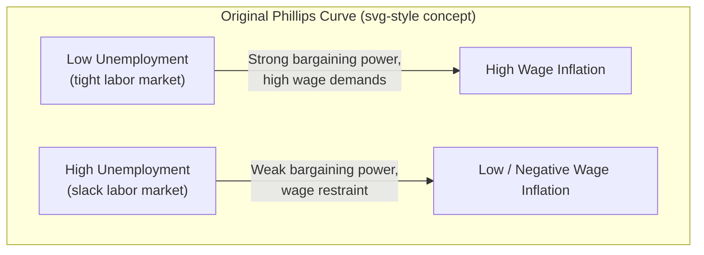
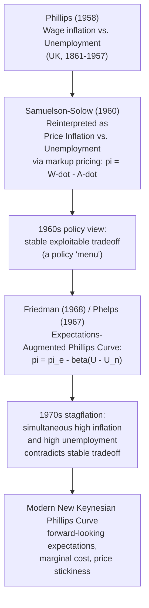

## Original Phillips Curve: Wage Inflation and Unemployment

### Historical Origin

The relationship was introduced by New Zealand-born economist A.W. Phillips in his 1958 paper "The Relation between Unemployment and the Rate of Change of Money Wage Rates in the United Kingdom, 1861–1957," published in *Economica*. Phillips examined nearly a century of UK data and documented an empirical, negative, nonlinear relationship between the unemployment rate and the rate of change of money (nominal) wages.

This is critical to note precisely: **the original Phillips curve relates wage inflation to unemployment — not price inflation to unemployment.** The later, more commonly taught "Phillips curve" relating *price* inflation to unemployment is a derivative concept developed by Paul Samuelson and Robert Solow (1960), who substituted price inflation for wage inflation using a markup relationship. This distinction is a frequent source of confusion and is treated in depth further below.

### The Empirical Relationship

Phillips plotted the annual percentage change in money wage rates, $\dot{W}/W$, against the unemployment rate, $U$, for the UK from 1861 to 1957. He found:

- A clear **negative, nonlinear (convex) relationship**: high unemployment was associated with low or negative wage growth; low unemployment was associated with high wage growth.
- The relationship was **remarkably stable** across nearly a century of data, spanning very different monetary regimes (the gold standard, WWI, the interwar period, WWII, and the postwar Bretton Woods era) — a stability that made it strikingly persuasive at the time.
- The curve was **convex to the origin**: wage growth accelerated much more sharply as unemployment fell below a critical low threshold than it decelerated as unemployment rose, reflecting an assumed asymmetry in labor market adjustment (downward wage rigidity makes wages "sticky" on the way down but not on the way up).

### Functional Form

Phillips fitted a curve of the form:

$$\dot{W}_t = -a + \frac{b}{U_t^{c}}$$

where $\dot{W}_t$ is the percentage rate of change of money wages, $U_t$ is the unemployment rate, and $a, b, c > 0$ are parameters estimated from the data. As $U_t \to 0^+$, wage inflation rises sharply (approaching infinity in the limit of the fitted functional form); as $U_t$ rises, wage inflation asymptotically approaches $-a$ (a finite negative floor, reflecting the assumption that wages are downwardly rigid but not entirely so).

A simplified linear approximation commonly used in textbooks for illustrative purposes is:

$$\dot{W}_t = -\alpha (U_t - U_n)$$

where $U_n$ is the unemployment rate at which wage inflation is zero, and $\alpha > 0$ governs the slope. [Inference] This linear form is a pedagogical simplification of Phillips's actual nonlinear specification and loses the asymmetric convexity that was central to Phillips's original empirical finding.

### The Phillips Curve Shape

### Visual Representation of the Curve

<svg xmlns="http://www.w3.org/2000/svg" viewBox="0 0 700 420">
<text x="350" y="26" text-anchor="middle" font-size="16" font-weight="bold" fill="#1a1a1a">Original Phillips Curve: Wage Inflation vs. Unemployment (svg_diagram)</text>
<line x1="80" y1="360" x2="650" y2="360" stroke="#333" stroke-width="1.5" />
<line x1="80" y1="360" x2="80" y2="50" stroke="#333" stroke-width="1.5" />
<text x="365" y="395" text-anchor="middle" font-size="13" fill="#333">Unemployment Rate, U (%)</text>
<text x="35" y="200" text-anchor="middle" font-size="13" fill="#333" transform="rotate(-90 35 200)">Wage Inflation, W-dot (%)</text>
<line x1="80" y1="240" x2="650" y2="240" stroke="#ccc" stroke-width="1" stroke-dasharray="4,4" />
<text x="660" y="244" font-size="11" fill="#999">0%</text>
<path d="M 130 60 C 200 130, 260 210, 330 250 C 420 300, 520 330, 620 345" fill="none" stroke="#c0392b" stroke-width="3" />
<text x="150" y="90" font-size="12" fill="#c0392b" font-weight="bold">Tight labor market:</text>
<text x="150" y="108" font-size="12" fill="#c0392b">sharp wage acceleration</text>
<text x="480" y="300" font-size="12" fill="#c0392b" font-weight="bold">Slack labor market:</text>
<text x="480" y="318" font-size="12" fill="#c0392b">wage growth flattens near a floor</text>
<line x1="330" y1="360" x2="330" y2="250" stroke="#2980b9" stroke-width="1" stroke-dasharray="3,3" />
<text x="330" y="378" text-anchor="middle" font-size="11" fill="#2980b9">U where W-dot = 0</text>
</svg>

### Theoretical Rationale: Why Would This Relationship Hold?

Phillips's own explanation, and subsequent elaborations, rest on a **labor market bargaining / excess demand mechanism**:

1. **Excess demand for labor drives up wages.** When unemployment is low, firms compete more intensely for scarce workers, and workers have greater bargaining leverage (individually and through unions), pushing money wages up faster.
2. **Excess supply of labor restrains wages.** When unemployment is high, workers have weak bargaining power (fear of job loss, abundant substitute labor), so wage growth slows or turns negative.
3. **Convexity reflects downward wage rigidity.** Even at very high unemployment, wages rarely fall sharply in nominal terms (due to institutional, contractual, and psychological resistance to nominal wage cuts — an idea later formalized as "downward nominal wage rigidity"), which is why the curve flattens toward a floor rather than continuing to fall without bound as unemployment rises. Conversely, there is no equivalent upward rigidity, so wages can accelerate sharply when labor markets tighten, producing the observed convex/asymmetric shape.

This is fundamentally a story about the **labor market's own excess demand conditions setting the pace of wage change** — it says nothing directly about the central bank, expected inflation, or monetary policy, all of which enter only in later reformulations (see below).

### From Wage Inflation to Price Inflation: The Samuelson-Solow Reinterpretation

Phillips's paper was about *wage* inflation. It became famous as an inflation-unemployment tradeoff largely because of Samuelson and Solow's 1960 paper "Analytical Aspects of Anti-Inflation Policy," which translated Phillips's wage curve into a *price* inflation curve using a simple markup pricing assumption:

$$P_t = (1 + \mu) \frac{W_t}{A_t}$$

where $P_t$ is the price level, $\mu$ is a constant markup over unit labor cost, $W_t$ is the nominal wage, and $A_t$ is average labor productivity. Taking growth rates:

$$\pi_t \approx \dot{W}_t - \dot{A}_t$$

That is, **price inflation approximately equals wage inflation minus productivity growth.** If productivity growth $\dot{A}_t$ is treated as roughly constant, then the Phillips relationship between $\dot{W}_t$ and $U_t$ translates directly into a relationship between $\pi_t$ and $U_t$ — this is the "menu" of inflation-unemployment combinations that Samuelson and Solow suggested policymakers could choose from, a claim that had enormous influence on 1960s macroeconomic policy debate in the United States.

**This distinction matters for several reasons:**

- The original curve is a statement about *labor market* dynamics (wage bargaining), while the Samuelson-Solow curve is a statement about the *aggregate price level*, mediated by a productivity/markup assumption that may not hold constant, especially during supply shocks (e.g., oil price shocks shift the markup or effective cost structure independent of wage bargaining).
- Criticisms of "the Phillips curve" as a stable policy menu (most famously by Friedman and Phelps in 1968, introducing the expectations-augmented Phillips curve) were primarily criticisms of the Samuelson-Solow *price* inflation adaptation, not of Phillips's original wage-unemployment finding as a descriptive empirical regularity for its historical sample.

### Original Phillips Curve vs. Later Reformulations

### Key Distinctions Summary Table

| Feature | Original Phillips Curve (1958) | Samuelson-Solow Adaptation (1960) | Friedman-Phelps (1968) |
| --- | --- | --- | --- |
| Dependent variable | Wage inflation ($\dot{W}$) | Price inflation ($\pi$) | Price inflation ($\pi$) |
| Mechanism | Labor market excess demand / bargaining | Wage curve + markup pricing identity | Labor market excess demand + adaptive/rational expectations |
| Expectations role | None (absent from the model) | None (absent from the model) | Central — inflation expectations shift the curve |
| Shape | Nonlinear, convex, empirically fitted | Derived, inherits nonlinearity from wage curve | Linear in most textbook presentations, vertical in long run |
| Implied long-run tradeoff | Not explicitly addressed by Phillips | Implicitly treated as a stable, exploitable menu | None — vertical at the natural rate $U_n$ in the long run |

### Empirical Example: Reading Phillips's Original Data Pattern

Using illustrative stylized values consistent with the qualitative pattern Phillips reported for the UK:

| Unemployment Rate (%) | Approx. Wage Inflation (%) |
| --- | --- |
| 1.0 | +8 to +10 |
| 2.0 | +4 to +5 |
| 3.0 | +2 |
| 4.0 | 0 to +1 |
| 5.5 (approx. threshold) | ≈ 0 |
| 8.0 | −1 to −2 |

[Unverified] These figures are illustrative approximations of the qualitative shape Phillips reported rather than exact reproductions of his fitted curve's numerical output, which depended on the specific nonlinear parameters $a, b, c$ estimated from his 1861–1957 UK sample.

**Interpretation exercise**: Notice the curve crosses zero wage inflation around 5.5% unemployment in this stylized example — this is *not* the same concept as the later "natural rate of unemployment" $U_n$ from Friedman-Phelps, since the original Phillips relationship contains no reference to inflation expectations or a theoretically-grounded equilibrium unemployment rate; it is simply the unemployment rate at which the empirically observed wage-bargaining dynamic implies zero nominal wage growth.

### Limitations and Historical Fate of the Original Curve

- **No microfoundations for expectations**: The original curve implicitly assumes workers and firms do not adjust their behavior based on anticipated future inflation — a static, backward-looking view of wage bargaining that later became the central point of critique.
- **Assumed stability across regimes**: Phillips's finding of a stable relationship across nearly a century, spanning gold standard and fiat currency regimes, [Inference] is now generally viewed as something of a historical coincidence of the specific UK sample rather than a structural constant, since the relationship visibly broke down internationally during the 1970s.
- **Silent on causation direction and productivity**: The original curve does not specify whether unemployment causes wage changes, whether both are driven by a common shock (e.g., aggregate demand), nor does it incorporate productivity growth, which is essential once one tries to extend the finding to price inflation.
- **The 1970s stagflation breakdown**: The apparent stability of the wage/price-unemployment tradeoff collapsed when many economies experienced simultaneously rising inflation and rising unemployment, a pattern the original (and Samuelson-Solow) framework could not accommodate, since it implied inflation and unemployment should move in opposite directions. This breakdown is what catalyzed the expectations-augmented reformulation.

### Common Misconceptions

- **Misconception**: "The Phillips curve" originally referred to price inflation and unemployment. **Correction**: Phillips's 1958 paper was specifically about the rate of change of *money wages*, not prices; the price-inflation version is a subsequent adaptation by Samuelson and Solow.
- **Misconception**: Phillips proposed his curve as a menu of policy choices for governments. **Correction**: Phillips's paper was a descriptive empirical study of historical UK data; the normative "policy menu" interpretation was introduced later, primarily by Samuelson and Solow and subsequent policy discourse.
- **Misconception**: The original curve was linear. **Correction**: Phillips's fitted relationship was explicitly nonlinear and convex, reflecting an assumed asymmetry in wage adjustment; the linear version is a common textbook simplification.

### Next Steps

- **Related Topics**:
  - Samuelson-Solow price Phillips curve and the markup pricing identity
  - Friedman-Phelps expectations-augmented Phillips curve
  - The natural rate of unemployment (NAIRU)
  - Adaptive vs. rational expectations in inflation dynamics
  - The 1970s stagflation and the breakdown of the stable tradeoff
  - Downward nominal wage rigidity
  - The New Keynesian Phillips Curve and forward-looking expectations
  - Okun's Law (linking unemployment gaps to output gaps)
  - Wage bargaining models and union power in labor economics
  - Sacrifice ratio and disinflation costs