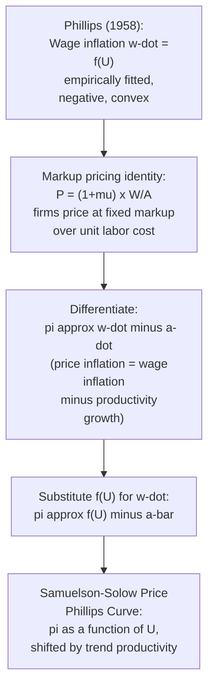

## Samuelson-Solow Adaptation to Price Inflation

### Historical Origin

In their 1960 paper "Analytical Aspects of Anti-Inflation Policy" (*American Economic Review*), Paul Samuelson and Robert Solow took A.W. Phillips's empirical finding — a negative relationship between UK unemployment and the rate of change of *money wages* — and reinterpreted it for the United States as a relationship between unemployment and the rate of change of *prices*. This adaptation transformed a narrow labor-market observation into what would become, for over a decade, the dominant framework for U.S. macroeconomic stabilization policy.

Samuelson and Solow did not have access to Phillips's exact UK dataset for the U.S. economy; instead, they constructed an analogous curve using U.S. wage and price data and, critically, provided the *theoretical bridge* — a pricing identity — that justified moving from a wage-based relationship to a price-based one.

### The Core Analytical Step: From Wages to Prices

The bridge is a simple **markup pricing rule**, under which firms set prices as a markup over unit labor costs:

$$P_t = (1 + \mu) \cdot \frac{W_t}{A_t}$$

where:

- $P_t$ = the aggregate price level
- $W_t$ = the nominal (money) wage rate
- $A_t$ = average labor productivity (output per worker)
- $\mu$ = a constant proportional markup reflecting profit margins, assumed fixed

Taking logarithms and differentiating with respect to time (i.e., converting to growth rates), and treating $\mu$ as constant so $\Delta \ln(1+\mu) \approx 0$:

$$\pi_t \equiv \frac{\dot{P}_t}{P_t} \approx \frac{\dot{W}_t}{W_t} - \frac{\dot{A}_t}{A_t} = \dot{w}_t - \dot{a}_t$$

where $\pi_t$ is price inflation, $\dot{w}_t$ is nominal wage growth, and $\dot{a}_t$ is labor productivity growth. In words:

$$\text{Price inflation} \approx \text{Wage inflation} - \text{Productivity growth}$$

This is the **unit labor cost identity**: if wages grow faster than productivity, unit labor costs rise, and under a constant markup, firms pass this through fully into higher prices.

### Substituting the Phillips Relationship

Since Phillips's original curve gives wage inflation as a (nonlinear, decreasing) function of unemployment:

$$\dot{w}_t = f(U_t), \quad f'(U_t) < 0$$

substituting into the markup identity yields a **derived relationship between price inflation and unemployment**:

$$\pi_t = f(U_t) - \dot{a}_t$$

If productivity growth $\dot{a}_t$ is assumed roughly constant (say, at its historical trend rate $\bar{a}$), this produces a curve of the same qualitative shape as the original Phillips curve, merely shifted vertically downward by the constant $\bar{a}$:

$$\pi_t \approx f(U_t) - \bar{a}$$

This is the key analytical result: **the price Phillips curve inherits its shape entirely from the wage Phillips curve**, with the vertical position of the curve determined by trend productivity growth.

### Diagram: The Analytical Chain

### Visualizing the Vertical Shift from Wage to Price Curve

<svg xmlns="http://www.w3.org/2000/svg" viewBox="0 0 700 420">
<text x="350" y="26" text-anchor="middle" font-size="16" font-weight="bold" fill="#1a1a1a">From Wage Curve to Price Curve: Productivity Shift (svg_diagram)</text>
<line x1="80" y1="360" x2="650" y2="360" stroke="#333" stroke-width="1.5" />
<line x1="80" y1="360" x2="80" y2="50" stroke="#333" stroke-width="1.5" />
<text x="365" y="395" text-anchor="middle" font-size="13" fill="#333">Unemployment Rate, U (%)</text>
<text x="35" y="200" text-anchor="middle" font-size="13" fill="#333" transform="rotate(-90 35 200)">Inflation Rate (%)</text>
<line x1="80" y1="230" x2="650" y2="230" stroke="#ccc" stroke-width="1" stroke-dasharray="4,4" />
<text x="660" y="234" font-size="11" fill="#999">0%</text>
<path d="M 130 70 C 200 130, 260 190, 330 220 C 420 260, 520 285, 620 300" fill="none" stroke="#2980b9" stroke-width="3" />
<text x="140" y="90" font-size="12" fill="#2980b9" font-weight="bold">Wage inflation curve, w-dot = f(U)</text>
<path d="M 130 130 C 200 190, 260 250, 330 280 C 420 320, 520 340, 620 350" fill="none" stroke="#c0392b" stroke-width="3" stroke-dasharray="8,4" />
<text x="140" y="150" font-size="12" fill="#c0392b" font-weight="bold">Price inflation curve, pi = f(U) - a-bar</text>
<line x1="330" y1="220" x2="330" y2="280" stroke="#333" stroke-width="1.5" />
<text x="345" y="255" font-size="11" fill="#333">shift = trend productivity growth (a-bar)</text>
</svg>

### The 1960s Policy Interpretation: A "Menu" of Choices

Samuelson and Solow explicitly framed their derived curve as offering policymakers a **tradeoff menu**: society could choose a point on the curve, accepting somewhat higher inflation in exchange for lower unemployment, or vice versa, via demand-management policy (fiscal and monetary expansion or contraction). This was enormously influential because it appeared to convert Phillips's descriptive labor-market regularity into a *policy instrument*:

- Expansionary fiscal/monetary policy → lower unemployment → move up and to the left along the curve → higher inflation accepted as the "cost."
- Contractionary policy → higher unemployment → move down and to the right → lower inflation achieved at the "cost" of higher unemployment.

Samuelson and Solow themselves were notably cautious about this interpretation, flagging the curve as potentially unstable and dependent on expectations — a caveat that was frequently lost in the subsequent policy discourse and textbook simplifications of their work.

### Illustrative Numerical Example

Suppose trend productivity growth $\bar{a} = 2\%$ per year, and the empirically fitted wage Phillips relationship (simplified to linear form for illustration) is:

$$\dot{w}_t = 10 - 2 U_t$$

Then the derived price Phillips curve is:

$$\pi_t = (10 - 2U_t) - 2 = 8 - 2U_t$$

| Unemployment Rate $U_t$ (%) | Wage Inflation $\dot{w}_t$ (%) | Price Inflation $\pi_t$ (%) |
| --- | --- | --- |
| 2 | 6 | 4 |
| 3 | 4 | 2 |
| 4 | 2 | 0 |
| 5 | 0 | −2 |
| 6 | −2 | −4 |

This table illustrates the mechanical translation: at each unemployment rate, price inflation is simply wage inflation minus the assumed constant 2% productivity growth. [Unverified] These numbers are illustrative constructs for pedagogical purposes and do not reproduce Samuelson and Solow's actual estimated U.S. curve, which was fitted to specific historical data and retained Phillips's original nonlinear convex shape rather than this simplified linear form.

### Critical Assumptions Embedded in the Adaptation

1. **Constant markup ($\mu$ fixed)**: Assumes firms' profit margins over unit labor cost do not vary systematically with the business cycle or with input cost shocks (e.g., oil prices, import prices). This assumption is violated during supply shocks, which shift the effective markup or cost structure independent of wage bargaining — a key reason the curve broke down during the 1970s oil shocks.
2. **Constant/exogenous productivity growth**: Treats $\dot{a}_t$ as a stable trend rather than a variable that itself responds to the business cycle (procyclical productivity, e.g., due to labor hoarding, can itself shift the derived price curve in ways not captured by the simple identity).
3. **No role for inflation expectations**: Like the original Phillips curve, the Samuelson-Solow adaptation is entirely backward-looking/static — workers and firms are assumed not to build anticipated future inflation into current wage and price decisions. This is precisely the feature that Milton Friedman (1968) and Edmund Phelps (1967) attacked, arguing that once expectations adjust, the exploitable tradeoff vanishes in the long run.
4. **Stability of the underlying wage-Phillips relationship itself**: The adaptation assumes the wage curve $f(U)$ is itself stable and structural, an assumption inherited directly from taking Phillips's finding as a fixed technological/behavioral relationship rather than a reduced-form correlation that could shift with the policy regime (a critique later generalized as the Lucas Critique).

### Why This Distinction Matters for Policy History

The Samuelson-Solow curve, particularly as simplified and popularized in textbooks through the 1960s, was widely read as evidence that policymakers faced a **stable, exploitable long-run tradeoff** between inflation and unemployment. This interpretation shaped U.S. macroeconomic policy through much of the 1960s, including the deliberate acceptance of somewhat higher inflation to pursue lower unemployment targets.

The **1970s stagflation** — simultaneous high inflation and high unemployment — directly contradicted the curve's implied negative relationship and is widely cited as the empirical episode that discredited the naive policy-menu interpretation, catalyzing the shift toward the expectations-augmented Phillips curve framework.

### Samuelson-Solow Curve vs. Later Frameworks

| Feature | Samuelson-Solow (1960) | Friedman-Phelps (1968) | New Keynesian Phillips Curve |
| --- | --- | --- | --- |
| Core mechanism | Markup pricing over unit labor cost, derived from wage Phillips curve | Labor market excess demand + expectations of inflation | Firm price-setting under nominal rigidities (e.g., Calvo pricing), forward-looking |
| Role of productivity | Explicit constant shift term ($\bar{a}$) | Typically abstracted away or embedded in $U_n$ | Embedded in real marginal cost |
| Role of expectations | Absent | Central; adaptive or rational | Central; rational, forward-looking |
| Implied long-run tradeoff | Stable, exploitable (as popularly interpreted) | None — vertical at $U_n$ | None in the basic closed-economy NKPC without frictions in expectations |
| Key policy implication | Governments can "buy" lower unemployment with modest inflation | Attempts to hold $U$ below $U_n$ only raise inflation persistently, without lasting unemployment gains | Inflation dynamics driven by expected future inflation and current marginal cost/output gap |

### Common Misconceptions

- **Misconception**: Samuelson and Solow claimed the tradeoff was permanent and safely exploitable. **Correction**: While their paper is popularly remembered this way, Samuelson and Solow themselves included explicit caveats about the curve's potential instability, particularly regarding how sustained policy exploitation might shift the curve — caveats that were often dropped in subsequent textbook and policy simplifications.
- **Misconception**: The Samuelson-Solow curve is empirically identical to Phillips's original curve. **Correction**: It is a *derived* relationship, obtained by combining Phillips's wage curve with a separate markup-pricing identity and a productivity growth assumption; it is a distinct theoretical construct, not a direct re-estimation of Phillips's finding.
- **Misconception**: The curve's breakdown in the 1970s disproved Phillips's original wage-unemployment finding. **Correction**: The 1970s stagflation primarily discredited the *stable exploitable price-inflation tradeoff* interpretation and the assumption of static expectations; it does not, by itself, invalidate the narrower claim that tight labor markets tend to generate faster wage growth, which remains a feature preserved (in modified form) even in expectations-augmented models.

### Next Steps

- **Related Topics**:
  - Original Phillips curve: wage inflation and unemployment
  - Friedman-Phelps expectations-augmented Phillips curve
  - The natural rate of unemployment (NAIRU)
  - Adaptive vs. rational expectations formation
  - The 1970s stagflation and oil price shocks
  - The New Keynesian Phillips Curve (Calvo pricing, forward-looking inflation)
  - The Lucas Critique and policy-invariant structural relationships
  - Unit labor costs and markup pricing in firm behavior
  - The sacrifice ratio and costs of disinflation
  - Short-run vs. long-run Phillips curve distinctions