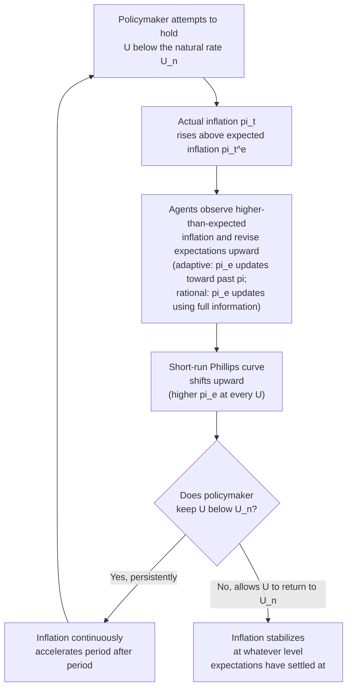

## Expectations-Augmented Phillips Curve

### Historical Origin and Motivation

The expectations-augmented Phillips curve (EAPC) was introduced independently by Milton Friedman (in his 1968 American Economic Association presidential address, "The Role of Monetary Policy") and Edmund Phelps (1967, "Phillips Curves, Expectations of Inflation and Optimal Unemployment over Time"). Both economists challenged the Samuelson-Solow interpretation of the Phillips curve as a stable, exploitable long-run menu of inflation-unemployment combinations.

Their central insight: the original and Samuelson-Solow Phillips curves were **static** — they implicitly assumed workers and firms never revise their expectations of future inflation when setting current wages and prices. Friedman and Phelps argued this was economically untenable once policymakers systematically tried to exploit the tradeoff, because rational economic agents would eventually incorporate anticipated inflation into their wage and price decisions, causing the curve itself to shift.

### The Core Modification: Adding Expected Inflation

The EAPC modifies the price Phillips curve by adding an expected inflation term, $\pi_t^e$:

$$\pi_t = \pi_t^e - \beta (U_t - U_n) + \varepsilon_t$$

where:

- $\pi_t$ = actual (realized) inflation rate
- $\pi_t^e$ = expected inflation rate, formed prior to period $t$
- $U_t$ = actual unemployment rate
- $U_n$ = the **natural rate of unemployment** (also called the non-accelerating inflation rate of unemployment, or NAIRU)
- $\beta > 0$ = the sensitivity of inflation to the unemployment gap (the slope parameter)
- $\varepsilon_t$ = a stochastic supply shock term (e.g., oil price shocks), often included in modern presentations

The critical conceptual shift: inflation is no longer simply a decreasing function of the unemployment *level* — it is a function of the deviation of unemployment from its **natural rate**, plus whatever inflation is already expected to occur.

### The Natural Rate of Unemployment ($U_n$)

$U_n$ is defined as the unemployment rate consistent with a stable, non-accelerating inflation rate — the rate that would prevail once all wage and price expectations have fully adjusted to actual inflation, i.e., in long-run equilibrium where $\pi_t = \pi_t^e$. It reflects structural and frictional features of the labor market (search frictions, labor market institutions, unemployment insurance generosity, demographic composition, minimum wage laws) rather than monetary or aggregate demand conditions.

$U_n$ is **not directly observable** and must be estimated; it can itself shift over time due to structural changes in the economy (this time-variation is itself an active area of empirical macroeconomics). [Inference] Estimates of $U_n$ for the U.S. have varied considerably across decades and estimation methods, and there is no consensus "true" value at any given point in time — it is inferred indirectly from inflation behavior rather than measured directly.

### The Expectations Formation Mechanism

**Friedman's original specification used adaptive expectations**, where expected inflation is formed as a backward-looking function of past actual inflation:

$$\pi_t^e = \pi_{t-1}^e + \lambda (\pi_{t-1} - \pi_{t-1}^e), \quad 0 < \lambda \le 1$$

A common simplification used in introductory treatments sets $\pi_t^e = \pi_{t-1}$ (naive/static expectations: agents simply expect this period's inflation to equal last period's), yielding the widely-taught **accelerationist Phillips curve**:

$$\pi_t = \pi_{t-1} - \beta(U_t - U_n) + \varepsilon_t$$

This form directly explains the "accelerationist" property: if policymakers hold $U_t$ persistently below $U_n$, inflation does not settle at a higher but stable level — it **continuously accelerates** period after period, since each period's higher-than-expected inflation becomes next period's (adaptively formed) expectation, requiring ever-faster inflation to keep unemployment below $U_n$.

**Later work (particularly by Robert Lucas and the rational expectations school) replaced adaptive expectations with rational expectations**, where agents use all available information (including knowledge of the policy rule itself) to form expectations optimally:

$$\pi_t^e = E_{t-1}[\pi_t \mid \Omega_{t-1}]$$

where $\Omega_{t-1}$ is the full information set available at $t-1$. Under rational expectations, systematic, anticipated monetary policy cannot generate *any* short-run tradeoff, even temporarily — because rational agents anticipate the policy's inflationary consequences immediately and incorporate them into wage/price setting before the policy even takes effect. Only *unanticipated* (surprise) policy shocks can move unemployment away from $U_n$, even temporarily — a result central to the Lucas "surprise supply function" and the broader Lucas Critique of using historically estimated reduced-form relationships (like the Phillips curve) to evaluate policy changes that would themselves alter those relationships.

### Diagram: The Analytical Logic

### Short-Run vs. Long-Run Phillips Curve

The EAPC generates a family of **short-run Phillips curves (SRPC)**, one for each level of expected inflation, and a single **long-run Phillips curve (LRPC)**:

- **Short run**: For a given, fixed $\pi_t^e$, the SRPC traces out the standard negative relationship between $\pi_t$ and $U_t$ — policymakers *can* temporarily reduce unemployment below $U_n$ by generating inflation surprises (actual inflation exceeding what was expected).
- **Long run**: Once expectations fully adjust ($\pi_t^e = \pi_t$), the unemployment gap term must equal zero, so $U_t = U_n$ regardless of the inflation rate. The LRPC is **vertical** at $U_n$ — there is no long-run tradeoff between inflation and unemployment; any inflation rate is consistent with the natural rate of unemployment once expectations catch up.

<svg xmlns="http://www.w3.org/2000/svg" viewBox="0 0 720 440">
<text x="360" y="26" text-anchor="middle" font-size="16" font-weight="bold" fill="#1a1a1a">Short-Run vs. Long-Run Phillips Curve (svg_diagram)</text>
<line x1="90" y1="380" x2="670" y2="380" stroke="#333" stroke-width="1.5" />
<line x1="90" y1="380" x2="90" y2="50" stroke="#333" stroke-width="1.5" />
<text x="380" y="412" text-anchor="middle" font-size="13" fill="#333">Unemployment Rate, U (%)</text>
<text x="45" y="215" text-anchor="middle" font-size="13" fill="#333" transform="rotate(-90 45 215)">Inflation Rate, pi (%)</text>
<line x1="330" y1="380" x2="330" y2="60" stroke="#8e44ad" stroke-width="3" />
<text x="345" y="80" font-size="12" fill="#8e44ad" font-weight="bold">LRPC (vertical at U_n)</text>
<line x1="330" y1="380" x2="330" y2="395" stroke="#333" stroke-width="1" />
<text x="330" y="410" text-anchor="middle" font-size="11" fill="#333">U_n</text>
<path d="M 150 130 C 220 160, 280 220, 330 260 C 380 300, 440 330, 510 350" fill="none" stroke="#2980b9" stroke-width="2.5" />
<text x="160" y="115" font-size="11" fill="#2980b9">SRPC (pi_e = pi_1, low)</text>
<path d="M 150 230 C 220 260, 280 300, 330 320 C 380 340, 440 355, 510 365" fill="none" stroke="#c0392b" stroke-width="2.5" />
<text x="160" y="215" font-size="11" fill="#c0392b">SRPC (pi_e = pi_2, higher)</text>
<circle cx="250" cy="185" r="4" fill="#2980b9" />
<text x="180" y="180" font-size="10" fill="#2980b9">Point A: U below U_n,
surprise inflation</text>
<circle cx="330" cy="260" r="4" fill="#333" />
<text x="345" y="255" font-size="10" fill="#333">Point B: U = U_n,
expectations catch up</text>
<path d="M 250 185 L 330 260" stroke="#555" stroke-width="1" stroke-dasharray="3,3" marker-end="url(#arrow)" />
</svg>

### Worked Numerical Example: The Accelerationist Dynamic

Suppose $U_n = 5\%$, $\beta = 1$, and expectations are adaptive with $\pi_t^e = \pi_{t-1}$. The economy starts at $\pi_0 = 2\%$ with $U_0 = U_n = 5\%$ (long-run equilibrium). Now suppose the central bank decides to hold unemployment at $U_t = 3\%$ (2 points below natural) indefinitely, with no supply shocks ($\varepsilon_t = 0$):

$$\pi_t = \pi_{t-1} - 1 \times (3 - 5) = \pi_{t-1} + 2$$

| Period $t$ | $U_t$ | $\pi_{t-1}$ (expected) | $\pi_t$ (actual) |
| --- | --- | --- | --- |
| 0 | 5% | — | 2% |
| 1 | 3% | 2% | 4% |
| 2 | 3% | 4% | 6% |
| 3 | 3% | 6% | 8% |
| 4 | 3% | 8% | 10% |

Each period, inflation rises by a constant 2 percentage points — it does not stabilize at a higher level; it **accelerates without bound** as long as unemployment is held below $U_n$. This demonstrates precisely why Friedman termed the natural rate the point at which inflation is "non-accelerating" — deviations from $U_n$ in either direction imply continuously *rising* or *falling* inflation, not merely a one-time shift to a new stable inflation rate.

### The 1970s Empirical Vindication

The EAPC's predictive success in explaining the 1970s **stagflation** (simultaneous high inflation and high unemployment) is widely cited as the episode that established the framework's credibility over the naive Samuelson-Solow policy-menu view:

- Persistent attempts to hold unemployment below its natural rate through the late 1960s, compounded by oil price supply shocks in 1973–74 and 1979, generated exactly the accelerating-inflation, high-unemployment pattern the EAPC predicted, contradicting the static Phillips curve's implied stable negative tradeoff.
- Paul Volcker's disinflation (1979–1982), which deliberately induced a severe recession (pushing $U_t$ well above $U_n$) to break embedded inflation expectations, is often read as an application of EAPC logic in reverse: a sustained positive unemployment gap was required to bring $\pi_t^e$ (and hence $\pi_t$) back down, at the cost of significant short-run output and employment losses (the "sacrifice ratio").

### The Lucas Critique and Rational Expectations Refinement

Robert Lucas (1976) extended the expectations-augmented logic further, arguing that even the *adaptive*-expectations EAPC was not fully robust to policy changes, since the parameters of an adaptively-formed expectations process are themselves likely to change if the policy regime changes (the Lucas Critique). Under rational expectations with full information, only **unanticipated** monetary policy can move $U_t$ away from $U_n$, even in the short run — anticipated, systematic policy rules are fully priced into wage and price contracts in advance and have no real effects, a result formalized in Lucas's "islands" model and the broader New Classical policy-ineffectiveness proposition. [Inference] This strong policy-ineffectiveness result is generally regarded as an extreme benchmark case rather than a fully accurate empirical description, since it depends on strict assumptions (full information, flexible prices, and correctly-specified rational expectations) that later New Keynesian models relax by introducing nominal rigidities, which can restore some short-run real effects of anticipated policy even under rational expectations.

### Comparison Table: Evolution of the Phillips Curve Framework

| Feature | Original Phillips (1958) | Samuelson-Solow (1960) | Friedman-Phelps EAPC (1967-68) | Lucas / Rational Expectations (1972-76) |
| --- | --- | --- | --- | --- |
| Dependent variable | Wage inflation | Price inflation | Price inflation | Price inflation / output gap |
| Expectations | None | None | Adaptive (backward-looking) | Rational (forward-looking, model-consistent) |
| Long-run tradeoff | Not addressed | Implicitly stable/exploitable | None — vertical at $U_n$ | None, even in the short run for anticipated policy |
| Key equilibrium concept | Empirical curve fit | Derived from wage curve + markup | Natural rate of unemployment ($U_n$) | Natural rate + policy-ineffectiveness under full information |
| Effect of persistent demand stimulus | Not modeled | Assumed to lower $U$ permanently | Only lowers $U$ temporarily; inflation accelerates | No effect on $U$ if stimulus is anticipated |

### Modern Legacy: The New Keynesian Phillips Curve

The EAPC's expectations-augmented logic was later reformulated with fully forward-looking (rather than adaptive) expectations and explicit microfoundations for price stickiness (e.g., Calvo pricing), producing the **New Keynesian Phillips Curve (NKPC)**:

$$\pi_t = \gamma E_t[\pi_{t+1}] + \kappa \tilde{y}_t$$

where $E_t[\pi_{t+1}]$ is expected *future* inflation (rather than past inflation) and $\tilde{y}_t$ is the output gap (a close cousin of the unemployment gap via Okun's Law). This framework retains the EAPC's central insight — that expectations must enter the inflation equation to avoid a spurious stable tradeoff — while updating the expectations mechanism to be forward-looking and grounding the curve in explicit firm price-setting optimization rather than reduced-form labor market bargaining.

### Common Misconceptions

- **Misconception**: The expectations-augmented Phillips curve implies monetary policy is powerless to affect unemployment even in the short run. **Correction**: Under adaptive expectations (Friedman's original formulation), monetary policy *can* move unemployment away from $U_n$ temporarily, at the cost of accelerating inflation; only under the stronger rational-expectations-plus-full-information assumptions does even short-run policy effectiveness vanish for anticipated policy.
- **Misconception**: The natural rate of unemployment is a fixed, universal constant. **Correction**: $U_n$ is estimated indirectly, varies across countries, and can shift over time with structural changes in labor markets (e.g., demographics, unemployment insurance policy, labor market institutions) — it is not treated as a permanent numerical constant in the literature.
- **Misconception**: The vertical long-run Phillips curve means inflation and unemployment are entirely unrelated in the long run. **Correction**: It means there is no long-run *tradeoff* to exploit — unemployment settles at $U_n$ regardless of the sustained inflation rate — but this does not imply inflation is costless or irrelevant; sustained high inflation carries its own distinct economic costs (e.g., menu costs, uncertainty, distorted price signals) separate from any unemployment tradeoff.

### Next Steps

- **Related Topics**:
  - Original Phillips curve: wage inflation and unemployment
  - Samuelson-Solow adaptation to price inflation
  - The natural rate of unemployment and NAIRU estimation
  - Adaptive expectations vs. rational expectations
  - The Lucas Critique and policy regime dependence
  - New Classical policy-ineffectiveness proposition
  - The New Keynesian Phillips Curve and Calvo pricing
  - The Volcker disinflation and the sacrifice ratio
  - The 1970s stagflation and oil price supply shocks
  - Okun's Law linking unemployment and output gaps