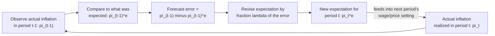

## Adaptive Expectations and the Accelerationist Hypothesis

### Conceptual Overview

Adaptive expectations is a hypothesis about how economic agents form beliefs about future inflation: rather than using all available structural information (as under rational expectations), agents revise their expectations gradually based on past forecast errors, essentially learning from recent experience. The accelerationist hypothesis is the direct macroeconomic implication of combining adaptive expectations with the expectations-augmented Phillips curve: any attempt to hold unemployment persistently below its natural rate does not produce a stable higher inflation rate, but rather causes inflation to accelerate continuously, without bound, for as long as the policy is sustained.

These two concepts are inseparable in the Friedman-Phelps framework — adaptive expectations is the *behavioral mechanism*, and the accelerationist property is the *macroeconomic consequence* of that mechanism operating within the Phillips curve relationship.

### The Adaptive Expectations Formation Rule

The general adaptive expectations mechanism specifies that expected inflation is revised in proportion to the most recent forecast error:

$$\pi_t^e = \pi_{t-1}^e + \lambda \left( \pi_{t-1} - \pi_{t-1}^e \right), \qquad 0 < \lambda \le 1$$

where:

- $\pi_t^e$ = inflation expected for period $t$, formed at the end of period $t-1$
- $\pi_{t-1}$ = actual inflation realized in period $t-1$
- $\pi_{t-1}^e$ = inflation that had been expected for period $t-1$
- $\lambda$ = the adjustment (or "learning") parameter, governing how quickly expectations respond to past errors

**Interpreting $\lambda$:**

- If $\lambda = 1$: expectations fully adjust to the most recent actual inflation rate in a single period. This collapses to the **naive/static expectations** special case: $\pi_t^e = \pi_{t-1}$.
- If $\lambda$ is small (close to 0): expectations adjust sluggishly, remaining heavily anchored to past expectations even after large forecast errors — agents are "slow learners."
- If $0 < \lambda < 1$: expectations are a **geometrically weighted average of all past actual inflation rates**, with more recent observations weighted more heavily.

### Deriving the Distributed Lag Form

Repeatedly substituting the adaptive expectations rule backward reveals that $\pi_t^e$ is a distributed lag of all past inflation:

$$\pi_t^e = \lambda \sum_{j=0}^{\infty} (1-\lambda)^j \, \pi_{t-1-j}$$

This shows explicitly that adaptive expectations are **entirely backward-looking**: the expectation for period $t$ depends only on the history of actual past inflation rates, with geometrically declining weights, and never on any forward-looking or structural information about future policy actions, anticipated shocks, or the announced intentions of the central bank.

### Diagram: The Expectation Revision Loop

### Naive Expectations: The Common Textbook Simplification

Introductory treatments frequently set $\lambda = 1$, giving the simplest possible adaptive rule:

$$\pi_t^e = \pi_{t-1}$$

Substituting into the expectations-augmented Phillips curve $\pi_t = \pi_t^e - \beta(U_t - U_n)$ yields the standard **accelerationist Phillips curve**:

$$\pi_t = \pi_{t-1} - \beta (U_t - U_n) + \varepsilon_t$$

where $\varepsilon_t$ represents supply shocks (e.g., oil price shocks) exogenous to the demand-side unemployment gap mechanism. This equation is the workhorse specification used in most intermediate macroeconomics treatments of the accelerationist hypothesis, and it is algebraically equivalent to writing the change in inflation as a function of the unemployment gap:

$$\Delta \pi_t \equiv \pi_t - \pi_{t-1} = -\beta (U_t - U_n) + \varepsilon_t$$

This restated form makes the accelerationist property visually explicit: it is the **change** in inflation, not the level, that depends on the unemployment gap.

### The Accelerationist Hypothesis Formally Stated

The accelerationist hypothesis asserts three linked propositions:

1. **No stable long-run tradeoff exists between the level of inflation and the level of unemployment.**
2. **The unemployment gap ($U_t - U_n$) determines the *change* in inflation, not its level.** Positive gaps (unemployment above natural rate) cause disinflation; negative gaps (unemployment below natural rate) cause inflation to accelerate.
3. **Inflation stabilizes at a constant, non-accelerating rate if and only if $U_t = U_n$** — hence the name **NAIRU** (Non-Accelerating Inflation Rate of Unemployment) as an alternative label for the natural rate concept in this specific context.

### Worked Example: Sustained Below-Natural Unemployment

Let $U_n = 5\%$, $\beta = 1.5$, $\varepsilon_t = 0$ (no supply shocks), starting from long-run equilibrium with $\pi_0 = 3\%$. Suppose the government sustains $U_t = 4\%$ (one point below natural) for five periods:

$$\pi_t = \pi_{t-1} - 1.5(4 - 5) = \pi_{t-1} + 1.5$$

| Period $t$ | $U_t$ (%) | $\pi_{t-1}$ (%) | $\pi_t$ (%) | Change in inflation |
| --- | --- | --- | --- | --- |
| 0 | 5.0 | — | 3.0 | — |
| 1 | 4.0 | 3.0 | 4.5 | +1.5 |
| 2 | 4.0 | 4.5 | 6.0 | +1.5 |
| 3 | 4.0 | 6.0 | 7.5 | +1.5 |
| 4 | 4.0 | 7.5 | 9.0 | +1.5 |
| 5 | 4.0 | 9.0 | 10.5 | +1.5 |

Inflation rises by a **constant 1.5 percentage points every period**, with no tendency to converge to a new stable level — this is the mathematical signature of acceleration. The smaller the unemployment gap or the smaller $\beta$, the slower the acceleration, but as long as $U_t \ne U_n$ is sustained under adaptive expectations, inflation never settles.

### Reversing the Example: Disinflation via Unemployment Above Natural

Now suppose, starting from $\pi_0 = 10\%$ with $U_0 = U_n = 5\%$, the central bank engineers a recession, holding $U_t = 8\%$ (3 points above natural) with $\beta = 1$:

$$\pi_t = \pi_{t-1} - 1(8-5) = \pi_{t-1} - 3$$

| Period $t$ | $U_t$ (%) | $\pi_t$ (%) |
| --- | --- | --- |
| 0 | 5.0 | 10.0 |
| 1 | 8.0 | 7.0 |
| 2 | 8.0 | 4.0 |
| 3 | 8.0 | 1.0 |
| 4 | 8.0 | −2.0 |

This stylized calculation illustrates the logic behind the **Volcker disinflation** (1979–1982): to durably reduce embedded inflation expectations under an adaptive-expectations world, a sustained period of unemployment above the natural rate is required — the deeper and more sustained the unemployment gap, the faster disinflation proceeds, but at a real economic cost captured by the **sacrifice ratio** (cumulative percentage-point-years of lost output, or excess unemployment, per percentage point of disinflation achieved).

### The Sacrifice Ratio

$$\text{Sacrifice Ratio} = \frac{\text{Cumulative output gap (\% of potential GDP-years) during disinflation}}{\text{Total reduction in inflation (percentage points)}}$$

[Unverified] Empirical estimates of the U.S. sacrifice ratio vary considerably by episode and estimation method, commonly cited in the range of roughly 2 to 5 (percentage-point-years of output loss per point of disinflation), though this is highly sensitive to how credible and how gradual the disinflation is perceived to be by wage- and price-setters.

### Visualizing the Accelerationist Dynamic Over Time

<svg xmlns="http://www.w3.org/2000/svg" viewBox="0 0 720 420">
<text x="360" y="26" text-anchor="middle" font-size="16" font-weight="bold" fill="#1a1a1a">Accelerationist Dynamics: Inflation Path Under Sustained U below U_n (svg_diagram)</text>
<line x1="90" y1="360" x2="670" y2="360" stroke="#333" stroke-width="1.5" />
<line x1="90" y1="360" x2="90" y2="50" stroke="#333" stroke-width="1.5" />
<text x="380" y="392" text-anchor="middle" font-size="13" fill="#333">Time (periods)</text>
<text x="45" y="200" text-anchor="middle" font-size="13" fill="#333" transform="rotate(-90 45 200)">Inflation Rate, pi (%)</text>
<polyline points="90,330 170,300 250,265 330,225 410,180 490,130 570,75" fill="none" stroke="#c0392b" stroke-width="3" />
<circle cx="90" cy="330" r="4" fill="#c0392b" />
<circle cx="170" cy="300" r="4" fill="#c0392b" />
<circle cx="250" cy="265" r="4" fill="#c0392b" />
<circle cx="330" cy="225" r="4" fill="#c0392b" />
<circle cx="410" cy="180" r="4" fill="#c0392b" />
<circle cx="490" cy="130" r="4" fill="#c0392b" />
<circle cx="570" cy="75" r="4" fill="#c0392b" />
<text x="130" y="345" font-size="11" fill="#333">t=0</text>
<text x="530" y="345" font-size="11" fill="#333">t=6</text>
<text x="380" y="55" text-anchor="middle" font-size="12" fill="#c0392b" font-weight="bold">Constant U below U_n sustained throughout: inflation accelerates without bound</text>
</svg>

### Adaptive Expectations vs. Rational Expectations: Contrasting Predictions

| Feature | Adaptive Expectations | Rational Expectations |
| --- | --- | --- |
| Information used | Only past inflation history | All available information, including the policy rule itself |
| Speed of adjustment | Gradual, governed by fixed $\lambda$ | Immediate, given available information |
| Systematic forecast errors | Possible and persistent (agents can be "fooled" repeatedly by a sustained, unchanging policy) | Not possible on average; errors are unpredictable/random |
| Effect of a sustained expansionary policy | Temporarily lowers $U$ below $U_n$; inflation accelerates as expectations catch up with a lag | If the policy is anticipated, no effect on $U$ even temporarily; only unanticipated shocks move $U$ from $U_n$ |
| Vulnerability to Lucas Critique | High — $\lambda$ and the expectations process are assumed fixed even if the policy regime changes | By construction, incorporates regime changes into the expectations formation process |
| Policy implication | A sustained inflationary policy has real short-run effects on unemployment, at the cost of ever-rising inflation | Systematic, anticipated policy is neutral even in the short run; only "surprises" matter |

### Empirical Relevance and Critiques of Adaptive Expectations

- **Descriptive success in the 1970s**: The accelerationist hypothesis, built on adaptive expectations, successfully predicted that persistent attempts to exploit a stable Phillips curve tradeoff through the late 1960s and 1970s (compounded by oil supply shocks) would generate the accelerating-inflation, high-unemployment pattern actually observed, in sharp contrast to the naive Samuelson-Solow static-curve prediction.
- **The Lucas Critique**: Robert Lucas argued that even a well-fitting adaptive expectations parameter $\lambda$, estimated from historical data under one policy regime, is not structurally invariant — if the monetary authority changes its behavior (e.g., adopts a credible inflation target), rational agents would eventually adjust *how* they form expectations, not merely *what* they expect, undermining the presumption that $\lambda$ remains fixed across a policy regime change.
- **Backward-looking limitation**: [Inference] Because adaptive expectations never use forward-looking or policy-announcement information, they cannot, by construction, capture the disinflationary effects of a credible, pre-announced policy shift before it is actually observed in the inflation data — a phenomenon central bank credibility and forward guidance strategies are explicitly designed to exploit, and one better captured by rational or forward-looking expectations frameworks such as the New Keynesian Phillips Curve.
- **Enduring practical relevance**: Despite these theoretical critiques, [Inference] many empirical inflation forecasting models and some central bank frameworks continue to use adaptive or hybrid (partly backward-looking, partly forward-looking) expectations specifications, as they often fit observed inflation persistence better than purely forward-looking rational expectations models, which tend to predict inflation should be less persistent (less "sticky") than is typically observed in the data.

### Common Misconceptions

- **Misconception**: Adaptive expectations and the accelerationist hypothesis are two separate, unrelated theories. **Correction**: The accelerationist property is the direct mathematical and economic *consequence* of embedding adaptive (specifically, often naive) expectations into the expectations-augmented Phillips curve; they form a single integrated framework.
- **Misconception**: The accelerationist hypothesis predicts inflation rises forever regardless of policy. **Correction**: Inflation only accelerates *while* unemployment is sustained away from $U_n$; once $U_t$ returns to $U_n$, inflation stabilizes (though not necessarily at its original level — it settles at whatever rate expectations have adjusted to).
- **Misconception**: A single, fixed value of $\lambda$ can be assumed stable across any policy environment for forecasting purposes. **Correction**: The Lucas Critique specifically challenges this assumption, arguing that policy regime changes can alter how agents form expectations, making $\lambda$ itself potentially unstable across different policy regimes.

### Next Steps

- **Related Topics**:
  - Expectations-augmented Phillips curve
  - The natural rate of unemployment and NAIRU estimation
  - Rational expectations and the Lucas Critique
  - The sacrifice ratio and costs of disinflation
  - The Volcker disinflation of 1979-1982
  - New Keynesian Phillips Curve and forward-looking inflation
  - Central bank credibility and inflation targeting
  - Inflation persistence and hybrid expectations models
  - Okun's Law and the output-unemployment relationship
  - Time inconsistency and the Kydland-Prescott critique of discretionary policy