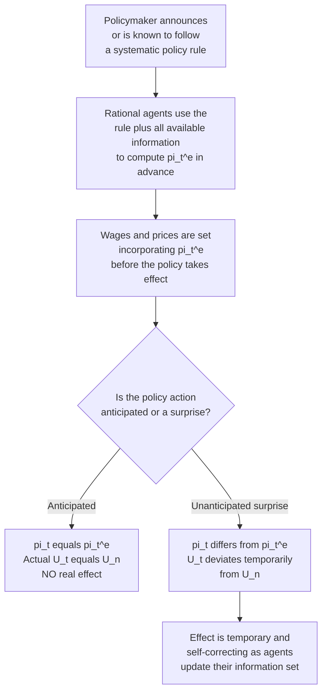

## Rational Expectations Critique of the Phillips Curve

### Historical Origin and Intellectual Context

The rational expectations critique of the Phillips curve was developed primarily by Robert Lucas in the early-to-mid 1970s, building on the concept of rational expectations first introduced by John Muth (1961) in the context of microeconomic price theory. Lucas applied Muth's insight to macroeconomics in a series of influential papers, most notably "Expectations and the Neutrality of Money" (1972) and "Econometric Policy Evaluation: A Critique" (1976), the latter formalizing what is now universally known as the **Lucas Critique**.

The rational expectations school (often called the **New Classical** school, including contributions from Thomas Sargent, Neil Wallace, and Robert Barro) pushed the Friedman-Phelps expectations-augmented framework a decisive step further: if adaptive expectations were an ad hoc, backward-looking assumption inconsistent with rational optimizing behavior, then a fully rational, forward-looking, model-consistent expectations mechanism should replace it — with dramatic implications for the effectiveness of monetary policy.

### The Definition of Rational Expectations

Rational expectations posits that economic agents form expectations of future variables using **all available relevant information**, including their understanding of the true underlying structure of the economy and the systematic behavior (rule) followed by policymakers. Formally, expected inflation equals the mathematical conditional expectation of actual inflation given the full information set $\Omega_{t-1}$ available at the time the expectation is formed:

$$\pi_t^e = E[\pi_t \mid \Omega_{t-1}]$$

This does not mean agents have perfect foresight — actual inflation can still deviate from expected inflation due to genuinely unpredictable shocks — but it does mean that:

1. **Forecast errors are unpredictable (white noise) on average**: $\pi_t - \pi_t^e$ has a zero mean and is uncorrelated with any information available at $t-1$.
2. **Agents cannot be systematically fooled**: no persistent, exploitable pattern in forecast errors can exist, because if one did, rational agents would incorporate it into their expectations and eliminate it.
3. **The expectations-formation process itself depends on the prevailing policy regime**: unlike adaptive expectations (which assumes a fixed, regime-independent weighting parameter $\lambda$), rational expectations explicitly incorporates the *current* policy rule into the calculation of $\pi_t^e$.

### The Core Critique: Policy Neutrality Under Anticipated Actions

Combining rational expectations with the expectations-augmented Phillips curve:

$$\pi_t = \pi_t^e - \beta(U_t - U_n) + \varepsilon_t$$

If the monetary authority follows a **known, systematic policy rule**, then rational agents can compute $\pi_t^e$ using that rule *before* the policy is implemented. Any anticipated component of monetary policy is therefore already embedded in $\pi_t^e$ and in wage/price contracts *before* it takes effect, leaving $(\pi_t - \pi_t^e)$ equal to zero on average for the anticipated component. Since only $(\pi_t - \pi_t^e) \ne 0$ can move unemployment away from $U_n$ in this framework, it follows that:

$$U_t = U_n \quad \text{whenever monetary policy is fully anticipated}$$

This is the **policy-ineffectiveness proposition**: *systematic, anticipated* monetary policy has no effect on real variables (output, unemployment), even in the short run. Only **unanticipated, surprise** policy actions — deviations from the expected rule — can move unemployment temporarily away from $U_n$.

### Diagram: The Logical Structure of the Critique

### The Lucas Critique: A Broader Methodological Point

Beyond the narrower policy-ineffectiveness result, Lucas's 1976 paper made a more general and enduring methodological argument applicable to *any* estimated reduced-form macroeconomic relationship, not just the Phillips curve:

> Historically estimated relationships between economic variables (such as a Phillips curve fitted to past data) are not structural, policy-invariant "laws of economics." They are the **equilibrium outcome of optimizing agents' behavior under a specific historical policy regime**. If the policy regime changes, rational agents' decision rules — and hence the expectations-formation process itself — will change, causing the previously estimated relationship to break down or shift.

Applied specifically to the Phillips curve: the empirically stable-looking wage/price-unemployment tradeoff observed by Phillips (1958) and formalized by Samuelson-Solow (1960) was not a fixed technological constant of the economy — it was an artifact of a particular historical monetary policy regime (one in which inflation was relatively low, stable, and not being deliberately exploited for demand-management purposes) and a particular expectations-formation environment. Once policymakers in the 1960s and 1970s began deliberately *using* the curve as a policy menu, the very act of exploiting it altered the environment that had generated the correlation in the first place, causing the relationship to shift and eventually appear to break down.

### The Lucas Aggregate Supply ("Islands") Model

Lucas formalized the surprise-only channel using an **imperfect information ("islands") model**, in which individual producers observe the price of their own good but must infer the aggregate price level (and hence relative prices) with a lag, due to imperfect information about aggregate conditions. This yields a **Lucas supply function**:

$$Y_t = Y_n + \gamma (P_t - P_t^e) + u_t$$

where $Y_t$ is actual output, $Y_n$ is natural/potential output, $P_t - P_t^e$ is the **price surprise**, $\gamma > 0$ is a sensitivity parameter, and $u_t$ is a supply shock. The economic logic: an individual producer observing an unexpectedly high price for their own good cannot immediately distinguish whether this reflects a genuine relative price increase (worth expanding production for) or simply a general, economy-wide price level increase (which should not affect real production decisions). Producers rationally attribute part of any unexpected price change to a relative price signal and expand output accordingly — but only to the extent the price change is a genuine *surprise*; anticipated price level changes provide no such signal and elicit no real output response. Via Okun's Law, this maps directly into an unemployment gap that only responds to price/inflation surprises, replicating the same policy-ineffectiveness logic derived from the EAPC above.

### Worked Numerical Illustration

Suppose $U_n = 5\%$, $\beta = 1$, and the central bank has a fully known, publicly announced policy rule targeting steady 2% inflation. Under rational expectations, if the rule is credible and fully anticipated:

$$\pi_t^e = 2\%, \quad \pi_t = 2\%, \quad U_t = U_n = 5\%$$

Now suppose the central bank instead attempts an unannounced, surprise monetary expansion intended to push inflation to 5% without changing its stated rule or being detected in advance:

$$\pi_t = 5\%, \quad \pi_t^e = 2\% \text{ (unchanged, since unanticipated)}$$

$$U_t = U_n - \frac{1}{\beta}(\pi_t - \pi_t^e) = 5 - 1 \times (5-2) = 2\%$$

Unemployment temporarily falls to 2% — but only because the expansion was genuinely unanticipated. If the central bank attempted to repeat this surprise systematically and predictably, rational agents would quickly learn the pattern, incorporate it into $\pi_t^e$, and the real effect on $U_t$ would vanish on subsequent attempts. This illustrates why, under the New Classical view, only *persistent unpredictability* (not merely occasional surprise) could sustain any real effect — and even that effect is inherently temporary and diminishing as agents learn.

| Scenario | Policy Nature | $\pi_t^e$ | $\pi_t$ | $U_t$ | Real Effect? |
| --- | --- | --- | --- | --- | --- |
| Announced, credible 2% target | Anticipated | 2% | 2% | 5% ($=U_n$) | None |
| One-time genuine surprise expansion | Unanticipated | 2% | 5% | 2% | Temporary, real |
| Same surprise repeated systematically | Becomes anticipated over time | Converges to 5% | 5% | Returns to 5% ($=U_n$) | Vanishes as learned |

### Empirical and Theoretical Challenges to the Strong Policy-Ineffectiveness Result

The New Classical policy-ineffectiveness proposition, while highly influential methodologically, faced substantial empirical and theoretical pushback:

- **Persistence of real effects in the data**: [Inference] Empirical studies of monetary policy shocks (including even reasonably well-anticipated ones) have often found real output and employment effects that appear more persistent and larger than the pure surprise-only Lucas model would predict, suggesting the strict information-based mechanism does not fully capture observed business cycle dynamics.
- **The New Keynesian response — nominal rigidities**: Economists including Stanley Fischer (1977), John Taylor (1980), and later Guillermo Calvo (1983) argued that even under fully rational expectations, if wages and prices are *contractually or institutionally sticky* (e.g., staggered multi-period wage/price contracts set in advance), then anticipated monetary policy *can* have real short-run effects, because not all prices can adjust immediately even when their future path is correctly anticipated. This reintroduced a channel for short-run monetary non-neutrality without abandoning rational expectations, forming the theoretical basis of the New Keynesian Phillips Curve and modern DSGE models.
- **Distinguishing imperfect information from nominal rigidity as the source of non-neutrality**: [Inference] Subsequent macroeconomic research has generally shifted away from Lucas's original imperfect-information "islands" mechanism as the primary explanation for short-run monetary non-neutrality, favoring nominal rigidity-based explanations instead, though imperfect information and rational inattention models have seen renewed interest in some strands of more recent research.

### Rational Expectations vs. Adaptive Expectations: Summary Contrast

| Dimension | Adaptive Expectations (Friedman-Phelps) | Rational Expectations (Lucas / New Classical) |
| --- | --- | --- |
| Information set | Past inflation history only | All available information, including the policy rule |
| Systematic forecast errors | Can persist for extended periods | Cannot persist systematically; errors are unpredictable |
| Effect of announced, credible policy | Still has real short-run effects, since expectations adjust with a lag | No real effect, even in the short run, if genuinely anticipated |
| Source of any real effects | Any deviation of $U_t$ from $U_n$, whether anticipated or not | Only unanticipated (surprise) deviations |
| Vulnerability to regime change | High — assumed fixed even across regime shifts (Lucas Critique target) | Explicitly built to adjust to regime changes |
| Compatibility with nominal rigidities | Not required for real effects to exist | Real effects require an additional friction (e.g., sticky prices/wages) once information is complete |

### Legacy for Macroeconomic Policy and Modeling

- **Methodological standard-setting**: The Lucas Critique fundamentally changed how macroeconomists evaluate policy: reduced-form, historically-estimated relationships (like a naive Phillips curve) are now treated with caution when used to predict the effects of *new* or *changed* policy regimes, pushing the field toward models with explicit microfoundations and policy-invariant "deep parameters" (preferences, technology, and market structure) — the methodological foundation of modern DSGE modeling.
- **Central bank credibility and communication**: The critique elevated the importance of central bank credibility, transparency, and communication strategy in policy design, since a credible, well-understood, and consistently followed rule is precisely what allows anticipated policy to be neutral (avoiding unnecessary inflation volatility) while unanticipated deviations remain the (limited, temporary) tool for real stabilization.
- **Synthesis in New Keynesian economics**: Modern mainstream macroeconomics (the New Keynesian synthesis) largely accepts the rational expectations *methodology* (agents are forward-looking and do not make systematic, exploitable errors) while rejecting the strong New Classical *conclusion* of complete policy neutrality, by introducing nominal rigidities as the mechanism preserving a meaningful short-run role for anticipated monetary policy.

### Common Misconceptions

- **Misconception**: Rational expectations means agents have perfect foresight and never make forecast errors. **Correction**: Rational expectations only requires that forecast errors be unpredictable given available information (i.e., unbiased and uncorrelated with known information), not that errors never occur — genuinely unforeseeable shocks still generate errors.
- **Misconception**: The Lucas Critique proves that monetary policy is always powerless. **Correction**: The strict policy-ineffectiveness result depends on additional assumptions (full information, flexible prices) beyond rational expectations alone; New Keynesian models retain rational expectations while restoring meaningful real effects of anticipated policy via nominal rigidities.
- **Misconception**: The rational expectations critique only applies to the Phillips curve. **Correction**: The Lucas Critique is a general methodological argument about the invalidity of using *any* historically-estimated reduced-form relationship to evaluate the effects of a policy regime change — the Phillips curve is simply its most famous and historically consequential application.

### Next Steps

- **Related Topics**:
  - Expectations-augmented Phillips curve
  - Adaptive expectations and the accelerationist hypothesis
  - The Lucas "islands" aggregate supply model
  - Policy-ineffectiveness proposition and New Classical macroeconomics
  - The Lucas Critique in econometric policy evaluation
  - Nominal rigidities: Fischer, Taylor, and Calvo pricing models
  - The New Keynesian Phillips Curve
  - Time inconsistency and the Kydland-Prescott critique
  - Central bank credibility and inflation-targeting regimes
  - Modern DSGE modeling and microfounded macroeconomics