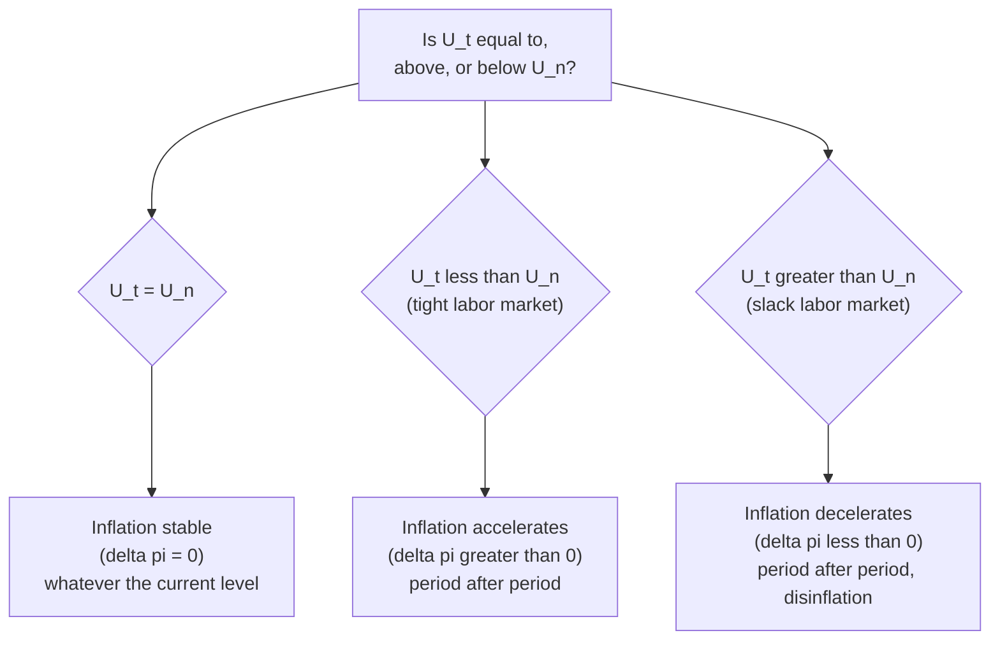
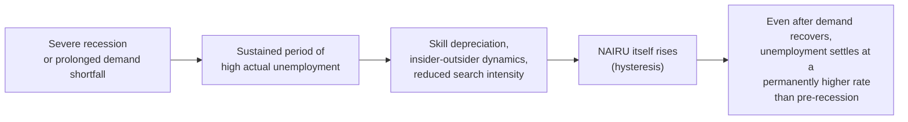

## Non-Accelerating Inflation Rate of Unemployment

### Definition and Conceptual Foundation

The Non-Accelerating Inflation Rate of Unemployment (NAIRU) is the unemployment rate at which inflation neither accelerates nor decelerates — the rate consistent with stable, constant inflation, holding supply shocks aside. NAIRU is closely related to, and in most modern usage functionally synonymous with, Milton Friedman's **natural rate of unemployment**, though the two terms emerged from slightly different theoretical traditions and are occasionally distinguished with subtle nuance in the specialist literature.

The term NAIRU was introduced by Franco Modigliani and Lucas Papademos (1975) as a more precise, empirically-oriented label emphasizing the specific *inflation-stabilizing* property of this unemployment rate, in contrast to Friedman's broader "natural rate" terminology, which carried connotations of a deeper Walrasian general-equilibrium concept tied to labor market frictions, search costs, and market clearing.

### Formal Definition via the Expectations-Augmented Phillips Curve

NAIRU emerges directly as the equilibrium condition of the expectations-augmented Phillips curve:

$$\pi_t = \pi_t^e - \beta(U_t - U_n) + \varepsilon_t$$

By definition, inflation is **non-accelerating** when $\pi_t = \pi_{t-1}$ (or, under rational expectations, when $\pi_t = \pi_t^e$), and no unexpected supply shocks are occurring ($\varepsilon_t = 0$). Setting $\pi_t = \pi_t^e$ and $\varepsilon_t = 0$:

$$0 = -\beta(U_t - U_n) \quad \Rightarrow \quad U_t = U_n$$

NAIRU, denoted $U_n$ (or sometimes $U^*$), is therefore precisely the unemployment rate at which the unemployment gap term vanishes, making the change in inflation equal to zero:

$$\Delta \pi_t = 0 \quad \Longleftrightarrow \quad U_t = U_n$$

### The Defining Property: Zero Acceleration, Not Zero Inflation

A critical conceptual point, frequently misunderstood: **NAIRU says nothing about the level of inflation itself** — only about whether inflation is rising, falling, or stable. Unemployment can sit at NAIRU whether the prevailing inflation rate is 2%, 5%, or even (in a hypothetical) negative — as long as $U_t = U_n$, inflation will remain at whatever level it currently sits, neither accelerating nor decelerating from that level.

### Why NAIRU Is Not Directly Observable

Unlike the actual unemployment rate $U_t$, which is measured monthly via labor force surveys, NAIRU is a **theoretical construct that must be estimated indirectly** — it cannot be read off any single published statistic. Estimation typically proceeds by inverting the Phillips curve relationship: given observed data on $\pi_t$, $\pi_{t-1}$ (or $\pi_t^e$), and $U_t$, econometricians estimate $\beta$ and back out the implied $U_n$ as the unemployment rate consistent with zero inflation acceleration over the sample.

**Common estimation approaches include:**

- **Direct regression-based estimation**: Fitting $\Delta \pi_t = -\beta(U_t - U_n) + \varepsilon_t$ via OLS or more sophisticated time-series methods, treating $U_n$ as a parameter to be estimated (sometimes allowed to be time-varying).
- **Time-varying NAIRU models**: Using state-space methods (e.g., Kalman filtering) to allow $U_n$ to evolve slowly over time in response to structural labor market changes, rather than assuming a single fixed constant across decades.
- **Structural/theoretical estimation**: Deriving $U_n$ from underlying models of labor market frictions, wage bargaining, and price-setting (e.g., the "battle of the markups" framework, where $U_n$ reflects the unemployment rate that reconciles the real wage workers bargain for with the real wage firms are willing to pay).

[Unverified] Because estimation methods and sample periods differ substantially, published estimates of NAIRU for any given economy and time period can vary by a percentage point or more across studies and institutions, and these estimates are also subject to considerable real-time revision as more data becomes available — a well-documented "real-time estimation uncertainty" problem in the applied NAIRU literature.

### Determinants of NAIRU: What Makes It Rise or Fall

NAIRU is not a fixed technological constant; it reflects structural features of the labor market that can and do shift over time:

| Determinant | Effect on NAIRU | Mechanism |
| --- | --- | --- |
| Generosity/duration of unemployment insurance | Raises NAIRU | Reduces urgency to accept job offers, lengthens search duration |
| Labor market mismatch (skills, geography) | Raises NAIRU | Frictional unemployment rises as vacancies and job-seekers fail to match efficiently |
| Union bargaining power / wage-setting institutions | Raises NAIRU (if power increases) | Stronger bargaining power pushes real wage demands above market-clearing level at any given unemployment rate |
| Minimum wage level relative to productivity | Raises NAIRU (if binding and high) | Prices some low-productivity workers out of employment |
| Demographic composition (share of youth, new entrants) | Raises NAIRU (if younger cohorts have higher frictional unemployment) | Younger workers typically experience more job turnover and search time |
| Active labor market policies (job training, placement services) | Lowers NAIRU | Reduces matching frictions, speeds job-finding |
| Productivity growth acceleration | [Inference] Ambiguous / debated | Some models link productivity surprises to temporarily lower measured NAIRU (as in the late-1990s U.S. experience) via effects on markups and real wage expectations |
| Hysteresis effects from prolonged high unemployment | Raises NAIRU | Long-term unemployed lose skills/attachment to the labor force, becoming structurally harder to re-employ even after aggregate demand recovers |

### Hysteresis: NAIRU as a Path-Dependent, Not Fixed, Concept

A significant theoretical elaboration on NAIRU is the **hysteresis hypothesis** (most associated with Olivier Blanchard and Lawrence Summers, 1986), which argues that NAIRU is not an independent, exogenous structural constant but can itself be *pushed upward by a prolonged period of actual high unemployment* — meaning the "natural" rate is partly a function of the economy's own recent cyclical history, not solely of fixed institutional parameters.

**Proposed mechanisms for hysteresis:**

- **Skill depreciation**: Long-term unemployed workers lose job-relevant skills and become less attractive to employers over time, effectively raising frictional/structural unemployment.
- **Insider-outsider wage bargaining**: Employed "insiders" who remain in wage-bargaining positions have limited incentive to moderate wage demands to help unemployed "outsiders" find work, entrenching higher equilibrium unemployment.
- **Reduced job search intensity and stigma effects**: Extended unemployment duration can reduce active search effort and signal lower productivity to potential employers, further raising the effective NAIRU.

[Inference] The empirical magnitude and even the existence of strong hysteresis effects remains actively debated; some economies (e.g., the U.S. after the 2008-09 financial crisis) saw unemployment eventually return close to pre-crisis levels, while others (parts of the Eurozone in the same period) experienced more persistent elevated unemployment, fueling ongoing disagreement about how universal or context-dependent hysteresis effects actually are.

### Worked Numerical Illustration: Estimating NAIRU from Data

Suppose an economist observes the following stylized annual data and wants to estimate NAIRU using the simple accelerationist specification $\Delta \pi_t = -\beta(U_t - U_n)$:

| Year | $U_t$ (%) | $\pi_t$ (%) | $\Delta \pi_t$ (%) |
| --- | --- | --- | --- |
| 1 | 7.0 | 3.0 | — |
| 2 | 6.0 | 2.0 | −1.0 |
| 3 | 5.0 | 2.2 | +0.2 |
| 4 | 4.5 | 3.5 | +1.3 |
| 5 | 6.0 | 3.0 | −0.5 |

Regressing $\Delta \pi_t$ on $U_t$ (illustratively) might yield a fitted line such as $\Delta \pi_t = -0.65(U_t - 5.2)$, implying an estimated $U_n \approx 5.2\%$ — the unemployment rate at which the fitted relationship crosses zero acceleration. Note from the data: at $U_t = 5.0\%$ inflation was still mildly accelerating (+0.2), while at $U_t = 6.0\%$ inflation decelerated (−0.5) in one year but not the other, illustrating the noisiness and estimation uncertainty inherent in real-world NAIRU inference, since actual data is rarely as clean as textbook illustrations.

### NAIRU vs. Related Concepts: Disambiguation Table

| Concept | Definition | Relationship to NAIRU |
| --- | --- | --- |
| Natural rate of unemployment ($U_n$, Friedman) | The unemployment rate consistent with labor market equilibrium once expectations fully adjust | Functionally near-identical to NAIRU in most modern usage; historically framed with more emphasis on frictional/structural market-clearing theory |
| Frictional unemployment | Unemployment from normal job search and matching time | A *component* contributing to NAIRU's level, not a synonym for it |
| Structural unemployment | Unemployment from skills/location mismatch between workers and available jobs | Another *component* contributing to NAIRU's level |
| Cyclical unemployment | The gap between actual unemployment and NAIRU ($U_t - U_n$) | By definition, this gap is exactly the driving term in the Phillips curve; cyclical unemployment is zero precisely when $U_t = U_n$ |
| Full employment | A looser, often politically-defined term for "low" unemployment | Frequently used loosely as if synonymous with NAIRU, though NAIRU is a specific, model-derived equilibrium concept rather than a normative target |

### Policy Relevance: NAIRU as a Guide for Monetary Policy

Central banks (including the U.S. Federal Reserve in its dual-mandate framework) use estimates of NAIRU (often referred to in policy contexts as the "natural rate" or the unemployment rate consistent with the Fed's inflation target) as one input for calibrating monetary policy stance:

- If actual unemployment is believed to be **below** estimated NAIRU, policymakers may interpret this as inflationary pressure building, supporting a case for tighter monetary policy (higher interest rates) to prevent accelerating inflation.
- If actual unemployment is believed to be **above** estimated NAIRU, this suggests disinflationary or deflationary pressure and slack in the economy, supporting a case for looser monetary policy to support employment without generating excess inflation.
- **A central practical challenge**: because NAIRU is estimated with substantial uncertainty and can shift over time (compounded by hysteresis effects), policymakers risk making significant errors by treating any single point estimate of NAIRU as precisely known — a concern that has shaped debates about appropriately cautious, data-dependent policy approaches (sometimes summarized as favoring policy rules that respond to *observed* inflation dynamics directly, reducing reliance on an uncertain, unobservable NAIRU estimate).

### Historical Episode: The Late-1990s U.S. "NAIRU Puzzle"

[Inference] A frequently cited historical episode illustrating NAIRU's estimation difficulty is the U.S. experience in the late 1990s, when unemployment fell well below most contemporaneous NAIRU estimates (which had commonly clustered around 5.5–6%) without the accelerating inflation the framework would have predicted. This episode is widely interpreted as evidence that NAIRU itself had fallen (attributed by various researchers to factors including a productivity growth acceleration, demographic shifts, and improved labor market matching technology), rather than as a wholesale rejection of the NAIRU framework, though it remains a commonly cited example of the practical difficulty of using real-time NAIRU estimates for policy.

### Common Misconceptions

- **Misconception**: NAIRU is the unemployment rate at which inflation is zero. **Correction**: NAIRU is the rate at which inflation is *stable* (non-accelerating), regardless of what level that stable inflation rate happens to be — the concept concerns the *change* in inflation, not its level.
- **Misconception**: NAIRU is a single, precisely known, permanently fixed number for any economy. **Correction**: NAIRU must be estimated indirectly, carries substantial estimation uncertainty, and can shift over time due to structural changes (and, per the hysteresis hypothesis, even due to the economy's own recent cyclical unemployment history).
- **Misconception**: NAIRU and the "natural rate of unemployment" are two fundamentally different concepts with distinct implications. **Correction**: In the overwhelming majority of modern macroeconomic usage, the two terms are treated as functionally equivalent, with NAIRU emphasizing the specific inflation-stabilizing empirical property and "natural rate" carrying somewhat more theoretical/structural connotation from its original Friedman-Phelps framing.

### Next Steps

- **Related Topics**:
  - Expectations-augmented Phillips curve
  - Adaptive expectations and the accelerationist hypothesis
  - Hysteresis in labor markets (Blanchard-Summers)
  - Frictional, structural, and cyclical unemployment
  - Okun's Law and the output gap
  - Time-varying NAIRU estimation (Kalman filter methods)
  - Insider-outsider models of wage bargaining
  - Central bank dual mandates and monetary policy rules
  - The 1990s U.S. productivity acceleration and low unemployment episode
  - New Keynesian Phillips Curve and the output gap analogue of NAIRU