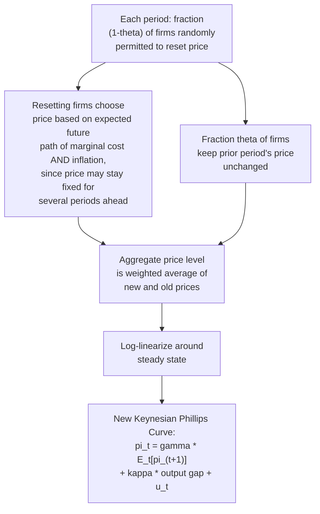
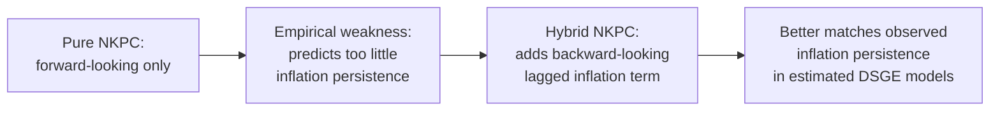

## New Keynesian Phillips Curve and Forward-Looking Inflation

### Historical Origin and Motivation

The New Keynesian Phillips Curve (NKPC) emerged in the 1980s and 1990s as macroeconomists sought to reconcile two seemingly opposed traditions: the rational expectations methodology of the New Classical school (Lucas, Sargent) and the Keynesian conviction that nominal rigidities generate meaningful short-run non-neutrality of monetary policy. Key theoretical foundations were laid by Stanley Fischer (1977) and John Taylor (1979, 1980), who showed that staggered, multi-period nominal contracts could preserve real effects of monetary policy even under fully rational expectations. Guillermo Calvo's (1983) stochastic pricing model provided the specific microfounded price-setting framework most commonly used to derive the modern NKPC, later popularized and extended by Julio Rotemberg, N. Gregory Mankiw, and Jordi Galí, among others.

The NKPC represents the "New Keynesian synthesis": it accepts that agents are fully rational and forward-looking (contra the backward-looking adaptive expectations of the original Friedman-Phelps framework) while retaining a meaningful role for monetary policy by grounding inflation dynamics in **explicit nominal price rigidities** at the level of individual, optimizing firms — rather than relying on the Lucas "islands" imperfect-information mechanism.

### The Core Equation

The baseline New Keynesian Phillips Curve is typically written as:

$$\pi_t = \gamma \, E_t[\pi_{t+1}] + \kappa \, \tilde{y}_t + u_t$$

where:

- $\pi_t$ = current price inflation
- $E_t[\pi_{t+1}]$ = **expected future inflation**, conditional on information available at time $t$ (the defining forward-looking feature)
- $\tilde{y}_t$ = the output gap (or, in labor-market formulations, a measure of real marginal cost, which is closely linked to the output gap)
- $\gamma$ = the discount-related coefficient on expected future inflation (often close to, or equal to, the household's subjective discount factor $\beta_{\text{discount}}$ in the underlying microfounded model)
- $\kappa$ = the slope coefficient, governing the sensitivity of current inflation to the output gap; $\kappa$ is itself a composite of deeper structural parameters (price stickiness, demand elasticity, discount factor)
- $u_t$ = a cost-push (supply) shock term

**The critical structural departure from the EAPC**: inflation depends on expected *future* inflation $E_t[\pi_{t+1}]$, not on past *realized* inflation $\pi_{t-1}$. This single change transforms the equation from a backward-looking difference equation into a forward-looking one, with profound implications for how inflation responds to credible policy announcements.

### Microfoundation: The Calvo Pricing Mechanism

The standard derivation of the NKPC rests on the **Calvo (1983) staggered price-setting model**:

- In each period, only a random fraction $(1-\theta)$ of firms are permitted to reset their price optimally; the remaining fraction $\theta$ must keep their previous price unchanged, regardless of current economic conditions. The parameter $\theta \in (0,1)$ is the probability a firm's price remains fixed each period, so $\frac{1}{1-\theta}$ is the average duration a price stays fixed.
- A firm that *is* allowed to reset its price does so knowing it may be "stuck" with that price for several future periods, so it sets its price based not only on current marginal cost but also on the **entire expected future path of marginal cost and inflation** over the (stochastic) duration its price will remain fixed.
- Aggregating across the fraction of firms that reset optimally and the fraction that do not, and log-linearizing around the zero-inflation steady state, yields the NKPC equation above, with:

$$\kappa = \frac{(1-\theta)(1-\theta\beta_{\text{discount}})}{\theta} \cdot \phi$$

where $\beta_{\text{discount}}$ is the household/firm discount factor and $\phi$ is a composite term reflecting the elasticity of real marginal cost with respect to the output gap.

**Interpreting $\kappa$:**

- A **higher $\theta$** (more price stickiness, longer average duration between price changes) implies a **lower $\kappa$**: prices respond less to current output gap movements because firms know their price will be locked in for a long time, so they must average over a longer expected future path, dampening the immediate pass-through of current conditions.
- A **lower $\theta$** (prices reset more frequently, closer to flexible pricing) implies a **higher $\kappa$**, approaching a limiting case where inflation responds almost fully and immediately to the output gap, as in a flexible-price benchmark.

### Diagram: The Calvo Pricing Logic

### Forward-Looking Solution: Inflation as a Sum of Expected Future Output Gaps

Because the NKPC is a **forward-looking difference equation**, it can be solved by iterating forward (assuming a transversality/no-bubble condition rules out explosive self-fulfilling paths):

$$\pi_t = \kappa \sum_{j=0}^{\infty} \gamma^{j} \, E_t[\tilde{y}_{t+j}] + \sum_{j=0}^{\infty} \gamma^{j} E_t[u_{t+j}]$$

This reveals the defining structural property of the NKPC: **current inflation is a discounted sum of the entire expected future path of output gaps (and cost-push shocks)**, not merely a function of current or past conditions. This has a striking and often-cited implication: a **credible announcement of future demand contraction (or expansion) can affect current inflation immediately**, even before the contraction (or expansion) actually occurs — because forward-looking price-setters incorporate the anticipated future output gap into today's pricing decision.

### Contrast with the Backward-Looking Accelerationist Phillips Curve

| Feature | Accelerationist Phillips Curve (Adaptive) | New Keynesian Phillips Curve (Forward-Looking) |
| --- | --- | --- |
| Key expectations term | $\pi_{t-1}$ (past realized inflation) | $E_t[\pi_{t+1}]$ (expected future inflation) |
| Direction of dependence | Backward-looking | Forward-looking |
| Response to a credible future policy announcement | No immediate effect (since $\pi_{t-1}$ is fixed by history) | Immediate effect on current inflation (agents price in anticipated future conditions today) |
| Inflation persistence source | Built directly into the equation via lagged inflation | Requires additional features (habit formation in pricing, indexation, or a hybrid specification) to generate persistence, since the pure forward-looking NKPC tends to predict inflation jumps immediately with news |
| Microfoundation | Reduced-form, no explicit firm optimization | Explicit firm profit-maximization under Calvo/Taylor-style price rigidity |
| Policy implication | Disinflation requires a sustained period of unemployment above $U_n$ (a "sacrifice") | A sufficiently credible disinflation announcement can, in principle, reduce inflation with a smaller output/employment cost, since expectations adjust immediately |

### The "Disinflation Puzzle" and the Case for Hybrid Specifications

A well-documented empirical weakness of the pure forward-looking NKPC: because it predicts inflation should jump immediately in response to news about future output gaps, it tends to generate **too little inflation persistence** compared to what is observed in actual macroeconomic data (real-world inflation is empirically highly persistent, moving slowly and gradually even after major disinflationary policy shifts). This has become known as informally related to the broader "disinflation puzzle" literature examining why disinflations (e.g., the Volcker disinflation) appeared to carry real output costs that a purely forward-looking model would not naturally predict.

This empirical shortfall motivated the **hybrid New Keynesian Phillips Curve**, incorporating both a backward-looking (lagged inflation) term and the forward-looking expected future inflation term, often derived from models where a fraction of firms use a backward-looking indexation rule (mechanically adjusting prices to past inflation) rather than fully optimizing:

$$\pi_t = \gamma_f \, E_t[\pi_{t+1}] + \gamma_b \, \pi_{t-1} + \kappa \, \tilde{y}_t + u_t$$

where $\gamma_f + \gamma_b$ typically sums to (or close to) one in calibrated/estimated models, and $\gamma_b > 0$ reintroduces the inflation persistence largely absent from the purely forward-looking specification.

### Worked Numerical Illustration

Suppose $\gamma = 0.99$ (a standard quarterly discount factor calibration), $\kappa = 0.05$ (moderate price stickiness), and the central bank credibly announces that it will engineer a negative output gap of $-2\%$ for the next three quarters, then return the output gap to zero, with no cost-push shocks ($u_t = 0$):

$$\pi_t \approx \kappa \left[ \tilde{y}_t + \gamma \, E_t[\tilde{y}_{t+1}] + \gamma^2 E_t[\tilde{y}_{t+2}] \right]$$

$$\pi_t \approx 0.05 \left[ -2 + (0.99)(-2) + (0.99)^2(-2) \right] \approx 0.05 \times (-5.94) \approx -0.297\%$$

Even though the *current* output gap might not yet have fallen (say the announcement is made just before the contraction begins, with $\tilde{y}_t = 0$ still), the *anticipated* future contraction, once it enters $E_t[\tilde{y}_{t+1}]$ and $E_t[\tilde{y}_{t+2}]$, still pulls current inflation down immediately upon the announcement — illustrating the forward-looking transmission mechanism distinct from backward-looking models, where inflation would not move until the output gap itself actually materialized.

[Unverified] This stylized numerical example is constructed for illustrative purposes using representative calibration values; actual estimated $\kappa$ and $\gamma$ parameters vary considerably across empirical studies, countries, sample periods, and whether marginal cost or the output gap is used as the driving variable.

### Real Marginal Cost vs. Output Gap Formulations

A subtlety in NKPC derivations concerns the correct driving variable. The theoretically cleanest derivation from firm optimization yields inflation as a function of **real marginal cost** ($mc_t$), not the output gap directly:

$$\pi_t = \gamma \, E_t[\pi_{t+1}] + \kappa \, \widehat{mc}_t$$

The output-gap formulation is obtained by additionally assuming a specific (often log-linear) relationship between real marginal cost and the output gap, which depends on assumptions about the labor market, production function, and price markup behavior. [Inference] Some empirical studies find the marginal-cost-based NKPC fits the data notably better than the output-gap-based version, or vice versa, depending on how each driving variable is measured and which country/sample is examined — this remains an active area of applied macroeconometric research rather than a fully settled matter.

### Empirical Challenges and Critiques

- **The "inflation persistence puzzle"**: as discussed above, the pure forward-looking NKPC struggles to generate the degree of gradual, sluggish inflation adjustment observed empirically without hybrid backward-looking terms or additional frictions (e.g., costly information acquisition, rational inattention, or sticky information models).
- **Weak identified relationship with the output gap**: [Inference] Some empirical estimates of the NKPC find a statistically weak or even wrong-signed relationship between inflation and standard output gap measures, a finding sometimes referred to as the NKPC's "empirical fragility," which has spurred research into alternative driving variables (labor income share, unit labor costs) and estimation methods (GMM vs. full-information Bayesian DSGE estimation).
- **Flattening of the Phillips curve**: [Inference] A substantial body of research beginning in the 2000s and continuing into recent decades has documented an apparent decline in the estimated slope $\kappa$ in many advanced economies (inflation appearing less responsive to the output/unemployment gap than in earlier decades), with proposed explanations including globalization, more anchored inflation expectations due to credible central bank inflation targeting, and changes in labor market bargaining dynamics — though the precise cause(s) remain debated among researchers.

### Policy Implications: Credibility as a Genuine Tool

The NKPC's forward-looking structure provides the theoretical basis for the modern emphasis on **central bank credibility and communication** as active policy tools, not merely public relations:

- A **credible commitment** to low future inflation directly lowers $E_t[\pi_{t+1}]$, which mechanically lowers current $\pi_t$ in the NKPC equation, *without* necessarily requiring an output/employment cost — in sharp contrast to the backward-looking accelerationist framework, where disinflation always requires a costly period of above-natural-rate unemployment.
- This is the theoretical foundation behind **inflation targeting regimes** and **forward guidance** as monetary policy instruments: by anchoring expectations of future inflation, central banks can influence current inflation dynamics more efficiently than purely relying on current demand management.
- [Inference] The practical effectiveness of credibility-based disinflation, however, depends heavily on how genuinely forward-looking price- and wage-setters actually are in practice — a question the empirical persistence puzzle suggests may be more limited than the pure theoretical NKPC implies, motivating continued reliance on hybrid models that retain some role for costly, backward-looking-expectations-driven disinflation.

### Common Misconceptions

- **Misconception**: The New Keynesian Phillips Curve is simply the old Phillips curve with rational expectations substituted for adaptive expectations. **Correction**: While rational expectations is a shared feature, the NKPC's defining innovation is the *forward-looking* dependence on expected future inflation (not merely a rationally-formed expectation of current-period inflation) combined with explicit microfoundations in staggered price-setting — a structurally different equation, not merely a relabeled expectations term.
- **Misconception**: A purely forward-looking NKPC accurately matches observed inflation dynamics without modification. **Correction**: The pure forward-looking form is widely recognized to understate observed inflation persistence, which is why hybrid specifications incorporating a backward-looking lagged inflation term are commonly used in empirical and policy-oriented DSGE models.
- **Misconception**: The NKPC implies monetary policy announcements are costless ways to change inflation. **Correction**: The model implies credible announcements *can* reduce the output/employment cost of disinflation relative to a purely backward-looking world, but this depends on the announcement's actual credibility and on how forward-looking real-world price-setters are — it does not eliminate all real costs of disinflation in practice.

### Next Steps

- **Related Topics**:
  - Expectations-augmented Phillips curve
  - Adaptive expectations and the accelerationist hypothesis
  - Rational expectations critique of the Phillips curve
  - Calvo pricing and staggered price-setting models
  - Taylor contracts and nominal wage rigidity
  - Hybrid NKPC and inflation persistence
  - Central bank credibility, inflation targeting, and forward guidance
  - The flattening Phillips curve debate
  - DSGE modeling and microfounded macroeconomics
  - Real marginal cost as a driving variable for inflation