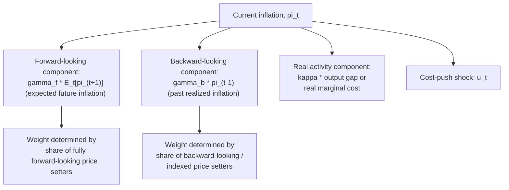
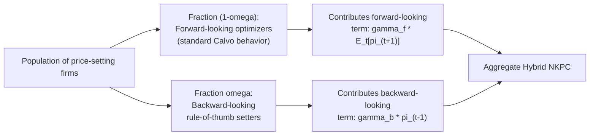

## Hybrid Phillips Curve Models

### Definition and Motivation

Hybrid Phillips curve models combine backward-looking (lagged, adaptive-style) inflation dynamics with forward-looking (rational, expected future inflation) dynamics in a single equation. They were developed specifically to address the central empirical weakness of the pure New Keynesian Phillips Curve (NKPC): its inability to generate the degree of gradual, persistent inflation adjustment observed in real-world macroeconomic data.

The pure forward-looking NKPC predicts that inflation should respond immediately and sharply to news about future economic conditions, since $\pi_t$ is a discounted sum of expected future output gaps. But empirically, inflation tends to move slowly and persistently, even following major identifiable shocks or clearly signaled policy shifts. Hybrid models were introduced to close this gap between theory and data while preserving as much of the rational-expectations, microfounded structure of the NKPC as possible.

### The Hybrid Phillips Curve Equation

The canonical hybrid specification, most closely associated with Jeffrey Fuhrer and George Moore (1995) and later given explicit microfoundations by Guillermo Calvo, Ricardo Caballero, and others, and popularized in estimated form by Jordi Galí and Mark Gertler (1999), is:

$$\pi_t = \gamma_f \, E_t[\pi_{t+1}] + \gamma_b \, \pi_{t-1} + \kappa \, \tilde{y}_t + u_t$$

where:

- $\gamma_f$ = the weight on **forward-looking** expected future inflation
- $\gamma_b$ = the weight on **backward-looking** lagged (past) inflation
- $\tilde{y}_t$ = the output gap (or real marginal cost, in some formulations)
- $\kappa$ = the slope coefficient on the driving variable
- $u_t$ = a cost-push shock term

In most calibrated and estimated hybrid models, the two coefficients are constrained (either by theory or by imposing a homogeneity restriction consistent with long-run price-level neutrality) such that:

$$\gamma_f + \gamma_b = 1$$

This restriction ensures that in a steady state with constant inflation ($\pi_t = \pi_{t-1} = E_t[\pi_{t+1}]$), the equation collapses to a standard reduced-form relationship between the constant inflation rate and the output gap, consistent with the absence of any long-run money illusion or permanent inflation-output tradeoff.

### Diagram: The Hybrid Structure

### Microfoundations: Where Does the Backward-Looking Term Come From?

Since the pure Calvo model generates only a forward-looking NKPC, hybrid models require an additional structural mechanism to introduce backward-looking behavior in a way consistent with (bounded) rational optimization, rather than simply appending an ad hoc lagged term. The two most influential microfoundations are:

**1. Backward-looking price indexation (Christiano, Eichenbaum, and Evans, 2005; Smets and Wouters, 2003, 2007)**

In this framework, firms that are *not* selected to reoptimize their price under the Calvo mechanism are not assumed to leave their price completely unchanged. Instead, they mechanically **index** their price to a measure of recent past inflation (e.g., last period's inflation rate), reflecting a rule-of-thumb adjustment for firms that cannot afford the cost of full re-optimization but wish to avoid falling arbitrarily behind the general price level. Aggregating over both the optimizing and the indexing firms yields a hybrid equation where the backward-looking weight $\gamma_b$ is directly proportional to the degree of indexation assumed.

**2. Rule-of-thumb price setters (Galí and Gertler, 1999)**

This approach assumes the economy is populated by two types of firms:

- A fraction $(1-\omega)$ of **forward-looking (optimizing)** firms that set prices exactly as in the standard Calvo model, using expected future marginal cost and inflation.
- A fraction $\omega$ of **backward-looking, "rule-of-thumb"** firms that, when given the opportunity to reset their price, simply set it equal to the average price recently chosen by optimizing firms, adjusted for lagged inflation — a boundedly rational shortcut rather than full dynamic optimization.

Aggregating the pricing decisions of both types of firms produces the hybrid NKPC, with $\gamma_b$ increasing directly in $\omega$ (the fraction of rule-of-thumb firms) and $\gamma_f$ correspondingly decreasing.

### Galí-Gertler Estimation and the "Hump-Shaped" Inflation Response

Galí and Gertler's influential 1999 empirical estimation of the hybrid NKPC for the U.S. found that while both coefficients were statistically significant, the **forward-looking component was typically estimated to be considerably larger than the backward-looking component** ($\gamma_f$ notably exceeding $\gamma_b$ in most specifications) — a finding they interpreted as evidence that inflation dynamics are predominantly, though not purely, forward-looking. [Unverified] However, subsequent research using different estimation methods, sample periods, and driving variables (marginal cost versus output gap) produced a wide range of estimated relative weights, and no single, universally agreed-upon numerical split between $\gamma_f$ and $\gamma_b$ has emerged from the broader empirical literature.

Nonetheless, the qualitative implication of a hybrid structure — that inflation responds to shocks with a **gradual, "hump-shaped" pattern** (rising slowly to a peak effect several periods after a shock, rather than jumping immediately as the pure forward-looking model predicts, or moving with the mechanical one-period lag structure of the pure adaptive-expectations model) — is widely regarded as a better qualitative match to observed impulse responses of inflation to monetary policy and other shocks in estimated VAR and DSGE studies.

### Worked Numerical Illustration

Suppose $\gamma_f = 0.6$, $\gamma_b = 0.4$ (summing to 1), $\kappa = 0.05$, and the economy starts in a zero-inflation steady state ($\pi_{-1} = 0$, $E_{-1}[\pi_0] = 0$). Suppose a demand shock generates an output gap path of $\tilde{y}_0 = 2\%$, $\tilde{y}_1 = 1\%$, $\tilde{y}_2 = 0\%$ (a temporary boom that fully unwinds after two periods), with no cost-push shocks, and (for simplicity) suppose agents perfectly foresee this path:

**Period 0:**

$$\pi_0 = 0.6 \, E_0[\pi_1] + 0.4(0) + 0.05(2)$$

Since this requires solving the full forward path jointly (a fixed-point problem), consider the terminal condition that inflation returns to zero once the output gap closes and stays there. A simplified illustrative solved path (consistent with the qualitative "hump-shaped, gradual" property of hybrid models) might look like:

| Period | Output Gap (%) | Inflation $\pi_t$ (%, illustrative solved path) |
| --- | --- | --- |
| $t=0$ | 2.0 | 0.10 |
| $t=1$ | 1.0 | 0.14 |
| $t=2$ | 0.0 | 0.09 |
| $t=3$ | 0.0 | 0.04 |
| $t=4$ | 0.0 | 0.02 |

Notice the qualitative pattern: inflation **peaks one period after** the output gap has already begun to decline ($t=1$, even though the gap fell from 2% to 1%), and then **decays gradually** over several subsequent periods even after the output gap has fully closed — this delayed peak and gradual decay is the "hump-shaped" persistence signature characteristic of hybrid models, contrasted with the immediate, contemporaneous jump the pure forward-looking NKPC would generate, or the simple one-period lagged adjustment implied by a purely backward-looking (adaptive) specification.

[Unverified] The specific numerical values in this table are stylized illustrative constructs designed to demonstrate the qualitative hump-shaped persistence property, not the output of an actual solved rational expectations model with specific calibrated parameters.

### Hybrid NKPC vs. Pure Forward-Looking vs. Pure Backward-Looking: Summary Comparison

| Feature | Pure Backward-Looking (Accelerationist) | Pure Forward-Looking (NKPC) | Hybrid NKPC |
| --- | --- | --- | --- |
| Key expectations term(s) | $\pi_{t-1}$ only | $E_t[\pi_{t+1}]$ only | Both $\pi_{t-1}$ and $E_t[\pi_{t+1}]$ |
| Response to credible future policy announcement | None until the change actually occurs | Immediate, full jump | Partial immediate response, plus gradual further adjustment |
| Inflation persistence generated endogenously | High (built directly into lag structure) | Low (tends to understate observed persistence) | Moderate to high, closer to observed data |
| Microfoundation | Ad hoc / reduced-form | Calvo staggered pricing, full optimization | Calvo pricing plus indexation or rule-of-thumb price setters |
| Consistency with rational expectations | Not fully consistent (backward-looking mechanism is ad hoc) | Fully consistent | Consistent, given the specific bounded-rationality microfoundation for the backward-looking share |
| Long-run vertical Phillips curve property | Yes, at $U_n$ | Yes, in most calibrations | Yes, given $\gamma_f + \gamma_b = 1$ restriction |

### Estimation Approaches and Empirical Debates

- **GMM (Generalized Method of Moments) estimation**: The most common approach in the Galí-Gertler tradition, using lagged variables as instruments for the expected future inflation term (since $E_t[\pi_{t+1}]$ is not directly observed but can be proxied via realized future inflation plus an orthogonality assumption on the expectational error).
- **Full-information Bayesian DSGE estimation**: Modern practice (e.g., in the Smets-Wouters class of models used at many central banks) typically embeds the hybrid NKPC within a full general equilibrium model and estimates all parameters jointly via Bayesian methods, allowing the indexation parameter to be estimated alongside the rest of the model's structural parameters rather than in isolation.
- **Ongoing debate over the relative weights**: [Inference] The literature has not converged on a single robust estimate of $\gamma_f$ versus $\gamma_b$, or equivalently the implied indexation/rule-of-thumb parameter; results are sensitive to the choice of driving variable (output gap vs. marginal cost measures), the specific dataset and time period, and the estimation methodology, making this an area where reasonable researchers continue to reach different quantitative conclusions despite general agreement on the qualitative hybrid structure's usefulness.
- **The "weak instrument" critique of GMM estimates**: [Inference] Some econometric critiques have raised concerns that GMM estimates of the hybrid NKPC may be sensitive to instrument choice and weak-instrument problems, given the difficulty of finding variables that are both correlated with future expected inflation and satisfy the required orthogonality conditions — a methodological concern that has motivated the shift toward full-system Bayesian estimation in more recent central bank modeling practice.

### Practical Relevance for Central Bank Modeling

Hybrid Phillips curve specifications are the standard workhorse inflation equation embedded in most medium-scale DSGE models actually used for policy analysis and forecasting at major central banks (including variants of the Smets-Wouters model used in policy contexts at institutions such as the Federal Reserve and the European Central Bank). Their appeal for practical policy modeling rests on:

- **Empirical realism**: better matching the observed gradual, persistent response of inflation to shocks and policy actions than the pure forward-looking NKPC.
- **Retained forward-looking channel**: preserving a meaningful role for policy credibility and expectations management (since $\gamma_f > 0$ still allows anticipated future policy to influence current inflation), unlike a purely backward-looking model.
- **Internal consistency with long-run neutrality**: the $\gamma_f + \gamma_b = 1$ restriction ensures the model does not imply any permanent, exploitable long-run inflation-output tradeoff, preserving the vertical long-run Phillips curve property considered a core stylized fact by most macroeconomists.

### Common Misconceptions

- **Misconception**: Hybrid models simply add a backward-looking term to the NKPC without theoretical justification. **Correction**: Standard hybrid specifications are derived from explicit microfoundations — either backward-looking price indexation for non-reoptimizing firms, or a subset of "rule-of-thumb" price setters — not from an ad hoc, atheoretical addition of a lagged inflation term.
- **Misconception**: Hybrid models imply inflation dynamics are "half rational, half irrational." **Correction**: Both the forward-looking and backward-looking firms in the standard microfoundations are behaving in a well-defined, internally consistent way given their assumed information and adjustment technology (full optimization vs. a specific boundedly-rational indexation or rule-of-thumb rule) — the backward-looking behavior is not modeled as irrationality, but as a specific, tractable form of bounded rationality or contractual indexation.
- **Misconception**: The relative weights $\gamma_f$ and $\gamma_b$ are precisely and consistently estimated across the empirical literature. **Correction**: Estimated weights vary considerably depending on data, driving variable choice, sample period, and econometric method; while the qualitative hybrid structure is widely used, no single definitive numerical split has achieved consensus.

### Next Steps

- **Related Topics**:
  - New Keynesian Phillips curve and forward-looking inflation
  - Calvo pricing and staggered price-setting models
  - Rule-of-thumb price setters (Galí-Gertler framework)
  - Price indexation in DSGE models (Christiano-Eichenbaum-Evans)
  - Smets-Wouters medium-scale DSGE models
  - GMM estimation of expectational Phillips curves
  - Inflation persistence and the disinflation puzzle
  - Central bank credibility and forward guidance
  - The flattening Phillips curve debate
  - Real marginal cost versus output gap as driving variables