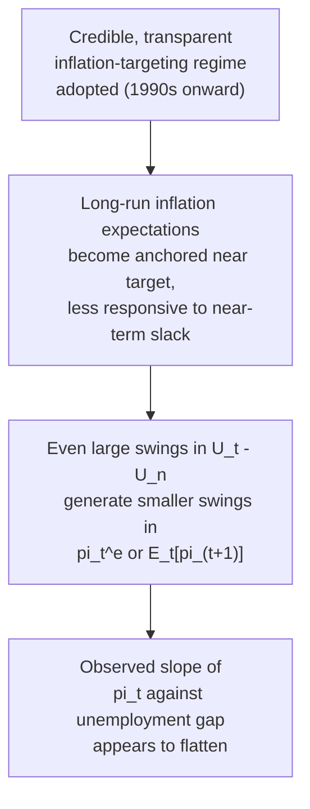
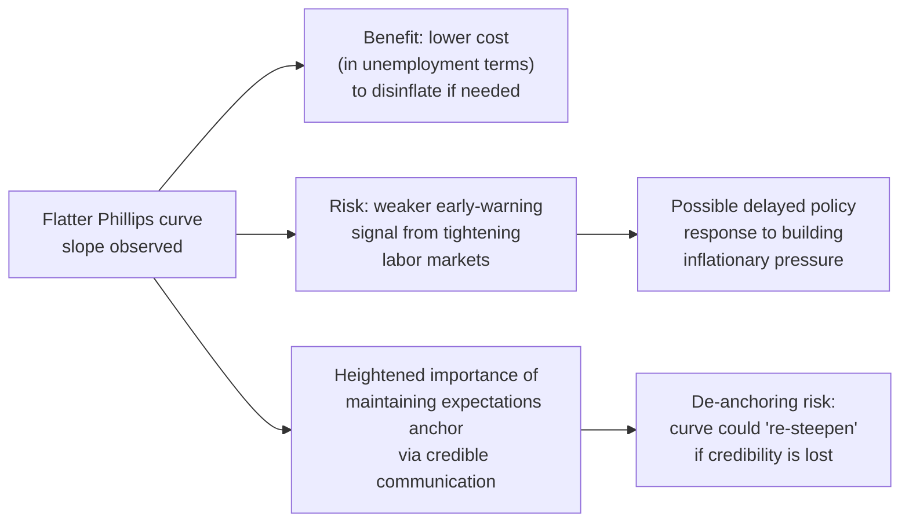

## Flattening of the Phillips Curve Debate

### Definition and Statement of the Puzzle

The "flattening" of the Phillips curve refers to a widely documented empirical pattern, primarily in advanced economies since roughly the mid-1990s to 2000s, in which the estimated slope coefficient relating inflation to measures of economic slack (the unemployment gap or output gap) has declined substantially compared to earlier decades. In terms of the standard specification:

$$\pi_t = \pi_t^e - \beta(U_t - U_n) + \varepsilon_t \qquad \text{or} \qquad \pi_t = \gamma E_t[\pi_{t+1}] + \kappa \tilde{y}_t + u_t$$

flattening refers specifically to a documented **decline in the estimated $\beta$ or $\kappa$ coefficient** over time — meaning a given change in unemployment or the output gap now appears to move inflation by a smaller amount than it did in earlier historical periods (such as the 1960s-1980s).

This is a genuinely important applied macroeconomic puzzle because the slope coefficient is central to how policymakers assess inflation risk from a tightening labor market and how much output/employment cost is required to achieve a given amount of disinflation.

### The Empirical Pattern

Multiple lines of evidence have been cited in support of a flattened curve:

- **Reduced volatility co-movement**: [Inference] Inflation appears to have become notably less responsive to unemployment/output gap fluctuations in many advanced economies since the mid-1990s, including during periods of historically low unemployment that, under earlier estimated slopes, would have been expected to generate substantially more inflationary pressure than was actually observed.
- **The late-1990s U.S. episode**: U.S. unemployment fell to multi-decade lows in the late 1990s without the inflation acceleration that contemporaneous Phillips curve estimates would have predicted, an early and influential data point in the flattening discussion (though also debated as potentially reflecting a temporarily lower NAIRU rather than a permanently flatter curve — see the related NAIRU material).
- **The 2010s U.S. "missing inflation" puzzle**: Following the 2008-09 financial crisis, U.S. unemployment fell substantially over the subsequent expansion (reaching historically low levels by 2018-2019) without a correspondingly large rise in inflation, again suggesting either a flatter curve, a lower/moving NAIRU, well-anchored inflation expectations, or some combination.
- **The 2021-2023 "missing disinflation" counterpart**: [Unverified] Some analyses of the post-pandemic inflation surge and subsequent disinflation have noted that inflation fell relatively quickly even as labor markets remained historically tight, which some researchers have interpreted as evidence against an extremely flat curve (i.e., a curve so flat it would predict disinflation should have been very costly in unemployment terms), reigniting active debate about whether the curve had "un-flattened" or whether other factors (supply chain normalization, energy price reversals) were doing most of the work independent of labor market slack.

### Diagram: Illustrating a Flattening Slope

<svg xmlns="http://www.w3.org/2000/svg" viewBox="0 0 720 420">
<text x="360" y="26" text-anchor="middle" font-size="16" font-weight="bold" fill="#1a1a1a">Steepening vs. Flattening Phillips Curve Slope (svg_diagram)</text>
<line x1="90" y1="360" x2="670" y2="360" stroke="#333" stroke-width="1.5" />
<line x1="90" y1="360" x2="90" y2="50" stroke="#333" stroke-width="1.5" />
<text x="380" y="392" text-anchor="middle" font-size="13" fill="#333">Unemployment Gap (U_t - U_n)</text>
<text x="45" y="200" text-anchor="middle" font-size="13" fill="#333" transform="rotate(-90 45 200)">Inflation Rate, pi (%)</text>
<line x1="380" y1="360" x2="380" y2="50" stroke="#ccc" stroke-width="1" stroke-dasharray="4,4" />
<text x="384" y="65" font-size="11" fill="#999">Gap = 0</text>
<line x1="140" y1="90" x2="620" y2="330" stroke="#c0392b" stroke-width="3" />
<text x="150" y="80" font-size="12" fill="#c0392b" font-weight="bold">Steeper curve (pre-1990s, larger beta)</text>
<line x1="140" y1="200" x2="620" y2="230" stroke="#2980b9" stroke-width="3" />
<text x="150" y="190" font-size="12" fill="#2980b9" font-weight="bold">Flatter curve (post-1990s, smaller beta)</text>
<text x="130" y="355" font-size="11" fill="#333">Negative gap
(loose)</text>
<text x="560" y="355" font-size="11" fill="#333">Positive gap
(tight)</text>
</svg>

### Proposed Explanation 1: Anchored Inflation Expectations

[Inference] Perhaps the most widely cited explanation attributes flattening to the increased **credibility of central bank inflation targeting** since the 1990s. If inflation expectations become well "anchored" near a central bank's explicit target regardless of near-term labor market conditions, then $\pi_t^e$ (or $E_t[\pi_{t+1}]$) becomes relatively insensitive to current economic slack — and since actual inflation is tied to expected inflation in both the accelerationist and New Keynesian frameworks, well-anchored expectations can mechanically reduce the observed responsiveness of *actual* inflation to the unemployment/output gap, even if the "true" structural relationship between slack and marginal cost/wages has not itself weakened.

### Proposed Explanation 2: Globalization and Global Slack

[Inference] Another prominent hypothesis argues that domestic inflation has become increasingly influenced by *global*, rather than purely domestic, economic slack, as supply chains, labor markets, and traded-goods competition have become more internationally integrated. Under this view, domestic labor market tightness matters less for domestic inflation than it once did, because globally-traded goods prices and internationally mobile capacity constrain domestic pricing power regardless of local unemployment conditions — meaning any Phillips curve estimated using only domestic slack measures will appear to have flattened, even if a "true" curve incorporating global slack has not.

### Proposed Explanation 3: Changes in Labor Market Structure and Bargaining Power

[Inference] A further set of explanations points to structural shifts in labor markets, including declining unionization rates, reduced worker bargaining power, the rise of more flexible/gig employment arrangements, and increased automation, which may have reduced the sensitivity of wage growth to labor market tightness — a weaker link between $U_t - U_n$ and wage inflation that, if it feeds through to price inflation via the standard markup mechanism, would show up empirically as a flatter Phillips curve.

### Proposed Explanation 4: Measurement and Specification Issues

Some economists argue that the "flattening" observed in many empirical studies is at least partly an **artifact of measurement and specification choices** rather than a genuine, permanent structural change in the economy:

- **NAIRU mismeasurement**: If the true, unobserved NAIRU has itself been falling over time (rather than remaining fixed), then a model using a mis-specified, too-high fixed NAIRU will systematically mistake genuine unemployment-gap-driven disinflationary pressure for "no relationship," making the curve appear artificially flat.
- **Choice of driving variable**: [Inference] Studies using unit labor costs or real marginal cost as the driving variable, rather than the unemployment or output gap, sometimes find a more stable, less-flattened slope, suggesting the apparent flattening may partly reflect the specific choice of gap measure rather than a fundamental change in underlying wage/price-setting behavior.
- **Sample period and structural break sensitivity**: Estimated slopes are often quite sensitive to the specific sample period used and to how researchers handle potential structural breaks, meaning claims of a smooth, gradual, monotonic flattening trend should be treated with some caution regarding their robustness to alternative reasonable specification choices.

### Summary Table of Competing Explanations

| Explanation | Core Mechanism | Implication for Curve Shape |
| --- | --- | --- |
| Anchored expectations | Credible inflation targeting reduces sensitivity of $\pi^e$ to near-term slack | Genuine reduction in *observed* slope; underlying structural slope may be less changed |
| Globalization / global slack | Domestic prices increasingly set by global rather than local conditions | Domestic-only Phillips curve appears flat; a correctly specified global-slack curve might not be |
| Weaker labor bargaining power | Structural labor market changes reduce wage responsiveness to tightness | Genuine structural flattening in the wage-setting link |
| NAIRU mismeasurement | Fixed/incorrect NAIRU assumption misattributes gap-driven movements to noise | Apparent, not necessarily genuine, flattening |
| Driving variable choice | Unemployment/output gap vs. marginal cost/unit labor cost measures behave differently | Partly a specification artifact rather than a real economic phenomenon |

### Illustrative Numerical Comparison

Suppose researchers estimate the simple relationship $\Delta \pi_t = -\beta (U_t - U_n)$ over two different sample periods for the same economy:

| Sample Period | Estimated $\beta$ (illustrative) | Interpretation |
| --- | --- | --- |
| 1960-1985 | 1.4 | A 1-point unemployment gap moves inflation acceleration by 1.4 points |
| 2000-2019 | 0.3 | A 1-point unemployment gap moves inflation acceleration by only 0.3 points |

[Unverified] These specific numerical values are illustrative constructs chosen to demonstrate the qualitative magnitude of the flattening finding commonly discussed in the literature, not precise reproductions of any single published study's point estimates, which vary considerably by country, exact sample window, and econometric specification.

### Policy Implications of a Flatter Curve

A flatter Phillips curve carries significant, double-edged implications for monetary policy:

- **Lower disinflation cost**: If the curve is genuinely flatter, achieving a given reduction in inflation requires a *smaller* increase in unemployment (a lower sacrifice ratio) than under a steeper historical curve — a seemingly favorable property for policymakers pursuing disinflation.
- **Reduced early-warning value of labor market tightness**: Conversely, a flatter curve means central banks receive a *weaker inflationary signal* from a tightening labor market, potentially allowing inflationary pressures to build for longer before becoming clearly visible in the data, raising the risk of delayed policy response and a subsequently larger correction once inflation does eventually rise (a concern some cite in connection with the 2021-2022 inflation surge).
- **Increased reliance on expectations management**: If much of the flattening genuinely reflects anchored expectations, then maintaining that anchor via credible policy communication becomes even more critical — a de-anchoring event (loss of credibility) could, under many of the same models, cause the curve to "re-steepen" and generate more painful inflation dynamics than recent decades' relatively benign experience would suggest.

### The Post-Pandemic Reassessment (2021-2024)

[Unverified] The sharp inflation surge of 2021-2022 in many advanced economies, followed by a relatively rapid disinflation through 2023-2024 without an accompanying large rise in unemployment, has prompted renewed and still-unsettled debate about whether the pre-pandemic flattening conclusion should be revised. Some researchers have argued the episode is consistent with a curve that is **non-linear** — relatively flat during periods of modest slack but steepening meaningfully once the economy operates at very tight capacity utilization or experiences large supply shocks — rather than a uniformly flat curve across all states of the business cycle. This nonlinearity hypothesis, if correct, would reconcile the pre-2020 flattening evidence with the 2021-2022 inflation surge without requiring the curve to have structurally "re-steepened" as a permanent shift. As this remains a live, actively researched empirical question, readers should treat any firm conclusion about the curve's current shape with appropriate caution and consult current research and central bank publications for the latest assessment.

### Common Misconceptions

- **Misconception**: A flatter Phillips curve means the concept of a labor market-inflation relationship has become irrelevant or is dead. **Correction**: Most researchers interpret flattening as a change in the *magnitude* of a persistent relationship (or a measurement/specification issue), not evidence that the relationship has vanished entirely; the debate concerns degree and cause, not existence.
- **Misconception**: The flattening finding is a single, settled, universally agreed-upon empirical fact. **Correction**: Estimated slopes are sensitive to sample period, country, driving variable choice, and specification; while a flattening pattern has been widely documented, its precise magnitude, permanence, and underlying cause(s) remain genuinely debated topics in ongoing research.
- **Misconception**: A flat curve necessarily implies costless disinflation is always achievable. **Correction**: Even under a flatter estimated curve, disinflation is not necessarily costless in practice, and the relationship may be nonlinear or state-dependent (e.g., flatter in normal times but steeper during periods of extreme tightness or large supply shocks).

### Next Steps

- **Related Topics**:
  - Expectations-augmented Phillips curve
  - Non-Accelerating Inflation Rate of Unemployment (NAIRU)
  - New Keynesian Phillips curve and forward-looking inflation
  - Hybrid Phillips curve models
  - Central bank credibility and anchored inflation expectations
  - Globalization and domestic inflation dynamics
  - The 2021-2023 post-pandemic inflation surge and disinflation
  - Nonlinear and state-dependent Phillips curve specifications
  - Labor market bargaining power and union density trends
  - Sacrifice ratio estimation across different curve slopes