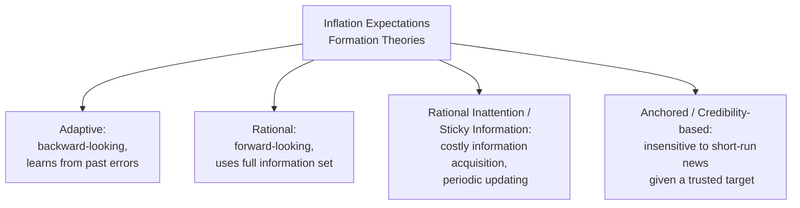
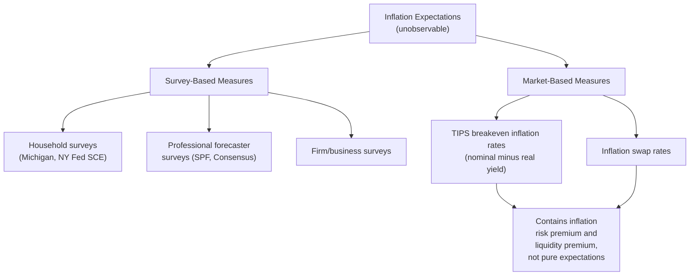
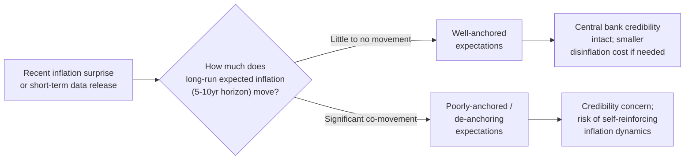

## Inflation Expectations Formation and Measurement

### Why Inflation Expectations Matter

Inflation expectations occupy a central position in virtually every modern macroeconomic framework for inflation dynamics — from the expectations-augmented Phillips curve through the New Keynesian Phillips Curve and its hybrid variants. Expected inflation directly influences wage bargaining, price-setting, contract indexation, savings and borrowing decisions, and the real return on nominal assets. Because expectations cannot be directly observed, both their **theoretical formation mechanisms** and their **empirical measurement** are foundational, closely linked topics in inflation economics.

### Theoretical Frameworks for Expectations Formation

**1. Adaptive (backward-looking) expectations**

$$\pi_t^e = \pi_{t-1}^e + \lambda(\pi_{t-1} - \pi_{t-1}^e), \qquad 0 < \lambda \le 1$$

Expectations adjust gradually based on past forecast errors, using only historical inflation data. This mechanism underlies the accelerationist Phillips curve and was the dominant framework prior to the rational expectations revolution.

**2. Rational expectations**

$$\pi_t^e = E[\pi_t \mid \Omega_{t-1}]$$

Agents use all available information, including knowledge of the structural economy and the policy rule, to form expectations that are unbiased and whose errors are uncorrelated with any known information. This underlies the Lucas Critique and the policy-ineffectiveness proposition.

**3. Rational inattention / sticky information**

[Inference] Building on work by Christopher Sims (rational inattention) and Ricardo Reis and N. Gregory Mankiw (sticky information), this class of models argues that acquiring and processing information about inflation is costly, so agents optimally update their expectations only periodically rather than continuously, even if they are otherwise fully rational conditional on the information they do choose to process. This framework can generate inflation persistence and expectational errors that persist for a time, without abandoning the assumption of rationality, by instead relaxing the assumption of costless, continuous information acquisition.

**4. Anchored expectations / credibility-based models**

Under a credible, transparent inflation-targeting regime, a substantial body of theory and evidence suggests that long-run inflation expectations become relatively insensitive to short-run economic news or fluctuations in current inflation, remaining "anchored" close to the central bank's stated target. This anchoring is itself often modeled as the equilibrium outcome of a rational learning process in which agents, having observed a sufically long track record of the central bank hitting its target, place high confidence in that target as the best predictor of long-run inflation, requiring only limited additional updating from short-term data surprises.

### Measuring Inflation Expectations: Survey-Based Methods

Since expectations are unobservable, empirical macroeconomics relies on proxy measurement approaches, broadly divided into survey-based and market-based methods.

**Household surveys:**

- **University of Michigan Surveys of Consumers**: Asks a representative sample of U.S. households for their expected inflation rate over the next 1 year and over the next 5-10 years, widely used as a gauge of consumer inflation expectations and closely watched by the Federal Reserve.
- **New York Fed Survey of Consumer Expectations (SCE)**: A more detailed, panel-based U.S. household survey collecting expectations at 1-year and 3-year horizons, along with additional detail on expected wage growth, home price changes, and spending intentions, allowing researchers to study the joint distribution and dynamics of household expectations over time.

**Professional forecaster surveys:**

- **Survey of Professional Forecasters (SPF)**: Conducted quarterly (in the U.S., by the Federal Reserve Bank of Philadelphia), surveying professional economists for their point and probabilistic forecasts of inflation and other macroeconomic variables at various horizons.
- **Consensus Economics and similar private survey providers**: Aggregate forecasts from panels of professional economists across many countries, providing internationally comparable measures.

**Business/firm surveys:**

- Various national statistical agencies and central banks conduct firm-level surveys asking businesses about their expected input cost inflation, output price plans, and general inflation expectations, providing a supply-side complement to household and forecaster measures.

### Measuring Inflation Expectations: Market-Based Methods

**Breakeven inflation rates from inflation-indexed bonds:**

The most widely used market-based measure derives from comparing the yield on a nominal government bond to the yield on an inflation-protected bond of the same maturity (e.g., U.S. Treasury Inflation-Protected Securities, TIPS):

$$\pi^{\text{breakeven}}_{t,n} \approx i^{\text{nominal}}_{t,n} - i^{\text{real}}_{t,n}$$

where $i^{\text{nominal}}_{t,n}$ is the nominal yield on an $n$-year Treasury bond and $i^{\text{real}}_{t,n}$ is the yield on an $n$-year TIPS of the same maturity. This "breakeven" rate represents, approximately, the average inflation rate over the bond's maturity that would make an investor indifferent between holding the nominal and the inflation-protected security.

**Important caveat**: the breakeven rate is not a pure measure of expected inflation — it typically embeds an **inflation risk premium** (compensation investors demand for bearing inflation uncertainty) and a **liquidity premium** (reflecting the generally lower trading liquidity of inflation-protected securities relative to conventional nominal bonds). Formally:

$$\pi^{\text{breakeven}}_{t,n} = E_t[\pi_{t,t+n}] + \text{Inflation Risk Premium}_{t,n} + \text{Liquidity Premium}_{t,n}$$

**Inflation swaps**: Derivative contracts in which one party pays a fixed rate and receives a floating rate tied to realized inflation over the contract's term; the fixed rate in a newly issued swap provides another market-based proxy for expected inflation, subject to similar risk-premium caveats as breakeven rates.

### Diagram: The Expectations Measurement Landscape

### Worked Numerical Illustration: Extracting a Breakeven Rate

Suppose a 10-year nominal Treasury bond yields 4.20% and a 10-year TIPS of the same maturity yields 1.70%:

$$\pi^{\text{breakeven}}_{t,10} = 4.20\% - 1.70\% = 2.50\%$$

If independent estimates suggest the inflation risk premium at the 10-year horizon is approximately 0.25 percentage points and the TIPS liquidity premium is approximately 0.15 percentage points (both subtracted from the breakeven, since compensation for risk and illiquidity inflates the required nominal-real yield spread beyond pure expected inflation):

$$E_t[\pi_{t,t+10}] \approx 2.50\% - 0.25\% - 0.15\% = 2.10\%$$

[Unverified] These illustrative risk and liquidity premium magnitudes are stylized for demonstration purposes; actual premium estimates vary over time, across countries, and across the specific term-structure decomposition model used by researchers (such as the Kim-Wright or D'Amico-Kim-Wei models commonly used by central bank staff), and are themselves subject to meaningful estimation uncertainty.

### Comparing Survey-Based and Market-Based Measures

| Feature | Survey-Based Measures | Market-Based Measures |
| --- | --- | --- |
| Source | Direct elicitation from households, forecasters, or firms | Inferred indirectly from asset prices |
| Contains risk/liquidity premia | No (directly reports stated beliefs, though subject to other biases) | Yes — must be adjusted to isolate pure expectations |
| Update frequency | Periodic (monthly/quarterly, per survey schedule) | Continuous (real-time, as markets trade) |
| Representativeness | Depends on sample; household and professional forecaster expectations often diverge notably | Reflects the expectations (and risk preferences) of market participants able to trade in relevant securities, not the general population |
| Known behavioral biases | Household surveys show well-documented biases (e.g., overweighting frequently-purchased goods like gasoline and food prices) | Subject to model risk in the risk/liquidity premium decomposition |
| Typical use case | Gauging "on the ground" sentiment, especially for wage-setting and consumption-relevant expectations | Gauging market-implied expectations relevant for asset pricing and monetary policy transmission |

### Known Discrepancies Between Household and Professional Expectations

[Inference] A well-documented empirical regularity is that household (consumer) survey-based inflation expectations tend to run persistently higher and more volatile than professional forecaster expectations, and household expectations appear to respond disproportionately to salient, frequently-purchased items such as gasoline and grocery prices, even when those items do not represent a large share of the overall consumption basket used to construct official inflation measures. This divergence has motivated research into whether "anchoring" of inflation expectations should be assessed separately for different types of economic agents, since the wage-price-setting relevance of household expectations, professional forecaster expectations, and financial market expectations may differ depending on which channel (labor bargaining, firm price-setting, or asset pricing) is of primary interest for a given macroeconomic question.

### Anchoring: Definition and Measurement Approaches

"Anchoring" refers to the degree to which longer-horizon inflation expectations remain stable and insensitive to short-term inflation surprises or current economic conditions, as opposed to closely tracking recent realized inflation. Researchers commonly assess anchoring using several complementary approaches:

- **Sensitivity regressions**: Regressing changes in long-horizon expected inflation (e.g., 5-to-10-year-ahead measures) on recent inflation surprises or short-horizon expectation revisions; a small, statistically insignificant coefficient is interpreted as evidence of anchoring, while a large, significant coefficient suggests expectations remain sensitive to (and potentially destabilized by) recent inflation news.
- **Dispersion of long-run forecasts across survey respondents**: Low cross-respondent disagreement about long-run inflation is often interpreted as a sign of well-anchored expectations, since widespread agreement suggests a shared, confident reference point (typically the central bank's target), whereas high dispersion suggests expectations are less firmly anchored to any common benchmark.
- **Probability distributions from surveys**: Some surveys (e.g., the SPF) collect not just point forecasts but full subjective probability distributions over future inflation outcomes, allowing researchers to assess whether the probability mass assigned to inflation outcomes far from target has grown or shrunk over time — a more granular anchoring indicator than point forecasts alone.

### Practical and Policy Relevance

- **Input to Phillips curve estimation**: The choice of which expectations measure (survey-based, market-based, adaptive proxy using lagged inflation) to use as $\pi_t^e$ or $E_t[\pi_{t+1}]$ in an estimated Phillips curve equation materially affects estimated coefficients and model fit, making expectations measurement choice a live methodological issue in applied inflation research (and related directly to the "flattening" debate discussed in the corresponding chapter topic, since some apparent flattening may partly reflect improved measurement or genuine changes in the anchoring of the expectations series used).
- **Central bank monitoring**: Most major central banks explicitly monitor a suite of both survey-based and market-based expectations measures as part of their regular policy assessment process, treating persistent, coordinated moves away from target across multiple measures as a more serious credibility concern than an isolated move in any single series.
- **Communication and forward guidance design**: Understanding how different types of agents (households, firms, professional forecasters, financial markets) form and update their expectations informs how central banks design communication strategies (e.g., explicit numerical inflation targets, published economic projections, forward guidance language) intended to influence and anchor those expectations.

### Common Misconceptions

- **Misconception**: The TIPS breakeven rate is a direct, unbiased measure of market-expected inflation. **Correction**: The breakeven rate embeds both an inflation risk premium and a liquidity premium; isolating pure expected inflation requires an additional term-structure decomposition model, not merely subtracting nominal minus real yields.
- **Misconception**: Household and professional forecaster inflation expectations should be expected to closely agree, since they concern the same future outcome. **Correction**: These groups reliably show documented, persistent divergences in both level and volatility, reflecting differences in information access, cognitive processing, and the salience of specific frequently-observed prices for households versus the broader, more comprehensive analytical approach typically used by professional forecasters.
- **Misconception**: "Anchored" expectations means expectations never move at all. **Correction**: Anchoring is a matter of degree, referring to reduced (not zero) sensitivity of longer-horizon expectations to short-term news; well-anchored expectations can still gradually adjust over time in response to sustained, credible changes in economic conditions or policy.

### Next Steps

- **Related Topics**:
  - Adaptive expectations and the accelerationist hypothesis
  - Rational expectations critique of the Phillips curve
  - New Keynesian Phillips curve and forward-looking inflation
  - Flattening of the Phillips curve debate
  - Central bank credibility and inflation targeting
  - TIPS, breakeven inflation, and term-structure decomposition models
  - Rational inattention and sticky information models
  - The Survey of Professional Forecasters and other survey methodologies
  - De-anchoring risk and its macroeconomic consequences
  - Forward guidance as a monetary policy communication tool