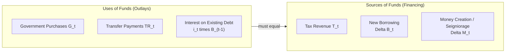
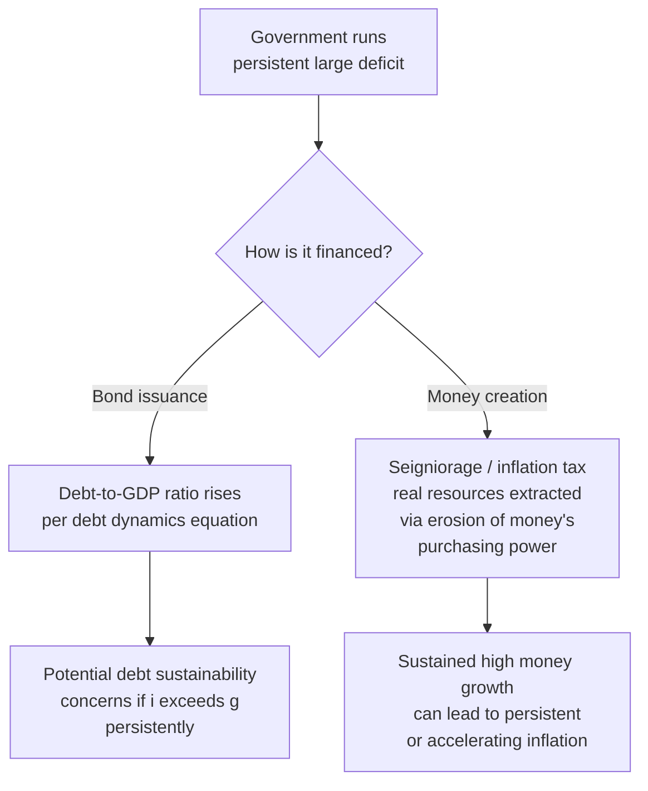

## Government Budget Constraint and Components

### Definition and Basic Concept

The government budget constraint (GBC) is the accounting and economic relationship describing how a government finances its spending: every dollar of government expenditure must be paid for through some combination of tax revenue, borrowing (issuing new debt), or money creation. Unlike a private household, a government with its own currency has an additional financing option — seigniorage (money creation) — though this option is unavailable to individual member states of a currency union (e.g., Eurozone members) or to governments that have chosen fixed exchange rate regimes with limited monetary independence.

The GBC is a foundational building block for understanding fiscal sustainability, debt dynamics, the interaction between fiscal and monetary policy, and the long-run consequences of persistent deficits.

### The Basic Period-by-Period Budget Identity

In its simplest flow form, the government's budget constraint for a single period is:

$$G_t + i_t B_{t-1} = T_t + \Delta B_t + \Delta M_t$$

where:

- $G_t$ = government purchases of goods and services in period $t$
- $i_t B_{t-1}$ = interest payments on outstanding debt carried over from the previous period, at nominal interest rate $i_t$
- $T_t$ = tax revenue (net of transfer payments, or with transfers added separately — conventions vary by textbook)
- $\Delta B_t = B_t - B_{t-1}$ = the change in government bonds outstanding (new borrowing)
- $\Delta M_t = M_t - M_{t-1}$ = the change in the monetary base attributable to financing government spending (seigniorage)

Rearranging to express the **budget deficit** (total outlays minus tax revenue) as what must be financed:

$$\underbrace{G_t + i_t B_{t-1} - T_t}_{\text{Budget Deficit}} = \Delta B_t + \Delta M_t$$

This equation states the core principle: **the deficit must be financed either by issuing new debt or by creating new money.**

### Including Transfer Payments Explicitly

A fuller specification separates government purchases from transfer payments (Social Security, unemployment insurance, subsidies, and similar non-purchase outlays):

$$G_t + TR_t + i_t B_{t-1} = T_t + \Delta B_t + \Delta M_t$$

where $TR_t$ represents transfer payments. This distinction matters because $G_t$ (purchases) enters the national income accounts as a direct component of GDP, while $TR_t$ (transfers) does not directly add to GDP but affects disposable income and, through the consumption function, indirectly affects aggregate demand.

### Diagram: Sources and Uses of Government Funds

### The Primary Deficit vs. the Total (Overall) Deficit

A key distinction in fiscal analysis separates the deficit into two components:

$$\text{Primary Deficit}_t = G_t + TR_t - T_t$$

$$\text{Total (Overall) Deficit}_t = \text{Primary Deficit}_t + i_t B_{t-1}$$

The **primary deficit** (or primary balance, when revenue exceeds primary spending) excludes interest payments on existing debt, isolating the portion of the deficit under the government's *current* discretionary control. The **total deficit** includes interest payments, which are a legacy obligation from *past* borrowing decisions and are not directly controllable in the current period without defaulting or restructuring debt. This distinction is critical for debt sustainability analysis, since a government can run a **primary surplus** while still running an overall (total) deficit if interest payments are large enough — a situation common for heavily indebted governments.

### Deriving the Debt Dynamics Equation (Debt-to-GDP Ratio)

To assess fiscal sustainability, economists typically transform the budget identity into an equation for the evolution of the **debt-to-GDP ratio**, since a government's ability to service debt depends on debt relative to the size of the economy, not the absolute nominal debt level. Starting from the debt accumulation identity (abstracting from money financing for simplicity, i.e., pure bond financing):

$$B_t = (1+i_t) B_{t-1} + G_t + TR_t - T_t$$

Dividing through by nominal GDP ($Y_t$) and defining lowercase variables as ratios to GDP ($b_t = B_t/Y_t$, and $d_t$ as the primary deficit ratio), and letting $g_t$ denote the nominal GDP growth rate, algebraic manipulation yields the standard debt dynamics equation:

$$b_t = \frac{1+i_t}{1+g_t} b_{t-1} + d_t$$

Or, approximating for small growth and interest rates, the commonly used simplified version:

$$\Delta b_t \approx (i_t - g_t) \, b_{t-1} + d_t$$

This equation is one of the single most important relationships in fiscal policy analysis: it shows that the debt-to-GDP ratio rises when the **primary deficit is positive** ($d_t > 0$) or when the **interest rate on debt exceeds the growth rate of the economy** ($i_t > g_t$, sometimes called an unfavorable "$r - g$" or "$i - g$" differential), and it can *fall* even with a modest primary deficit if growth sufficiently exceeds the interest rate (a condition often referred to as favorable debt dynamics).

### Worked Numerical Illustration

Suppose a government begins with a debt-to-GDP ratio $b_{t-1} = 80\%$, faces a nominal interest rate on its debt $i_t = 4\%$, nominal GDP growth $g_t = 3\%$, and runs a primary deficit of $d_t = 2\%$ of GDP:

$$\Delta b_t \approx (0.04 - 0.03)(0.80) + 0.02 = (0.01)(0.80) + 0.02 = 0.008 + 0.02 = 0.028$$

The debt-to-GDP ratio would rise by approximately 2.8 percentage points, from 80% to roughly 82.8%, driven by both the unfavorable interest-growth differential (contributing 0.8 points) and the primary deficit itself (contributing 2.0 points).

Now suppose instead the same government achieves a primary **surplus** of 1% of GDP ($d_t = -0.01$), while $i_t = 3\%$ and $g_t = 4\%$ (a favorable differential):

$$\Delta b_t \approx (0.03 - 0.04)(0.80) + (-0.01) = (-0.01)(0.80) - 0.01 = -0.008 - 0.01 = -0.018$$

The debt-to-GDP ratio would fall by approximately 1.8 percentage points, illustrating how a combination of primary surplus and favorable growth-interest dynamics can reduce the debt burden even without extreme fiscal austerity.

| Scenario | $i_t$ | $g_t$ | $d_t$ (primary deficit) | $\Delta b_t$ (approx.) | Debt Ratio Trend |
| --- | --- | --- | --- | --- | --- |
| Unfavorable | 4% | 3% | +2% | +2.8 pts | Rising |
| Favorable | 3% | 4% | −1% | −1.8 pts | Falling |
| Knife-edge | 3% | 3% | 0% | 0 pts | Stable |

[Unverified] These calculations use the small-rate linear approximation common in textbook treatments; the exact (non-approximated) formula using the full $(1+i_t)/(1+g_t)$ ratio will produce slightly different numerical results, particularly at higher interest rate or growth rate levels, though the qualitative conclusions are unaffected.

### The Seigniorage Financing Channel

Seigniorage refers to the real resources a government can command by creating new base money rather than borrowing or taxing. In flow terms:

$$\text{Seigniorage}_t = \frac{\Delta M_t}{P_t}$$

where $P_t$ is the price level, so seigniorage is expressed in real terms. Seigniorage revenue is closely linked to the **inflation tax**: when a government finances spending by expanding the money supply faster than real money demand grows, the resulting inflation erodes the real value of money balances held by the public, effectively transferring real resources from money-holders to the government. This is why persistent, large-scale reliance on money financing of deficits (particularly in economies with weak tax collection capacity or fiscal credibility) is closely associated with high and often hyperinflationary outcomes, since seigniorage revenue as a share of GDP tends to be self-limiting: sufficiently high inflation reduces real money demand, which can require ever-faster money growth to generate the same real resources, a dynamic central to models of hyperinflation dynamics (such as the Cagan model).

### Automatic Stabilizers vs. Discretionary Fiscal Policy Within the Constraint

The budget constraint's components respond differently to the business cycle:

- **Automatic stabilizers**: Tax revenue $T_t$ and certain transfer payments $TR_t$ (e.g., unemployment insurance) move automatically with the business cycle without any new legislation — tax revenue falls and transfer spending rises during recessions (widening the deficit automatically), and the reverse occurs during expansions, providing a built-in countercyclical fiscal buffer.
- **Discretionary fiscal policy**: Deliberate legislative changes to $G_t$, tax rates, or transfer program parameters, requiring active policy decisions rather than occurring automatically through the existing structure of the tax and transfer system.
- **The cyclically-adjusted (structural) budget balance**: A commonly used analytical construct that strips out the estimated automatic-stabilizer component of the deficit, isolating the portion of the fiscal stance attributable to discretionary policy choices — useful for assessing the underlying fiscal policy stance independent of where the economy happens to sit in the business cycle.

### Intertemporal Budget Constraint and Long-Run Sustainability

Beyond the single-period flow identity, economists also analyze the government's **intertemporal budget constraint**, which requires that the current stock of debt be backed by the present discounted value of all future primary surpluses:

$$B_{t-1} = \sum_{j=0}^{\infty} \frac{(-d_{t+j}) \, Y_{t+j}}{\prod_{k=0}^{j}(1+i_{t+k})}$$

Informally: outstanding debt today must eventually be repaid through some combination of future primary surpluses, discounted back to the present. This "no-Ponzi-game" condition rules out a government perpetually rolling over debt with ever-growing balances relative to its capacity to eventually generate primary surpluses, and is the theoretical foundation for concepts such as fiscal sustainability assessments, debt sustainability analysis conducted by institutions like the IMF, and theories such as the Fiscal Theory of the Price Level, which reverses the usual causality and asks what price level is required to make a *given* path of fiscal deficits consistent with the government's intertemporal budget constraint being satisfied.

### Common Misconceptions

- **Misconception**: A government budget deficit and rising debt-to-GDP ratio are the same thing. **Correction**: The debt ratio can fall even amid an ongoing primary deficit if GDP growth sufficiently exceeds the interest rate on debt (favorable $i - g$ dynamics), and conversely can rise even with a primary surplus if the interest-growth differential is sufficiently unfavorable.
- **Misconception**: Governments that issue debt in their own currency face the same financing constraints as households or firms. **Correction**: A government with monetary sovereignty has an additional financing channel unavailable to private agents — money creation/seigniorage — though this channel carries its own economic costs (inflation) and is unavailable to individual members of a currency union or those pegging their exchange rate with limited monetary autonomy.
- **Misconception**: The primary deficit and the total (overall) deficit are interchangeable measures for assessing fiscal policy. **Correction**: They serve different analytical purposes; the primary deficit isolates current discretionary fiscal choices, while the total deficit (including interest payments) is more relevant for tracking the overall change in the debt stock and assessing near-term financing needs.

### Next Steps

- **Related Topics**:
  - Debt-to-GDP dynamics and sustainability analysis
  - Automatic stabilizers and discretionary fiscal policy
  - The cyclically-adjusted (structural) budget balance
  - Seigniorage, the inflation tax, and the Cagan model
  - The Fiscal Theory of the Price Level
  - Ricardian equivalence and government debt
  - Sovereign debt crises and default risk premia
  - Fiscal multipliers and the effectiveness of government spending
  - Crowding out and the interaction of fiscal and monetary policy
  - Intergenerational aspects of public debt