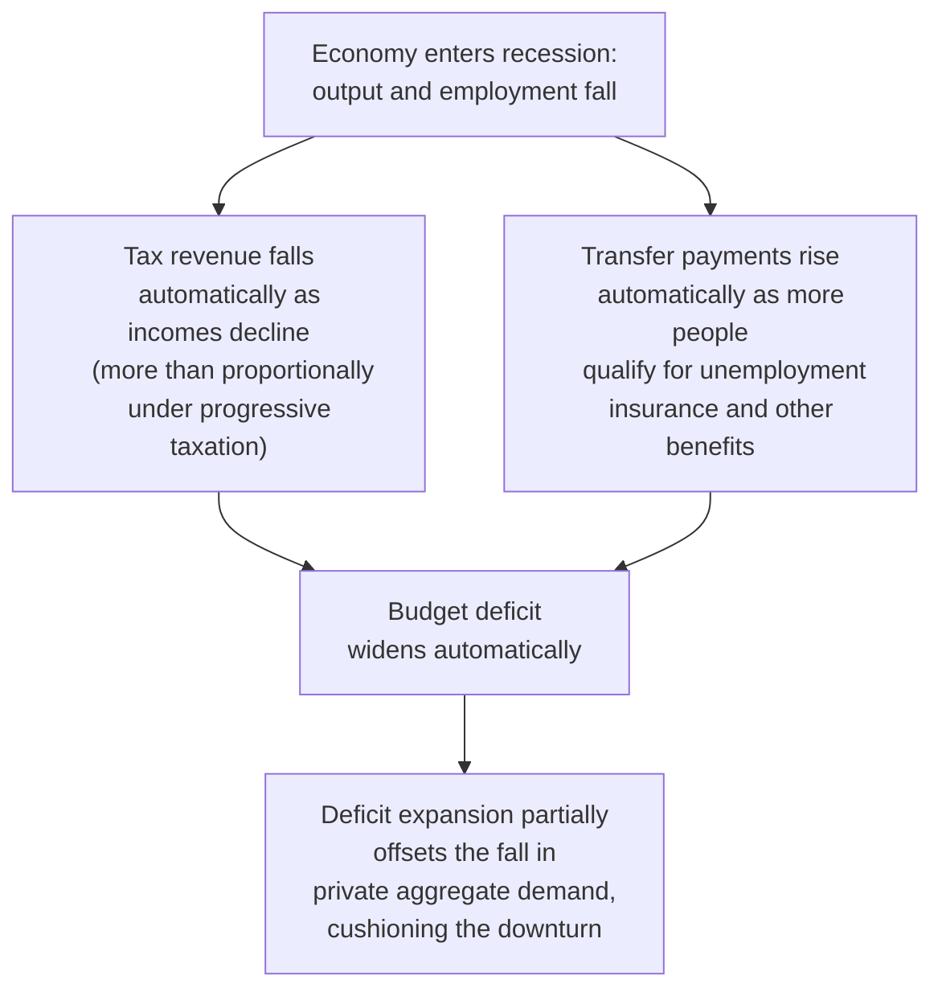
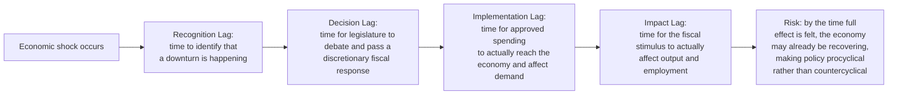

## Discretionary Fiscal Policy Versus Automatic Stabilizers

### Definitions and Basic Distinction

Fiscal policy actions that affect the government budget can be classified into two broad categories based on how they arise:

- **Discretionary fiscal policy** refers to deliberate, active changes to government spending or taxation enacted through new legislation or executive action, specifically intended to influence aggregate demand, employment, or other macroeconomic outcomes. Discretionary policy requires an explicit decision by policymakers (e.g., Congress passing a stimulus bill, a government cutting a tax rate).
- **Automatic stabilizers** are features of the existing tax and transfer system that automatically adjust government revenue and spending in response to changes in economic conditions, without requiring any new legislative or executive action. They operate through the pre-existing structure of the tax code and transfer programs, expanding fiscal support during downturns and withdrawing it during expansions purely as a mechanical consequence of how income, employment, and eligibility interact with the existing system.

### The Core Mechanism of Automatic Stabilizers

Automatic stabilizers work primarily through two channels:

**1. Progressive/proportional taxation**

As income falls during a recession, tax revenue falls automatically — and falls by *more* than proportionally under a progressive tax system, since taxpayers move into lower tax brackets and effective average tax rates decline. This automatically reduces the tax burden precisely when economic activity is weak, without any new tax legislation being passed.

**2. Transfer payment programs tied to economic conditions**

Programs such as unemployment insurance, the Supplemental Nutrition Assistance Program (SNAP), and other means-tested transfer programs automatically pay out more as unemployment rises and household incomes fall, since eligibility and benefit levels are triggered by the very economic conditions (job loss, low income) that a recession produces. Spending on these programs rises automatically during downturns and falls automatically during expansions as fewer people qualify or need support.

### Formal Representation: The Automatic Stabilizer Mechanism

A simple way to formalize automatic stabilization is through a tax function that depends on income:

$$T(Y) = t \cdot Y$$

where $t$ is the marginal tax rate and $Y$ is aggregate income/output. Disposable income becomes:

$$Y_D = Y - T(Y) = (1-t) Y$$

In the standard Keynesian income-expenditure model, this tax-income relationship reduces the **fiscal multiplier**, because a portion of any change in income is automatically taxed away rather than flowing entirely into disposable income and subsequent consumption spending:

$$\text{Multiplier (with income tax)} = \frac{1}{1 - c(1-t)}$$

compared to the simpler multiplier without an income-dependent tax:

$$\text{Multiplier (no income tax)} = \frac{1}{1-c}$$

where $c$ is the marginal propensity to consume. Since $0 < t < 1$, the multiplier with an income-dependent tax is always **smaller** than without one — this is precisely the stabilizing property: a smaller multiplier means any given demand shock (positive or negative) produces a *smaller* swing in equilibrium output, because automatic stabilizers dampen (rather than amplify) the initial shock's propagation through the economy.

### Worked Numerical Illustration

Suppose the marginal propensity to consume $c = 0.8$ and the marginal tax rate $t = 0.25$:

**Without automatic stabilizers (no income tax):**

$$\text{Multiplier} = \frac{1}{1-0.8} = \frac{1}{0.2} = 5.0$$

**With automatic stabilizers (income tax in place):**

$$\text{Multiplier} = \frac{1}{1 - 0.8(1-0.25)} = \frac{1}{1 - 0.8(0.75)} = \frac{1}{1 - 0.6} = \frac{1}{0.4} = 2.5$$

A negative demand shock of, say, $-\$100$ billion in autonomous spending would, absent automatic stabilizers, produce a $-\$500$ billion decline in equilibrium output; with automatic stabilizers in place, the same initial shock produces only a $-\$250$ billion decline — the automatic stabilizer mechanism cuts the output volatility from the shock roughly in half in this illustrative example.

| Scenario | Marginal Tax Rate $t$ | Multiplier | Output Change from −$100B Shock |
| --- | --- | --- | --- |
| No automatic stabilizers | 0 | 5.0 | −$500B |
| Moderate automatic stabilizers | 0.25 | 2.5 | −$250B |
| Strong automatic stabilizers | 0.40 | 1.85 (approx.) | −$185B (approx.) |

[Unverified] These figures use a simplified closed-economy Keynesian multiplier framework for illustrative purposes; real-world multiplier estimates incorporate additional factors (imports, monetary policy responses, expectations effects) not captured in this basic model.

### Advantages of Automatic Stabilizers

- **Speed**: Automatic stabilizers respond immediately and continuously as economic conditions change, without the delays inherent in the legislative process (recognition lag, decision lag, and implementation lag — collectively the "policy lags" problem discussed further below).
- **No political negotiation required**: Because the response is built into existing law, automatic stabilizers do not require a new political consensus to be built during a crisis, avoiding delays from legislative gridlock or disagreement.
- **Automatically self-correcting/symmetric**: Automatic stabilizers withdraw support automatically as the economy recovers (rising tax revenue, falling transfer payments), without requiring a separate, politically difficult decision to actively withdraw stimulus, unlike discretionary measures which often prove easier to enact than to later reverse (a well-documented political economy asymmetry).
- **Reduced forecasting risk**: Because automatic stabilizers respond directly to realized (not forecasted) economic conditions, they avoid the risk of a discretionary policy being based on an inaccurate real-time economic forecast.

### Advantages and Rationale for Discretionary Fiscal Policy

- **Scale and targeting flexibility**: Automatic stabilizers provide only a fixed, pre-determined degree of cushioning; a sufficiently severe downturn (such as a major financial crisis or pandemic-driven recession) may require a fiscal response substantially larger than what the automatic stabilizer system alone would provide, necessitating discretionary action (e.g., extended/expanded unemployment benefits, direct stimulus payments, infrastructure spending).
- **Addressing specific, unusual circumstances**: Discretionary policy can be tailored to address particular features of a specific crisis (e.g., targeted support for specific sectors shut down by a pandemic-related lockdown) in ways a generic, pre-existing automatic stabilizer system cannot.
- **Signaling and confidence effects**: A visible, deliberate discretionary policy response can itself influence household and business confidence and expectations about future economic conditions, a channel distinct from the pure mechanical income effects of automatic stabilizers.

### The Policy Lags Problem: A Central Argument for Automatic Stabilizers

A classic argument in favor of relying more heavily on automatic stabilizers, and treating discretionary fiscal policy with caution, rests on the concept of **policy lags**:

- **Recognition lag**: Economic data is released with a delay, and downturns are often only clearly identified well after they have begun (recall, from business cycle dating material, that the NBER itself typically announces recession start dates only months after the fact).
- **Decision lag**: The legislative process for passing new discretionary fiscal measures can take weeks to months, particularly in political systems with divided government or requiring extended negotiation.
- **Implementation lag**: Even after legislation passes, disbursing funds (e.g., processing infrastructure project approvals, distributing benefit payments) takes additional time.

[Inference] Because of these compounding delays, a poorly-timed discretionary fiscal response risks arriving *after* the economy has already begun to recover on its own, potentially adding unwanted stimulus during an expansion rather than cushioning the original downturn — a risk that automatic stabilizers, by construction, do not share, since they respond to *current*, not forecasted or legislatively processed, economic conditions.

### Discretionary Fiscal Policy Tools

| Tool | Type | Example |
| --- | --- | --- |
| Tax rebates / rate cuts | Revenue-side discretionary | 2008 U.S. Economic Stimulus Act tax rebate checks |
| Direct stimulus payments | Revenue-side discretionary | 2020-2021 U.S. Economic Impact Payments |
| Infrastructure spending | Spending-side discretionary | Public works programs, transportation projects |
| Extended/enhanced unemployment benefits | Hybrid (extends an automatic stabilizer program via discretionary legislation) | Pandemic Unemployment Assistance (2020) |
| Public sector hiring/investment programs | Spending-side discretionary | Direct government job creation initiatives |

### Automatic Stabilizer Components: A Summary Table

| Component | Automatic Mechanism | Direction During Recession |
| --- | --- | --- |
| Progressive income tax | Effective tax rate falls as income and bracket placement fall | Revenue falls, deficit widens |
| Corporate income tax | Profits fall sharply in downturns (highly procyclical), reducing tax receipts | Revenue falls, deficit widens |
| Unemployment insurance | More claimants automatically qualify as layoffs rise | Spending rises, deficit widens |
| Means-tested transfer programs (e.g., SNAP) | More households qualify as income falls | Spending rises, deficit widens |
| Corporate loss carryforward/carryback provisions | Firms with losses can offset past or future tax liabilities | Revenue falls, deficit widens |

### Measuring the Size of Automatic Stabilization: The Cyclically-Adjusted Budget Balance

To separate the automatic-stabilizer-driven portion of the deficit from the discretionary policy stance, economists compute the **cyclically-adjusted (or structural) budget balance** — an estimate of what the budget balance would be if the economy were operating at potential output (i.e., with the output gap at zero), stripping out the mechanical effects of the current cyclical position:

$$\text{Cyclically-Adjusted Balance} = \text{Actual Balance} - (\text{Budget Sensitivity Parameter}) \times (\text{Output Gap})$$

A widening gap between the actual (headline) deficit and the cyclically-adjusted deficit during a downturn is attributable to automatic stabilizers; a change in the cyclically-adjusted deficit itself reflects a genuine shift in discretionary fiscal policy stance, independent of where the economy sits in the business cycle.

### International Variation in Automatic Stabilizer Strength

[Inference] The strength of automatic stabilizers varies considerably across countries, primarily reflecting differences in the size and progressivity of the tax system and the generosity/coverage of transfer programs. Economies with larger public sectors, more progressive taxation, and more generous, broadly-available unemployment and social insurance systems (commonly cited examples include several Western European economies) tend to have stronger built-in automatic stabilization than economies with smaller public sectors and less generous, more restrictively-targeted transfer programs, which consequently may rely more heavily on discretionary fiscal action to achieve a comparable degree of cyclical cushioning.

### Common Misconceptions

- **Misconception**: Automatic stabilizers and discretionary fiscal policy are mutually exclusive alternatives a government must choose between. **Correction**: They operate simultaneously and complementarily in virtually all real-world economies; the policy question is typically about the appropriate *relative balance and scale* between the two, not an either/or choice, and discretionary policy is often used specifically to temporarily expand an existing automatic stabilizer program (e.g., extending unemployment benefit duration).
- **Misconception**: A widening budget deficit during a recession necessarily reflects a deliberate, active stimulus decision by policymakers. **Correction**: A substantial portion of deficit widening during any recession occurs automatically through the existing tax and transfer system, independent of any new discretionary policy action — this is precisely why economists use the cyclically-adjusted balance to isolate the discretionary policy component.
- **Misconception**: Automatic stabilizers are costless in the sense of having no tradeoffs. **Correction**: While automatic stabilizers avoid policy lag problems, a sufficiently generous automatic stabilizer system (e.g., high marginal tax rates, generous transfer benefits) can also reduce incentives to work or invest during normal times, representing a genuine efficiency-stability tradeoff in the design of tax and transfer systems.

### Next Steps

- **Related Topics**:
  - Government budget constraint and components
  - The cyclically-adjusted (structural) budget balance
  - Fiscal multipliers and the marginal propensity to consume
  - Policy lags: recognition, decision, and implementation
  - Unemployment insurance design and labor market incentives
  - The 2008 and 2020 U.S. discretionary fiscal stimulus episodes
  - Progressive taxation and its macroeconomic stabilization role
  - Business cycle dating and stylized facts
  - Fiscal policy versus monetary policy in short-run stabilization
  - Crowding out and Ricardian equivalence considerations for discretionary policy