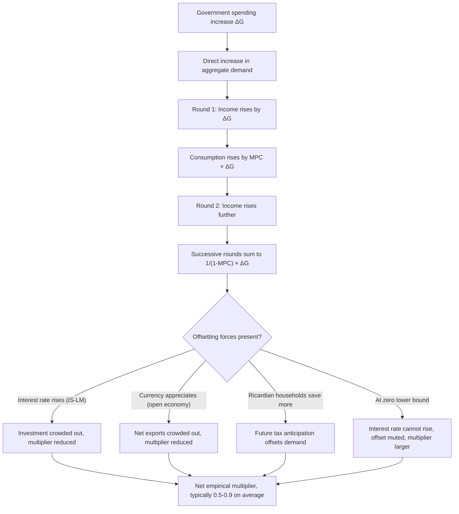

## Fiscal Multipliers: Theory and Empirical Estimates

### Definition

The fiscal multiplier measures the change in aggregate output resulting from a one-unit change in a fiscal policy instrument (government spending or taxation). Formally, the government spending multiplier is:

$$m_G = \frac{\Delta Y}{\Delta G}$$

and the tax multiplier is:

$$m_T = \frac{\Delta Y}{\Delta T}$$

A multiplier greater than 1 implies output changes by more than the initial fiscal impulse; a multiplier less than 1 implies a smaller-than-proportional response; a negative multiplier implies output moves opposite to the fiscal impulse.

### Theoretical Foundations: The Simple Keynesian Multiplier

In the basic Keynesian cross model (no interest rate feedback, closed economy), equilibrium output is:

$$Y = C(Y - T) + I + G$$

With a linear consumption function $C = a + b(Y-T)$, where $b$ is the marginal propensity to consume (MPC):

$$Y = a + b(Y - T) + I + G$$

Solving for $Y$:

$$Y = \frac{1}{1-b}\left(a - bT + I + G\right)$$

**Government spending multiplier:**

$$m_G = \frac{\partial Y}{\partial G} = \frac{1}{1-b}$$

**Tax multiplier:**

$$m_T = \frac{\partial Y}{\partial T} = \frac{-b}{1-b}$$

**Key Points**

- Since $0 < b < 1$, the spending multiplier $1/(1-b) > 1$, while the tax multiplier is negative and smaller in absolute value than the spending multiplier.
- The **balanced-budget multiplier** — a simultaneous equal increase in $G$ and $T$ — equals exactly 1: $m_G + m_T = \dfrac{1}{1-b} - \dfrac{b}{1-b} = \dfrac{1-b}{1-b} = 1$.
- This basic derivation assumes no crowding out, no supply constraints, and a closed economy with no price-level response — assumptions relaxed by richer models below.

### IS-LM Modification: Crowding Out

Incorporating interest-rate feedback (as in the IS-LM model) reduces the multiplier below its simple Keynesian value, because higher output raises money demand, which raises the interest rate (given fixed money supply), which reduces interest-sensitive investment — partially offsetting the initial spending increase.

The IS-LM-adjusted spending multiplier is:

$$m_G^{IS-LM} = \frac{h}{h+bk}\cdot\frac{1}{1-c}$$

(using $h$, $k$ as LM parameters, $b$ as investment's interest sensitivity, and $c$ as the MPC out of disposable income; exact notation varies by textbook).

**Key Points**

- The degree of crowding out depends on the interest-sensitivity of investment ($b$) and of money demand ($h$, $k$).
- A steeper LM curve (money demand relatively insensitive to $r$) implies more crowding out and a smaller multiplier.
- A flatter LM curve (as in a liquidity trap) implies less crowding out and a multiplier closer to the simple Keynesian value.
- In an open economy with flexible exchange rates and high capital mobility (Mundell-Fleming), fiscal multipliers can be reduced further or even driven toward zero, because currency appreciation crowds out net exports.

### Theoretical Predictions Across Models

| Model | Spending Multiplier | Key Mechanism |
| --- | --- | --- |
| Simple Keynesian (no crowding out) | $1/(1-b) > 1$ | No interest rate or supply-side offset |
| IS-LM (closed economy) | Smaller than simple Keynesian | Interest-rate crowding out of investment |
| Mundell-Fleming, flexible exchange rate, perfect capital mobility | Near zero | Exchange rate appreciation crowds out net exports |
| Mundell-Fleming, fixed exchange rate | Larger, can exceed closed-economy IS-LM | Central bank must expand money supply to defend peg, reinforcing the fiscal shock |
| Neoclassical / RBC with Ricardian equivalence | Near zero or negative | Households anticipate future taxes and increase saving, offsetting the spending increase |
| New Keynesian DSGE (sticky prices) | Varies, often 0.5–1.5 | Depends on monetary policy rule response and price stickiness |
| Zero lower bound (nominal rate constrained) | Larger than in normal times | Interest rate cannot rise to crowd out investment, weakening the offset |

### Determinants of Multiplier Size (Theoretical)

**Key Points**

- **Marginal propensity to consume (MPC):** Higher MPC raises the simple multiplier, since more of each round of new income is re-spent.
- **Marginal propensity to import (MPM):** In an open economy, some spending leaks abroad via imports, reducing the domestic multiplier: $m_G = 1/(1-b+m)$, where $m$ is the MPM.
- **Tax and transfer system progressivity:** Automatic stabilizers (progressive taxes, unemployment benefits) reduce the effective MPC out of pre-tax income, dampening the multiplier — a deliberate stabilization feature, not a flaw.
- **Monetary policy response:** If the central bank accommodates fiscal expansion (holds interest rates fixed or lowers them), the multiplier is larger; if the central bank tightens to offset inflationary pressure, the multiplier is smaller or even negative.
- **Exchange rate regime:** Fixed exchange rates amplify fiscal multipliers relative to flexible rates, because monetary policy is subordinated to the exchange rate target rather than free to offset the fiscal shock.
- **State of the business cycle:** Multipliers tend to be larger during recessions/economic slack (when resources are underutilized and crowding out is minimal) and smaller during expansions (when the economy is closer to capacity).
- **Public debt level:** High existing government debt tends to be associated with smaller multipliers, plausibly because higher debt raises risk premia and can trigger anticipation of future austerity or crowding out through higher borrowing costs.
- **Zero lower bound (ZLB):** When nominal interest rates are constrained near zero, the interest-rate offset to fiscal expansion is muted, so multipliers tend to be larger than in normal times.

### Empirical Estimation Challenges

Estimating fiscal multipliers empirically is difficult primarily because of **identification problems**: government spending and taxes are not randomly assigned but respond endogenously to the state of the economy (e.g., spending rises and taxes fall automatically during recessions), making simple correlations between fiscal variables and output uninformative about causal effects.

**Common identification strategies:**

- **Structural VAR with recursive (Cholesky) ordering** (Blanchard and Perotti, 2002) — assumes government spending does not respond within the same quarter to output shocks, using institutional lags in the budget process to justify the ordering.
- **Narrative/military spending shocks** (Ramey, 2011; Barro and Redlick, 2011) — uses exogenous shifts in defense spending (e.g., war buildups) as instruments, since these are plausibly unrelated to the contemporaneous domestic business cycle.
- **Local projections (LP)** (Jordà, 2005) — estimates impulse responses via a sequence of single-equation regressions at each forecast horizon rather than from a single VAR system. Local projections allow for more accurate cumulative multiplier estimates, defined as the integral of the output response over the integral of the government spending response, in contrast to the ratio of the output response to the initial shock more commonly used in VAR impulse responses, which tends to overestimate multiplier size. [Wiley Online Library](https://onlinelibrary.wiley.com/doi/10.1111/joes.70020)
- **State-dependent / regime-switching methods** (Auerbach and Gorodnichenko, 2012, 2013) — allow the multiplier to vary across recession versus expansion regimes using smooth-transition or threshold specifications.
- **Panel/cross-regional methods** (e.g., using U.S. states or EU regions) — exploit variation in fiscal shocks (such as federal spending allocations) across sub-national units holding national monetary policy fixed, isolating the multiplier from monetary policy offset.

**Key Points**

- Recent research suggests local projections are more robust than VAR-based approaches, particularly in panel data settings that reduce the bias-variance trade-off, making them a valuable complement to conventional VAR methods. [Wiley Online Library](https://onlinelibrary.wiley.com/doi/10.1111/joes.70020)
- No single method is universally preferred; VAR and LP approaches are often used together as robustness checks on one another.

### Empirical Estimates: Range and Central Tendencies

Empirical estimates of the fiscal multiplier span a very wide range, from approximately –3.00 to 3.00, reflecting differences in model assumptions, identification strategies, state-dependence, and dataset choices. Despite this wide range, a synthesis of the literature finds multipliers are generally concentrated between about 0.50 and 0.90, with higher estimates typically found during periods of economic slack and at the zero lower bound, and lower estimates found in economies or periods with high public-debt ratios. [Mercatus Center](https://www.mercatus.org/research/working-papers/government-spending-multiplier-survey-empirical-literature)[Mercatus Center](https://www.mercatus.org/research/working-papers/government-spending-multiplier-survey-empirical-literature)

**Key empirical regularities:**

- Multipliers (in absolute value) tend to be larger during economic downturns than during expansions, though there remains no full agreement in the literature on the precise size of government spending and tax multipliers. [ScienceDirect](https://www.sciencedirect.com/science/article/pii/S0164070423000848)
- Under accommodative or unconventional monetary policy conditions (such as near-zero policy rates combined with quantitative easing), some studies estimate substantially larger multipliers, in a range as high as roughly 1.7 to 5 across a panel of OECD countries — underscoring a strong positive interaction between expansionary fiscal policy and accommodative monetary policy. [ScienceDirect](https://www.sciencedirect.com/science/article/pii/S0264999325000586)
- Research by Blanchard and Leigh has found that fiscal multipliers, especially during downturns such as the post-2008 period, were larger than policymakers had initially assumed when designing austerity programs, an argument used to support the case for stronger fiscal responses during severe recessions. [ScienceDirect](https://www.sciencedirect.com/science/article/pii/S0264999325000586)
- Multipliers estimated on defense/military spending shocks (a widely used identification strategy) tend to fall on the lower end of the range, often between 0.6 and 1.0, since military buildups are large, persistent, and plausibly exogenous to the domestic business cycle, but may not generalize to other spending categories such as infrastructure or transfers.
- Government investment (e.g., infrastructure) versus government consumption spending may generate different multipliers, reflecting differences in how directly and immediately each spending type translates into aggregate demand versus longer-run productive capacity. [Inference] The precise ranking and magnitude of any consumption-versus-investment multiplier gap remains an active empirical research question rather than a settled result.

### Bibliometric Overview of the Literature

A recent bibliometric review analyzing 337 journal articles published between 2002 and 2023 found that more than half of this literature emerged just in the 2020–2023 period, with the most impactful papers appearing in top-tier economics journals, reflecting sharply growing academic and policy interest in fiscal multipliers. The review found that vector autoregressive (VAR) models dominate the empirical literature, although local projection techniques are increasingly used; structural and recursive identification strategies lead among VAR-based studies, while local-projection-based research more frequently relies on instrumental variables. There is also a growing trend toward estimating regime-dependent multipliers across different phases of the business cycle. [Wiley Online Library](https://onlinelibrary.wiley.com/doi/10.1111/joes.70020)[Wiley Online Library](https://onlinelibrary.wiley.com/doi/10.1111/joes.70020)

**Key Points**

- The surge in fiscal multiplier research after 2020 is plausibly linked to the scale of fiscal responses to the COVID-19 pandemic, which generated large, relatively well-identified fiscal shocks and renewed policy interest in multiplier size, though this specific causal link between the pandemic and the research surge is an inference rather than a claim made explicitly in the cited bibliometric study.

### Diagrammatic Summary: Multiplier Transmission and Offsetting Forces

### Policy Implications

**Key Points**

- Because multipliers are state-dependent, policymakers designing stimulus or austerity programs should account for the business-cycle phase: fiscal expansion is likely more effective (larger multiplier) during recessions and less effective during expansions.
- Some researchers argue that fiscal rules based solely on reducing the structural fiscal balance may understate the amplified multiplier effects available in certain economic conditions, and that alternative rules focused on outcomes such as unemployment targets could better account for state-dependent multiplier effects. [Unverified] This is a specific policy-design argument from the cited literature and should be treated as one viewpoint within an ongoing debate over fiscal rule design, not a settled consensus. [ScienceDirect](https://www.sciencedirect.com/science/article/pii/S0264999325000586)
- The composition of fiscal stimulus (spending versus tax cuts, transfers versus direct government purchases, temporary versus permanent measures) affects the realized multiplier, meaning "one-size-fits-all" multiplier assumptions in policy design can be misleading.

### Related Topics

- Automatic stabilizers and discretionary fiscal policy
- Ricardian equivalence and the permanent-income hypothesis
- Crowding out in the IS-LM and Mundell-Fleming models
- State-dependent (regime-switching) econometric models
- Local projections versus structural VAR methodology
- Fiscal policy at the zero lower bound
- Fiscal rules and debt sustainability analysis
- Government investment versus consumption spending multipliers