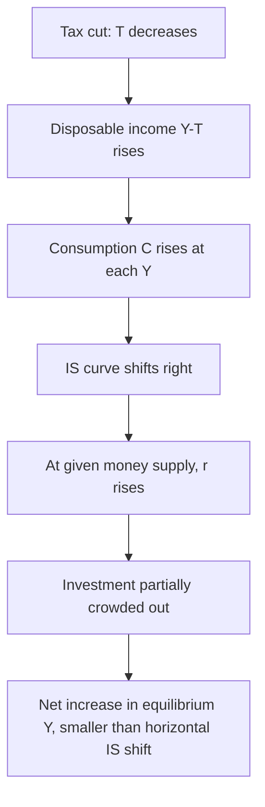

## Tax Policy and Aggregate Demand

### Overview

Tax policy affects aggregate demand primarily by altering disposable income, which changes household consumption, and by altering after-tax returns to investment, which changes business spending. Unlike government spending, which enters aggregate demand directly, tax changes affect demand indirectly through their influence on private decisions, making the size and timing of their effects depend heavily on household and firm behavior.

### Channels of Transmission

**Key Points**

- **Disposable income channel:** A tax cut raises disposable income $Y_d = Y - T$, which raises consumption according to the consumption function $C = a + b(Y-T)$, where $b$ is the marginal propensity to consume.
- **Relative price channel:** Changes in marginal tax rates alter the relative price of consumption versus saving, or of labor versus leisure, affecting the composition and level of economic activity, not just its overall magnitude.
- **Investment incentive channel:** Corporate tax changes, investment tax credits, and depreciation rules alter the after-tax cost of capital, affecting business investment independent of disposable-income effects on consumers.
- **Wealth channel:** Tax changes affecting asset returns (capital gains, dividends) can affect perceived wealth and thus consumption via a wealth effect, distinct from the direct disposable-income effect.
- **Expectations channel:** Anticipated future tax changes affect current behavior even before they take effect, since forward-looking households and firms adjust consumption and investment plans based on expected lifetime after-tax income.

### The Tax Multiplier: Derivation

Starting from the Keynesian cross equilibrium condition:

$$Y = C(Y-T) + I + G$$

With linear consumption $C = a + b(Y - T)$:

$$Y = a + b(Y-T) + I + G$$

$$Y = \frac{1}{1-b}(a - bT + I + G)$$

The tax multiplier is:

$$m_T = \frac{\partial Y}{\partial T} = \frac{-b}{1-b}$$

**Key Points**

- The tax multiplier is negative: a tax increase reduces output, a tax cut raises it.
- In absolute value, $|m_T| = \dfrac{b}{1-b} < \dfrac{1}{1-b} = m_G$, so the tax multiplier is always smaller in magnitude than the spending multiplier for the same MPC.
- The intuition: a dollar of government spending enters aggregate demand directly and fully in the first round, while a dollar of tax cut is only partially spent (fraction $b$) in the first round, with the remainder $(1-b)$ saved, so the tax cut's initial impulse is weaker before the multiplier process compounds it.

### The Balanced-Budget Multiplier

If government simultaneously raises $G$ and $T$ by the same amount $\Delta G = \Delta T$, the net effect on output is:

$$\Delta Y = m_G \Delta G + m_T \Delta T = \frac{1}{1-b}\Delta G - \frac{b}{1-b}\Delta G = \frac{1-b}{1-b}\Delta G = \Delta G$$

**Key Points**

- The balanced-budget multiplier equals exactly 1, regardless of the value of $b$: output rises by exactly the amount of the (equal) increase in spending and taxes.
- This result holds in the simple Keynesian model without interest-rate feedback; incorporating IS-LM crowding-out effects or open-economy considerations can alter this exact result.

### IS-LM Perspective: Tax Policy Shifts the IS Curve

A tax cut increases disposable income at every level of $Y$, raising consumption and shifting the **IS curve rightward**. This is analytically similar to a government spending increase, but scaled by the smaller tax multiplier before interest-rate feedback is considered.

**Transmission through IS-LM:**

1. Tax cut raises disposable income → consumption rises at each $Y$.
2. IS curve shifts right (by less than an equivalent-dollar $G$ increase, due to the smaller tax multiplier).
3. At unchanged money supply, higher desired spending raises money demand, pushing up the interest rate.
4. Higher $r$ partially crowds out investment, dampening the net increase in $Y$ relative to the horizontal IS shift.

### Types of Tax Changes and Differential Effects

**Key Points**

- **Lump-sum taxes** — taxes independent of income; affect disposable income directly without altering marginal incentives to work, save, or invest. The simple multiplier formula above assumes lump-sum taxes.
- **Proportional/marginal income taxes** — taxes that scale with income (e.g., $T = tY$) reduce the effective multiplier itself, because they act as an automatic stabilizer: $m_G = \dfrac{1}{1-b(1-t)}$, which is smaller than $\dfrac{1}{1-b}$ for any $t > 0$.
- **Capital gains and dividend tax changes** — affect saving and investment incentives and asset valuations, with effects concentrated among asset-holding households, which can produce different aggregate demand effects than broad-based income tax changes due to different distributional incidence.
- **Corporate tax changes** — affect the user cost of capital and investment decisions directly, operating through a channel distinct from household consumption.
- **Temporary versus permanent tax changes** — under the permanent-income/life-cycle hypothesis, temporary tax cuts generate a smaller consumption response than permanent tax cuts, because forward-looking households spread anticipated income changes over their expected lifetime rather than fully adjusting consumption to a one-time change.

### Distributional Considerations and the MPC

**Key Points**

- Tax cuts (or transfers) targeted at lower-income households tend to generate a larger aggregate demand response than equivalent-sized cuts targeted at higher-income households, because lower-income households typically have a higher marginal propensity to consume out of additional income, often due to binding liquidity constraints.
- This implies the *effective* multiplier of a given tax package depends on its distributional incidence, not just its aggregate dollar size — a consideration frequently cited in comparing the design of different fiscal stimulus packages.
- [Inference] Precise empirical estimates of how much MPC differs by income group vary across studies and data sources; the qualitative direction (higher MPC at lower income) is well supported, but exact magnitudes should be treated as estimates rather than fixed parameters.

### Ricardian Equivalence

The Ricardian equivalence proposition (associated with Barro, building on Ricardo) argues that, under certain conditions, tax cuts financed by government borrowing have no effect on aggregate demand, because forward-looking households recognize that current deficits imply higher future taxes, and increase saving today to prepare for that future tax liability, leaving consumption unchanged.

**Conditions required for Ricardian equivalence to hold exactly:**

- Households are fully forward-looking (rational, infinite planning horizons or operative bequest motives linking generations).
- Capital markets are perfect: households can borrow and lend at the same rate as the government.
- No liquidity constraints preventing households from smoothing consumption against expected future income.
- Taxes are lump-sum, not distortionary.
- No intergenerational effects that break the link between current and future taxpayers.

**Key Points**

- If Ricardian equivalence holds fully, the tax multiplier for a deficit-financed tax cut approaches zero, since private saving offsets the tax cut one-for-one.
- Most empirical evidence suggests only partial Ricardian offset: households do save somewhat more following deficit-financed tax cuts, but typically not enough to offset the stimulus fully, implying tax cuts do have a positive, though possibly muted, effect on aggregate demand.
- Liquidity-constrained households (unable to borrow against future income) are less likely to behave in a Ricardian manner, since they cannot smooth consumption regardless of their expectations about future taxes; this partly explains observed partial (rather than full) offset.

### Automatic Stabilizers

Progressive income taxes and transfer programs (unemployment insurance, means-tested benefits) function as **automatic stabilizers**: they reduce the after-tax income multiplier without requiring discretionary legislative action, dampening the amplitude of business-cycle fluctuations.

**Mechanism:**

- During a downturn, tax revenue automatically falls (as incomes and profits decline) and transfer payments automatically rise (as unemployment claims increase), partially offsetting the decline in disposable income and cushioning the fall in consumption.
- During an expansion, the reverse occurs: tax revenue rises and transfers fall automatically, moderating the expansion.

**Key Points**

- Automatic stabilizers act with no implementation lag, unlike discretionary fiscal policy, which is subject to recognition, legislative, and implementation lags.
- The presence of automatic stabilizers is one reason why the effective (post-stabilizer) multiplier on autonomous shocks is smaller than a multiplier computed ignoring the tax-income relationship.

### Timing and Lags in Tax Policy

**Key Points**

- **Recognition lag** — time required to identify that a demand shortfall or overheating requires a policy response.
- **Legislative lag** — time required to pass tax legislation, which for structural tax code changes can be considerably longer than for spending appropriations in many political systems.
- **Implementation lag** — time between a tax law's passage and its effect on household and firm behavior; withholding changes can take effect quickly, but larger structural changes (e.g., corporate tax reform) may take longer to influence investment decisions.
- **Response lag** — time for household and firm behavior to fully adjust to the tax change, particularly relevant for permanent-income effects, which build gradually as expectations adjust.

These lags mean discretionary tax policy is often criticized as a poor tool for fine-tuning short-run demand fluctuations, in contrast to automatic stabilizers, which operate without discretionary delay.

### Empirical Evidence on Tax Multipliers

**Key Points**

- Empirical estimates of tax multipliers vary substantially across studies, methodologies, and country contexts, similar to the wide range found for spending multipliers.
- Romer and Romer's narrative approach (using historical records to identify tax changes not motivated by contemporaneous economic conditions) is a widely cited method for isolating exogenous tax shocks and has found relatively large output effects from tax changes identified this way. [Inference] Specific point-estimate multiplier values from this and related studies vary by sample period and specification; exact figures should be checked against the most current version of the relevant paper rather than treated as fixed constants.
- Similar to spending multipliers, tax multipliers appear to be state-dependent: larger during recessions than expansions, and larger when monetary policy is constrained (e.g., near the zero lower bound) because the interest-rate offset is muted.
- Studies using targeted household-level data (natural experiments such as tax rebate programs) generally find that the marginal propensity to consume out of transitory tax rebates is significant but well below 1, consistent with only partial Ricardian offset and with life-cycle/permanent-income considerations.

### Summary Comparison: Spending vs. Tax Policy

| Dimension | Government Spending | Tax Policy |
| --- | --- | --- |
| Direct effect on AD | Direct (enters $G$ term) | Indirect (via consumption/investment decisions) |
| Multiplier magnitude (same $b$) | Larger: $1/(1-b)$ | Smaller: $b/(1-b)$ |
| Sensitive to household saving behavior | Less sensitive | Highly sensitive (Ricardian offset risk) |
| Best suited for | Direct demand stimulus, public goods provision | Incentive effects, supply-side goals, redistribution |
| Automatic stabilization role | Limited (transfers only) | Central (progressive tax structure) |
| Distributional targeting flexibility | Lower | Higher (can target by income group) |

### Related Topics

- Ricardian equivalence and the permanent-income hypothesis
- Automatic stabilizers versus discretionary fiscal policy
- Fiscal multipliers: theory and empirical estimates
- Marginal propensity to consume and liquidity constraints
- Supply-side effects of taxation (labor supply, investment incentives)
- Crowding out in the IS-LM framework
- Progressive taxation and business-cycle stabilization
- Tax incidence and distributional analysis