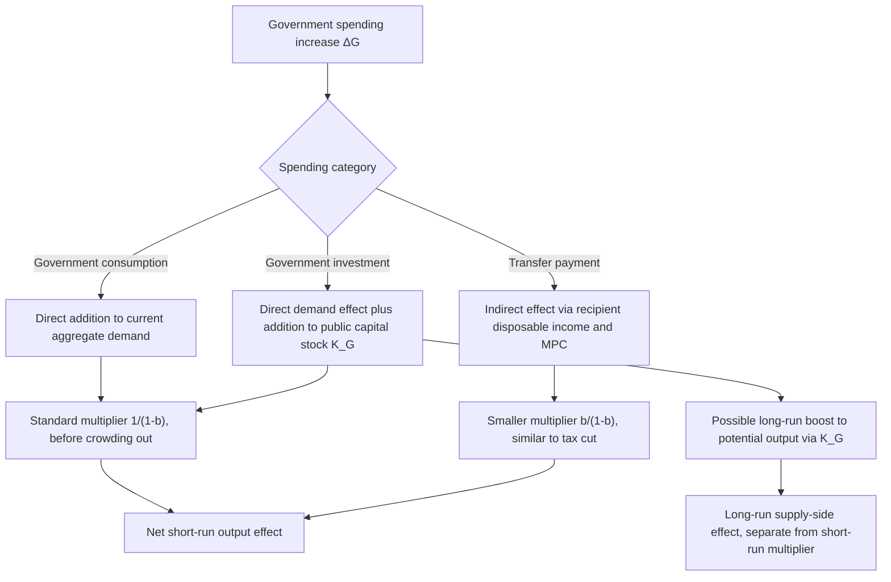

## Government Spending Composition and Effects

### Overview

Government spending is not homogeneous: its macroeconomic effects depend substantially on its composition — whether it consists of consumption, investment, or transfers, and how it is allocated across sectors. Aggregate spending totals of equal size can produce different effects on output, the capital stock, employment composition, and long-run growth depending on how the spending is structured.

### Categories of Government Spending

**Key Points**

- **Government consumption** — current expenditure on goods and services consumed within the period (public sector wages, routine operations, defense operations, health and education service delivery). Enters GDP directly and immediately; does not add to the capital stock.
- **Government investment** — expenditure on public capital (infrastructure, public buildings, R&D funding, equipment) that adds to the stock of public capital and can raise the economy's future productive capacity, not just current demand.
- **Transfer payments** — payments to households or firms (social security, unemployment insurance, subsidies) that do not directly enter GDP as government purchases (since $G$ in the national accounts excludes transfers); they raise disposable income and affect demand indirectly through the recipient's consumption response, similar to a tax cut.
- **Interest payments on public debt** — payments to bondholders; typically excluded from the $G$ used in multiplier analysis since they do not represent purchases of current goods or services, though they affect the government budget constraint and future fiscal space.

### National Accounts Treatment

In the national income identity:

$$Y = C + I + G + NX$$

$G$ conventionally refers to **government consumption and investment expenditure** — actual purchases of goods and services — not total government outlays. Transfer payments are excluded from $G$ and instead affect $Y$ indirectly through their effect on disposable income and thus $C$:

$$Y_d = Y - T + TR$$

where $TR$ denotes transfers. This distinction matters for multiplier analysis, since a dollar of direct government purchases and a dollar of transfer payment operate through different channels with different multipliers.

### Multiplier Differences by Spending Type

**Key Points**

- **Government purchases (consumption/investment)** enter aggregate demand directly and fully in the first round, generating the standard spending multiplier $1/(1-b)$ before any crowding-out adjustment.
- **Transfers** operate like a (negative) tax: only the fraction $b$ (the marginal propensity to consume) of the transfer is spent in the first round, with the multiplier $b/(1-b)$ — smaller than the direct purchases multiplier, analogous to the tax multiplier.
- Multipliers may also depend on the type of spending in more nuanced ways — for example, whether the spending shock is driven by demand-side or supply-side factors, or whether the change is anticipated in advance (news shocks) versus unanticipated, both of which can alter the size and timing of the output response independent of the spending category itself.
- Government investment spending may generate a distinct multiplier profile compared with government consumption, since investment spending affects the economy's future productive capacity in addition to its immediate demand effect, though the precise empirical ranking between the two remains an active research question rather than a settled finding.

### Government Investment and the Capital Stock

Public investment spending contributes to the public capital stock $K_G$, which can enter the aggregate production function as a complement to private capital and labor:

$$Y = A \cdot F(K_P, K_G, L)$$

where $K_P$ is private capital and $K_G$ is public capital (infrastructure, etc.).

**Key Points**

- To the extent that public capital raises the marginal product of private capital and labor (e.g., transportation infrastructure reducing firms' costs), government investment can have effects on long-run potential output beyond its short-run demand-side multiplier effect — a channel absent from pure consumption spending.
- This creates a potential "supply-side" argument for infrastructure spending distinct from its short-run Keynesian demand effect, though the magnitude of productivity effects from public capital is empirically contested and depends heavily on the type, quality, and targeting of the investment.
- Government investment projects often have longer implementation lags than consumption spending (planning, procurement, construction time), which can delay the demand-side stimulus relative to more immediately disbursable consumption or transfer spending.

### Composition and Crowding Out

**Key Points**

- Government consumption spending on goods and services that closely substitute for private-sector output (e.g., government provision of a good the private sector would otherwise supply) can crowd out private production more directly than spending on genuinely public goods (national defense, basic infrastructure) that the private sector would not otherwise provide.
- Government investment in physical capital can, in principle, crowd in private investment if public infrastructure raises the expected return to complementary private capital, contrasting with the interest-rate-driven crowding out mechanism in the standard IS-LM analysis.
- The composition of spending also affects the sectoral distribution of the demand impulse: spending concentrated in capital-intensive sectors (construction) versus labor-intensive sectors (public services) will have different immediate effects on employment composition, even if the aggregate dollar multiplier were identical.

### Sectoral Allocation and Regional Effects

**Key Points**

- Spending allocated to different regions or sectors of an economy produces different local demand effects, a consideration used in some empirical work that exploits regional variation in federal spending allocation (e.g., defense contracts by U.S. state) to identify multiplier effects while holding national monetary policy fixed.
- Sector-specific spending can generate different supply-side responses if some sectors face more binding capacity constraints than others; spending directed at sectors already near capacity may generate more price/wage pressure and less real output response than spending directed at sectors with slack.

### Diagram: Composition-Dependent Transmission

### Temporary vs. Permanent and Anticipated vs. Unanticipated Spending

**Key Points**

- **Temporary spending increases** (e.g., disaster relief, short-term stimulus programs) are generally analyzed within the standard multiplier framework without strong permanent-income complications on the government side, though household responses to the associated income may still depend on whether households perceive the underlying economic conditions as temporary or persistent.
- **Permanent spending increases** (e.g., a structural expansion of a public program) can have different long-run fiscal sustainability implications, potentially affecting expectations about future taxation and interacting with Ricardian-type household responses in ways that temporary spending does not.
- **Anticipated ("news") shocks** — spending increases announced in advance of implementation — can generate demand responses (e.g., through changed expectations of future income) before the actual spending occurs, distinguishing them from unanticipated spending shocks in models and empirical identification strategies.

### Composition and the Government Budget Constraint

Spending composition also affects fiscal sustainability analysis. Government investment that raises long-run output can, in principle, partially "pay for itself" through a larger future tax base, whereas pure consumption spending or transfers do not carry this offsetting revenue channel to the same degree.

**Key Points**

- This does not imply investment spending is costless or self-financing in general; the degree of any revenue offset depends on the size of the productivity effect, the tax rate applied to the resulting additional output, and the time horizon considered.
- [Inference] Claims that specific infrastructure programs "pay for themselves" are frequently made in policy debate but are contested empirically and should be evaluated on a case-by-case, project-specific basis rather than accepted as a general property of government investment spending.

### Summary Comparison Table

| Spending Type | Enters GDP Directly? | Short-Run Multiplier (relative) | Long-Run Supply Effect | Typical Implementation Lag |
| --- | --- | --- | --- | --- |
| Government consumption | Yes | Standard ($1/(1-b)$, pre-crowding-out) | Minimal | Short to moderate |
| Government investment | Yes | Standard, similar to consumption | Potentially positive via public capital | Moderate to long |
| Transfer payments | No (indirect via $C$) | Smaller (like tax multiplier, $b/(1-b)$) | Minimal directly, though can support human capital (e.g., education/health transfers) | Short (can be rapid, e.g., benefit payments) |
| Interest payments on debt | No | Not typically included in multiplier analysis | None directly | N/A |

### Related Topics

- Fiscal multipliers: theory and empirical estimates
- Tax policy and aggregate demand
- Public capital and long-run growth models
- Crowding out and crowding in of private investment
- Automatic stabilizers versus discretionary fiscal policy
- Fiscal sustainability and the government budget constraint
- Regional/state-level identification of spending multipliers