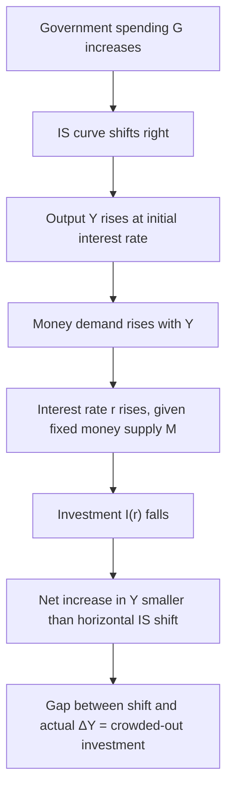
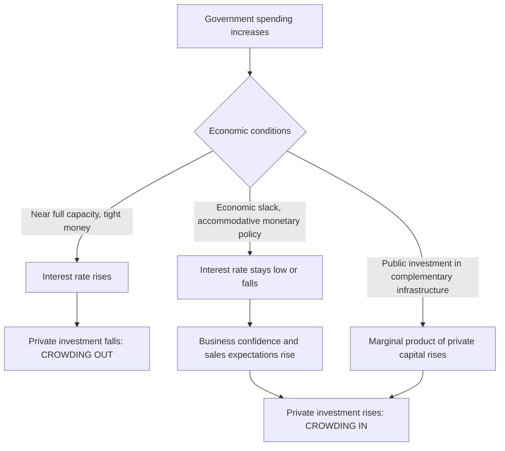

## Crowding Out Versus Crowding In

### Definitions

**Crowding out** refers to a reduction in private-sector spending (typically investment, but potentially consumption or net exports) caused by an expansion of government spending or borrowing. **Crowding in** refers to the opposite: an increase in private-sector spending induced by government fiscal actions. Both concepts describe how fiscal policy's net effect on aggregate output can be smaller (crowding out) or larger (crowding in) than the simple Keynesian multiplier would predict, once general-equilibrium feedback effects are considered.

### Financial (Interest-Rate) Crowding Out — IS-LM Mechanism

The most commonly taught mechanism operates through the interest rate. In the IS-LM model:

1. Government spending increases (or taxes fall), shifting the IS curve rightward.
2. At the initial interest rate, desired spending now exceeds output, raising income $Y$.
3. Higher $Y$ raises money demand (via $L(r,Y)$, increasing in $Y$).
4. With money supply held fixed, excess money demand pushes the equilibrium interest rate $r$ up.
5. The higher interest rate reduces interest-sensitive investment $I(r)$, partially offsetting the initial demand stimulus.

$$r = \frac{kY}{h} - \frac{1}{h}\cdot\frac{M}{P}$$

The net increase in equilibrium output is smaller than the horizontal shift of the IS curve, with the vertical gap between the horizontal shift and the actual increase in $Y$ representing the crowded-out investment.

**Key Points**

- The degree of crowding out depends on the slopes of IS and LM: a flatter LM curve (money demand highly interest-elastic) produces less crowding out, since the interest rate rises less for a given output increase.
- A steeper IS curve (investment relatively insensitive to $r$) also produces less crowding out, since a given rise in $r$ translates into a smaller fall in $I$.
- In the extreme case of a **vertical LM curve** (money demand completely interest-inelastic — the "classical case"), crowding out is complete: the interest rate rises enough to fully offset the fiscal expansion, leaving output unchanged.
- In the extreme case of a **horizontal LM curve** (liquidity trap), crowding out is absent: the interest rate does not rise at all, so fiscal policy achieves its full simple-Keynesian-multiplier effect on output.

### Complete Crowding Out: The Classical/Vertical LM Case

If money demand does not depend on the interest rate at all ($L = kY$, no $r$ term), the LM curve is vertical: $Y = M/(kP)$, fixed regardless of $r$. Any fiscal expansion that shifts IS rightward simply raises $r$ with no change in equilibrium $Y$, since $Y$ is pinned down entirely by the money market. All of the additional government spending is offset dollar-for-dollar by reduced private investment.

**Key Points**

- This case represents the theoretical upper bound of financial crowding out and is generally regarded as an extreme simplifying case rather than an empirically typical outcome, useful primarily for illustrating the mechanism at its logical limit.
- [Inference] Whether real-world economies ever approach this vertical-LM extreme is disputed; most empirical estimates of money demand find some interest-rate sensitivity, implying partial rather than complete crowding out in practice.

### Open-Economy Crowding Out (Mundell-Fleming)

In an open economy with flexible exchange rates and high capital mobility, fiscal expansion raises domestic interest rates, attracting capital inflows that appreciate the domestic currency, which reduces net exports:

1. Fiscal expansion raises $r$ domestically (as in closed-economy IS-LM).
2. Higher $r$ relative to world rates attracts foreign capital.
3. Capital inflow raises demand for domestic currency, causing appreciation.
4. Currency appreciation makes exports more expensive and imports cheaper, reducing $NX$.
5. Reduced net exports crowd out the initial fiscal stimulus, potentially strongly, under high capital mobility.

**Key Points**

- Under perfect capital mobility and a fully flexible exchange rate, fiscal policy can be almost entirely crowded out via the exchange-rate channel, an open-economy analogue to the closed-economy interest-rate crowding-out mechanism.
- Under a **fixed exchange rate regime**, this crowding-out channel is muted or eliminated, because the central bank must expand the money supply to defend the peg against appreciation pressure, which reinforces rather than offsets the fiscal expansion — making fiscal policy relatively more effective under fixed exchange rates than under flexible ones, a core Mundell-Fleming result.

### Ricardian Crowding Out (Household Saving Response)

A distinct, non-interest-rate mechanism arises if households are forward-looking (per Ricardian equivalence logic): deficit-financed government spending or tax cuts lead households to anticipate future tax liabilities and increase private saving today, reducing current consumption and offsetting some or all of the fiscal stimulus.

**Key Points**

- This mechanism operates even in models without an interest-rate channel, distinguishing it from IS-LM financial crowding out.
- Empirical evidence generally supports only partial Ricardian offset rather than the full offset predicted under strict Ricardian equivalence assumptions, implying this channel typically reduces but does not eliminate the net fiscal multiplier.
- Liquidity-constrained households, who cannot borrow against expected future income, are less likely to exhibit this behavior, limiting the strength of Ricardian crowding out in economies or periods with a larger share of constrained households.

### Direct/Resource Crowding Out

A further mechanism, distinct from financial crowding out, occurs when government spending directly competes with the private sector for scarce real resources (labor, materials, capacity) rather than operating through financial markets.

**Key Points**

- If the economy is near full capacity, government purchases of goods or hiring of workers can bid up wages and prices, directly displacing private production rather than adding to total output — a supply-constrained form of crowding out distinct from the interest-rate channel.
- This mechanism is generally considered more relevant when the economy is operating near potential output; during periods of substantial economic slack (unemployed resources, idle capacity), direct resource crowding out is expected to be minimal, since government spending can utilize otherwise-idle resources rather than bidding them away from private use.

### Crowding In: Mechanisms

Crowding in describes conditions under which government spending increases, rather than decreases, private spending, reversing the standard crowding-out logic.

**Key mechanisms:**

- **Public investment complementarity:** Government investment in infrastructure can raise the expected marginal product of private capital (e.g., new transport infrastructure lowering firms' costs), inducing additional private investment that complements rather than competes with the public spending.
- **Demand-driven crowding in during slack:** If the economy has substantial unused capacity, higher government spending raising aggregate demand and firm sales expectations can *increase* business confidence and induce firms to raise their own investment (an accelerator-type effect), rather than reducing it via higher interest rates.
- **Liquidity-trap crowding in:** At the zero lower bound, since the interest-rate channel of crowding out is muted (rates cannot fall/rise meaningfully in response), fiscal expansion's demand effects can dominate, and some models find fiscal multipliers well above 1 in this regime, consistent with crowding in rather than crowding out.
- **Monetary accommodation:** If the central bank accommodates fiscal expansion by holding interest rates steady (or under unconventional monetary policy, expanding its balance sheet in coordination with fiscal expansion), the interest-rate crowding-out channel is muted or reversed, and studies analyzing fiscal multipliers under accommodative monetary conditions have found multipliers substantially above 1, sometimes estimated in a range as high as roughly 1.7 to 5 across a panel of OECD countries under especially accommodative unconventional monetary policy conditions.

### Empirical Perspective

**Key Points**

- Empirical multiplier estimates spanning roughly –3.00 to 3.00 across the literature partly reflect the varying balance between crowding-out and crowding-in mechanisms across different countries, time periods, and monetary regimes.
- A synthesis of the empirical literature finds multipliers are generally concentrated between about 0.50 and 0.90 on average, consistent with partial rather than complete crowding out in typical (non-crisis, non-ZLB) conditions.
- Multipliers estimated at the zero lower bound or during significant economic slack tend to be higher, consistent with muted interest-rate crowding out (and potentially crowding-in effects) during those periods, while multipliers estimated in economies or periods with high public debt levels tend to be lower, plausibly reflecting stronger anticipated future crowding-out or risk-premium effects.
- No consensus exists on the precise magnitude of crowding out versus crowding in for any specific policy episode; results are highly sensitive to identification strategy, sample period, and the state of the economy and monetary policy stance at the time of the fiscal shock.

### Summary Comparison

| Mechanism | Channel | Direction | Key Condition for Strength |
| --- | --- | --- | --- |
| Interest-rate crowding out | IS-LM: money demand, r, investment | Reduces private investment | Steep LM curve, economy near capacity |
| Exchange-rate crowding out | Mundell-Fleming: capital flows, currency appreciation | Reduces net exports | Flexible exchange rate, high capital mobility |
| Ricardian crowding out | Anticipated future taxes, household saving | Reduces private consumption | Forward-looking, unconstrained households |
| Direct resource crowding out | Competition for scarce real resources | Reduces private output/hiring | Economy near full capacity |
| Investment-complementarity crowding in | Public capital raises private capital's marginal product | Increases private investment | Well-targeted, productive public infrastructure |
| Demand/confidence crowding in | Accelerator effect from higher expected sales | Increases private investment | Economic slack, credible sustained demand increase |
| Monetary-accommodation crowding in | Central bank holds/lowers rates alongside fiscal expansion | Increases net private spending | Zero lower bound or explicit policy coordination |

### Related Topics

- Fiscal multipliers: theory and empirical estimates
- The IS-LM model and interest rate determination
- Mundell-Fleming model and open-economy policy effectiveness
- Ricardian equivalence and household saving behavior
- Zero lower bound and unconventional monetary policy
- Public capital and long-run growth models
- Government spending composition and effects