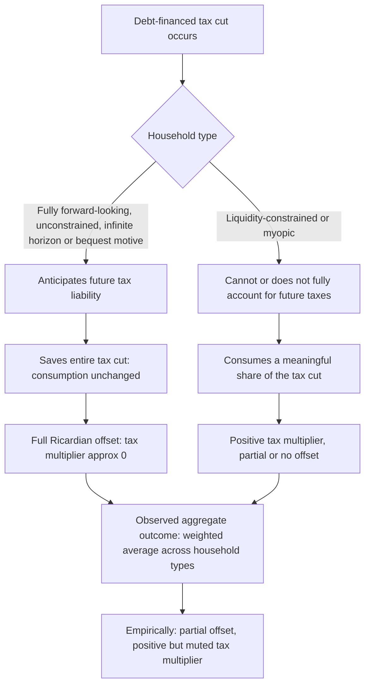

## Ricardian Equivalence Debate Revisited

### Definition and Core Proposition

Ricardian equivalence is the proposition that, under a specific set of idealized conditions, the method of financing a given path of government spending — via current taxation or via debt (future taxation) — has no effect on aggregate consumption or output, because forward-looking households treat government debt as equivalent to deferred taxes and adjust their saving accordingly. The idea traces to David Ricardo's own skeptical discussion of debt-financed war spending, but its modern formalization and defense as a rigorous theoretical proposition is primarily associated with Robert Barro's 1974 paper.

### Formal Argument

Consider a government that cuts current taxes by $\Delta T$, financed by issuing debt $\Delta B = \Delta T$, holding the path of government spending $G$ fixed. The government's intertemporal budget constraint requires that this debt eventually be repaid via higher future taxes, with the present value of future tax increases equal to the current tax cut plus accumulated interest:

$$\Delta T = \frac{\Delta T_{t+1}}{1+r}$$

(in a simple two-period case, where $r$ is the interest rate).

A fully rational, infinitely-lived (or intergenerationally linked via bequests) household recognizes this and treats its **lifetime** budget constraint as unchanged: it saves the entire current tax cut to pay the anticipated future tax liability, leaving current consumption — and therefore aggregate demand — unaffected.

**Key Points**

- Under strict Ricardian equivalence, the tax multiplier for a deficit-financed tax cut is zero: private saving rises one-for-one with the tax cut.
- The proposition implies that the *composition* of government financing (taxes vs. debt) is irrelevant to real economic outcomes; only the *path of government spending* matters for aggregate demand, since spending — not its financing method — is what withdraws resources from the private sector.
- This is a strong theoretical benchmark, not a claim that debt levels are irrelevant to other outcomes (e.g., interest rates, sustainability, or intergenerational distribution) — Ricardian equivalence concerns only the neutrality of the debt/tax financing choice for aggregate demand under the specified assumptions.

### Necessary Conditions for Exact Ricardian Equivalence

**Key Points**

- **Perfect capital markets:** Households can borrow and lend at the same interest rate as the government, so that private and public discounting of future tax liabilities coincide.
- **Rational, forward-looking expectations:** Households correctly anticipate the future tax implications of current deficits.
- **Infinite horizons or operative intergenerational bequest motives:** If households have finite lives, the equivalence requires that they care about the welfare of their descendants (via a bequest motive) enough to internalize tax burdens that fall on future generations, effectively behaving as if they had an infinite planning horizon (Barro's key theoretical contribution linking overlapping generations via bequests).
- **Lump-sum, non-distortionary taxation:** If financing shifts between distortionary tax instruments (e.g., changing marginal income tax rates over time), the equivalence can break down even if the total present value of taxes is unchanged, since the *timing and structure* of distortionary taxes affects economic decisions independent of their present value.
- **No liquidity constraints:** Households must be able to freely adjust saving in response to a tax cut; if constrained, they cannot fully act on Ricardian incentives even if they hold rational expectations.
- **Certainty (or rational expectations under uncertainty) about future tax incidence:** Households must have some basis for anticipating who will bear future taxes and by how much, an assumption that becomes more tenuous under significant policy uncertainty.

### Theoretical Critiques

**Key Points**

- **Finite lifetimes without bequest motives:** If households do not fully value the welfare of future generations, a debt-financed tax cut can raise the current generation's lifetime consumption at the expense of future generations who bear the resulting tax liability — the overlapping-generations (OLG) critique associated with Diamond (1965) and formalized in various life-cycle models, directly challenging the infinite-horizon assumption Barro relies on.
- **Liquidity constraints:** A meaningful share of households face borrowing constraints (cannot borrow against future income at the risk-free rate available to government), so a current tax cut relaxes their constraint and increases current consumption regardless of anticipated future tax liabilities — a widely cited theoretical and empirical challenge to full equivalence.
- **Distortionary taxation:** Since virtually all real-world taxes are distortionary (income, corporate, consumption taxes) rather than lump-sum, the *timing* of taxation affects relative prices (e.g., of labor versus leisure, or of consumption today versus tomorrow) even when the present value of tax liabilities is held constant, breaking strict equivalence.
- **Uncertainty about future tax incidence:** Households may not know with confidence whether, when, or upon whom future taxes will fall (e.g., which future generation, income group, or specific tax instrument will bear the burden), weakening the tight linkage between current deficits and anticipated future tax liability that the theory requires.
- **Myopia and bounded rationality:** Some households may not fully process the intertemporal government budget constraint or may apply high discount rates to distant future tax liabilities, behaving in a more "Keynesian" (non-Ricardian) manner regardless of the underlying fiscal arithmetic.
- **Growth and demographic considerations:** If the economy's population or productivity is growing, the government may be able to service debt indefinitely without ever raising taxes in present-value terms relative to a growing tax base, weakening the direct linkage between a current deficit and a specific anticipated future tax increase.

### Empirical Tests and Evidence

Testing Ricardian equivalence empirically is difficult because it requires distinguishing between a "full offset" (consumption unchanged, saving rises one-for-one with the tax cut) and a "partial offset" (some saving response, but not complete), against a backdrop of many confounding macroeconomic factors.

**Common empirical approaches:**

- **Aggregate consumption/saving regressions:** Testing whether government deficits are associated with higher private saving, controlling for other saving determinants (income, wealth, interest rates, demographics).
- **Natural experiments using tax rebates:** Measuring the marginal propensity to consume out of temporary, debt-financed tax rebates (e.g., one-time stimulus payments), where full Ricardian equivalence predicts an MPC of zero (all saved) and standard Keynesian consumption theory predicts a positive MPC.
- **Cross-country and panel studies:** Comparing saving behavior across countries or time periods with differing fiscal deficit levels, financing structures, and household liquidity-constraint prevalence.

**Key Points**

- The bulk of empirical evidence finds only **partial** Ricardian offset: private saving does rise somewhat in response to debt-financed tax cuts or deficit spending, consistent with some forward-looking behavior, but typically not enough to fully offset the change in consumption predicted under strict equivalence.
- Studies of tax rebate programs generally find a marginal propensity to consume that is positive and economically meaningful, though well below 1, consistent with a mix of Ricardian-type saving behavior and standard non-Ricardian consumption response, plausibly reflecting the mix of liquidity-constrained and unconstrained households in the population.
- The degree of offset appears to vary across countries and time periods, plausibly reflecting differences in the prevalence of liquidity constraints, financial market development, and household expectations about fiscal sustainability, though disentangling these specific causal channels empirically remains difficult and is not fully settled in the literature.
- [Inference] Because full Ricardian equivalence and its complete absence are both testable extreme cases, and most empirical results fall in between, the debate in modern macroeconomics has largely shifted from "is Ricardian equivalence true or false" toward "what share of households behave in a Ricardian manner, and what determines that share" — a more nuanced framing than the original binary theoretical debate.

### Reconciling Theory with New Keynesian and Heterogeneous-Agent Models

Modern macroeconomic modeling has moved toward frameworks that nest both Ricardian and non-Ricardian behavior by explicitly modeling household heterogeneity.

**Key Points**

- **HANK (Heterogeneous Agent New Keynesian) models** explicitly incorporate a distribution of households with varying liquidity positions, some constrained and some unconstrained, generating an aggregate consumption response to fiscal policy that lies between the zero-offset Ricardian benchmark and the full-response simple Keynesian benchmark, depending on the share of constrained ("hand-to-mouth") households in the economy.
- The prevalence of hand-to-mouth households — who consume close to their current income regardless of wealth or future income considerations — has become a central empirical parameter in modern fiscal multiplier analysis, effectively formalizing the liquidity-constraint critique of Ricardian equivalence within a fully specified general-equilibrium model.
- [Inference] The specific quantitative share of hand-to-mouth households used in HANK-type models varies by study and country calibration; this is an actively evolving area of quantitative macroeconomics rather than a single settled parameter value.

### Diagrammatic Summary of the Debate

### Policy Relevance

**Key Points**

- If Ricardian equivalence held exactly, debates over whether to finance a spending program via taxes or debt would be irrelevant to its short-run demand effects, shifting policy debate entirely toward long-run debt sustainability and intergenerational equity considerations.
- Given the empirical finding of only partial offset, most policymakers and forecasters treat debt-financed fiscal stimulus as having a meaningfully positive, though possibly smaller-than-naively-predicted, effect on aggregate demand — a middle-ground practical stance between the strict Ricardian and strict Keynesian extremes.
- The debate remains relevant to discussions of stimulus design: policies targeted at liquidity-constrained households (e.g., transfers to lower-income groups) are generally expected to generate a larger demand response than equivalent tax cuts targeted at higher-income, likely-unconstrained households, precisely because the former face conditions further from the assumptions required for Ricardian behavior.

### Related Topics

- Tax policy and aggregate demand
- Fiscal multipliers: theory and empirical estimates
- Life-cycle and permanent-income hypotheses of consumption
- Overlapping-generations (OLG) models
- Liquidity constraints and hand-to-mouth consumers
- Heterogeneous Agent New Keynesian (HANK) models
- Government debt sustainability and intergenerational equity
- Crowding out versus crowding in