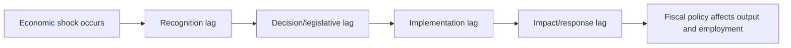

## Fiscal Policy Lags: Recognition, Decision, and Implementation

### Overview

Fiscal policy lags refer to the delays between the emergence of an economic problem (recession, overheating) and the point at which discretionary fiscal policy actually affects aggregate demand. These lags are a central reason discretionary fiscal policy is often considered a blunter, slower stabilization tool than monetary policy or automatic stabilizers, and they help explain why well-intentioned countercyclical fiscal actions can sometimes arrive too late to be effective, or even prove destabilizing if they take effect only after the economy has already begun to recover on its own.

### Taxonomy of Lags

The standard decomposition, following the classic Friedman-style analysis of policy lags, divides the total delay into sequential stages:

$$\text{Total Lag} = \text{Recognition Lag} + \text{Decision Lag} + \text{Implementation Lag} + \text{Impact/Response Lag}$$

### Recognition Lag

The recognition lag is the time between when an economic disturbance actually begins and when policymakers and analysts identify that a problem exists requiring a policy response.

**Key Points**

- Recognition lags arise because macroeconomic data (GDP, employment, output gaps) are collected, processed, and released with a delay, and are frequently revised substantially after initial publication.
- Distinguishing a genuine downturn from normal short-run volatility in noisy data takes time; policymakers must avoid both false positives (reacting to noise) and false negatives (failing to react to a genuine shock).
- Real-time output gap and potential-output estimates — critical inputs for judging whether fiscal stimulus is needed — are particularly prone to significant ex-post revision, meaning policymakers may be acting on a mismeasured picture of the economy's true position in the cycle at the moment a decision is made.
- The recognition lag is common to both fiscal and monetary policy, but its consequences are compounded in fiscal policy by the additional lags that follow (decision and implementation), discussed below.

### Decision (Legislative) Lag

The decision lag is the time required, once a problem is recognized, for policymakers to agree upon, formulate, and formally enact a policy response.

**Key Points**

- In most political systems, discretionary fiscal policy requires legislative approval (budget bills, spending authorizations, tax law changes), a process that can involve committee deliberation, negotiation across branches or chambers of government, and political compromise — all of which take time and are subject to significant uncertainty about final outcomes.
- The decision lag for fiscal policy is generally considered longer and less predictable than for monetary policy, where a central bank committee can often change its policy rate at a scheduled meeting without requiring separate legislative action.
- Political factors — divided government, election cycles, competing legislative priorities, and disagreement over the appropriate size or composition of a fiscal response — can substantially lengthen or even entirely block the decision lag, independent of the underlying economic urgency.
- Some fiscal responses face shorter decision lags than others: temporary emergency measures (e.g., disaster relief) or adjustments within existing programs (which may not require new legislation) can be enacted faster than structural changes to the tax code or new large-scale spending programs.

### Implementation Lag

The implementation lag is the time between a policy's formal enactment and the point at which funds are actually disbursed or tax changes actually take effect in a way that influences private spending decisions.

**Key Points**

- Government spending programs, especially infrastructure investment, often require planning, environmental review, procurement, contracting, and construction phases before funds translate into actual economic activity — a process that can take months to years even after a program is legislated.
- Tax changes can sometimes be implemented relatively quickly (e.g., adjusting withholding tables), but more structural tax reforms may require administrative guidance, compliance system updates, and taxpayer adjustment time before their full behavioral effects are realized.
- Direct transfer payments (e.g., one-time rebate checks, expanded unemployment benefits) generally have among the shortest implementation lags of major fiscal instruments, since they can often be disbursed through existing payment infrastructure relatively soon after legislative authorization.
- "Shovel-ready" infrastructure projects are sometimes specifically sought out during recessions precisely to minimize implementation lag, though the actual availability of genuinely ready-to-execute large-scale projects at short notice is frequently more limited in practice than initially anticipated in policy design.

### Impact/Response Lag

Beyond the lags in enacting and disbursing fiscal policy, there is a further lag in how quickly private-sector behavior (consumption, investment) responds once funds are actually received or tax changes take effect.

**Key Points**

- Under the permanent-income/life-cycle hypothesis, households may spread the consumption response to a given change in income over time rather than adjusting fully upon receipt, particularly if the change is perceived as temporary rather than permanent — lengthening the effective response lag for tax rebates and transfers.
- Firms' investment decisions in response to changed tax incentives (e.g., investment tax credits) may also involve internal planning and capital-budgeting cycles that delay the translation of a policy change into actual capital expenditure.
- This lag interacts with the multiplier process itself: even after the initial fiscal impulse occurs, the full round-by-round multiplier effect on aggregate output accumulates over multiple periods rather than instantaneously.

### Consequences of Long and Variable Lags

**Key Points**

- **Pro-cyclical risk:** If total lags are long relative to the typical duration of a business-cycle downturn, a fiscal stimulus package can end up taking effect only after the economy has already begun to recover on its own, potentially overheating an already-recovering economy rather than counteracting the original downturn — a long-standing critique associated with monetarist skepticism of discretionary fiscal fine-tuning (e.g., Friedman's arguments).
- **Uncertainty compounding:** Because the decision lag in particular is highly variable and difficult to predict in advance (unlike, say, a fixed administrative processing time), policymakers face substantial uncertainty about when — or whether — a proposed fiscal response will actually take effect, complicating real-time economic forecasting and policy design.
- **Comparison with monetary policy:** Monetary policy is generally considered to have a shorter decision lag (a central bank can adjust rates relatively quickly at scheduled or emergency meetings) but potentially a longer and more uncertain impact/transmission lag (since interest-rate changes must work through the financial system and private investment/consumption decisions, which themselves take time), whereas fiscal policy's chief weaknesses tend to concentrate in the decision and implementation stages rather than the final transmission stage.
- **Argument for automatic stabilizers:** Because automatic stabilizers (progressive taxation, unemployment insurance) respond to economic conditions without requiring a new recognition, decision, or implementation lag — they are already embedded in the tax and transfer system and respond mechanically to changes in income and employment — they are frequently cited as a more reliably timed complement or alternative to discretionary fiscal stimulus.

### Comparison Table: Lag Structure by Policy Instrument

| Instrument | Recognition Lag | Decision Lag | Implementation Lag | Overall Speed |
| --- | --- | --- | --- | --- |
| Automatic stabilizers (progressive taxes, UI benefits) | None (mechanical) | None (no new legislation needed) | Minimal (existing infrastructure) | Fastest |
| Direct transfer payments / rebates | Standard | Can be enacted quickly for emergency measures | Short (existing payment systems) | Fast, once decided |
| Tax rate/withholding changes | Standard | Moderate to long (legislative process) | Short to moderate | Moderate |
| Structural tax reform | Standard | Long (complex negotiation) | Moderate to long (administrative adjustment) | Slow |
| Government consumption spending | Standard | Moderate to long | Short to moderate | Moderate |
| Government investment/infrastructure | Standard | Moderate to long | Long (planning, procurement, construction) | Slowest |
| Monetary policy (for comparison) | Standard | Short (scheduled/emergency committee decisions) | Short (immediate rate change) | Fast decision, variable transmission |

### Policy Design Implications

**Key Points**

- Given long and uncertain fiscal lags, policy design increasingly emphasizes automatic stabilizers and pre-legislated "automatic triggers" (rules that activate additional stimulus automatically when specific economic indicators, such as the unemployment rate, cross a pre-set threshold) as a way of reducing reliance on the uncertain discretionary decision lag.
- Some researchers and policymakers have argued for outcome-based fiscal rules (e.g., tied to unemployment targets) rather than purely structural-balance rules, partly on the reasoning that such rules could reduce recognition and decision lag by pre-committing to a response triggered by an observable outcome rather than requiring fresh legislative deliberation each time.
- The choice of fiscal instrument in a stimulus package is frequently informed explicitly by lag considerations: transfer payments and existing-program expansions are often prioritized for their shorter implementation lag relative to new infrastructure programs, even when the latter may have desirable long-run supply-side effects.

### Related Topics

- Automatic stabilizers versus discretionary fiscal policy
- Fiscal multipliers: theory and empirical estimates
- Monetary policy transmission lags (for comparison)
- Output gap measurement and real-time data revision
- Fiscal rules and pre-committed policy triggers
- Government spending composition and effects
- Tax policy and aggregate demand