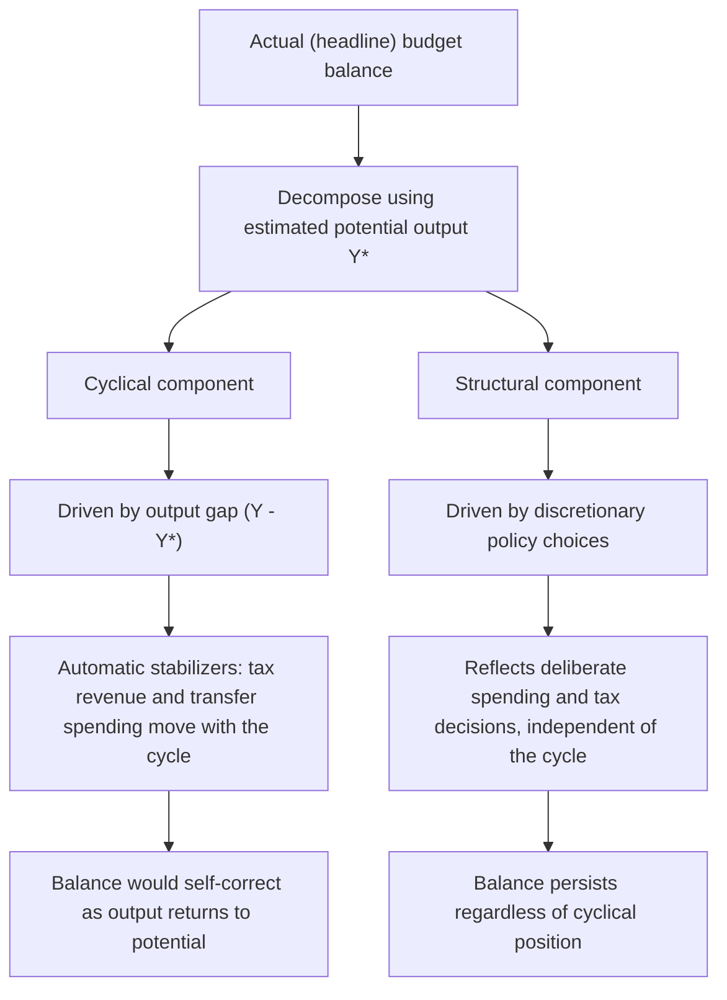

## Structural Versus Cyclical Budget Balance

### Overview

The observed government budget balance in any given year reflects two conceptually distinct components: a **cyclical** component driven by where the economy sits relative to its potential output, and a **structural** component reflecting discretionary policy choices independent of the business cycle. Separating these two components is essential for assessing whether fiscal policy is genuinely tightening or loosening, since the actual (headline) budget balance can move for reasons unrelated to any deliberate policy change.

### Definitions

**Key Points**

- **Actual (headline) budget balance:** The observed difference between total government revenue and expenditure in a given period, $B = T(Y) - G$, which automatically fluctuates with the business cycle even absent any policy change, because tax revenue rises with income and certain expenditures (unemployment benefits) rise as income falls.
- **Cyclical budget balance:** The portion of the actual balance attributable solely to the gap between actual output $Y$ and potential output $Y^*$, operating through automatic stabilizers (progressive taxation, unemployment insurance) rather than discretionary policy action.
- **Structural (cyclically adjusted) budget balance:** The estimated budget balance that would prevail if output were at its potential level $Y^*$, isolating the effect of discretionary policy choices from the mechanical effect of the business cycle on tax revenue and cyclical spending.

$$B_{actual} = B_{structural} + B_{cyclical}$$

### Formal Derivation

A simplified representation of the government balance as a function of the output gap:

$$B(Y) = tY - G - \alpha(Y^* - Y)$$

where $t$ is the average tax rate, $G$ is discretionary spending, and $\alpha$ captures cyclical spending sensitivity (e.g., unemployment benefits rising as $Y$ falls below $Y^*$).

The **cyclical component** is typically estimated as:

$$B_{cyclical} = \varepsilon \cdot (Y - Y^*)$$

where $\varepsilon$ is the budget's estimated sensitivity to the output gap (combining both the tax-revenue elasticity and the automatic-spending elasticity with respect to the output gap), often estimated empirically by national fiscal authorities and international institutions (e.g., the IMF, OECD, and European Commission each publish their own estimated sensitivity parameters and methodologies).

The **structural component** is then the residual:

$$B_{structural} = B_{actual} - B_{cyclical}$$

### Why the Distinction Matters

**Key Points**

- A government running a large deficit purely because the economy is in recession (high cyclical deficit, automatic stabilizers pushing revenue down and spending up) is in a very different fiscal position than a government running the same headline deficit through discretionary overspending during a boom (structural deficit) — the former is expected to shrink automatically once the economy recovers, while the latter reflects a genuine, non-self-correcting policy stance.
- The structural balance is widely used as the appropriate metric for assessing the *stance* of discretionary fiscal policy, since the headline balance conflates policy choices with automatic, cycle-driven fluctuations that are not under the direct discretionary control of current policymakers.
- The **change** in the structural balance from one period to the next (the "fiscal impulse") is often used as a summary measure of whether fiscal policy is actively expansionary or contractionary in a given year, independent of where the economy happens to sit in the business cycle.
- Automatic stabilizers cause the cyclical balance to move countercyclically without any new legislative action: deficits widen automatically in recessions (revenue falls, transfer spending rises) and narrow automatically in expansions — a stabilizing, unlegislated fiscal response distinct from discretionary structural policy changes.

### The Output Gap and Potential Output Estimation

Estimating the structural balance requires an estimate of potential output $Y^*$ and the corresponding output gap $(Y - Y^*)$, which is itself unobservable and must be estimated using statistical or model-based methods (e.g., production function approaches, Hodrick-Prescott or other statistical filters, or structural macroeconomic models).

**Key Points**

- Potential output and output gap estimates are subject to substantial real-time uncertainty and are frequently revised significantly after the fact as more data become available, meaning structural balance estimates computed in real time can differ meaningfully from later, revised estimates of the same historical period.
- Different institutions (national treasuries, the IMF, the OECD, the European Commission) often use different methodologies and can produce materially different structural balance estimates for the same country and year, complicating direct comparison and, at times, complicating compliance assessment under fiscal rules that reference structural balance targets.
- Cárdenas et al. and related work have argued that potential output and cyclically adjusted primary balance estimates used by some European institutions can be systematically higher than warranted, creating what these authors describe as an overly restrictive constraint on countries' genuinely available fiscal space; this represents one perspective within an ongoing methodological and policy debate rather than a universally accepted conclusion.

### Diagrammatic Decomposition

### Structural Balance and Fiscal Rules

Many countries and supranational bodies (notably the European Union's fiscal framework) have adopted fiscal rules expressed in terms of the structural balance rather than the headline balance, precisely to avoid penalizing (or rewarding) governments for cyclical fluctuations outside their direct discretionary control.

**Key Points**

- Structural-balance-based fiscal rules aim to allow automatic stabilizers to operate freely (letting the headline deficit widen in a recession without being judged as a rule violation) while still constraining discretionary policy choices.
- Critics have argued that the specific methodology used to estimate potential output and the structural balance under such rules can produce inaccurate or overly conservative estimates of a country's genuine fiscal space, particularly for economies where potential output itself may be depressed by prior downturns (hysteresis effects), a concern raised prominently in debates over the design and calibration of the EU's fiscal rules.
- Some economists and policymakers have proposed shifting toward fiscal rules anchored more directly to observable outcomes — such as unemployment rate targets — rather than to a structural balance computed from a contested and revision-prone potential-output estimate, arguing this could reduce the risk of an inaccurate constraint on fiscal space while still preserving meaningful discipline on discretionary policy.
- [Inference] The relative merits of outcome-based versus structural-balance-based fiscal rules remain an active and unsettled area of policy debate; the summary above reflects the range of positions found in the literature rather than a single settled conclusion.

### Primary Balance vs. Overall Balance

A related distinction, often combined with the structural/cyclical decomposition, separates the **primary balance** (revenue minus non-interest expenditure) from the **overall balance** (which also subtracts interest payments on existing debt):

$$\text{Primary Balance} = T - G_{non-interest}$$

$$\text{Overall Balance} = \text{Primary Balance} - \text{Interest Payments}$$

**Key Points**

- The **cyclically adjusted primary balance (CAPB)** — combining both adjustments — is a commonly used summary metric in fiscal sustainability analysis, isolating the balance attributable to current discretionary non-interest spending and tax policy, net of both the business cycle and the (largely predetermined, backward-looking) burden of servicing existing debt.
- Changes in the CAPB from year to year are frequently used by researchers (including in the fiscal multiplier identification literature) as a measure of discretionary fiscal policy shocks, since it strips out both cyclical and interest-payment effects that are not representative of a fresh policy decision.

### Summary Comparison

| Concept | Driven By | Behavior in a Recession | Policy Relevance |
| --- | --- | --- | --- |
| Actual (headline) balance | Both cycle and discretionary policy | Deteriorates (both cyclical and possibly structural effects) | Reflects overall fiscal outcome, not policy stance alone |
| Cyclical balance | Output gap, automatic stabilizers | Deteriorates automatically, no new legislation required | Expected to self-correct as the cycle turns |
| Structural balance | Discretionary policy choices | Unchanged by the cycle itself | Primary metric for assessing fiscal policy stance |
| Primary balance | Revenue minus non-interest spending | Can be cyclical or structural | Used in debt-sustainability analysis |
| Cyclically adjusted primary balance (CAPB) | Discretionary non-interest policy, net of cycle | Isolates discretionary stance | Common measure of fiscal policy shocks in empirical research |

### Related Topics

- Automatic stabilizers versus discretionary fiscal policy
- Potential output and output gap estimation
- Fiscal rules and debt sustainability
- Fiscal multipliers: theory and empirical estimates
- Fiscal policy lags: recognition, decision, and implementation
- Government debt dynamics and sustainability analysis
- Hysteresis effects on potential output