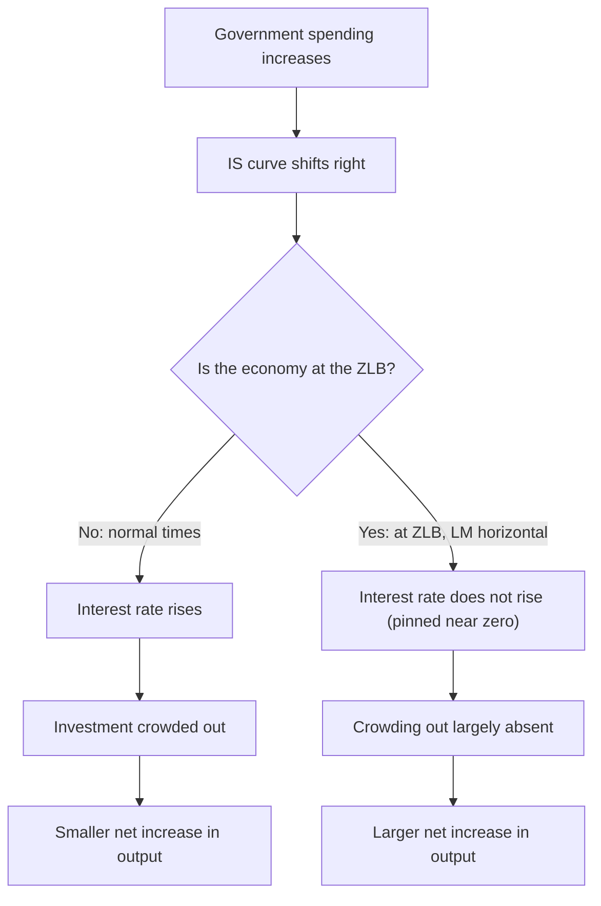

## Fiscal Policy at the Zero Lower Bound

### Definition of the Zero Lower Bound

The zero lower bound (ZLB) refers to the constraint that nominal interest rates cannot fall meaningfully below zero, since holding physical cash offers a zero-nominal-return alternative to holding interest-bearing assets. When a central bank's policy rate reaches (or approaches) zero, conventional interest-rate-based monetary policy loses its ability to further stimulate demand through additional rate cuts, fundamentally altering the macroeconomic environment in which fiscal policy operates.

**Key Points**

- The ZLB is sometimes referred to as the "effective lower bound" (ELB) in more recent literature, reflecting the empirical observation that some central banks have implemented modestly negative nominal rates, meaning the true constraint may sit slightly below exactly zero rather than at precisely zero. [Inference] The exact effective lower bound level varies by country and financial system structure and is not a single universal constant.
- At the ZLB, the LM curve in the IS-LM framework becomes horizontal (or near-horizontal) over the relevant range, since the central bank cannot lower the policy rate further to accommodate additional money demand.

### Why the ZLB Changes Fiscal Policy's Effectiveness

In the standard closed-economy IS-LM model away from the ZLB, fiscal expansion raises the interest rate, which crowds out private investment (interest-rate crowding out), and in the open-economy Mundell-Fleming extension, can additionally trigger currency appreciation that crowds out net exports. At the ZLB, this offsetting mechanism is substantially weakened.

**Transmission at the ZLB:**

1. Government spending increases (or taxes fall), shifting the IS curve rightward.
2. Because the LM curve is horizontal at the ZLB, the equilibrium interest rate does not rise in response to the higher money demand generated by increased output.
3. With the interest rate pinned at (or near) zero, the usual crowding-out channel through higher borrowing costs is largely absent.
4. The fiscal expansion's effect on output is transmitted with little offset, implying a larger fiscal multiplier than in normal times.

**Key Points**

- This mechanism is the primary theoretical reason that fiscal multipliers are generally predicted, and often empirically estimated, to be larger during ZLB episodes than during normal monetary policy conditions.
- A synthesis of the empirical fiscal multiplier literature finds that estimates are generally larger during periods of economic slack and at the zero lower bound, consistent with this theoretical prediction of muted crowding out.
- Some studies examining fiscal multipliers under accommodative or unconventional monetary policy conditions (which frequently coincide with ZLB episodes) have found substantially larger multipliers, in a range as high as roughly 1.7 to 5 across a panel of OECD countries, reflecting strong positive interaction between expansionary fiscal policy and an accommodative monetary stance.

### Monetary Policy Becomes Constrained, Not Absent

**Key Points**

- The ZLB does not mean monetary policy becomes entirely powerless; central banks can and do employ unconventional tools — quantitative easing (large-scale asset purchases), forward guidance (commitments about the future path of policy), and in some cases negative interest rate policy — to continue providing some stimulus even after the conventional policy rate reaches zero.
- However, these unconventional tools are generally considered less predictable and potentially less powerful, unit-for-unit, than conventional interest-rate policy away from the ZLB, which is a key reason the burden of stabilization is often argued to shift more heavily toward fiscal policy during ZLB episodes.
- Because conventional monetary policy cannot further lower rates to offset a demand shortfall, and because unconventional tools face greater uncertainty about their transmission and effectiveness, this creates an argument, made by many economists and policymakers, for more active discretionary fiscal policy specifically during ZLB periods, when monetary policy's usual stabilization role is impaired.

### Government Spending Multiplier at the ZLB: Theoretical Models

New Keynesian models with an explicit ZLB constraint (e.g., models building on Christiano, Eichenbaum, and Rebelo-style analysis) formalize this mechanism by imposing a constraint that the nominal interest rate cannot fall below zero, combined with a monetary policy rule (e.g., a Taylor rule) that would otherwise call for a negative rate during a sufficiently large demand shortfall.

**Key Points**

- In these models, when the ZLB constraint binds, the government spending multiplier can exceed 1, and in some calibrations substantially so, because the interest-rate crowding-out channel that operates away from the ZLB is switched off by the binding zero constraint.
- Some New Keynesian ZLB models additionally emphasize a **deflationary spiral risk**: if a demand shortfall pushes inflation expectations down while the nominal rate is pinned at zero, the *real* interest rate can actually rise (since real rate = nominal rate minus expected inflation), worsening rather than easing the recession — a mechanism through which fiscal stimulus, by supporting demand and inflation expectations, can have an amplified stabilizing role at the ZLB relative to normal times.
- [Inference] The precise magnitude of ZLB multipliers produced by these models is highly sensitive to model calibration, the assumed monetary policy rule, and the assumed duration of the ZLB episode; published estimates vary considerably and should not be treated as a single settled number.

### Historical Context and Applications

**Key Points**

- Discussions of the ZLB and its implications for fiscal policy gained substantial renewed prominence following the 2008 global financial crisis, when many major central banks (the U.S. Federal Reserve, the Bank of Japan, the European Central Bank, and others) held policy rates at or near zero for extended periods.
- Blanchard and Leigh's analysis found that fiscal multipliers, especially during the downturn following the 2008 crisis, were larger than had been assumed by policymakers designing fiscal consolidation programs at the time, an argument frequently cited in the broader debate over the appropriate pace of post-crisis fiscal austerity given the constrained state of monetary policy.
- The COVID-19 pandemic represented another period in which many economies faced ZLB or near-ZLB conditions alongside a severe demand shortfall, contributing to a substantial surge in both fiscal policy responses and in academic research studying fiscal multipliers, with more than half of a large sample of fiscal-multiplier journal articles reviewed in a recent bibliometric study having been published in the 2020–2023 period alone.
- Japan's experience with persistently near-zero interest rates from the 1990s onward is frequently cited as an early and prolonged real-world case relevant to ZLB fiscal policy discussions, though drawing precise multiplier estimates from any single country's historical experience requires care given the many other country-specific factors involved. [Unverified] Specific numerical multiplier estimates attributed to the Japanese experience vary substantially by study and are not restated here as a single figure.

### Complications and Caveats

**Key Points**

- **Debt sustainability concerns:** Larger fiscal expansion at the ZLB, even if effective at raising output in the short run, still adds to government debt, and the interaction between debt sustainability concerns and ZLB-era fiscal multipliers remains a live area of both theoretical and policy debate — some argue that low borrowing costs during ZLB periods make debt-financed stimulus relatively cheap, while others emphasize longer-run sustainability risk regardless of the current low-rate environment.
- **Exit dynamics:** Fiscal expansion undertaken during a ZLB episode raises questions about the appropriate pace of subsequent fiscal consolidation once the economy recovers and the ZLB constraint no longer binds, since multipliers (and the risk of crowding out) are expected to change once conventional monetary policy space is restored.
- **State-dependence uncertainty in real time:** Because determining whether — and for how long — an economy will remain at the ZLB involves the same real-time recognition-lag and forecasting uncertainty discussed generally in fiscal policy lag analysis, policymakers may not know with confidence, at the moment a fiscal decision is made, whether the economy will still be at the ZLB by the time the policy takes effect.
- **Distortionary versus non-distortionary financing:** As in the general Ricardian equivalence debate, the degree to which ZLB-era fiscal expansion is offset by private saving still depends on the same household behavioral assumptions (liquidity constraints, forward-looking behavior) discussed in that broader theoretical debate; the ZLB primarily affects the interest-rate crowding-out channel, not household saving responses to anticipated future taxation.

### Comparison: Fiscal Policy Effectiveness, Normal Times vs. ZLB

| Feature | Normal Times (Away from ZLB) | At the Zero Lower Bound |
| --- | --- | --- |
| LM curve slope | Upward sloping | Horizontal (or near-horizontal) |
| Interest-rate response to fiscal expansion | Rises | Little to no change |
| Interest-rate crowding out of investment | Present, can be substantial | Largely absent |
| Monetary policy offset capacity | Full (rate cuts available) | Constrained (conventional tool exhausted) |
| Expected fiscal multiplier | Smaller (partial crowding out) | Larger (crowding out muted) |
| Role of unconventional monetary tools | Typically not needed | QE, forward guidance may supplement fiscal action |
| Deflationary spiral risk | Limited | Present in some model specifications |

### Related Topics

- Fiscal multipliers: theory and empirical estimates
- Crowding out versus crowding in
- The IS-LM model and monetary policy effects
- Unconventional monetary policy (quantitative easing, forward guidance)
- New Keynesian models and the Taylor rule
- Government debt sustainability and low-interest-rate environments
- Fiscal policy lags: recognition, decision, and implementation