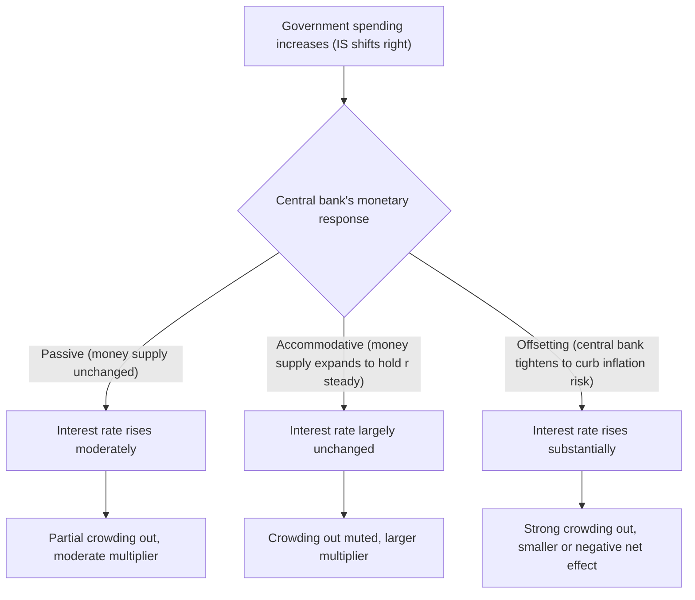

## Fiscal-Monetary Policy Interactions and Coordination

### Overview

Fiscal and monetary policy do not operate independently: each affects the macroeconomic environment in which the other acts, and their combined stance jointly determines the ultimate impact on output, inflation, and interest rates. Understanding how these two arms of stabilization policy interact — whether they reinforce, offset, or actively coordinate with one another — is essential for interpreting observed macroeconomic outcomes and for evaluating alternative policy mixes.

### The Basic Interaction Channel: IS-LM Perspective

In the standard IS-LM framework, fiscal policy shifts the IS curve while monetary policy shifts the LM curve. The final equilibrium — and hence the ultimate division of any demand impulse between output and interest-rate changes — depends jointly on both curves' positions, meaning fiscal policy's effectiveness cannot be evaluated in isolation from the prevailing monetary stance.

**Key mechanisms of interaction:**

- **Monetary accommodation of fiscal expansion:** If the central bank holds the money supply (and hence the LM curve) fixed while government spending shifts IS rightward, the resulting interest-rate increase produces partial crowding out of private investment. If instead the central bank accommodates the fiscal expansion by increasing the money supply to hold the interest rate steady, crowding out is muted or eliminated, and the fiscal multiplier is correspondingly larger.
- **Monetary offset of fiscal expansion:** If the central bank actively tightens policy in response to a fiscal expansion (e.g., raising rates to counteract expected inflationary pressure from the fiscal stimulus), the resulting increase in $r$ can crowd out private spending by more than would occur under a passive, non-responsive monetary stance, potentially substantially reducing or even reversing the net effect of the fiscal action on output.
- **Fiscal support for monetary policy at the ZLB:** When the central bank's conventional policy rate is constrained near zero, monetary policy loses its ability to further lower rates in response to a demand shortfall, and the interest-rate-based crowding-out channel that normally limits fiscal multipliers is largely absent, meaning fiscal policy's marginal effectiveness rises precisely when monetary policy's marginal effectiveness is most constrained.

### The Policy Mix: Four Combinations

Combining the direction of fiscal policy (expansionary/contractionary) with the direction of monetary policy (expansionary/contractionary) generates four canonical policy-mix scenarios, each with distinct implications for output, the interest rate, and the composition of GDP.

| Policy Mix | Effect on Output | Effect on Interest Rate | Effect on Investment Share of GDP |
| --- | --- | --- | --- |
| Fiscal expansion + Monetary expansion | Rises (reinforcing) | Ambiguous (depends on relative magnitude of shifts) | Ambiguous |
| Fiscal expansion + Monetary contraction | Ambiguous (offsetting forces) | Rises | Falls (strong crowding out) |
| Fiscal contraction + Monetary expansion | Ambiguous (offsetting forces) | Falls | Rises (crowding in) |
| Fiscal contraction + Monetary contraction | Falls (reinforcing) | Ambiguous | Ambiguous |

**Key Points**

- When fiscal and monetary policy move in the same direction, their effects on output reinforce one another, though the net effect on the interest rate becomes ambiguous since IS and LM are shifting simultaneously in ways that can offset each other's interest-rate implications.
- When fiscal and monetary policy move in opposite directions, the net effect on output becomes ambiguous (depending on the relative magnitude of the two shifts), while the effect on the interest rate becomes unambiguous, since both policies push the interest rate in the same direction in these "opposing" cases.
- This type of combined analysis has historically been used to characterize observed episodes of divergent fiscal and monetary stances, such as periods combining fiscal tightening with monetary easing, or vice versa, though attributing any specific historical episode to a particular deliberate policy-mix strategy requires care and is a matter for economic-history analysis rather than a general theoretical claim. [Unverified] Specific historical attributions of policy-mix choices to particular governments or central banks are outside the scope of this general framework and should be verified against dedicated economic-history sources.

### Central Bank Independence and Coordination

**Key Points**

- Most modern advanced-economy central banks operate with a significant degree of institutional independence from the fiscal authority, meaning monetary policy decisions are generally not directly dictated by, or explicitly coordinated with, the government's fiscal choices in real time — a design intended to prevent fiscal considerations (e.g., a government's incentive to keep borrowing costs low) from compromising the central bank's price-stability mandate.
- Despite formal independence, monetary policymakers still must account for the prevailing and expected fiscal stance when setting policy, since the aggregate demand and inflationary effects of fiscal policy are a direct input into the macroeconomic outlook the central bank is responding to — meaning interaction occurs even without explicit coordination or joint decision-making.
- Some economists have specifically argued for greater fiscal-monetary policy coordination during crisis periods, particularly at the zero lower bound, when monetary policy alone may be insufficiently powerful to address a severe demand shortfall, framing closer coordination (rather than fully independent, potentially conflicting policy stances) as more likely to achieve stabilization objectives during such episodes. Uxó et al. and related contributions have argued that fiscal rules focused on outcome-based targets such as unemployment, rather than solely on reducing structural fiscal balances, could better support the kind of fiscal space needed for effective coordination with monetary policy during downturns. This represents one specific position within an active policy debate, not a settled consensus.
- **Fiscal dominance** describes a scenario in which the fiscal authority's financing needs constrain or override the central bank's ability to pursue its own independent price-stability objective (for example, if a central bank feels compelled to keep interest rates low specifically to limit government interest costs or prevent debt-sustainability concerns, rather than purely in response to its inflation and output objectives). [Inference] The degree to which fiscal dominance concerns apply to any specific contemporary economy is a matter of ongoing analysis and disagreement among economists and should not be treated as an established fact about any named country without checking current, country-specific analysis.

### Coordination Under Unconventional Monetary Policy

Research examining fiscal multipliers in the presence of unconventional monetary policy (such as large-scale asset purchases undertaken alongside fiscal expansion) has found that, under sufficiently accommodative monetary conditions, the fiscal multiplier can be substantially amplified. Studies of this kind across a panel of 17 OECD countries found multipliers ranging between roughly 1.7 and 5 under accommodative monetary conditions, underscoring a significant positive interaction between fiscal and unconventional monetary interventions — considerably above the roughly 0.5-to-0.9 range often cited as typical for fiscal multipliers in more normal monetary-policy conditions.

**Key Points**

- This amplification is generally attributed to the muting of the interest-rate crowding-out channel when the central bank is simultaneously expanding its balance sheet and holding rates low, reinforcing rather than offsetting the fiscal impulse.
- Some analysis in this literature has also raised concerns that certain formal fiscal rules — such as structural-balance-based rules common in some supranational frameworks — may not fully account for these amplified multiplier effects during periods of accommodative monetary policy, potentially constraining fiscal space in ways that limit the kind of fiscal-monetary coordination that would otherwise be most effective during such episodes, particularly for economies where fiscal policy has proven especially potent in stimulating growth under these conditions.
- [Inference] The specific multiplier ranges reported in any given study are sensitive to the countries, time period, and monetary policy episodes included in the sample, and should be understood as estimates from a particular body of research rather than universal constants applicable to all accommodative-monetary-policy episodes.

### Coordination Risks and Trade-offs

**Key Points**

- **Inflation risk:** Excessive coordination toward a jointly expansionary fiscal-monetary stance, particularly if sustained beyond the point warranted by economic slack, carries the risk of generating excess aggregate demand and inflationary pressure, a standard concern raised whenever policy coordination is discussed as a stabilization tool.
- **Credibility and independence concerns:** Explicit, ongoing coordination between fiscal and monetary authorities can raise concerns about central bank independence and the credibility of its inflation-fighting commitment, since markets and the public may come to expect monetary policy to systematically accommodate fiscal financing needs rather than pursue its price-stability mandate independently.
- **Time-inconsistency considerations:** A central bank perceived as likely to accommodate future fiscal expansions may face a credibility problem in convincing markets and the public that it will act to control inflation if fiscal pressures intensify, a version of the broader time-inconsistency problem studied in monetary policy credibility theory.
- **Debt sustainability interactions:** Coordinated low-interest-rate, high-fiscal-expansion policy mixes can, in the near term, ease debt-servicing costs and support demand, but they also raise longer-run questions about debt sustainability and the eventual difficulty of normalizing both fiscal and monetary policy simultaneously once the underlying economic shock has passed.

### Summary: When Coordination Matters Most

**Key Points**

- Fiscal-monetary interaction is most consequential, and coordination arguments are most frequently raised, during severe demand shortfalls when monetary policy faces the zero lower bound constraint, since this is precisely when conventional monetary tools are least able to independently stabilize the economy and fiscal policy's marginal effectiveness is theoretically largest.
- During normal times, away from the ZLB, the standard IS-LM crowding-out analysis suggests that the two arms of policy can and often do operate somewhat independently, with monetary policy generally retaining the capacity to offset or accommodate fiscal actions as needed to maintain its own inflation and output objectives.
- The empirical range of multiplier estimates in the literature — with higher multipliers found under accommodative monetary conditions and during economic slack, and lower multipliers found in high-public-debt regimes — is consistent with the theoretical prediction that the fiscal-monetary policy mix, not fiscal policy alone, ultimately determines the realized macroeconomic impact of any given fiscal action.

### Related Topics

- The IS-LM model and monetary policy effects
- Fiscal policy at the zero lower bound
- Crowding out versus crowding in
- Fiscal multipliers: theory and empirical estimates
- Central bank independence and monetary policy credibility
- Fiscal dominance and debt sustainability
- Unconventional monetary policy (quantitative easing, forward guidance)
- Structural versus cyclical budget balance and fiscal rules