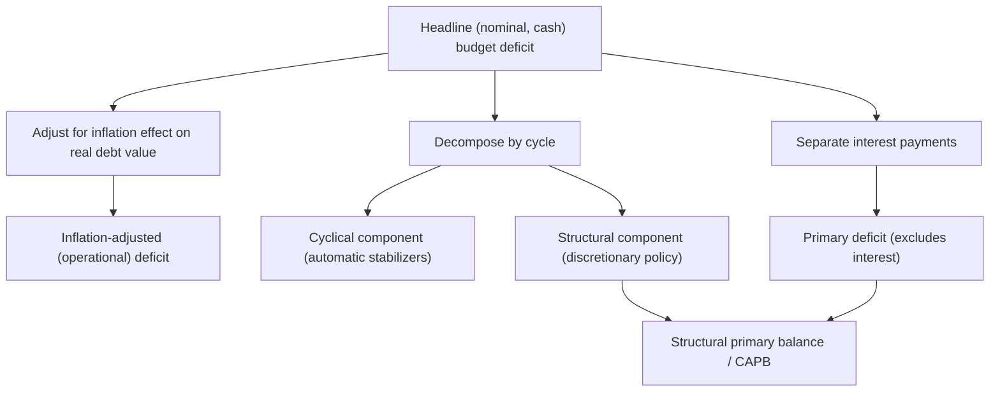

## Measuring Budget Deficits and Public Debt

### Overview

Accurately measuring government budget deficits and public debt is more conceptually and practically complex than it first appears. Different measurement conventions — nominal versus real, gross versus net, headline versus structural, and differing accounting treatments across countries — can produce meaningfully different pictures of a government's fiscal position from the same underlying economic reality, which matters greatly for cross-country comparison, sustainability analysis, and policy design.

### Basic Definitions

**Key Points**

- **Budget deficit (flow concept):** The excess of government expenditure over revenue in a given period, typically a fiscal year: $\text{Deficit}_t = G_t - T_t$. A negative deficit (revenue exceeding expenditure) is a **surplus**.
- **Public debt (stock concept):** The cumulative sum of past deficits (net of any surpluses), representing the total outstanding stock of government liabilities at a point in time: $D_t = D_{t-1} + \text{Deficit}_t$ (abstracting from valuation effects, discussed below).
- The deficit is a **flow** (measured per period, e.g., per year), while debt is a **stock** (measured at a point in time); this distinction is analogous to the difference between income and wealth for a household, and confusing the two is a common source of error in public discussion of fiscal issues.

### The Government Budget Constraint

The evolution of debt over time follows from the government's period-by-period budget identity:

$$D_t = (1+i)D_{t-1} + G_t - T_t$$

where $i$ is the nominal interest rate on outstanding debt, $G_t$ is non-interest (primary) spending, and $T_t$ is revenue.

Dividing through by nominal GDP and expressing in ratio form (a standard approach for cross-country and cross-time comparability) yields the debt-dynamics equation, commonly expressed as:

$$\frac{D_t}{Y_t} - \frac{D_{t-1}}{Y_{t-1}} \approx (i - g)\frac{D_{t-1}}{Y_{t-1}} - pb_t$$

where $g$ is the nominal GDP growth rate and $pb_t$ is the primary balance (surplus) as a share of GDP.

**Key Points**

- The term $(i-g)$ — the gap between the interest rate on debt and the economy's growth rate — is central to debt sustainability analysis: if $i > g$, the debt-to-GDP ratio tends to rise automatically unless offset by a sufficiently large primary surplus; if $g > i$, the economy can "outgrow" its debt even while running modest primary deficits.
- Expressing debt and deficits as a **ratio to GDP** rather than in absolute nominal terms is the standard convention for meaningful comparison across countries of different sizes and across time periods with different price levels, since a given absolute deficit or debt figure means something very different for a small economy than a large one.

### Nominal vs. Real Deficit Measurement

**Key Points**

- The **nominal deficit** is measured in current-dollar terms without adjusting for inflation's effect on the real value of outstanding debt.
- The **inflation-adjusted (or "operational") deficit** corrects for the fact that inflation erodes the real value of nominal debt, effectively transferring real resources from bondholders to the government; failing to account for this can overstate the government's true fiscal deterioration during high-inflation periods, since part of the nominal interest payment merely compensates lenders for expected inflation rather than representing a real resource transfer.
- This distinction is particularly significant during periods of high or volatile inflation, when the nominal deficit and the inflation-adjusted deficit can diverge substantially, and is a standard adjustment applied in more rigorous fiscal sustainability analysis.

### Gross vs. Net Debt

**Key Points**

- **Gross debt** measures total government liabilities outstanding, without netting out any financial assets the government holds (e.g., foreign exchange reserves, government-owned equity stakes, loans made by the government to other entities).
- **Net debt** subtracts government-held financial assets from gross liabilities, providing a measure more closely aligned with the government's true net financial position, though data availability and valuation practices for government assets vary considerably across countries, making net debt comparisons less standardized internationally than gross debt comparisons.
- International institutions (such as the IMF) often report both measures, and the appropriate choice between them depends on the specific analytical question — gross debt is more relevant for assessing total financing/rollover needs, while net debt is more relevant for assessing the government's overall balance-sheet position.
- **Intragovernmental holdings:** In some countries, a portion of gross debt is held by other parts of government (e.g., a social insurance trust fund holding government bonds), which some analysts argue should be excluded or treated differently from debt held by the public, since it does not represent a claim by external private creditors on future government resources in the same way as debt held externally.

### Deficit and Debt Accounting Conventions

**Key Points**

- **Cash accounting** records revenue and expenditure when cash actually changes hands, while **accrual accounting** records transactions when the underlying economic obligation is incurred, regardless of when cash flows occur; these two approaches can produce different deficit figures in a given year, particularly for large, lumpy transactions (e.g., pension obligations, loan guarantees) whose cash and accrual timing diverge.
- **Off-budget items and contingent liabilities:** Guarantees, public-private partnership obligations, and other contingent liabilities may not appear in headline deficit and debt figures at all unless and until they are triggered, meaning conventional debt statistics can understate a government's true long-run fiscal exposure if such items are large relative to the reported figures.
- **Unfunded liabilities:** Future obligations under pay-as-you-go social insurance programs (public pensions, health entitlements) are generally not included in conventional debt statistics, even though they represent a form of long-run fiscal commitment; separate long-run actuarial or generational-accounting analyses are typically used to assess this dimension of fiscal sustainability, since it falls outside standard deficit/debt measurement conventions.
- **Valuation effects on debt held in foreign currency:** For governments with debt denominated in foreign currencies, exchange-rate fluctuations can change the domestic-currency value of outstanding debt without any new borrowing or repayment having occurred, a stock-revaluation effect distinct from the flow of new deficits.

### Structural, Cyclical, and Primary Measures Applied to Deficit Analysis

**Key Points**

- As with the general structural-versus-cyclical decomposition, headline deficit figures reflect both automatic cyclical movements (tax revenue falling and cyclical spending rising in a downturn) and discretionary structural policy choices; separating these components is essential for judging whether a given year's deficit reflects a genuine change in fiscal stance or simply the economy's position in the business cycle.
- The **primary deficit** (excluding interest payments) isolates the portion of the deficit attributable to current non-interest spending and revenue decisions, separate from the burden of servicing previously accumulated debt — a useful distinction since interest payments on existing debt are largely predetermined by past borrowing decisions and prevailing interest rates, not current-year discretionary choices.
- The **cyclically adjusted primary balance (CAPB)** combines both adjustments and is frequently used as a summary indicator of the current discretionary fiscal stance, net of both the business cycle and legacy interest obligations.

### Measuring the Debt Stock: Additional Complications

**Key Points**

- **Market value vs. face value of debt:** Outstanding government bonds can be measured at their original face (par) value or at current market value, which fluctuates with interest rates and credit conditions; most standard debt statistics use face value, but market-value measures can matter for certain analytical purposes (e.g., assessing the true cost of debt buybacks or restructuring).
- **Debt-to-GDP ratio measurement sensitivity:** Because this widely used ratio has both a debt numerator and a GDP denominator, its movement over time reflects not only new borrowing but also changes in nominal GDP (from both real growth and inflation, and from GDP revisions), meaning apparent changes in the ratio can sometimes reflect denominator effects (a growing or shrinking economy) rather than genuine changes in fiscal policy or new borrowing.
- **Cross-country statistical conventions:** Different countries and international statistical systems (e.g., the IMF's Government Finance Statistics framework versus national accounting standards) can classify certain transactions differently (e.g., whether particular state-owned enterprise liabilities count as government debt), meaning cross-country debt comparisons require care regarding the specific definitional and methodological basis being used.

### Summary Comparison of Key Measurement Concepts

| Concept | What It Measures | Key Adjustment or Distinction |
| --- | --- | --- |
| Headline (nominal) deficit | Cash-basis revenue minus expenditure, current period | Baseline flow measure |
| Inflation-adjusted deficit | Deficit net of inflation's erosion of real debt value | Corrects for inflation-driven overstatement |
| Primary deficit | Deficit excluding interest payments | Isolates current discretionary decisions from legacy debt service |
| Cyclically adjusted (structural) deficit | Deficit at estimated potential output | Isolates discretionary policy from automatic cyclical effects |
| Cyclically adjusted primary balance (CAPB) | Combines both adjustments above | Summary measure of discretionary fiscal stance |
| Gross debt | Total outstanding government liabilities | Does not net out government-held financial assets |
| Net debt | Gross debt minus government-held financial assets | Reflects overall net financial position |
| Debt-to-GDP ratio | Debt stock relative to economic size | Sensitive to both numerator (borrowing) and denominator (growth, inflation) movements |

### Why Measurement Choices Matter for Policy

**Key Points**

- The choice of measurement convention can materially affect whether a country appears to be complying with a given fiscal rule (e.g., a structural-balance-based rule versus a headline-deficit rule), meaning debates over fiscal policy compliance sometimes hinge as much on measurement methodology as on the underlying substance of the policy choice.
- Cross-country comparisons of debt or deficit levels that do not carefully account for differing gross/net conventions, accrual/cash accounting, or statistical classification practices can produce misleading rankings or conclusions about relative fiscal positions.
- Because potential output, and hence the structural/cyclical decomposition, is subject to substantial real-time estimation uncertainty and later revision, structural deficit figures computed at the time a policy decision is made can differ meaningfully from later, revised assessments of the same period — a consideration relevant to both policymakers and analysts interpreting real-time fiscal data.

### Related Topics

- Structural versus cyclical budget balance
- Government debt dynamics and sustainability analysis
- Debt-to-GDP ratio and the growth-interest rate gap
- Fiscal rules and compliance methodology
- Contingent liabilities and off-budget fiscal risk
- Cross-country fiscal statistics (IMF Government Finance Statistics)
- Unfunded liabilities and generational accounting