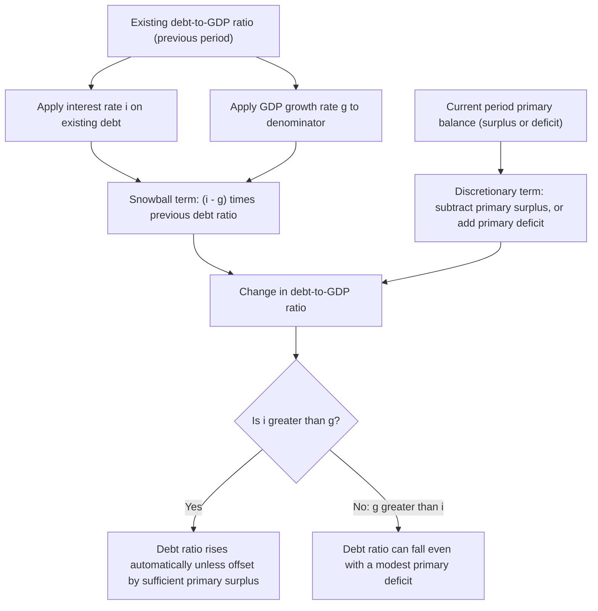

## Debt Dynamics and the Debt-to-GDP Ratio Equation

### Overview

The debt-to-GDP ratio is the standard summary metric for assessing a government's fiscal position relative to the size of its economy. Its evolution over time is governed by a well-defined dynamic equation linking the interest rate on debt, the economy's growth rate, and the primary budget balance. Understanding this equation is central to debt sustainability analysis, since it clarifies precisely which variables drive the ratio's rise or fall and under what conditions a given fiscal stance is sustainable indefinitely versus explosive.

### Deriving the Debt Dynamics Equation

Start from the government's nominal budget identity, where debt grows by the interest owed on existing debt plus the new primary deficit:

$$D_t = (1+i)D_{t-1} + PD_t$$

where $D_t$ is nominal debt at the end of period $t$, $i$ is the nominal interest rate on debt, and $PD_t$ is the nominal primary deficit (non-interest spending minus revenue) in period $t$.

Divide both sides by nominal GDP, $Y_t = (1+g)Y_{t-1}$, where $g$ is the nominal GDP growth rate:

$$\frac{D_t}{Y_t} = \frac{(1+i)D_{t-1}}{(1+g)Y_{t-1}} + \frac{PD_t}{Y_t}$$

Let $d_t = D_t/Y_t$ (debt-to-GDP ratio) and $pd_t = PD_t/Y_t$ (primary deficit as a share of GDP):

$$d_t = \frac{1+i}{1+g}d_{t-1} + pd_t$$

For small $i$ and $g$, this is commonly approximated as:

$$d_t - d_{t-1} \approx (i-g)\,d_{t-1} + pd_t$$

or, expressing the primary balance as a **surplus** $pb_t = -pd_t$:

$$\Delta d_t \approx (i-g)\,d_{t-1} - pb_t$$

**Key Points**

- This equation decomposes the change in the debt ratio into two distinct forces: an **automatic ("snowball") term** $(i-g)d_{t-1}$, driven purely by the gap between the interest rate and growth rate applied to the existing debt stock, and a **discretionary term** $-pb_t$, driven by the current period's primary fiscal stance.
- The equation is typically derived and applied using **nominal** interest rates and nominal GDP growth (which includes inflation), but it can equivalently be expressed in **real** terms using the real interest rate $r$ and real GDP growth rate, since inflation affects both the numerator (nominal debt service) and denominator (nominal GDP growth) in an offsetting way, leaving the real-terms version algebraically equivalent under standard assumptions.

### The Critical Role of $(i - g)$: The "Snowball Effect"

**Key Points**

- If $i > g$ (the interest rate on debt exceeds the economy's growth rate), the debt ratio tends to rise automatically over time from the existing debt stock alone, even absent any new primary deficit — sometimes called the debt "snowball" effect, since the automatic accumulation compounds over time.
- If $g > i$ (the growth rate exceeds the interest rate), the debt ratio tends to fall automatically over time even with a modest primary deficit, since the growing economic base outpaces the compounding cost of servicing existing debt — sometimes described as the government being able to "grow out of" its debt.
- The historical relationship between $i$ and $g$ has varied considerably across countries and time periods; for extended periods in some advanced economies, average borrowing costs have been below average nominal growth rates, which some economists have argued substantially eases the sustainability constraint on debt accumulation relative to a simple assumption of $i > g$. [Inference] Whether this favorable $g > i$ relationship persists into the future for any specific economy cannot be assumed and depends on future monetary policy, growth prospects, and fiscal credibility, none of which are fixed parameters.
- The sensitivity of the debt ratio's evolution to the $(i-g)$ gap means small, sustained changes in either the average interest rate on government debt or the average long-run growth rate can have large cumulative effects on the debt trajectory over long horizons, even without any change in the primary balance.

### The Debt-Stabilizing Primary Balance

A commonly used analytical benchmark is the primary balance required to keep the debt-to-GDP ratio constant (i.e., $\Delta d_t = 0$):

$$pb_t^{stabilizing} = (i-g)\,d_{t-1}$$

**Key Points**

- If $i > g$, a government must run a primary **surplus** at least as large as $(i-g)d_{t-1}$ merely to prevent the debt ratio from rising, and any primary balance below this threshold implies a rising debt ratio.
- If $g > i$, the debt-stabilizing primary balance is actually **negative** (i.e., the government can run a primary deficit and still see the debt ratio stabilize or fall), since growth alone is sufficient to offset the interest cost of existing debt.
- This stabilizing primary balance concept is frequently used in fiscal sustainability assessments (e.g., by the IMF and other institutions) as a benchmark against which a government's actual and projected primary balance path is compared to judge whether current fiscal policy is consistent with a stable or declining debt trajectory.

### Diagrammatic Representation of Debt Dynamics

### Numerical Illustration

**Example**

Suppose a country has a debt-to-GDP ratio of $d_{t-1} = 80\%$, a nominal interest rate on debt of $i = 4\%$, and nominal GDP growth of $g = 3\%$.

**Debt-stabilizing primary balance:**

$$pb^{stabilizing} = (0.04 - 0.03)(0.80) = 0.008 = 0.8\% \text{ of GDP}$$

This government must run a primary **surplus** of at least 0.8% of GDP simply to prevent its debt ratio from rising.

**If the government instead runs a primary deficit of 1% of GDP** ($pb_t = -0.01$):

$$\Delta d_t = (0.04-0.03)(0.80) - (-0.01) = 0.008 + 0.01 = 0.018$$

The debt ratio rises by 1.8 percentage points that year, from 80% to 81.8%.

**If instead $g$ rises to 5% (i.e., $g > i$), with the same 1% primary deficit:**

$$\Delta d_t = (0.04-0.05)(0.80) - (-0.01) = -0.008 + 0.01 = 0.002$$

The debt ratio rises only slightly (0.2 percentage points), illustrating how a higher growth rate relative to the interest rate substantially eases the debt burden even while running a primary deficit.

[Inference] This example uses simplified, illustrative parameter values chosen for pedagogical clarity; actual government interest rates on debt are typically a weighted average across many different bond maturities and vintages issued at different times, making the effective average $i$ more complex to compute in practice than a single stated rate.

### Complications to the Basic Equation

**Key Points**

- **Stock-flow adjustments:** The simple debt dynamics equation assumes debt evolves purely through the flow of primary deficits and interest accrual, but actual debt stocks can also change due to factors outside the standard deficit measure — for example, government asset sales or purchases, valuation changes on foreign-currency-denominated debt from exchange-rate movements, or the assumption of previously off-balance-sheet contingent liabilities. These are sometimes labeled "stock-flow adjustments" or "below-the-line" items in fiscal statistics.
- **Maturity structure and interest-rate risk:** Because $i$ in practice reflects a blend of rates on debt issued at different times and maturities, a government's *effective* average interest rate adjusts only gradually as older, potentially lower- or higher-rate debt matures and is refinanced at current rates — meaning changes in current market interest rates do not immediately and fully translate into changes in the effective $i$ used in the debt dynamics equation for the full outstanding stock.
- **Uncertainty in $g$:** Because future GDP growth is inherently uncertain and subject to significant real-time measurement and forecasting error (as with output gap estimation more broadly), debt sustainability projections built on the debt dynamics equation are sensitive to the growth assumptions used, and small changes in assumed long-run growth can substantially alter projected debt trajectories over multi-decade horizons.
- **Non-linear and self-reinforcing dynamics:** In some circumstances, a rising debt ratio can itself raise the interest rate a government must pay (via a rising risk premium demanded by creditors), which in turn worsens the $(i-g)$ gap and further accelerates debt accumulation — a potential feedback loop distinct from the simple linear dynamics of the baseline equation, sometimes discussed in the context of debt crises or sudden shifts in market sentiment. [Inference] The conditions under which this kind of self-reinforcing dynamic becomes empirically significant (as opposed to a purely theoretical risk) vary by country, debt composition (currency denomination, maturity, holder base), and broader macroeconomic and institutional credibility factors.

### Applications in Fiscal Sustainability Analysis

**Key Points**

- International institutions (such as the IMF) routinely use variants of this debt dynamics framework in formal debt sustainability analyses, projecting future debt trajectories under different assumed paths for $i$, $g$, and the primary balance, often including alternative "stress test" scenarios with less favorable assumptions to assess the resilience of the debt outlook to adverse shocks.
- The framework is also used to evaluate the fiscal space available to a government for additional spending or tax cuts: a government with $g$ persistently exceeding $i$ and a currently low debt ratio has more capacity to run primary deficits without triggering an explosive debt trajectory than one facing $i > g$ and an already elevated debt ratio.
- The debt dynamics equation underlies much of the debate over the sustainability of debt-financed fiscal expansion at the zero lower bound, since ZLB episodes are often associated with low interest rates ($i$), which — depending on the simultaneous behavior of growth ($g$) — can materially affect the debt-stabilizing primary balance calculation and thus the assessed sustainability of expansionary fiscal action undertaken during such periods.

### Summary Table: Key Terms in the Debt Dynamics Equation

| Term | Symbol | Description | Effect on Debt Ratio |
| --- | --- | --- | --- |
| Previous debt-to-GDP ratio | $d_{t-1}$ | Debt stock relative to GDP at start of period | Base upon which the snowball term acts |
| Interest rate on debt | $i$ | Effective average nominal rate on outstanding debt | Higher $i$ raises the debt ratio, all else equal |
| Nominal GDP growth rate | $g$ | Growth of the denominator (GDP) | Higher $g$ lowers the debt ratio, all else equal |
| Interest-growth differential | $(i-g)$ | The "snowball" term | Positive gap raises debt ratio automatically; negative gap lowers it |
| Primary balance | $pb_t$ | Revenue minus non-interest spending, as % of GDP | Surplus lowers debt ratio; deficit raises it |
| Debt-stabilizing primary balance | $pb^{stabilizing}$ | Primary balance needed to hold debt ratio constant | Benchmark for sustainability assessment |

### Related Topics

- Measuring budget deficits and public debt
- Structural versus cyclical budget balance
- Fiscal sustainability analysis and debt crises
- Sovereign risk premia and interest rate determination
- Fiscal policy at the zero lower bound
- Potential output and long-run growth projections
- Contingent liabilities and stock-flow adjustments