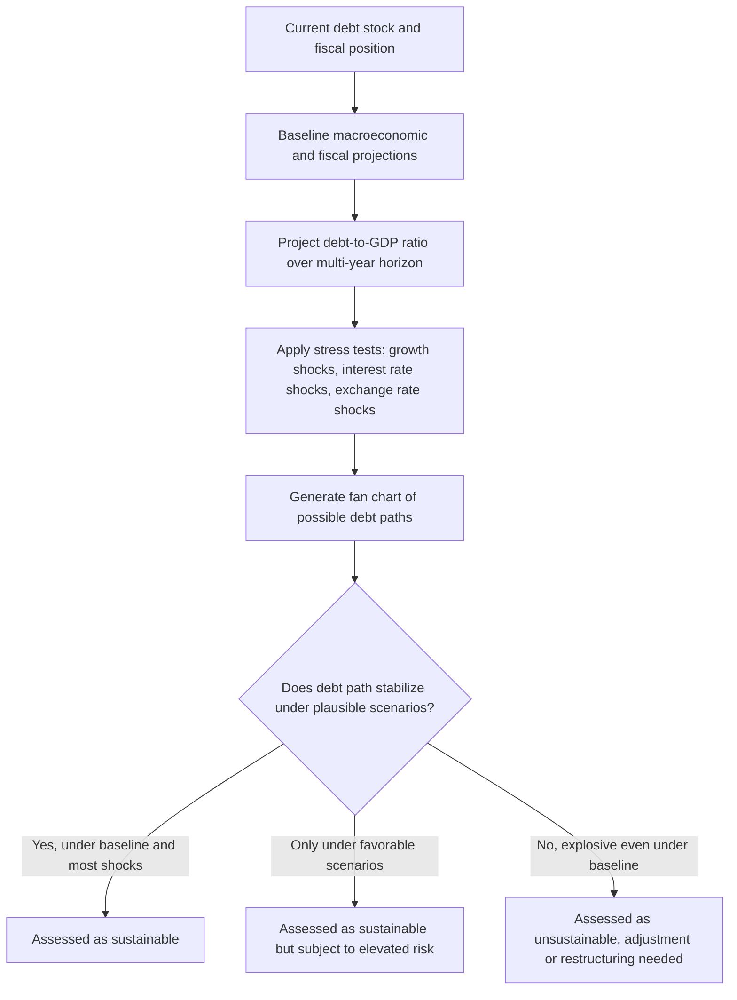

## Sustainability of Government Debt

### Definition

Government debt sustainability refers to a government's ability to service its outstanding debt obligations — making interest and principal payments as they come due — without requiring an unrealistically large and disruptive future adjustment to fiscal policy, without defaulting, and without resorting to financing methods (such as inflationary money creation) that generate unacceptable macroeconomic costs. Sustainability is not a single sharp threshold but a matter of degree, typically assessed through forward-looking projections of a government's debt trajectory under a range of plausible economic scenarios.

### The Core Sustainability Condition

Building on the debt dynamics equation, a debt path is generally considered sustainable if the projected debt-to-GDP ratio does not grow explosively over the relevant horizon — that is, if the primary balance path is sufficient, given the prevailing interest-rate/growth-rate differential, to stabilize or reduce the debt ratio over time:

$$d_t \to d^* \text{ (a finite, stable level)} \quad \text{rather than} \quad d_t \to \infty$$

Formally, this requires the government's primary balance to satisfy an intertemporal budget constraint: the present discounted value of all future primary surpluses must be sufficient to cover the current stock of debt.

**Key Points**

- This is a **forward-looking** concept: a government can be running a large deficit and rising debt ratio today and still be considered sustainable if credible future policy adjustments are expected to bring the trajectory under control, whereas a government with a currently modest deficit could be assessed as unsustainable if current trends are projected to continue on an explosive path.
- Sustainability assessments are inherently probabilistic and scenario-dependent, given the fundamental uncertainty in projecting future interest rates, growth rates, and primary balances over multi-year horizons — a key reason sustainability is best understood as a matter of risk and degree rather than a binary pass/fail determination.

### The IMF's Debt Sustainability Analysis (DSA) Framework

The IMF, often working alongside the World Bank, maintains formal frameworks for conducting debt sustainability analyses as a tool to better detect, prevent, and resolve potential debt crises, applied differently depending on a country's income level and market access.

**Key components across DSA frameworks:**

- **Baseline projections:** A central forecast of debt, deficits, growth, and financing needs over a multi-year horizon (commonly around 10 years), built from assumptions about macroeconomic variables and current policy settings.
- **Stress tests and shock scenarios:** Alternative scenarios applying adverse shocks (e.g., lower growth, higher interest rates, exchange-rate depreciation, natural disasters) to assess how resilient the baseline debt trajectory is to plausible negative developments.
- **Fan charts:** A visualization technique using stochastic (probabilistic) shocks — including asymmetric ("skewed") shock distributions rather than only symmetric ones — to show a range of possible debt paths and their associated probabilities, offering a visual representation of whether risks to the baseline are tilted toward better or worse outcomes than the central projection.
- **Debt-carrying capacity classification:** For low-income countries specifically, the IMF-World Bank Debt Sustainability Framework (DSF) classifies countries into strong, medium, or weak debt-carrying capacity categories, which determine the specific thresholds used to judge whether projected debt and debt-service indicators signal elevated risk.
- **Debt service-to-revenue ratios:** Used alongside debt-to-GDP ratios as a complementary indicator, since this metric captures the government's revenue-generating capacity to meet debt obligations directly, and the specific threshold applied varies depending on a country's assessed debt-carrying capacity.

### Distress and Restructuring

**Key Points**

- Sustainability assessments feed directly into decisions about **access to financing**: for many countries, an IMF program or other official lending is conditioned on an assessment that the country's debt is sustainable, or sustainable following an agreed fiscal adjustment or debt restructuring.
- When debt is assessed as unsustainable without relief, **debt restructuring** — negotiated reductions in the value, maturity extension, or interest-rate reduction of outstanding obligations — may be pursued with creditors to restore a sustainable trajectory, a process central to recent debt crisis resolutions.
- Restructuring outcomes are evaluated against sustainability benchmarks: for example, one recent restructuring case examined in current policy literature was deemed sustainable at a total debt-to-GDP ratio of 95% and a foreign-exchange-debt-service-to-GDP ratio of 4.5% over the following several years, illustrating how specific numerical thresholds are applied in practice to judge whether a post-restructuring debt path is considered sustainable going forward.
- Post-restructuring sustainability assessments increasingly grapple with the challenge of low-probability but high-impact shocks: for instance, a country's history of repeated tropical cyclones has been raised as a factor that could plausibly disrupt an otherwise-judged-sustainable debt path during the repayment period, and recent real-world events — a major cyclone striking a country shortly after a debt restructuring agreement — have prompted calls to recalibrate IMF programs and renegotiate restructuring terms already in place, illustrating the practical tension between standardized sustainability frameworks and evolving real-world shocks such as climate-related disasters. [Unverified] Whether or to what extent any specific restructuring agreement is ultimately renegotiated in response to such shocks is a case-by-case, evolving matter that should be checked against current news for the most up-to-date status.

### External vs. Domestic Debt Considerations

**Key Points**

- A long-standing analytical debate concerns whether external (foreign-currency or foreign-held) debt should be treated differently from domestic debt in sustainability analysis. Arguments for retaining this distinction include: payments on external debt drain resources from the domestic economy in a way that domestic debt payments (owed to residents) do not; foreign-exchange constraints can become binding even when a country's overall debt burden might otherwise seem manageable, as illustrated by cases where countries have defaulted after exhausting foreign-exchange reserves; and debt restructuring negotiations and the principle of "comparability of treatment" among creditors typically apply specifically to external debt.
- Some evolving IMF methodological approaches have moved toward reducing this specific emphasis on external debt as a separate analytical category, reflecting an ongoing and unsettled methodological debate about the most appropriate framework design, particularly for low-income countries. [Inference] The specific direction and pace of any such methodological shift is subject to ongoing institutional review and should be checked against the most current published framework documentation rather than assumed fixed.
- Domestic debt sustainability analysis has become an increasingly emphasized complement to external debt analysis, since empirical research has found that domestic debt (as a share of GDP) can have an estimated effect on the likelihood of debt distress comparable in magnitude to that of external debt relative to GDP, challenging an earlier tendency in some frameworks to focus predominantly on external debt risk.

### Indicators Beyond the Core Debt-to-GDP Ratio

**Key Points**

- **Debt composition indicators** — the share of debt that is short-term, foreign-currency-denominated, index-linked (e.g., inflation-linked), or held by non-resident creditors — are used as supplementary indicators of vulnerability, since these characteristics affect a country's exposure to rollover risk, exchange-rate risk, and inflation-linked payment risk in ways not captured by the headline debt ratio alone.
- **Reserve coverage ratios** (for countries with external financing needs) provide insight into a country's capacity to meet near-term foreign-currency obligations independent of new borrowing.
- **Financial system soundness indicators** — such as bank capital adequacy ratios, nonperforming loan shares, and private-sector credit growth — are sometimes incorporated into broader sustainability assessments, reflecting the interconnection between sovereign and domestic financial-sector risk (a sovereign-bank "doom loop" concern in some contexts).
- **Debt transparency and data availability:** A recognized challenge in sustainability analysis is that, among developing countries surveyed by the IMF, only about half have laws requiring debt management and fiscal reporting, and fewer than a quarter require disclosure of loan-level information considered crucial for transparency — a data-quality constraint that itself complicates accurate sustainability assessment. International initiatives, including G20-endorsed information-sharing principles, the World Bank's Debtor Reporting System, and voluand voluntary creditor transparency principles, aim to improve debt data reporting and disclosure to support more reliable analysis.

### Debates Around the DSA Methodology

**Key Points**

- Some critics of formal debt sustainability frameworks argue that specific parameter choices — such as potential-output or growth assumptions used in generating baseline projections — can produce overly conservative or overly optimistic sustainability assessments depending on the methodology applied, a concern raised prominently regarding certain supranational frameworks (e.g., the EU's economic governance framework).
- A distinct normative critique, raised by civil society and some academic commentators, holds that formal sustainability analysis should more explicitly account for a government's core service-delivery obligations (health, education, social protection) as competing claims on resources alongside debt service, rather than treating debt repayment capacity in isolation from these other essential government functions — reflected in proposals that arrears to civil servants and pensioners be treated as repayment obligations of comparable priority to arrears owed to creditors.
- There have also been calls to build climate-related shock scenarios (e.g., natural disaster risk) more systematically into standard debt sustainability frameworks as a recurring, rather than exceptional, module — particularly relevant for countries with a demonstrated history of frequent climate-related disasters — reflecting a broader push to expand the range of risks considered material to sustainability beyond traditional macroeconomic and financial variables.
- [Inference] These methodological debates are actively evolving as international institutions periodically review and revise their frameworks (as with the ongoing IMF-World Bank review of the low-income country framework); any description of "current" methodology should be checked against the latest published framework version for precision, since specific technical details are subject to change following each review cycle.

### Domestic Fiscal Rules and Sustainability

**Key Points**

- Sustainability concepts connect directly to the structural-balance-based fiscal rules discussed elsewhere in fiscal policy analysis: a fiscal rule requiring a government to maintain a debt-stabilizing (or debt-reducing) structural primary balance is, in effect, an institutionalized commitment mechanism intended to keep the debt trajectory on a sustainable path without requiring case-by-case sustainability judgment each year.
- Debates over the appropriate calibration of such rules (for example, within the EU's revised economic governance framework) directly parallel the broader DSA methodological debates: choices about growth assumptions, the treatment of investment spending, and the length of the adjustment horizon all affect whether a given fiscal rule produces a sustainability assessment consistent with more detailed case-specific debt sustainability analysis.

### Summary Table: Key Sustainability Assessment Tools

| Tool/Concept | Purpose | Key Limitation |
| --- | --- | --- |
| Debt dynamics equation ($i$, $g$, primary balance) | Core analytical building block for projecting debt trajectories | Sensitive to uncertain long-run interest rate and growth assumptions |
| Baseline + stress-test scenarios | Assess resilience of debt path to adverse shocks | Choice of shock scenarios itself involves judgment |
| Fan charts (stochastic projections) | Visualize probability distribution of future debt paths | Requires assumptions about the historical shock distribution used to generate the fan |
| Debt-carrying capacity classification (LIC-DSF) | Tailor risk thresholds to country-specific capacity | Classification itself can be contested or become outdated |
| Debt service-to-revenue ratio | Capture revenue-based repayment capacity | Varies by assumed debt-carrying capacity category |
| External vs. domestic debt distinction | Capture foreign-exchange and external-financing-specific risks | Degree of continued emphasis on this distinction is under active methodological review |
| Debt transparency/data quality | Underpins reliability of all other tools | Many countries lack robust legal disclosure requirements |

### Related Topics

- Debt dynamics and the debt-to-GDP ratio equation
- Measuring budget deficits and public debt
- Sovereign debt restructuring and default
- Fiscal rules and structural balance targets
- Structural versus cyclical budget balance
- Fiscal policy at the zero lower bound
- Sovereign risk premia and interest rate determination