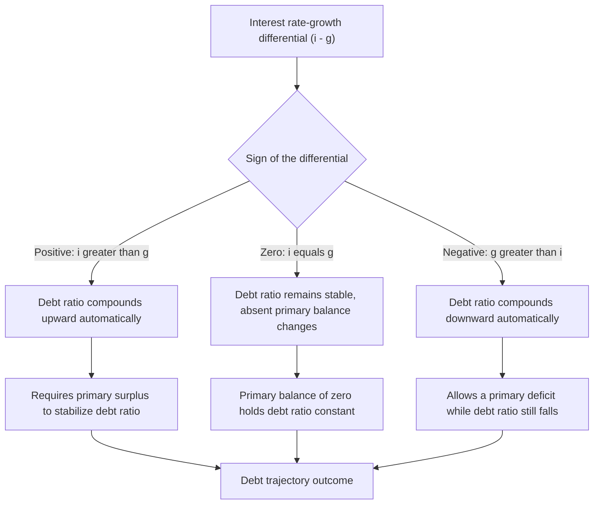

## Interest Rate-Growth Differential and Debt Trajectories

### Definition

The interest rate-growth differential, commonly denoted $(i-g)$ or $(r-g)$ in real terms, is the gap between the effective interest rate a government pays on its outstanding debt and the growth rate of the economy (nominal or real, matched consistently with the interest rate measure used). This single quantity is the central determinant of whether a given debt-to-GDP ratio tends to rise or fall automatically over time, absent any change in the primary fiscal balance, making it one of the most closely watched parameters in debt sustainability analysis.

### Derivation from the Debt Dynamics Equation

Recall the standard debt dynamics approximation:

$$\Delta d_t \approx (i-g)\,d_{t-1} - pb_t$$

where $d_t$ is the debt-to-GDP ratio, $pb_t$ is the primary balance (surplus) as a share of GDP, $i$ is the effective interest rate on debt, and $g$ is the nominal GDP growth rate.

Setting $\Delta d_t = 0$ (a stable debt ratio) gives the debt-stabilizing primary balance:

$$pb_t^{stabilizing} = (i-g)\,d_{t-1}$$

**Key Points**

- The differential $(i-g)$ acts as a multiplier on the *existing* debt stock: the larger the current debt ratio $d_{t-1}$, the more consequential a given $(i-g)$ gap becomes for the debt trajectory, meaning highly indebted governments are more sensitive to changes in this differential than lightly indebted ones.
- A **positive** differential ($i > g$) implies debt grows automatically ("snowballs") unless offset by a primary surplus of at least $(i-g)d_{t-1}$.
- A **negative** differential ($g > i$) implies the government can run a primary deficit up to $(g-i)d_{t-1}$ and still see the debt ratio stabilize or decline, since growth outpaces the compounding cost of debt service.

### Real vs. Nominal Formulation

The differential can be expressed equivalently using either nominal or real variables, provided both the interest rate and growth rate are measured on a consistent basis:

$$(i-g)_{nominal} = (r-g_{real})_{real}$$

where $r$ is the real interest rate and $g_{real}$ is real GDP growth (both nominal quantities net of the same inflation rate).

**Key Points**

- Since inflation affects both the nominal interest cost of debt (partially, depending on debt's maturity and indexation) and nominal GDP growth in an approximately offsetting way, the real-terms $(r-g)$ formulation is often preferred in academic and policy discussions precisely because it isolates the underlying real economic relationship from purely nominal/inflation effects.
- However, this equivalence is only approximate in practice: it holds most cleanly for debt entirely composed of short-maturity, non-indexed instruments that reprice quickly with inflation; for longer-maturity fixed-rate debt, an unexpected rise in inflation can temporarily reduce the *real* cost of debt service even while nominal $g$ rises, creating a transitional divergence between the nominal and real versions of the differential.

### Historical Behavior of $(r-g)$

**Key Points**

- The historical relationship between average government borrowing costs and average GDP growth rates has varied substantially across countries and time periods; for extended periods in a number of advanced economies, average sovereign borrowing costs have run below average nominal or real growth rates, a condition some economists have argued materially eases the constraint on sustainable debt accumulation relative to a presumption that $i$ must exceed $g$.
- [Inference] Whether a favorable $g > i$ (or $g > r$) relationship persists into the future for any specific economy is not something that can be assumed to continue automatically; it depends on the future path of monetary policy, potential growth, demographic trends, and the risk premium markets demand on that country's debt — all of which can shift, sometimes rapidly, in response to changing fiscal credibility or global financial conditions.
- Because $(r-g)$ has been observed to fluctuate meaningfully over time and across countries, prudent debt sustainability analysis typically avoids relying on a single historical average value as a permanent assumption, instead incorporating a range of scenarios for this differential, including less favorable ones, as part of formal stress-testing exercises.

### Sensitivity of Debt Trajectories to the Differential

The debt path implied by a given $(i-g)$ assumption compounds over time, meaning even small differences in the assumed differential can produce substantially different long-run debt trajectories.

**Example**

Consider a country with an initial debt-to-GDP ratio of 100% and a primary balance held at exactly zero (no primary surplus or deficit) for 20 years, under three alternative constant differentials:

- If $(i-g) = 1\%$: the debt ratio compounds at roughly 1% per year, reaching approximately 122% of GDP after 20 years.
- If $(i-g) = 0\%$: the debt ratio remains exactly stable at 100% of GDP throughout.
- If $(i-g) = -1\%$: the debt ratio compounds downward at roughly 1% per year, falling to approximately 82% of GDP after 20 years.

[Inference] This example uses a simplified constant-differential assumption purely for illustration; in practice $(i-g)$ varies year to year with market conditions and macroeconomic developments, so actual debt trajectories rarely follow such a smooth, constant compounding path.

### Determinants of the Interest Rate Component

**Key Points**

- **Monetary policy stance:** The general level of policy interest rates set by the central bank strongly influences the borrowing costs governments face, particularly for shorter-maturity debt; this is a key channel linking monetary policy decisions (including ZLB episodes) to the sustainability of a given fiscal stance.
- **Sovereign risk premium:** Beyond the risk-free base rate, governments pay a premium reflecting perceived default or restructuring risk, which itself can depend on the debt ratio, debt composition, political stability, and market sentiment — creating the potential for a self-reinforcing feedback loop in which a rising debt ratio raises the risk premium (and hence $i$), which in turn worsens the $(i-g)$ gap and further accelerates debt accumulation.
- **Debt maturity structure and refinancing:** Because outstanding debt reflects rates locked in when it was originally issued, the *effective* average interest rate on the full debt stock adjusts only gradually as older debt matures and is refinanced at prevailing market rates, meaning current market rate changes do not instantly and fully pass through into the effective $i$ relevant for the near-term debt dynamics equation.
- **Currency denomination:** For debt issued in foreign currency, the effective domestic-currency interest cost also depends on exchange-rate movements, adding a further source of variability to the effective $i$ beyond the contractual interest rate alone.

### Determinants of the Growth Component

**Key Points**

- **Potential output growth:** Long-run real GDP growth reflects underlying factors such as labor force growth, capital accumulation, and productivity growth — structural determinants that change slowly and are subject to considerable long-run forecasting uncertainty.
- **Demographic trends:** Aging populations and slowing labor force growth in many advanced economies have been widely discussed as a structural headwind to long-run potential growth, with direct implications for the sustainable level of $(i-g)$-driven debt dynamics in those economies. [Inference] The precise quantitative impact of demographic trends on any specific country's long-run growth rate depends on numerous interacting factors (immigration policy, labor force participation, productivity trends) and is not a fixed, universally agreed figure.
- **Inflation and nominal growth:** Since the nominal formulation of the differential uses nominal GDP growth, the inflation component of nominal growth directly affects the nominal debt dynamics calculation, distinct from its role in affecting the nominal interest rate (discussed above).
- **Cyclical versus structural growth:** Short-run cyclical fluctuations in growth (recessions, expansions) can temporarily move the observed $(i-g)$ differential away from its longer-run structural average, meaning single-year readings of the differential should generally be interpreted with reference to the broader cyclical context rather than treated as representative of the sustained trend.

### Relevance to Fiscal Space and Policy Debate

**Key Points**

- A government facing a persistently favorable (negative) $(i-g)$ differential has greater latitude ("fiscal space") to run primary deficits, finance public investment, or absorb fiscal shocks without triggering an explosive debt trajectory, a consideration frequently invoked in debates over the appropriate size and timing of fiscal expansion, including debt-financed stimulus at the zero lower bound.
- Conversely, a government facing a persistently unfavorable (positive) $(i-g)$ differential, especially combined with an already elevated debt ratio, faces a more constrained fiscal space, requiring sustained primary surpluses merely to prevent the debt ratio from rising further.
- This differential is a central input into formal debt sustainability analyses conducted by institutions such as the IMF, which routinely construct baseline and stress-test scenarios incorporating a range of plausible interest rate and growth assumptions specifically because of the outsized sensitivity of long-run debt projections to this parameter.
- The differential's central role in sustainability analysis also connects directly to the broader fiscal-monetary policy interaction discussion: because monetary policy directly influences $i$ (and can indirectly influence $g$ through its effect on aggregate demand), the prevailing monetary stance is itself an important, though not sole, determinant of a government's debt sustainability outlook at any given time.

### Summary Table

| Scenario | Sign of $(i-g)$ | Implication for Debt Ratio | Required Primary Balance for Stability |
| --- | --- | --- | --- |
| High borrowing costs, low growth | Positive, large | Debt ratio rises rapidly if unaddressed | Large primary surplus required |
| Borrowing costs roughly equal to growth | Near zero | Debt ratio roughly stable | Primary balance near zero |
| Low borrowing costs, strong growth | Negative | Debt ratio can fall even with a primary deficit | Primary deficit compatible with declining debt ratio |
| Rising risk premium as debt increases | Increasingly positive (feedback loop) | Potential for self-reinforcing, accelerating debt growth | Increasingly large surplus required, may become infeasible |

### Related Topics

- Debt dynamics and the debt-to-GDP ratio equation
- Sustainability of government debt
- Sovereign risk premia and interest rate determination
- Fiscal policy at the zero lower bound
- Potential output and long-run growth determinants
- Measuring budget deficits and public debt
- Fiscal-monetary policy interactions and coordination