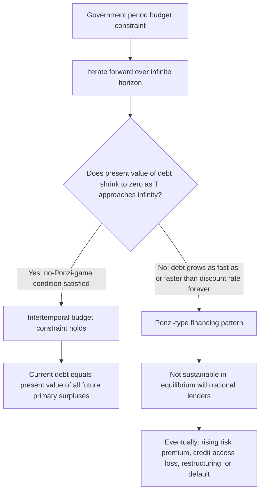

## Ponzi Conditions and the No-Ponzi-Game Constraint

### Definition

A Ponzi condition, in the context of government debt, describes a financing strategy in which a government perpetually rolls over its debt — issuing new debt to pay off maturing principal and interest — without ever generating the primary surpluses needed to actually repay it in present-value terms. The **no-Ponzi-game (NPG) constraint** is the theoretical condition ruling out this kind of indefinitely postponed repayment, requiring instead that government debt cannot grow faster than the discount rate forever; it is a foundational assumption in intertemporal government budget constraint analysis and in most formal models of fiscal sustainability.

### Formal Statement

Starting from the government's period budget identity in present-value terms, and iterating forward, the government's debt today must equal the present discounted value of all future primary surpluses, **provided** the following transversality (no-Ponzi-game) condition holds:

$$\lim_{T\to\infty} \frac{D_T}{(1+r)^T} = 0$$

where $D_T$ is the nominal (or real) debt stock at some future date $T$, and $r$ is the relevant discount rate (typically the interest rate on government debt).

**Key Points**

- This condition states that the present value of debt must shrink to zero as the horizon extends to infinity: the government cannot simply keep growing its debt forever at a rate equal to or exceeding the interest rate, financing new interest payments entirely with new borrowing in perpetuity, without ever paying any of it down in present-value terms.
- If this condition is imposed, iterating the government's period budget constraint forward yields the **intertemporal government budget constraint**:

$$D_0 = \sum_{t=1}^{\infty} \frac{PB_t}{(1+r)^t}$$

meaning the current debt stock must be matched, in present-value terms, by the sum of all future primary surpluses $PB_t$ the government is expected to run.

### Why the No-Ponzi-Game Constraint Matters

**Key Points**

- Without the NPG constraint, a government could in principle run permanent primary deficits indefinitely, financing all interest payments (and more) purely through new debt issuance forever — a scheme that, mechanically, resembles a Ponzi scheme in the sense that it depends on ever-expanding new borrowing to service prior obligations, rather than any actual capacity to repay from real resources.
- The NPG constraint is not typically imposed as an external legal or institutional rule but rather emerges as an **equilibrium condition**: in a world with rational, forward-looking lenders, creditors would not indefinitely be willing to hold government debt that they correctly anticipate can never be repaid even in present-value terms, since doing so would require an ever-expanding pool of new lenders with no underlying claim on real resources — the same underlying feature that characterizes a Ponzi scheme in private finance.
- The condition is therefore best understood as a statement about what is feasible given rational expectations and functioning credit markets, rather than a policy choice a government makes directly; a government attempting to violate it in practice would eventually be unable to find willing lenders at sustainable interest rates, triggering a debt crisis, forced restructuring, or default well before literally reaching the theoretical Ponzi limit.

### Distinguishing a Ponzi Path from a Sustainable Rolling-Over Path

**Key Points**

- It is a common misconception that any government that continuously rolls over maturing debt (rather than fully repaying principal from current-period surpluses) is engaged in Ponzi-like financing; in fact, most governments in practice continuously roll over some portion of maturing debt as a routine feature of debt management, and this alone does not violate the no-Ponzi-game condition.
- The key distinguishing feature of a genuine Ponzi path is not merely rolling over debt but whether the debt stock is growing **at a rate equal to or exceeding the interest rate indefinitely without any offsetting primary surplus ever materializing** — that is, whether the present value of the debt is failing to shrink over the very long run, not whether any single maturing bond is refinanced rather than repaid from that period's revenue.
- A government running a debt-to-GDP ratio that stabilizes at a positive but finite level (as discussed in debt dynamics analysis) — even one that persistently rolls over debt — satisfies the no-Ponzi-game condition, since the present value of a *stable*, finite debt-to-GDP ratio, discounted at a rate exceeding the growth rate, converges to zero as the horizon extends.
- If the interest rate-growth differential $(i-g)$ is negative (i.e., $g > i$) on a sustained basis, a government can in principle run a **permanent primary deficit** and still satisfy the no-Ponzi-game condition, since the debt-to-GDP ratio can converge to a finite, stable level under these conditions rather than growing explosively — an important nuance often missed in informal discussions that equate "never running a primary surplus" with "engaging in Ponzi finance."

### Relationship to the Interest Rate-Growth Differential

**Key Points**

- The no-Ponzi-game condition interacts directly with the $(i-g)$ differential discussed in debt dynamics analysis: whether a given constant primary balance path satisfies the NPG condition depends critically on whether $i$ exceeds $g$ or vice versa.
- If $i > g$ persistently, satisfying the no-Ponzi-game condition generally requires the government to eventually run primary surpluses sufficient to prevent the debt ratio from growing without bound, consistent with the debt-stabilizing primary balance concept.
- If $g > i$ persistently, the no-Ponzi-game condition can be satisfied even with a permanent, moderate primary deficit, since the growing economic base (denominator) can outpace the compounding debt service, allowing the present value of debt (relative to a growing economy) to still converge appropriately.
- [Inference] This theoretical possibility of sustained primary deficits under $g > i$ has featured in academic and policy discussions of fiscal space in low-interest-rate environments; however, whether any specific real-world economy can rely on this condition holding indefinitely into the future involves substantial forecasting uncertainty about future interest rates and growth, and should not be treated as a guaranteed, permanent state of affairs.

### The No-Ponzi-Game Condition vs. Transversality Conditions in Optimization Models

**Key Points**

- In formal dynamic general equilibrium models (e.g., representative-agent optimization models used in macroeconomics), the no-Ponzi-game condition on the government is often paired with an analogous transversality condition on the household side, ensuring that households similarly cannot run unbounded borrowing schemes financed purely by ever-increasing new debt — the private-sector counterpart of the same underlying no-arbitrage, no-free-lunch logic.
- These conditions are typically imposed as **necessary conditions for a well-defined equilibrium** to exist in the model, rather than derived from any specific institutional feature of financial markets, reflecting the broader mathematical requirement that infinite-horizon optimization problems have bounded, well-behaved solutions.
- [Inference] The precise mathematical formulation of the no-Ponzi-game or transversality condition can vary somewhat depending on the specific model setup (e.g., whether uncertainty, multiple types of debt, or an open economy with external creditors is involved); the general statement given above represents the standard closed-economy, single-asset case.

### Practical and Policy Relevance

**Key Points**

- While the no-Ponzi-game condition is a theoretical equilibrium requirement rather than a directly observable policy rule, it underlies the entire logical structure of formal debt sustainability analysis: the requirement that a government's projected debt path not grow explosively over the analysis horizon is, in effect, an approximate, finite-horizon operationalization of the theoretical infinite-horizon no-Ponzi-game condition.
- In practice, market discipline — rising risk premia, reduced willingness of creditors to roll over debt, or outright loss of market access — tends to constrain governments well before they could ever approach a literal, infinite-horizon Ponzi trajectory, meaning the theoretical construct is best understood as clarifying the underlying logic of sustainability analysis rather than describing a scenario governments are ever observed to reach in practice.
- The concept is frequently invoked in academic and policy debates to push back against the (mistaken) claim that a government's continuous rolling over of debt is inherently unsustainable "Ponzi finance," clarifying that sustainability instead hinges specifically on the long-run relationship between the interest rate, the growth rate, and the primary balance — not on the mere practice of debt rollover itself.

### Summary Table

| Concept | Description | Key Distinguishing Feature |
| --- | --- | --- |
| No-Ponzi-game (NPG) condition | Present value of debt must approach zero as horizon extends to infinity | Formal transversality-type condition on the intertemporal budget constraint |
| Genuine Ponzi financing | Debt grows at or above the discount rate indefinitely, with no offsetting surplus ever materializing | Present value of debt does not shrink to zero |
| Sustainable debt rollover | Maturing debt continuously refinanced, but debt-to-GDP ratio stabilizes at a finite level | Present value of a stable finite ratio converges to zero |
| Permanent deficit with $g > i$ | Primary deficit persists indefinitely, but debt ratio still stabilizes due to favorable growth-interest gap | Consistent with NPG condition despite never running a surplus |
| Intertemporal budget constraint | Current debt equals present value of all future primary surpluses | Direct implication of imposing the NPG condition |

### Related Topics

- Debt dynamics and the debt-to-GDP ratio equation
- Interest rate-growth differential and debt trajectories
- Sustainability of government debt
- Government intertemporal budget constraint
- Sovereign risk premia and market access
- Transversality conditions in dynamic optimization models
- Fiscal policy at the zero lower bound