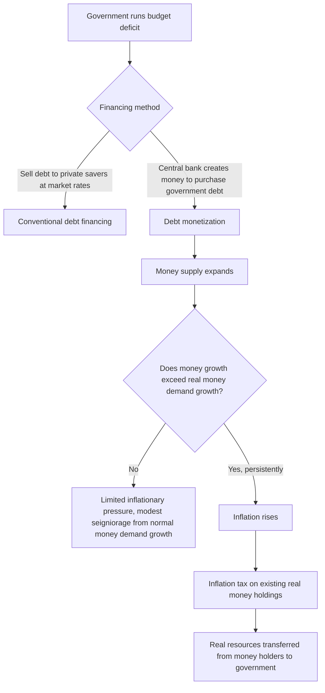

## Debt Monetization and Seigniorage

### Definitions

**Debt monetization** refers to a government financing its budget deficit, in whole or in part, by having the central bank create new money to purchase government debt (directly or effectively), rather than financing the deficit entirely through borrowing from private savers or raising taxes. **Seigniorage** is the real revenue a government (or its central bank) derives from its monopoly power to issue currency — the resources it can command by creating money that costs little to produce but has positive purchasing power.

### Seigniorage: Formal Definition

Seigniorage revenue can be expressed as the real value of new money creation:

$$S_t = \frac{\Delta M_t}{P_t}$$

where $\Delta M_t$ is the nominal increase in the money supply during period $t$ and $P_t$ is the price level.

This can be decomposed into a growth component and an inflation-tax component:

$$S_t = \underbrace{\frac{\Delta M_t}{M_t}\cdot\frac{M_t}{P_t}}_{\text{real balances growth}}$$

**Key Points**

- Part of seigniorage arises simply from the economy's growing real demand for money as the economy expands (a "normal" source of revenue that does not require any inflationary money growth beyond what real money demand naturally absorbs).
- The remainder arises from money creation in excess of real money demand growth, which generates inflation — this portion is often called the **inflation tax**, since it erodes the real value of existing money balances held by the public, effectively transferring real resources from money holders to the money issuer.

### The Inflation Tax

The inflation tax specifically refers to the erosion of the real value of the public's existing money holdings due to inflation:

$$\text{Inflation Tax}_t = \pi_t \cdot \frac{M_{t-1}}{P_{t-1}}$$

where $\pi_t$ is the inflation rate and $M_{t-1}/P_{t-1}$ is the real money stock held at the start of the period.

**Key Points**

- The inflation tax is conceptually similar to a conventional tax in that it transfers real purchasing power from private agents (money holders) to the government, but it operates through the price level rather than through an explicit fiscal levy, and it falls specifically on holders of non-interest-bearing money balances (and to some extent on holders of nominal, non-indexed assets more broadly) rather than on income or transactions in the way conventional taxes do.
- Because it does not require new legislation, does not appear as an explicit line item in conventional budget or tax statistics, and is not experienced by the public as a direct payment, the inflation tax is sometimes described as a "hidden" or politically easier-to-implement form of revenue generation compared with explicit taxation, particularly relevant in fiscal environments where raising conventional taxes or cutting spending faces strong political resistance.

### Mechanisms of Debt Monetization

**Key Points**

- **Direct monetization:** The central bank purchases newly issued government debt directly from the treasury, effectively printing money to fund the deficit. This practice is explicitly prohibited or heavily restricted by law in many modern institutional frameworks (for example, direct central bank financing of government deficits is generally prohibited under the treaties governing the European Central Bank and euro-area member states).
- **Indirect monetization:** The central bank purchases government debt in secondary markets (from private holders who initially bought newly issued debt), which can have monetary effects similar to direct monetization if conducted at sufficient scale and duration, even though it does not involve the central bank buying debt directly from the treasury at issuance. Large-scale asset purchase programs (quantitative easing) undertaken by central banks during periods of very low policy rates have sometimes been discussed in this context, though such programs are typically justified and designed with reference to monetary policy objectives (supporting demand, achieving inflation targets) rather than explicitly as deficit-financing operations.
- **De facto monetization via low, fixed policy rates:** If a central bank holds interest rates persistently low specifically to reduce government debt-servicing costs, rather than purely in response to its own independent inflation and output mandate, this can constitute a more subtle form of monetary accommodation of fiscal financing needs, sometimes discussed under the broader heading of "fiscal dominance."

### Seigniorage as a Revenue Source: Magnitude and Limits

**Key Points**

- Seigniorage revenue as a share of GDP is generally modest in economies with low, stable inflation and well-developed financial systems, since real money demand growth in such economies is limited by the (typically small) growth of transactions demand for currency and central bank reserves.
- Seigniorage revenue can become quantitatively much larger during episodes of high or hyperinflation, since the government can, in principle, generate substantial short-run real resources by rapidly expanding the money supply — though this relationship is subject to an important limit described by the Laffer-curve-like logic of the inflation tax.
- **The seigniorage Laffer curve:** As expected inflation rises, the public tends to reduce their real money holdings (economizing on cash balances, a phenomenon captured in money-demand theory), meaning the inflation-tax base itself shrinks as the inflation rate rises; beyond some point, further increases in money growth and inflation can actually *reduce* real seigniorage revenue, since the shrinking real money base offsets the higher tax rate (inflation rate) applied to it — an outcome frequently observed in historical hyperinflation episodes.
- This dynamic explains why extremely high, unstable rates of money growth are generally an inefficient and ultimately self-defeating way to raise sustained real government revenue, even though they may generate substantial revenue in the short run before money demand fully adjusts downward.

### Historical Context and Hyperinflation Episodes

**Key Points**

- Historically, episodes of severe or hyperinflation have frequently been associated with governments relying heavily on debt monetization to finance large fiscal deficits, particularly in contexts where conventional borrowing from private savers (domestic or foreign) was unavailable or prohibitively costly, and where the political or institutional capacity to raise sufficient conventional tax revenue or cut spending was constrained.
- The classic economic analysis of hyperinflation (associated with work such as Cagan's study of interwar and post-war hyperinflations) models the interaction between money growth, inflation, and the shrinking real money demand base described above, providing a formal account of why hyperinflations tend to be self-limiting or require ever-accelerating money growth to sustain a given level of real seigniorage revenue.
- [Inference] Attributing any specific historical inflationary episode to debt monetization as the primary or sole cause typically requires case-specific historical and institutional analysis; the general theoretical mechanism described here represents a standard analytical framework rather than a claim about any particular historical episode not explicitly named.

### Central Bank Independence as an Institutional Safeguard

**Key Points**

- The modern institutional design of central bank independence in most advanced economies is, in significant part, motivated by a desire to prevent the kind of fiscal dominance in which the central bank feels pressured to monetize government deficits, undermining its ability to pursue an independent price-stability mandate.
- Legal prohibitions or strong institutional norms against direct central bank financing of government deficits (as in the euro area's treaty framework) are a specific, codified response to the risks associated with debt monetization, reflecting lessons drawn from historical hyperinflation and monetary instability episodes.
- Despite formal independence, the fiscal-monetary interaction literature notes that central banks must still account for the prevailing fiscal stance in setting policy, and concerns about *de facto*, informal monetization (for example, through sustained accommodation of low rates specifically to ease government debt burdens rather than purely in pursuit of independent objectives) remain a live topic in discussions of central bank credibility, particularly in high-debt environments.

### Seigniorage and Debt Sustainability Interactions

**Key Points**

- Seigniorage revenue can, in principle, be incorporated into debt sustainability analysis as an additional source of government resources alongside conventional primary surpluses, though most standard sustainability frameworks focus primarily on conventional fiscal variables (the primary balance, interest rate-growth differential) given the modest and often unreliable scale of seigniorage revenue in economies with credible, independent monetary institutions.
- Reliance on substantial seigniorage revenue as a sustained fiscal strategy is generally viewed with concern in modern macroeconomic and policy analysis, both because of the seigniorage Laffer-curve limits described above and because of the broader macroeconomic costs of high and volatile inflation (distorted price signals, redistribution from savers to borrowers, and the erosion of a stable and predictable investment and planning environment) that typically accompany large-scale debt monetization.
- The topic connects directly to the broader fiscal-monetary policy coordination discussion: debt monetization represents an extreme, generally undesirable end-point of fiscal-monetary interaction, in contrast to the more measured forms of monetary accommodation (e.g., temporarily low policy rates during a demand shortfall) that are typically discussed as legitimate coordination in modern macroeconomic policy debate.

### Summary Table

| Concept | Description | Key Consideration |
| --- | --- | --- |
| Seigniorage | Real revenue from money creation | Includes both "normal" real balance growth and inflation tax components |
| Inflation tax | Erosion of real value of existing money holdings due to inflation | Falls on money holders, not experienced as an explicit tax payment |
| Direct monetization | Central bank buys government debt directly from treasury | Prohibited or heavily restricted in many modern frameworks (e.g., euro area) |
| Indirect monetization | Central bank buys government debt in secondary markets at scale | Can resemble direct monetization in effect if large and sustained |
| Seigniorage Laffer curve | Relationship between money growth/inflation and real seigniorage revenue | Revenue can decline at very high inflation as real money demand shrinks |
| Central bank independence | Institutional safeguard against fiscal dominance and monetization pressure | Key modern policy response to historical monetization/hyperinflation episodes |

### Related Topics

- Fiscal-monetary policy interactions and coordination
- Sustainability of government debt
- Money demand and the quantity theory of money
- Hyperinflation and the Cagan model
- Central bank independence and credibility
- Fiscal dominance and debt sustainability
- Interest rate-growth differential and debt trajectories