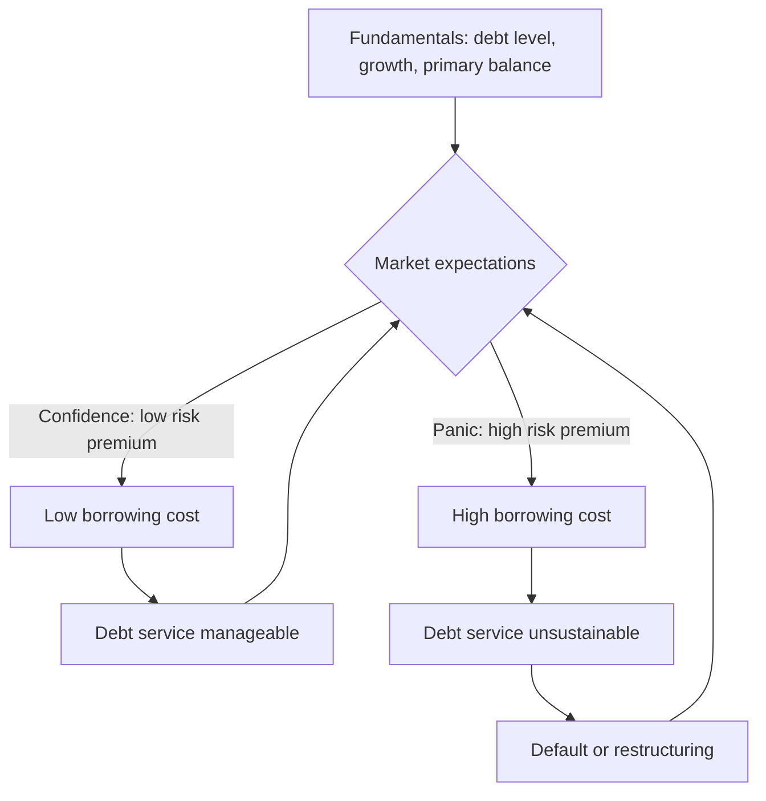
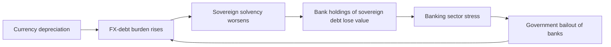

## Sovereign Default and Debt Crises

### Overview

Sovereign default occurs when a national government fails to meet its debt obligations — missing a scheduled interest payment, failing to repay principal, or unilaterally restructuring terms to the disadvantage of creditors. A debt crisis is the broader macroeconomic and financial episode surrounding actual or anticipated default: rising borrowing costs, capital flight, currency pressure, and often a sharp contraction in output. Unlike household or corporate bankruptcy, sovereign default has no supranational bankruptcy court with enforcement power over a state, which shapes almost everything distinctive about how these episodes unfold and resolve.

### Why Sovereigns Default

**Key Points**

- **Solvency vs. liquidity distinction**: A solvency crisis means the debt burden is unsustainable given the country's growth and fiscal trajectory even absent a temporary shock. A liquidity crisis means the government is fundamentally solvent but cannot roll over maturing debt because of a temporary loss of market access — a self-fulfilling run is possible here.
- **Debt sustainability arithmetic**: The debt-to-GDP ratio evolves according to

  $$\frac{d_{t+1}}{d_t} \approx d_t \cdot \frac{(1+r)}{(1+g)} - pb_t$$

  where $d_t$ is the debt-to-GDP ratio, $r$ is the effective real interest rate on debt, $g$ is real GDP growth, and $pb_t$ is the primary balance (surplus) as a share of GDP. When $r > g$, debt dynamics are unfavorable and require sustained primary surpluses to stabilize $d_t$; when $g > r$, debt can be stabilized or even reduced with weaker fiscal effort.
- **Original sin**: Many emerging markets historically could not borrow internationally in their own currency, forcing dollar- or euro-denominated debt. This removes the option of inflating away debt and ties debt service to the exchange rate — a depreciation directly raises the local-currency cost of external debt.
- **Willingness vs. ability to pay**: Governments sometimes have the fiscal capacity to pay but choose not to (strategic default) when the political and economic cost of continued debt service exceeds the cost of default (reputational loss, litigation, exclusion from capital markets).
- **Triggers**: commodity price collapses (for commodity-exporting sovereigns), sudden stops in capital flows, currency mismatches combined with depreciation, banking sector crises that get transferred to the sovereign balance sheet ("doom loop"), contagion from other sovereigns, and political instability.

### The Debt Sustainability Framework

The standard IMF/World Bank Debt Sustainability Analysis (DSA) framework projects the debt path under baseline and stress scenarios, checking:

1. **Fiscal space**: room to run primary surpluses without triggering recession or political unrest.
2. **Gross financing needs (GFN)**: total borrowing requirement (maturing debt + new deficit) as a share of GDP in a given year; GFN above roughly 15–20% of GDP for emerging markets is often flagged as a red zone.
3. **Debt profile vulnerabilities**: share of debt held by non-residents, share denominated in foreign currency, average maturity, and share held by official vs. private creditors.
4. **Market perception**: sovereign spreads (e.g., EMBI spreads, CDS spreads) as a real-time signal of default probability priced by markets.

**Example**

A country with $d = 90\%$ of GDP, $r = 5\%$, and $g = 2\%$ needs

$$pb^* = d \cdot \frac{r-g}{1+g} \approx 0.90 \times \frac{0.03}{1.02} \approx 2.6\%\text{ of GDP}$$

in primary surplus just to hold the debt ratio constant — before financing any new deficit. If political constraints cap feasible primary surpluses at 1% of GDP, the debt ratio is on an explosive path absent faster growth, lower interest rates, or restructuring.

### Multiple Equilibria and Self-Fulfilling Crises

[Inference — standard theoretical result, model-dependent] In models following Calvo (1988) and Cole-Kehoe (2000), the same fundamentals can support two equilibria: a "good" equilibrium where creditors expect repayment, charge low rates, and low rates make repayment easy; and a "bad" equilibrium where creditors expect default, charge high rates, and the resulting high debt service pushes the government toward actual default. This multiplicity is why crises can appear to strike suddenly and why lender-of-last-resort facilities (official or otherwise) can, in principle, coordinate expectations toward the good equilibrium without any change in fundamentals.

### Types and Mechanics of Default

**Key Points**

- **Outright default**: missed payment with no immediate restructuring offer.
- **Debt restructuring**: negotiated change in terms — maturity extension (reprofiling), coupon reduction, principal haircut, or a combination (often via **Brady bonds**-style exchanges historically, or modern collective action clause (CAC) driven exchanges).
- **Selective default (SD)**: rating agencies' designation when a sovereign defaults on some instruments (e.g., domestic law bonds) while continuing to service others (e.g., external bonds), or defaults on private creditors while remaining current with official creditors (IMF, World Bank).
- **Domestic vs. external default**: default on domestically-held, local-currency debt is more common than commonly assumed historically (Reinhart and Rogoff's research documents extensive domestic default episodes) but is less studied because data is sparser.
- **Reprofiling**: extending maturities without reducing the face value or coupon, sometimes used as a softer first step before a full restructuring.

### Restructuring Process and Creditor Coordination

Sovereign debt restructuring lacks a formal bankruptcy code (no equivalent to Chapter 11), producing a decentralized, negotiated process:

1. **Default or near-default trigger** — missed payment or announced intent to restructure, often alongside IMF program negotiations.
2. **Standstill / negotiation phase** — informal creditor committees form (historically the London Club for bank debt, Paris Club for official bilateral debt); modern bond restructurings coordinate holders of internationally issued bonds.
3. **Exchange offer** — the sovereign offers new instruments (often with reduced face value, lower coupons, and/or longer maturities) in exchange for old defaulted bonds.
4. **Collective Action Clauses (CACs)**: contractual provisions allowing a qualified supermajority of bondholders (commonly 75%) to bind all holders of that bond series to the restructuring terms, preventing a small minority from blocking the deal.
5. **Holdout creditors**: investors (sometimes specialized "vulture funds") who refuse the exchange and pursue full repayment through litigation — the Argentina v. NML Capital case (2000s–2016) is the canonical example, where holdouts obtained U.S. court rulings blocking Argentina from servicing exchanged bonds until holdouts were paid.
6. **Aggregation clauses**: newer-generation CACs (post-2014, following the Argentina litigation) allow voting across multiple bond series simultaneously, further reducing holdout leverage.

**Example: Haircut mechanics**

If a bond with $100 face value and 8% coupon is exchanged for a new bond with $55 face value and 5% coupon, the **face value haircut** is 45%, but the **net present value (NPV) haircut** — the more economically meaningful measure — depends on discounting both old promised cash flows and new cash flows at an appropriate exit yield:

$$\text{NPV haircut} = 1 - \frac{\text{PV(new cash flows)}}{\text{PV(old promised cash flows)}}$$

NPV haircuts in historical restructurings have ranged roughly from 20% to over 70% depending on the severity of the crisis. [Unverified — exact figures vary by episode and methodology; cite specific case data for precision]

### Sovereign CDS and Market Pricing

Credit default swaps on sovereign debt allow investors to buy protection against default; the CDS spread is a market-implied estimate of default risk. A simplified relationship under risk-neutral pricing:

$$\text{CDS spread} \approx (1 - R) \times \lambda$$

where $R$ is the assumed recovery rate and $\lambda$ is the risk-neutral hazard rate (annual default probability). [Inference — simplified single-period approximation; actual pricing uses full term structure models] A CDS "credit event" auction determines the payout after a determination committee rules a default or restructuring qualifies as a triggering event.

### The Role of the IMF and Official Sector

**Key Points**

- The IMF frequently provides emergency financing conditional on fiscal adjustment and structural reform programs, intended to restore market access and stabilize the debt path.
- **Debt sustainability as a precondition**: IMF programs generally require the DSA to show debt is sustainable (or made sustainable through restructuring) before IMF funds are disbursed, formalizing the link between IMF lending and creditor haircuts.
- **Paris Club**: coordinates official bilateral debt restructuring among mostly Western creditor governments; historically dominant for low-income country debt relief (e.g., HIPC and MDRI initiatives).
- **Common Framework (2020–)**: G20-led mechanism intended to coordinate restructuring involving both traditional Paris Club creditors and newer major bilateral lenders (notably China), applied in cases like Zambia, Chad, and Ethiopia; progress has been criticized as slow. [Unverified — evolving initiative; check current case status]
- **Debt Relief Initiatives**: HIPC (Heavily Indebted Poor Countries) and MDRI (Multilateral Debt Relief Initiative) provided deep debt stock relief to eligible low-income countries in the 1990s–2000s.

### Currency Crises and Twin/Triple Crises

Sovereign debt crises frequently co-occur with currency crises and banking crises:

- **Twin crises**: a currency crisis (sharp depreciation, reserve depletion) coinciding with a banking crisis, common when banks hold currency-mismatched balance sheets.
- **Triple crisis**: currency, banking, and sovereign debt crises reinforcing each other — a depreciation raises the local-currency value of foreign-currency public debt, weakening sovereign solvency; a weakening sovereign raises the risk on domestic bank holdings of government bonds (the "sovereign-bank doom loop," prominently observed in the Eurozone periphery 2010–2012); and banking sector bailouts transfer private losses onto the public balance sheet, worsening sovereign debt dynamics.

### Historical Episodes (Reference Cases)

| Episode | Period | Key Features |
| --- | --- | --- |
| Latin American Debt Crisis | 1982–1989 | Widespread default across Mexico, Brazil, Argentina; led to Brady Plan bond exchanges converting bank loans into tradable bonds |
| Russian Default | 1998 | Domestic ruble-denominated GKO default plus devaluation; triggered LTCM collapse in the U.S. |
| Argentina | 2001–2002, 2005/2010 exchanges, 2014 holdout litigation, 2020 restructuring | Largest sovereign default at the time (~$100B); prolonged holdout litigation under NML Capital v. Argentina |
| Greece | 2012 | Largest sovereign restructuring by face value at the time (~€200B), involving a coercive use of retrofitted CACs on domestic-law bonds ("PSI" — Private Sector Involvement) |
| Zambia, Sri Lanka, Ghana, Ethiopia | 2020s | Post-pandemic wave of defaults tied to rising global rates, commodity shocks, and Common Framework negotiations |

[Unverified — figures above are approximate and widely cited in literature; consult primary sources (IMF, rating agencies) for precise haircut and amount figures per episode]

### Costs of Default

**Key Points**

- **Output costs**: defaults are typically associated with output contractions, though causality is debated (default may be a symptom of a crisis already causing contraction rather than solely its cause). [Inference]
- **Exclusion from capital markets**: temporary loss of market access, though empirical evidence suggests re-access often occurs within a few years, faster than earlier literature assumed. [Unverified — sensitive to sample period and methodology]
- **Trade credit disruption**: some evidence of reduced trade financing and trade volumes following default episodes.
- **Reputational and political costs**: sovereign credit ratings downgrades, higher future borrowing spreads even after resolution, and domestic political costs to incumbent governments.
- **Contagion**: default in one country can raise borrowing costs for others perceived as similar (regional or "asset class" contagion), as observed in the Eurozone crisis spillovers from Greece to Portugal, Ireland, Italy, Spain.

### Sovereign Default vs. Corporate Default: Key Distinctions

| Dimension | Corporate Default | Sovereign Default |
| --- | --- | --- |
| Legal enforcement | Bankruptcy court, defined priority of claims | No supranational bankruptcy court; enforcement relies on litigation in creditor-country courts, asset seizure is limited (sovereign immunity) |
| Collateral | Often secured against specific assets | Rarely collateralized (few exceptions, e.g., commodity-backed loans) |
| Restructuring mechanism | Formal reorganization plan under court supervision | Ad hoc negotiated exchange offers, CACs, Paris Club/Common Framework |
| "Ability to pay" | Bounded by firm's assets and cash flows | Bounded by taxing capacity and political feasibility of austerity |
| Post-default continuity | Firm may be liquidated | State continues to exist and must eventually regain market access |

### Diagram: Anatomy of a Sovereign Debt Crisis (svg_diagram)

<svg xmlns="http://www.w3.org/2000/svg" viewBox="0 0 900 460">
\<style\>
.box { fill: #f5f7fa; stroke: #2c3e50; stroke-width: 1.5; }
.arrow { stroke: #2c3e50; stroke-width: 1.5; marker-end: url(#arrow); }
.label { font-family: Arial, sans-serif; font-size: 13px; fill: #1a1a1a; }
.title { font-family: Arial, sans-serif; font-size: 15px; font-weight: bold; fill: #1a1a1a; }
\</style\>
<text x="250" y="25" class="title">Anatomy of a Sovereign Debt Crisis (svg_diagram)</text>
<rect x="30" y="50" width="180" height="60" class="box" />
<text x="45" y="75" class="label">Fiscal deficits +</text>
<text x="45" y="93" class="label">rising debt/GDP</text>
<rect x="30" y="150" width="180" height="60" class="box" />
<text x="45" y="175" class="label">External shock</text>
<text x="45" y="193" class="label">(rates, terms of trade)</text>
<rect x="260" y="100" width="180" height="60" class="box" />
<text x="275" y="125" class="label">Rising risk premium /</text>
<text x="275" y="143" class="label">spread widening</text>
<rect x="490" y="100" width="180" height="60" class="box" />
<text x="505" y="125" class="label">Loss of market access /</text>
<text x="505" y="143" class="label">sudden stop</text>
<rect x="490" y="220" width="180" height="60" class="box" />
<text x="505" y="245" class="label">Currency depreciation</text>
<text x="505" y="263" class="label">(if FX debt exists)</text>
<rect x="260" y="220" width="180" height="60" class="box" />
<text x="275" y="245" class="label">GFN exceeds</text>
<text x="275" y="263" class="label">available financing</text>
<rect x="380" y="330" width="200" height="60" class="box" />
<text x="395" y="355" class="label">Default / restructuring</text>
<text x="395" y="373" class="label">announcement</text>
<rect x="150" y="410" width="220" height="40" class="box" />
<text x="165" y="435" class="label">Negotiation, CACs, IMF program</text>
<rect x="420" y="410" width="220" height="40" class="box" />
<text x="435" y="435" class="label">Restored market access (eventual)</text>
<line x1="120" y1="110" x2="330" y2="110" class="arrow" />
<line x1="120" y1="180" x2="330" y2="150" class="arrow" />
<line x1="440" y1="130" x2="490" y2="130" class="arrow" />
<line x1="350" y1="160" x2="350" y2="220" class="arrow" />
<line x1="580" y1="160" x2="580" y2="220" class="arrow" />
<line x1="440" y1="250" x2="490" y2="250" class="arrow" />
<line x1="350" y1="280" x2="450" y2="330" class="arrow" />
<line x1="580" y1="280" x2="500" y2="330" class="arrow" />
<line x1="450" y1="390" x2="330" y2="410" class="arrow" />
<line x1="500" y1="390" x2="550" y2="410" class="arrow" />
</svg>

### Empirical Literature Highlights

- Reinhart and Rogoff, *This Time Is Different* (2009): documents centuries of sovereign default and banking crisis data, arguing debt crises recur predictably despite claims each era is structurally different.
- Sturzenegger and Zettelmeyer (2006): systematic quantification of NPV haircuts across post-1990s restructurings.
- Cruces and Trebesch (2013): finds larger haircuts are associated with longer subsequent exclusion from capital markets and higher post-restructuring spreads. [Unverified — specific magnitudes should be checked against the original paper]

### Related Topics

- Debt sustainability analysis (DSA) methodology in depth
- Original sin and currency mismatch in emerging market borrowing
- Collective action clauses and the evolution of sovereign bond contracts
- The Eurozone sovereign debt crisis and the sovereign-bank doom loop
- IMF conditionality and structural adjustment programs
- Odious debt doctrine and legal theories of debt repudiation
- Currency crises and speculative attacks (Krugman first-generation models, Obstfeld second-generation models)
- Fiscal space and the r-g differential in advanced economy debt sustainability
- Vulture fund litigation and pari passu clause interpretation
- Common Framework for Debt Treatment and China's role as a bilateral creditor