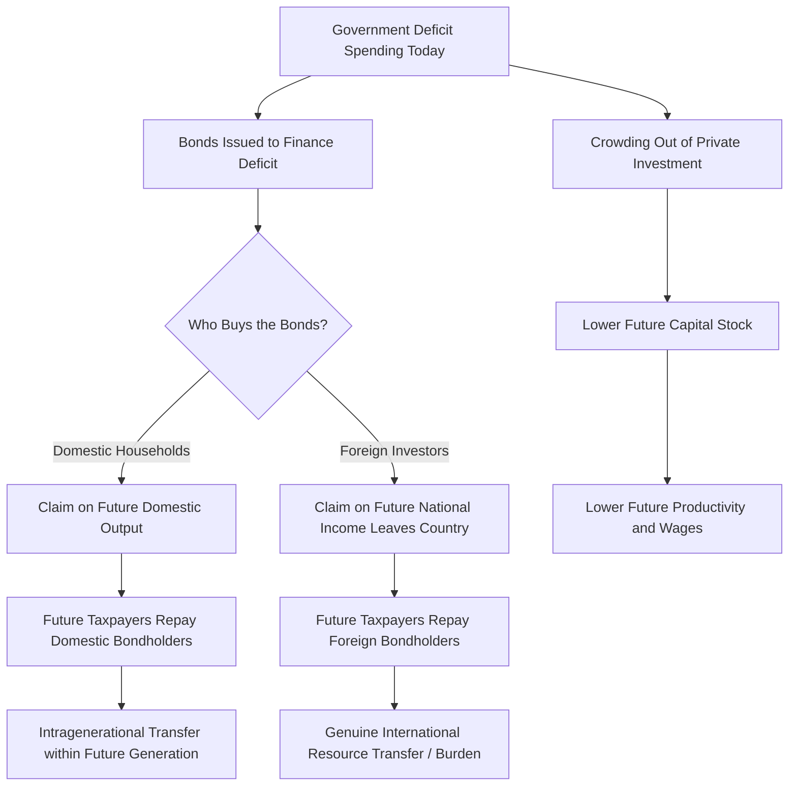

## Intergenerational Burden of Debt

### Definition and Core Concept

The intergenerational burden of debt refers to the theory that government borrowing today shifts the real economic cost of current spending onto future generations, who inherit both the debt obligations and the associated repayment burden. The concept asks: who ultimately pays for government spending financed by borrowing rather than taxation?

The debate splits fundamentally into two camps: those who argue debt burden falls primarily on future generations (the "traditional" or "orthodox" view), and those who argue the burden, in a closed economy, is largely borne by the generation alive when the spending occurs (the "new orthodox" or Ricardian view).

### The Traditional View: Debt Shifts Burden Forward

**Key Points**

- Government debt allows the current generation to consume more (via tax cuts or spending) without an equivalent reduction in current resources
- Future generations must service this debt through higher taxes, reduced public spending, or both
- The burden manifests as reduced consumption possibilities for future taxpayers, not merely a redistribution

The traditional argument rests on the idea that when government issues bonds instead of raising taxes, current citizens can consume goods and services without bearing the full opportunity cost of resources used. Future taxpayers who did not benefit from that spending must pay interest and principal, effectively transferring purchasing power away from them.

**Example**

A government finances a $10 billion infrastructure project entirely through 30-year bonds instead of a one-time tax. The generation building and initially using the infrastructure enjoys the benefit without bearing full cost. Taxpayers 25 years later, many not yet born when the debt was issued, pay taxes to service that debt — potentially crowding out their own priorities (education, healthcare, private investment).

### The Ricardian Equivalence Counterargument

Ricardian Equivalence, formalized by Robert Barro (1974), argues that rational, forward-looking households anticipate that government borrowing today implies higher taxes tomorrow. Consequently, households increase private saving today by the present value of the future tax liability, leaving national consumption and capital formation unchanged regardless of whether spending is tax-financed or debt-financed.

$$S_{private} + \Delta T_{expected} = \text{constant}$$

where an increase in expected future taxes ($\Delta T_{expected}$) is offset one-for-one by an increase in private saving ($S_{private}$).

**Key Points**

- If Ricardian Equivalence holds fully, debt-financed spending imposes no net intergenerational burden because parents bequeath more to offset children's higher future tax burden
- This requires assumptions: rational expectations, operative bequest motives (parents care about heirs' welfare), perfect capital markets, and no borrowing constraints
- In practice, most economists view Ricardian Equivalence as a useful benchmark rather than a literal description of behavior — empirical support is mixed and partial [Inference: the degree of Ricardian offset in real economies is disputed and varies by study and country]

### Mechanisms of Burden Transfer

Three distinct channels are typically identified in the literature:

**1. Crowding Out of Capital Formation**

If government borrowing absorbs savings that would otherwise fund private investment, the capital stock inherited by future generations is smaller than it would have been. This is the mechanism most economists agree produces a genuine intergenerational burden, since a smaller capital stock means lower future productivity, wages, and output — a real resource cost borne by those who work in the future economy.

$$K_{t+1} = K_t + I_t - \delta K_t$$

If deficit-financed borrowing reduces $I_t$ (investment) relative to the counterfactual, $K_{t+1}$ falls, lowering future output per worker.

**2. Domestic vs. External Debt Holders**

- **Debt held domestically**: repayment is largely a transfer *within* the future generation — from future taxpayers to future bondholders (who may be the same people or their heirs). The nation as a whole does not lose real resources to outsiders, though distributional effects occur (often regressive, since bondholders tend to be wealthier).
- **Debt held externally**: repayment requires transferring real resources (via trade surpluses or asset sales) to foreign creditors. This represents an unambiguous net outflow of future national income, making external debt more clearly burdensome. [Inference: the precise welfare cost of external debt depends on the interest rate differential and the use of borrowed funds]

**3. Composition of Spending: Consumption vs. Investment**

**Key Points**

- Debt-financed *investment* (infrastructure, education, R&D) may generate future returns that offset or exceed the debt service cost — future generations inherit both the liability and the productive asset
- Debt-financed *current consumption* (e.g., transfer payments not linked to future productivity) shifts cost forward without a compensating asset
- This distinction underlies the "golden rule" of public finance: borrow only to invest, not to consume

$$\text{Net Intergenerational Burden} \approx \text{PV(Debt Service)} - \text{PV(Future Returns on Financed Assets)}$$

### The Overlapping Generations (OLG) Framework

The formal theoretical apparatus for analyzing intergenerational burden is the Overlapping Generations model (Samuelson 1958; Diamond 1965). In this framework, each generation lives for two (or more) periods — working-age and retired — and overlaps with adjacent generations, allowing debt to genuinely redistribute resources across non-overlapping cohorts (unlike infinite-horizon models where Ricardian Equivalence tends to hold under altruistic bequests).

In the Diamond OLG model, government debt can:

- Reduce the capital stock in steady state (if debt competes with capital as a savings vehicle)
- Permanently lower long-run output and consumption per capita
- Create a real welfare transfer from future generations to the generation that received the initial debt-financed benefit

$$c_{1,t} + \frac{c_{2,t+1}}{1+r} = w_t - \tau_t$$

This lifetime budget constraint shows how current taxes ($\tau_t$) reduce lifetime consumption possibilities, and how debt-financed deferral of $\tau_t$ to future periods reallocates consumption across cohorts.

### Counterarguments and Nuances

**Key Points**

- **"We owe it to ourselves"**: A classic rebuttal (associated with Abba Lerner) argues that domestically-held debt is not a burden on the nation as a whole, since interest payments are transfers among citizens, not a loss of aggregate resources
- **Functional Finance view**: Lerner argued debt sustainability should be judged by its effect on employment and output, not by arbitrary debt-to-GDP thresholds
- **Modern Monetary Theory (MMT) perspective**: For a sovereign currency issuer, government "debt" denominated in its own currency is not analogous to household debt; the binding constraint is inflation/resource availability, not solvency [Speculation: this remains a contested framework among mainstream macroeconomists, with significant disagreement over its policy implications]
- **Growth dilution**: If the economy grows faster than the interest rate on debt ($g > r$), the debt-to-GDP ratio can shrink even without primary surpluses, softening the intergenerational burden

### Empirical and Policy Indicators

| Factor | Increases Burden | Decreases Burden |
| --- | --- | --- |
| Use of borrowed funds | Current consumption | Productive investment |
| Interest rate vs. growth rate | $r > g$ | $r < g$ |
| Debt holder location | External/foreign | Domestic |
| Household behavior | Non-Ricardian (borrowing-constrained) | Ricardian (full offset via saving) |
| Crowding-out effect | Strong | Weak (e.g., liquidity trap, excess savings) |

### Debt Sustainability and the r-g Condition

The evolution of the debt-to-GDP ratio is commonly expressed as:

$$\frac{d_{t}}{Y_t} = \frac{(1+r)}{(1+g)}\frac{d_{t-1}}{Y_{t-1}} - pb_t$$

where $d$ is debt, $Y$ is GDP, $r$ is the real interest rate, $g$ is the real growth rate, and $pb_t$ is the primary balance (surplus positive) as a share of GDP. When $r > g$, debt compounds faster than the economy's ability to grow out of it, requiring larger primary surpluses — falling more heavily on future taxpayers. When $r < g$, the debt burden can passively shrink relative to GDP.

### Diagram: Channels of Intergenerational Transfer

<svg xmlns="http://www.w3.org/2000/svg" viewBox="0 0 800 420" font-family="sans-serif">
<text x="400" y="30" text-anchor="middle" font-size="18" font-weight="bold">Intergenerational Burden of Debt (svg_diagram)</text>
<rect x="30" y="70" width="220" height="60" fill="#dbeafe" stroke="#1e40af" stroke-width="1.5" rx="6" />
<text x="140" y="95" text-anchor="middle" font-size="13" font-weight="bold">Current Generation</text>
<text x="140" y="115" text-anchor="middle" font-size="12">Benefits from spending, avoids taxes</text>
<rect x="30" y="200" width="220" height="60" fill="#fef3c7" stroke="#92400e" stroke-width="1.5" rx="6" />
<text x="140" y="225" text-anchor="middle" font-size="13" font-weight="bold">Government Debt Issued</text>
<text x="140" y="245" text-anchor="middle" font-size="12">Bonds sold to savers</text>
<rect x="30" y="330" width="220" height="60" fill="#fee2e2" stroke="#991b1b" stroke-width="1.5" rx="6" />
<text x="140" y="355" text-anchor="middle" font-size="13" font-weight="bold">Future Generation</text>
<text x="140" y="375" text-anchor="middle" font-size="12">Pays taxes to service debt</text>
<rect x="320" y="130" width="220" height="60" fill="#e0e7ff" stroke="#3730a3" stroke-width="1.5" rx="6" />
<text x="430" y="155" text-anchor="middle" font-size="13" font-weight="bold">Crowding Out</text>
<text x="430" y="175" text-anchor="middle" font-size="12">Less private investment</text>
<rect x="320" y="270" width="220" height="60" fill="#dcfce7" stroke="#166534" stroke-width="1.5" rx="6" />
<text x="430" y="295" text-anchor="middle" font-size="13" font-weight="bold">Smaller Capital Stock</text>
<text x="430" y="315" text-anchor="middle" font-size="12">Lower future productivity</text>
<rect x="590" y="200" width="180" height="60" fill="#f3e8ff" stroke="#6b21a8" stroke-width="1.5" rx="6" />
<text x="680" y="225" text-anchor="middle" font-size="13" font-weight="bold">Real Burden</text>
<text x="680" y="245" text-anchor="middle" font-size="12">Lower wages/output</text>
<line x1="140" y1="130" x2="140" y2="200" stroke="#334155" stroke-width="2" marker-end="url(#arrow)" />
<line x1="140" y1="260" x2="140" y2="330" stroke="#334155" stroke-width="2" marker-end="url(#arrow)" />
<line x1="250" y1="220" x2="320" y2="170" stroke="#334155" stroke-width="2" marker-end="url(#arrow)" />
<line x1="430" y1="190" x2="430" y2="270" stroke="#334155" stroke-width="2" marker-end="url(#arrow)" />
<line x1="540" y1="300" x2="590" y2="240" stroke="#334155" stroke-width="2" marker-end="url(#arrow)" />
<line x1="250" y1="360" x2="590" y2="245" stroke="#334155" stroke-width="1.5" stroke-dasharray="4,3" marker-end="url(#arrow)" />
</svg>

### Distinguishing Nominal Debt Burden from Real Resource Burden

**Key Points**

- The often-cited "national debt per baby" figures represent a nominal accounting burden, not necessarily the real economic burden
- The real burden depends on what the borrowed resources were used for, who holds the debt, and macroeconomic conditions (crowding out, growth rate) at the time
- A government can run persistent deficits without proportionally harming future generations if debt-financed investment raises future productive capacity sufficiently

### Policy Implications

- **Golden Rule fiscal policy**: borrow only for capital investment, balance the budget for current spending
- **Debt brakes / fiscal rules**: caps on deficit-to-GDP or debt-to-GDP ratios (e.g., EU's Stability and Growth Pact) attempt to limit intergenerational transfer
- **Generational accounting**: a method developed by Auerbach, Gokhale, and Kotlikoff to measure the net fiscal burden (taxes paid minus benefits received) facing current versus future generations under existing policy
- **Entitlement reform debates**: unfunded liabilities in pension and healthcare systems are often analyzed through the same intergenerational lens as explicit government debt

**Related Topics**

- Ricardian Equivalence and its empirical tests
- Overlapping Generations (OLG) models
- Crowding-out effect and the loanable funds market
- Debt-to-GDP dynamics and the $r > g$ / $r < g$ condition
- Generational accounting methodology
- Modern Monetary Theory and functional finance
- Public debt sustainability analysis
- Golden Rule of public finance
- Fiscal rules and debt brakes (e.g., EU Stability and Growth Pact)
- External vs. domestic public debt