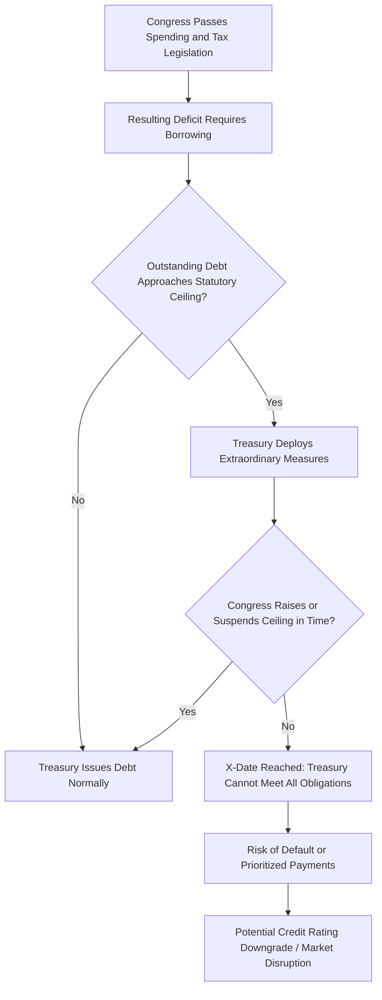

## Fiscal Rules and Debt Ceilings

### Definition and Purpose

Fiscal rules are numerical constraints on budgetary policy — typically expressed as targets or ceilings on deficits, debt, spending, or revenue — designed to ensure fiscal discipline, sustainability, and credibility. They act as institutional commitment devices that limit the discretion of governments, addressing the time-inconsistency problem where politicians face short-term incentives to overspend even when long-term restraint is optimal.

**Key Points**

- Fiscal rules aim to correct the deficit bias observed in democratic political systems
- They constrain policymakers ex ante rather than relying on ex post market discipline alone
- Effectiveness depends heavily on design, enforcement mechanisms, and escape clauses

### Rationale: The Deficit Bias Problem

Several political-economy mechanisms explain why governments tend to run persistent deficits absent constraints:

- **Common pool problem**: spending programs benefit concentrated groups while costs are diffused across all taxpayers, creating incentive to overspend
- **Time inconsistency**: current governments discount the costs debt imposes on future administrations and generations
- **Electoral cycles**: incumbents may increase spending or cut taxes before elections (political business cycle), then adjust after
- **War of attrition**: coalition governments may delay unpopular fiscal adjustment, each faction waiting for others to bear the cost of consolidation

Fiscal rules are designed as a solution analogous to Ulysses binding himself to the mast — a pre-commitment mechanism that removes discretion during moments of political temptation.

### Typology of Fiscal Rules

**1. Budget Balance Rules**

Constrain the deficit or surplus, often as a percentage of GDP.

- *Overall balance rule*: limits total deficit (e.g., Eurozone's 3%-of-GDP limit under the Stability and Growth Pact)
- *Structural balance rule*: targets the deficit adjusted for the business cycle and one-off factors, allowing automatic stabilizers to operate
- *Cyclically-adjusted balance*: removes the estimated cyclical component of the deficit to isolate discretionary policy stance

$$SB_t = D_t - \alpha (Y_t - Y_t^{*})$$

where $SB_t$ is the structural balance, $D_t$ the actual deficit, $\alpha$ the budget sensitivity to the output gap, and $(Y_t - Y_t^{*})$ the output gap (actual minus potential GDP).

**2. Debt Rules**

Set an explicit ceiling on public debt as a share of GDP (e.g., the Maastricht Treaty's 60%-of-GDP reference value).

**3. Expenditure Rules**

Cap the growth rate of government spending, often independent of revenue fluctuations, providing a more directly controllable instrument since spending is under more direct government control than revenue.

**4. Revenue Rules**

Set ceilings or floors on revenue collection or windfall use, less common as standalone rules.

**5. Golden Rules**

Permit borrowing only for capital investment, requiring current spending to be balanced by current revenue.

$$\text{Golden Rule: } G_t^{current} \leq T_t \quad \text{(borrowing permitted only for } G_t^{investment}\text{)}$$

### Comparison Table

| Rule Type | Target Variable | Main Strength | Main Weakness |
| --- | --- | --- | --- |
| Budget balance | Deficit/GDP | Simple, transparent | Pro-cyclical if not cyclically adjusted |
| Structural balance | Cyclically-adjusted deficit | Allows automatic stabilizers | Output gap estimates are uncertain and revised |
| Debt rule | Debt/GDP | Directly targets sustainability | Slow-moving, weak short-term signal |
| Expenditure rule | Spending growth | Directly controllable, simple to monitor | Can incentivize revenue-side gaming (tax expenditures) |
| Golden rule | Current balance | Protects public investment | Investment can be mis-defined or gamed |

### Debt Ceilings: A Distinct Mechanism

A debt ceiling differs from a debt *rule* in that it is typically a legislatively-set statutory limit on the total amount of debt the government (specifically the Treasury) is authorized to issue, rather than a target tied to GDP or fiscal balance.

**Key Points**

- The debt ceiling constrains the *stock* of debt outstanding, not the flow of new borrowing decisions directly
- It creates a structural conflict when spending/revenue legislation (which determines the deficit) is decided separately from the borrowing authorization (the ceiling itself)
- This separation can produce "debt ceiling crises" — situations where authorized borrowing is exhausted before Congress/parliament raises the limit, risking default or government shutdown

**Example: U.S. Debt Ceiling**

The United States is a prominent example of a statutory debt ceiling system, dating to the Second Liberty Bond Act of 1917. Congress sets a specific dollar limit on total outstanding federal debt; when the Treasury approaches this limit, it must use "extraordinary measures" (accounting maneuvers such as suspending investments in certain government funds) to avoid breaching it, until Congress passes legislation to raise or suspend the ceiling.

Most other advanced economies do not use a separate statutory debt ceiling mechanism of this kind; fiscal constraint is instead typically embedded directly in deficit or debt rules tied to the budget process itself, making the U.S. institutional structure comparatively distinctive. [Inference: cross-country institutional comparisons are subject to frequent legislative change and should be verified against current sources for any specific country]

### International Examples of Fiscal Rules

**European Union — Stability and Growth Pact (SGP)**

- Deficit ceiling: 3% of GDP
- Debt ceiling: 60% of GDP (reference value, with correction mechanism if exceeded)
- Reformed multiple times (notably 2011 "Six-Pack," 2013 "Two-Pack," and a significant 2024 overhaul introducing country-specific medium-term fiscal-structural plans with debt sustainability analysis as the anchor)

**Germany — Debt Brake (Schuldenbremse)**

- Constitutional rule limiting the structural federal deficit to 0.35% of GDP
- States (Länder) generally prohibited from running structural deficits at all
- Includes an escape clause for exceptional circumstances (natural disasters, severe recessions) requiring a supermajority vote

**Switzerland — Debt Brake**

- Expenditure rule linking spending ceilings to estimated cyclically-adjusted revenue
- Widely cited as one of the more successfully enforced rules, associated with a declining debt-to-GDP trajectory since adoption in 2003 [Inference: causal attribution of Swiss debt trends solely to the rule versus other macroeconomic factors is debated among researchers]

**Chile — Structural Balance Rule**

- Targets a structural fiscal balance adjusted for copper price and output gap fluctuations, given the economy's dependence on copper export revenue
- Often cited as a model for commodity-dependent economies managing resource revenue volatility

### Enforcement Mechanisms and Institutional Design

**Key Points**

- **Legal basis**: constitutional (strongest, hardest to override — e.g., Germany) vs. statutory (easier to amend) vs. political/coalition agreement (weakest)
- **Independent fiscal institutions**: fiscal councils or watchdogs (e.g., the UK's Office for Budget Responsibility, the EU's national independent fiscal institutions) monitor compliance and produce independent forecasts, reducing the temptation to use overly optimistic assumptions
- **Escape clauses**: pre-defined conditions (recessions, natural disasters, wars) under which rules may be temporarily suspended — necessary for credibility (avoiding rules that are ignored during genuine crises) but also a source of potential abuse if defined too loosely
- **Correction mechanisms**: automatic or mandated adjustment paths when a rule is breached

### Design Trade-offs

| Design Dimension | Trade-off |
| --- | --- |
| Simplicity vs. Economic Nuance | Simple rules (headline deficit) are easy to monitor but can be pro-cyclical; nuanced rules (structural balance) are more economically sound but harder to measure and easier to game |
| Flexibility vs. Credibility | Escape clauses preserve usefulness during crises but can erode credibility if invoked opportunistically |
| Numerical Rigidity vs. Political Feasibility | Very strict rules may be breached and abandoned, damaging future credibility; loose rules may not bind meaningfully |
| National vs. Supranational Enforcement | Supranational rules (EU) face weaker enforcement since sanctioning sovereign member states is politically difficult |

### Effectiveness: Empirical and Theoretical Considerations

**Key Points**

- Fiscal rules are generally associated with improved fiscal discipline in the empirical literature, though compliance rates vary substantially and enforcement gaps are common, particularly for supranational rules
- Rules with independent monitoring bodies and clear correction mechanisms tend to show stronger compliance outcomes than purely self-enforced rules [Inference: comparative effectiveness estimates vary by study methodology and time period]
- A well-known criticism is that overly rigid rules can force pro-cyclical austerity during downturns (cutting spending when the economy is already weak), potentially deepening recessions
- The 2020 COVID-19 pandemic triggered widespread suspension of fiscal rules globally (e.g., the EU's general escape clause activated 2020–2023), illustrating both the necessity and the fragility of rule-based frameworks during large shocks

### Debt Sustainability as the Underlying Anchor

Modern fiscal rule frameworks increasingly emphasize debt sustainability analysis (DSA) as the anchor, rather than a single arbitrary threshold. The EU's 2024 fiscal framework reform, for instance, shifted toward country-specific, risk-based debt trajectories informed by DSA rather than a uniform 3%/60% rule applied identically to all member states.

$$\Delta d_t = \left(\frac{r - g}{1+g}\right)d_{t-1} - pb_t + sfa_t$$

where $d$ is the debt-to-GDP ratio, $r$ the effective interest rate, $g$ the nominal growth rate, $pb_t$ the primary balance, and $sfa_t$ stock-flow adjustments (e.g., valuation effects, one-off financial operations).

### Diagram: Fiscal Rule Taxonomy

<svg xmlns="http://www.w3.org/2000/svg" viewBox="0 0 800 400" font-family="sans-serif">
<text x="400" y="28" text-anchor="middle" font-size="18" font-weight="bold">Fiscal Rule Taxonomy (svg_diagram)</text>
<rect x="320" y="55" width="160" height="45" fill="#1e3a8a" rx="6" />
<text x="400" y="83" text-anchor="middle" font-size="13" fill="#ffffff" font-weight="bold">Fiscal Rules</text>
<rect x="40" y="150" width="140" height="55" fill="#dbeafe" stroke="#1e40af" rx="6" />
<text x="110" y="172" text-anchor="middle" font-size="12" font-weight="bold">Balance Rules</text>
<text x="110" y="190" text-anchor="middle" font-size="10">Overall / Structural</text>
<rect x="200" y="150" width="140" height="55" fill="#fef3c7" stroke="#92400e" rx="6" />
<text x="270" y="172" text-anchor="middle" font-size="12" font-weight="bold">Debt Rules</text>
<text x="270" y="190" text-anchor="middle" font-size="10">Debt/GDP ceiling</text>
<rect x="360" y="150" width="140" height="55" fill="#dcfce7" stroke="#166534" rx="6" />
<text x="430" y="172" text-anchor="middle" font-size="12" font-weight="bold">Expenditure Rules</text>
<text x="430" y="190" text-anchor="middle" font-size="10">Spending growth cap</text>
<rect x="520" y="150" width="120" height="55" fill="#f3e8ff" stroke="#6b21a8" rx="6" />
<text x="580" y="172" text-anchor="middle" font-size="12" font-weight="bold">Revenue Rules</text>
<text x="580" y="190" text-anchor="middle" font-size="10">Windfall/floor rules</text>
<rect x="650" y="150" width="130" height="55" fill="#fee2e2" stroke="#991b1b" rx="6" />
<text x="715" y="172" text-anchor="middle" font-size="12" font-weight="bold">Golden Rule</text>
<text x="715" y="190" text-anchor="middle" font-size="10">Invest-only borrowing</text>
<line x1="400" y1="100" x2="110" y2="150" stroke="#334155" stroke-width="1.5" />
<line x1="400" y1="100" x2="270" y2="150" stroke="#334155" stroke-width="1.5" />
<line x1="400" y1="100" x2="430" y2="150" stroke="#334155" stroke-width="1.5" />
<line x1="400" y1="100" x2="580" y2="150" stroke="#334155" stroke-width="1.5" />
<line x1="400" y1="100" x2="715" y2="150" stroke="#334155" stroke-width="1.5" />
<rect x="250" y="260" width="300" height="60" fill="#f1f5f9" stroke="#334155" rx="6" />
<text x="400" y="282" text-anchor="middle" font-size="12" font-weight="bold">Enforcement Layer</text>
<text x="400" y="300" text-anchor="middle" font-size="10">Independent fiscal councils, correction mechanisms, escape clauses</text>
<line x1="270" y1="205" x2="350" y2="260" stroke="#94a3b8" stroke-width="1" stroke-dasharray="3,2" />
<line x1="430" y1="205" x2="420" y2="260" stroke="#94a3b8" stroke-width="1" stroke-dasharray="3,2" />
<line x1="580" y1="205" x2="480" y2="260" stroke="#94a3b8" stroke-width="1" stroke-dasharray="3,2" />

<text x="400" y="360" text-anchor="middle" font-size="11" fill="`#475569`">Debt Ceilings (e.g., U.S.) operate as a separate statutory borrowing-authorization limit</text>

</svg>

### Criticisms and Alternative Views

- **MMT and functional finance critique**: argue fiscal rules based on arbitrary deficit/debt thresholds ignore the real constraint (inflation and resource capacity) for currency-issuing sovereign governments [Speculation: heterodox in mainstream macroeconomic policy circles, with significant disagreement over applicability]
- **Political economy critique**: rules can be circumvented via creative accounting, off-budget entities, or repeated escape-clause invocation, undermining their intended discipline
- **Pro-cyclicality critique**: rigid numerical targets, if not properly cyclically adjusted, can force contractionary policy exactly when counter-cyclical stimulus is needed

**Next Steps**

- Debt sustainability analysis (DSA) methodology
- Automatic stabilizers and cyclical vs. structural deficits
- The Stability and Growth Pact: history and 2024 reform
- Fiscal councils and independent fiscal institutions
- Ricardian Equivalence and its relevance to rule design
- U.S. debt ceiling history and "extraordinary measures"
- Sovereign credit ratings and market discipline as alternatives to rules
- Modern Monetary Theory's critique of debt/deficit constraints
- Pro-cyclical vs. counter-cyclical fiscal policy