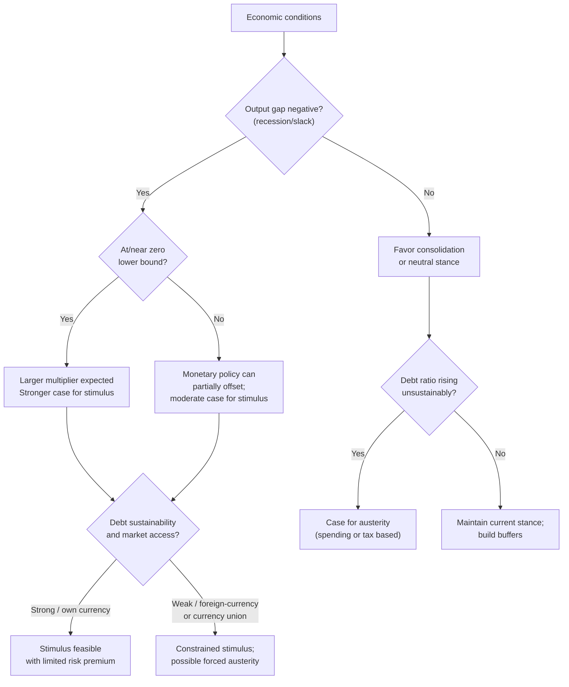

## Austerity versus Stimulus Debates

### Overview

Austerity and stimulus represent two opposing fiscal policy responses to economic downturns and elevated government debt. Austerity refers to deliberate government policies that reduce budget deficits through spending cuts, tax increases, or both, typically justified by concerns over debt sustainability or investor confidence. Stimulus refers to deliberate increases in the deficit through higher spending or tax cuts, intended to boost aggregate demand and output during a downturn. The debate between these approaches centers on the size and sign of fiscal multipliers, the behavior of interest rates and confidence under different debt trajectories, and the appropriate timing of consolidation relative to the business cycle.

### Theoretical Foundations

#### The Keynesian Case for Stimulus

The Keynesian framework holds that during a recession, private demand falls short of potential output because of weak consumption, investment, or net exports. Government spending or tax cuts can fill this "output gap" by directly or indirectly raising aggregate demand. The core mechanism is the fiscal multiplier:

$$k = \frac{1}{1 - MPC(1-t)}$$

where $MPC$ is the marginal propensity to consume and $t$ is the marginal tax rate. In a simple closed-economy model with no crowding out, a multiplier greater than 1 implies that a dollar of government spending raises output by more than a dollar, because the initial spending generates rounds of induced consumption.

Keynesians argue multipliers are especially large when:

- The economy is at the zero lower bound (ZLB), so expansionary fiscal policy does not raise interest rates and crowd out private spending
- There is significant economic slack (high unemployment, idle capacity)
- The stimulus is directed at credit-constrained households with high MPC
- Monetary policy is unable or unwilling to offset the fiscal expansion

#### The Case for Austerity

Advocates of austerity draw on several distinct arguments:

**Debt sustainability**: If debt-to-GDP is on an explosive path, deficits must eventually be reduced to avoid default, inflation, or forced abrupt adjustment. The debt dynamics equation is:

$$\Delta d_t = \left(\frac{r - g}{1+g}\right) d_{t-1} - pb_t$$

where $d_t$ is the debt-to-GDP ratio, $r$ is the real interest rate, $g$ is the real growth rate, and $pb_t$ is the primary balance (surplus) as a share of GDP. When $r > g$, debt compounds faster than the economy grows, and a persistent primary deficit produces an ever-rising debt ratio.

**Ricardian equivalence**: Under strict Ricardian equivalence, rational households anticipate that current deficits imply future tax increases and save the stimulus rather than spend it, so the multiplier approaches zero. This is a theoretical benchmark rather than an empirical norm; most evidence rejects strict Ricardian equivalence, though partial forward-looking behavior is observed.

**Expansionary fiscal contraction (EFC) hypothesis**: Associated with Alberto Alesina and collaborators, this view holds that credible, spending-based deficit reduction can be expansionary if it improves confidence, lowers risk premia on government debt, and signals lower future tax burdens, thereby crowding in private investment and consumption. [Inference] The empirical support for large expansionary effects is contested and appears sensitive to the specific historical episodes and country conditions studied.

**Crowding out**: In a classical or neoclassical framework, government borrowing competes with private borrowers for a limited pool of savings, raising interest rates and displacing private investment, particularly when the economy is near full employment.

### Key Empirical Debates

#### Multiplier Size Estimates

Fiscal multiplier estimates vary considerably across studies, model specifications, and economic conditions. Broad empirical patterns that have emerged in the literature include:

| Condition | Typical multiplier range | Mechanism |
| --- | --- | --- |
| Normal times, flexible exchange rate | ~0.3–0.8 | Partial monetary offset, some crowding out |
| Deep recession / ZLB | ~1.0–1.8 | No monetary offset, high slack, credit constraints |
| Fixed exchange rate / currency union | Higher end of range | No independent monetary policy to offset |
| Open economy, high import share | Lower | Demand leaks abroad via imports |
| Tax-based consolidation | Smaller contractionary effect (in EFC framework) | Confidence and incentive channels |
| Spending-based consolidation | Larger contractionary effect (in standard Keynesian framework) | Direct demand withdrawal |

[Unverified] Precise point estimates differ by author, methodology (structural VAR, narrative/instrumental variable approach, DSGE calibration), country sample, and time period, so these ranges should be read as indicative rather than definitive.

#### The Reinhart-Rogoff Episode

A widely cited 2010 paper by Carmen Reinhart and Kenneth Rogoff argued that median growth rates fall markedly once gross government debt exceeds roughly 90% of GDP, a finding invoked by some policymakers to justify austerity following the 2008–09 financial crisis. In 2013, researchers at the University of Massachusetts Amherst (Thomas Herndon, Michael Ash, and Robert Pollin) identified a spreadsheet coding error, selective exclusion of certain country-years, and an unconventional weighting scheme in the original analysis; when corrected, the sharp growth cliff at 90% debt-to-GDP largely disappeared, though a more moderate negative association between high debt and growth remained. This episode is frequently cited as a cautionary example in the applied econometrics of debt thresholds and is a recurring case study in the austerity-stimulus literature. [Unverified: specific corrected coefficient values vary by which follow-up study is consulted.]

#### European Austerity, 2010–2015

Following the Eurozone sovereign debt crisis, Greece, Portugal, Ireland, Spain, and Italy undertook substantial fiscal consolidation, often as a condition of financial assistance from the "Troika" (European Commission, European Central Bank, International Monetary Fund). Outcomes were widely debated:

- **Pro-austerity view**: Consolidation was necessary to restore market access and avoid disorderly default; countries that consolidated (e.g., Ireland) eventually returned to growth.
- **Critical view**: Front-loaded, spending-heavy austerity during a period when policy rates were already near zero (limiting monetary offset) and applied simultaneously across many trading partners (limiting the demand-leakage benefit any single country might get from currency depreciation or export growth) produced multipliers larger than officially assumed, deepening and prolonging recessions, notably in Greece.

The IMF itself published a notable 2013 reassessment (Blanchard and Leigh) acknowledging that fiscal multipliers used in early crisis forecasts had likely been underestimated, implying that projected consolidation costs were understated in real time. [Inference] This is generally read as an implicit institutional acknowledgment that the growth costs of austerity in that specific episode were larger than initially modeled, though the IMF's broader policy stance did not abandon fiscal consolidation as a tool.

#### The 2008–09 Global Stimulus Response

In contrast, the U.S. American Recovery and Reinvestment Act (2009) and coordinated G20 stimulus represented the stimulus side of the debate. Assessments of the U.S. package's effects on output and employment vary by model and estimation method, with a range of multiplier estimates in the literature; some studies find effects consistent with a multiplier near or above 1, while others find smaller effects. [Unverified] Specific numerical impact estimates are model-dependent and are best treated as a range rather than a single settled figure.

### Determinants of Which Regime Is Appropriate

#### Business Cycle Position

A widely shared principle across the theoretical spectrum, though weighted differently by different schools, is that the state of the economy matters:

- **During a recession or with a large negative output gap**: Standard Keynesian analysis favors stimulus, since idle resources mean added demand raises output rather than merely raising prices or interest rates.
- **During an expansion or with output near or above potential**: Standard analysis favors consolidation (or at least deficit-neutral policy), since additional demand mainly raises prices and crowds out private activity. This "counter-cyclical" prescription — running deficits in downturns and surpluses (or smaller deficits) in booms — is a near-consensus normative benchmark, even though actual fiscal policy in many countries has tended to be pro-cyclical or has run deficits persistently across the cycle. [Inference] The empirical pattern of pro-cyclical or persistently deficit-prone fiscal policy is well documented in the political-economy literature, though the precise degree varies by country and period.

#### Monetary Policy Constraints

The interaction between fiscal and monetary policy substantially affects the relative case for stimulus versus austerity:

- **At the zero lower bound (ZLB)**: Central banks cannot cut nominal rates further to offset fiscal contraction or accommodate fiscal expansion through lower rates, so fiscal multipliers are typically estimated to be larger in both directions.
- **Away from the ZLB**: Central banks can offset fiscal stimulus by raising rates (reducing its net effect on output) or cushion fiscal contraction by cutting rates (reducing its contractionary effect), a dynamic sometimes called monetary offset.
- **Fixed exchange rate or currency union members** (e.g., Eurozone members) lack an independent monetary policy lever entirely, which some analyses suggest raises the effective multiplier of fiscal policy relative to countries with independent, flexible-rate monetary policy. [Inference] The magnitude of this effect is debated and depends on capital mobility and exchange rate regime specifics.

#### Debt Level and Market Access

- **Countries with low debt and strong market access** (own-currency borrowers with deep, liquid government bond markets) face fewer constraints on running stimulus deficits, since interest rate risk premia are less sensitive to near-term deficit changes.
- **Countries with high debt or limited market access** (especially those borrowing in foreign currency or without a sovereign central bank, such as individual Eurozone members) face a higher risk that markets demand a rising risk premium, potentially forcing austerity regardless of the cyclical position — sometimes called the "bond vigilante" constraint. [Inference] Whether and when markets actually impose this discipline (versus tolerating higher deficits) is empirically variable and has been a central point of dispute, particularly regarding whether currency-issuing sovereigns with independent central banks (e.g., the U.S., Japan, U.K.) face materially different constraints than currency users (e.g., individual Eurozone states).

#### Composition of Fiscal Adjustment

Within both stimulus and austerity, the composition of measures matters for output effects:

- **Spending-based stimulus** (infrastructure, transfers to high-MPC households) tends to have larger multipliers than **tax-based stimulus** (broad-based tax cuts), because transfers and direct spending are less likely to be saved.
- **Spending-based austerity** (cuts to public investment, transfers, public employment) tends to be more contractionary in standard Keynesian models than **tax-based austerity** (revenue increases via base-broadening), though the EFC literature disputes the direction of this asymmetry, arguing spending cuts can be more credible signals of fiscal discipline.

### Modern Monetary and Institutional Perspectives

#### Modern Monetary Theory (MMT) View

MMT proponents argue that a sovereign currency issuer with its own central bank (not pegged to another currency and not borrowing in foreign currency) faces no solvency constraint analogous to a household or firm, since it can always create the currency needed to service debt denominated in that currency. In this framework, the binding constraint on stimulus is inflation and real resource availability, not the deficit or debt ratio per se, and austerity aimed purely at reducing debt ratios (absent inflation concerns) is viewed as unnecessary and potentially harmful to output and employment. [Speculation] This remains a minority position within mainstream academic macroeconomics, and most practicing central banks and treasury departments continue to treat debt sustainability and interest costs as independently relevant policy constraints, so the practical applicability of the MMT framework to specific policy choices is disputed among economists.

#### Fiscal Rules and Institutional Constraints

Many countries and currency unions impose fiscal rules intended to structurally limit deficits and debt, shaping the stimulus-austerity choice independent of the pure economic case:

- The EU's Stability and Growth Pact historically set reference values of 3% of GDP for the annual deficit and 60% of GDP for gross debt, with an excessive deficit procedure for non-compliance.
- Balanced-budget rules at the U.S. state level constrain counter-cyclical stimulus at that level of government, shifting the burden of counter-cyclical fiscal policy toward the federal government.
- Debt brakes (e.g., Germany's "Schuldenbremse") constrain structural deficits to a small percentage of GDP, generally exempting cyclical components.

These rules are a recurring point of friction in the austerity-stimulus debate: critics argue rigid rules prevent adequate counter-cyclical stimulus during downturns, while proponents argue rules are necessary to prevent deficit bias and maintain long-run credibility.

### Illustrative Diagram: Policy Choice Under Different Conditions

### Comparative Summary

**Key Points**

- Stimulus raises deficits deliberately to expand aggregate demand; austerity reduces deficits deliberately to control debt or restore confidence.
- The Keynesian multiplier framework predicts stimulus is most effective with economic slack and a binding zero lower bound; classical/neoclassical framework predicts crowding out dominates near full employment.
- The expansionary fiscal contraction (EFC) hypothesis argues credible austerity can boost confidence and private investment, but this remains empirically contested.
- The Reinhart-Rogoff 90% debt threshold finding was significantly weakened after a 2013 correction of coding and methodological errors, illustrating the sensitivity of debt-growth threshold claims to empirical specification.
- European austerity (2010–2015) is widely cited as an episode where realized output costs exceeded initial official projections, prompting an IMF reassessment of multiplier assumptions (Blanchard and Leigh, 2013).
- The appropriate stance depends jointly on the output gap, monetary policy space, debt sustainability and market access, and currency sovereignty — there is no single multiplier or threshold that applies universally across countries and time periods.

### Example: Simplified Multiplier Comparison

Consider a hypothetical economy with $MPC = 0.8$ and marginal tax rate $t = 0.25$.

Closed-economy multiplier with no crowding out:

$$k = \frac{1}{1 - 0.8(1-0.25)} = \frac{1}{1 - 0.6} = 2.5$$

If the same economy is instead near full capacity and the central bank offsets stimulus with higher interest rates that reduce investment one-for-one with the fiscal impulse, the effective multiplier could fall toward or below 1, illustrating why the same nominal stimulus package can have very different real output effects depending on cyclical and policy conditions. [Inference] This stylized example abstracts from open-economy leakages, expectations effects, and dynamic adjustment paths present in fuller macroeconomic models.

**Next Steps**

- Fiscal multipliers: theory, measurement, and state-dependence
- Automatic stabilizers versus discretionary fiscal policy
- Debt sustainability analysis and the $r - g$ differential
- Zero lower bound and the interaction of monetary and fiscal policy
- Sovereign debt crises and the Eurozone periphery (2010–2015)
- Ricardian equivalence: theory and empirical tests
- Fiscal rules and debt brakes (Stability and Growth Pact, Schuldenbremse)
- Modern Monetary Theory: claims, critiques, and mainstream responses
- Political economy of deficit bias and pro-cyclical fiscal policy
- Currency sovereignty and constraints on fiscal space