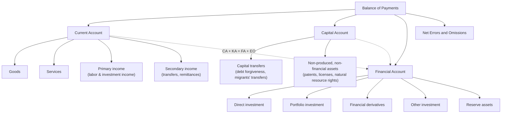

## Balance of Payments Accounting: Current and Capital Accounts

### Overview

The balance of payments (BOP) is a systematic double-entry accounting record of all economic transactions between residents of one country and residents of the rest of the world over a given period, typically a quarter or year. Because it is constructed using double-entry bookkeeping, the BOP always balances by construction: total credits equal total debits. It is compiled following international standards set out in the IMF's *Balance of Payments and International Investment Position Manual* (BPM6), which structures the accounts into three main components: the current account, the capital account, and the financial account.

### Double-Entry Principle

Every international transaction generates two offsetting entries in the BOP:

- A **credit** (recorded with a positive sign): exports of goods/services, income received from abroad, or a reduction in foreign assets/increase in foreign liabilities
- A **debit** (recorded with a negative sign): imports of goods/services, income paid abroad, or an increase in foreign assets/decrease in foreign liabilities

For example, if a domestic firm exports $1,000 of goods and is paid via a deposit into its foreign bank account, this generates a credit of $1,000 in the current account (export of goods) and a debit of $1,000 in the financial account (increase in the firm's foreign assets, i.e., a capital outflow).

### The Current Account

The current account (CA) records transactions in goods, services, primary income, and secondary income (transfers) that do not create future repayment obligations. It is the component most closely associated with a country's "trade balance" in everyday usage, though it is broader than trade alone.

#### Components

**Goods (merchandise trade)**: Physical exports and imports, recorded at market value, generally on a "free on board" (FOB) basis at the border of the exporting country.

**Services**: Cross-border trade in transportation, travel/tourism, financial services, insurance, royalties and licensing fees, telecommunications, and other intangible services.

**Primary income**: Income flows related to the use of factors of production across borders — compensation of employees working temporarily abroad, and investment income (dividends, interest, and reinvested earnings) on cross-border holdings of equity, debt, and direct investment.

**Secondary income (current transfers)**: One-way flows with no corresponding economic value received in return, such as workers' remittances, foreign aid grants, and pension payments to non-residents.

The current account balance is:

$$CA = (X - M) + NY + NCT$$

where $X$ is exports of goods and services, $M$ is imports of goods and services, $NY$ is net primary income from abroad, and $NCT$ is net current transfers.

#### Relationship to National Saving and Investment

A foundational macroeconomic identity links the current account to domestic saving and investment. Starting from the national income identity:

$$Y = C + I + G + (X - M)$$

and defining national saving $S = Y - C - G$, rearranging gives:

$$CA \approx S - I$$

This identity shows that a current account deficit is, by definition, equivalent to domestic investment exceeding domestic saving — implying the country is a net borrower from the rest of the world. A current account surplus means national saving exceeds domestic investment, implying the country is a net lender to the rest of the world.

### The Capital Account

The capital account is the smallest and most narrowly defined of the BOP accounts under BPM6. It records:

- **Capital transfers**: Transactions involving the transfer of ownership of fixed assets, forgiveness of debt, and migrants' transfers of assets when changing residence
- **Acquisition/disposal of non-produced, non-financial assets**: Rights to natural resources, patents, copyrights, trademarks, franchises, and similar intangible rights not classified as produced goods

[Unverified] The capital account is typically small relative to the current and financial accounts for most economies, though its relative size can be more significant for countries receiving substantial debt forgiveness or large capital transfer flows in a given period.

Note on terminology: colloquially, and in older or non-BPM6 presentations (including some textbooks and the older U.S. BOP presentation prior to full BPM6 adoption), "capital account" is sometimes used loosely to refer to what BPM6 calls the **financial account** (portfolio investment, direct investment, and reserve asset flows). This is a frequent source of confusion; under the current international standard, the capital account (transfers and non-produced assets) is distinct from the financial account (financial claims and liabilities).

### The Financial Account

Although the item under discussion is framed as "current and capital accounts," the financial account is required to complete the accounting identity and is documented here for completeness.

The financial account records net acquisition and disposal of financial assets and liabilities, categorized by functional type:

| Category | Description |
| --- | --- |
| Direct investment | Cross-border investment with a lasting interest and significant influence (conventionally, ≥10% equity ownership) |
| Portfolio investment | Cross-border holdings of equity and debt securities below the direct investment threshold |
| Financial derivatives | Net flows from derivative instruments (options, swaps, forwards) |
| Other investment | Loans, currency and deposits, trade credit, and other claims not elsewhere classified |
| Reserve assets | Changes in the central bank's foreign exchange reserves, monetary gold, SDR holdings, and reserve position in the IMF |

### The Fundamental BOP Identity

Because the BOP is a closed double-entry system:

$$CA + KA + FA + EO = 0$$

where $CA$ is the current account balance, $KA$ is the capital account balance, $FA$ is the financial account balance (recorded here with net lending/borrowing sign convention such that a financial outflow is positive), and $EO$ is net errors and omissions, a balancing/statistical discrepancy item that captures measurement error, timing mismatches, and unrecorded transactions.

An equivalent and commonly used presentation is:

$$CA + KA = FA + EO$$

expressing that the sum of the current and capital account balances (the economy's net lending/borrowing to the rest of the world) must be matched by an equal and opposite net financial flow — i.e., a current account surplus must be "financed" by net acquisition of foreign financial assets (or reserve accumulation), and a current account deficit must be financed by net foreign borrowing, inward investment, or drawdown of reserves.

### Illustrative Diagram: Balance of Payments Structure

### Worked Example: Recording a Transaction

**Example**

A U.S. software company licenses its product to a firm in Germany for $500,000, and the German firm pays by wire transfer into the U.S. company's account held at a U.S. bank, which in turn holds the funds via a correspondent relationship that increases U.S. banks' foreign liabilities.

Recording:

1. **Current account credit of $500,000**: export of services (royalties/licensing fees under primary or services classification depending on the precise nature of the license)
2. **Financial account debit of $500,000**: increase in U.S. liabilities to foreign residents (the German firm's payment ultimately reflects a financial claim being settled), or equivalently a reduction in the German firm's foreign assets

This single economic transaction generates exactly offsetting entries, illustrating why the BOP always balances in aggregate, even though individual sub-accounts (like the current account alone) can run persistent surpluses or deficits.

### Interpreting Persistent Imbalances

**Key Points**

- A current account deficit is not inherently a sign of economic weakness; it reflects a country investing more than it saves domestically, financed by capital inflows from abroad. Whether this is sustainable depends on what the borrowed funds finance (productive investment versus consumption) and the terms of financing.
- A current account surplus reflects a country saving more than it invests domestically, exporting the surplus in the form of net financial claims on the rest of the world.
- Persistent, large imbalances (in either direction) can raise sustainability concerns tied to external debt accumulation, currency mismatch risk, and the composition of financing (portfolio flows are typically considered more volatile/reversible than direct investment, sometimes summarized informally as the "pecking order" of flow stability). [Inference] This ranking of flow stability, while a common heuristic in policy and IMF discussions, is a generalization; specific episodes have shown exceptions depending on investor composition and market conditions.
- Net errors and omissions, while conceptually a residual balancing item, can be economically informative in some countries as evidence of unrecorded capital flight or measurement gaps in trade and financial data. [Speculation] The specific interpretation of a large or persistent errors-and-omissions term is case-specific and requires country-level investigation rather than a general rule.

### Data Sources and Compilation

Balance of payments statistics are compiled by national statistical agencies and central banks (e.g., the U.S. Bureau of Economic Analysis, the European Central Bank, national central banks) following BPM6 methodology, and are aggregated and published internationally by the IMF's Balance of Payments and International Investment Position Statistics database. Data are typically available quarterly and annually, with revisions common as source data (customs records, survey responses, financial institution reporting) are finalized.

**Next Steps**

- Financial account subcomponents: direct, portfolio, and other investment
- International investment position (IIP) and net foreign asset stocks
- Twin deficits hypothesis: fiscal deficit and current account deficit linkages
- Exchange rate regimes and their effect on BOP adjustment
- Sudden stops and capital flow reversals
- Foreign exchange reserve accumulation and sterilization
- Global imbalances debate (U.S. current account deficit, East Asian and oil-exporter surpluses)
- BPM6 versus earlier BPM5 methodology changes