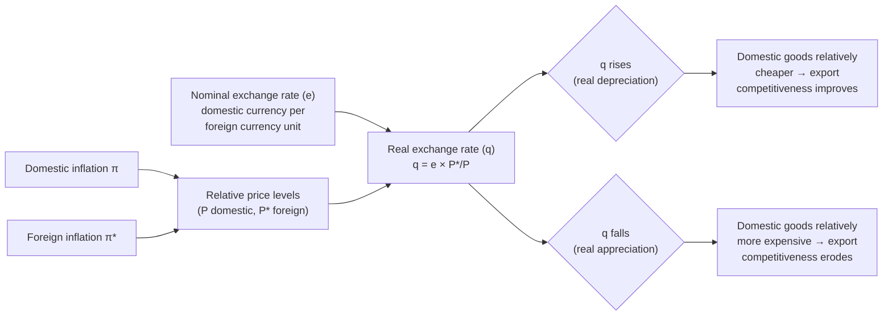

## Nominal versus Real Exchange Rates

### Overview

The nominal exchange rate measures the price of one currency in terms of another, while the real exchange rate adjusts this nominal price for differences in price levels between countries, measuring the relative price of goods and services across borders. The distinction is central to open-economy macroeconomics because it separates pure currency valuation effects from the underlying competitiveness of a country's goods and services in international trade.

### Nominal Exchange Rate

#### Definition and Quotation Conventions

The nominal exchange rate $e$ is the rate at which one currency can be exchanged for another. There are two common quotation conventions:

- **Direct (price) quotation**: domestic currency units per unit of foreign currency (e.g., ¥150/$ for Japan). A rise in $e$ under this convention means the domestic currency has **depreciated**.
- **Indirect (volume) quotation**: foreign currency units per unit of domestic currency (e.g., $0.0067/¥ for Japan). A rise in $e$ under this convention means the domestic currency has **appreciated**.

Consistency in quotation convention is essential, since the same underlying currency movement produces opposite directional readings depending on which convention is used. This document uses the direct quotation convention (domestic currency per unit of foreign currency) unless stated otherwise.

#### Bilateral versus Effective (Nominal) Exchange Rates

- **Bilateral nominal exchange rate**: the exchange rate between two specific currencies.
- **Nominal effective exchange rate (NEER)**: a trade-weighted index of a currency's value against a basket of trading-partner currencies, typically weighted by bilateral trade shares. The NEER is used to assess a currency's overall strength or weakness against the full set of a country's trading partners rather than a single counterpart currency.

### Real Exchange Rate

#### Definition

The real exchange rate ($RER$ or $q$) adjusts the nominal exchange rate for relative price levels, measuring the rate at which domestic goods can be exchanged for foreign goods. It is defined as:

$$q = e \times \frac{P^*}{P}$$

where $e$ is the nominal exchange rate (domestic currency per unit of foreign currency), $P^*$ is the foreign price level, and $P$ is the domestic price level.

**Interpretation**: A rise in $q$ means foreign goods have become relatively more expensive than domestic goods — i.e., a **real depreciation**, which tends to improve the price competitiveness of domestic exports. A fall in $q$ means domestic goods have become relatively more expensive — a **real appreciation**, which tends to erode export competitiveness.

#### Alternative Formulation Using Inflation Differentials

The rate of change of the real exchange rate can be approximated as:

$$\%\Delta q \approx \%\Delta e + \pi^* - \pi$$

where $\pi^*$ is foreign inflation and $\pi$ is domestic inflation. This shows that a country with persistently higher domestic inflation than its trading partners will experience real appreciation over time unless offset by sufficient nominal depreciation — a key mechanism connecting inflation differentials to competitiveness.

#### Real Effective Exchange Rate (REER)

The real effective exchange rate (REER) extends the effective exchange rate concept to real terms, using a trade-weighted basket of bilateral real exchange rates against major trading partners, each adjusted for relative price levels. The REER is widely used by central banks, the IMF, and the Bank for International Settlements (BIS) as a summary indicator of a country's overall international price competitiveness. [Unverified] Different institutions calculate REER using somewhat different price deflators (CPI, PPI/producer prices, unit labor costs, or GDP deflators) and different trade-weighting schemes, so REER values for the same country and period can differ meaningfully across data sources.

### Purchasing Power Parity (PPP) and the Real Exchange Rate

The real exchange rate is directly linked to the theory of purchasing power parity:

- **Absolute PPP** holds that $q = 1$ at all times, i.e., a basket of goods costs the same in both countries once converted to a common currency: $e = P/P^*$.
- **Relative PPP** holds that changes in the nominal exchange rate offset inflation differentials, keeping $q$ constant over time, even if absolute PPP does not hold at a point in time due to transport costs, tariffs, or non-traded goods.

Empirically, absolute PPP is strongly rejected in the short and medium run — the real exchange rate exhibits large and persistent deviations from 1 (or from any constant benchmark), often for years. [Inference] The consensus in the empirical international finance literature is that PPP deviations show substantial persistence (commonly summarized with half-lives of deviations on the order of several years in cross-country studies, sometimes referred to as the "PPP puzzle"), though exact estimated half-lives vary by study, sample period, and econometric method, so no single number should be treated as definitive.

#### The Balassa-Samuelson Effect

A well-established explanation for systematic long-run deviations from PPP, particularly between richer and poorer countries, is the Balassa-Samuelson effect: countries with higher productivity growth in their tradable-goods sector tend to experience real exchange rate appreciation, because higher tradable-sector wages spill over into the non-tradable sector (services), raising the general price level relative to countries with lower tradable-sector productivity growth, even without a change in the nominal exchange rate.

### Why the Distinction Matters

**Key Points**

- **Trade competitiveness** is governed by the real exchange rate, not the nominal exchange rate alone. A nominal depreciation that is fully offset by higher domestic inflation leaves the real exchange rate — and therefore trade competitiveness — unchanged.
- **Nominal exchange rate movements** are what is typically quoted in financial markets and media, and directly affect the domestic-currency cost of foreign travel, imported goods, and foreign-currency-denominated debt service.
- **Real exchange rate movements** are the relevant variable for models of the trade balance, export and import volumes, and the expenditure-switching effects central to open-economy macroeconomic models (e.g., the Mundell-Fleming model and its extensions).
- A country can experience **nominal exchange rate stability** while still undergoing significant **real appreciation or depreciation** purely through inflation differentials — relevant, for example, in fixed exchange rate or currency union contexts where the nominal rate is anchored but real competitiveness can still drift.

### Illustrative Diagram: Nominal versus Real Exchange Rate Linkages

### Worked Example

**Example**

Suppose the nominal exchange rate is ¥150/$ (direct quotation from the U.S. perspective, i.e., domestic = U.S., foreign = Japan). A representative basket of goods costs $100 in the United States ($P$) and ¥18,000 in Japan ($P^*$).

$$q = e \times \frac{P^*}{P} = 150 \times \frac{18{,}000}{100 \times 150}$$

To keep units consistent, first convert the Japanese price into dollar terms: $P^*_{\$} = 18{,}000 / 150 = \$120$.

$$q = \frac{P^*_{\$}}{P} = \frac{120}{100} = 1.2$$

Since $q = 1.2 > 1$, the Japanese basket is 20% more expensive than the equivalent U.S. basket once converted at the current nominal exchange rate — U.S. goods are relatively cheap, implying the dollar is real-undervalued relative to PPP (equivalently, the yen is real-overvalued), which would tend to support U.S. export competitiveness and Japanese import demand for U.S. goods, all else equal.

If, over the following year, U.S. inflation is 2% and Japanese inflation is 5%, with the nominal exchange rate unchanged at ¥150/$, the real exchange rate would rise further:

$$\%\Delta q \approx 0\% + 5\% - 2\% = 3\%$$

indicating additional real depreciation of the dollar (real appreciation of the yen) driven purely by the inflation differential, with no nominal exchange rate movement at all.

### Measurement Considerations

**Output**

| Concept | Formula / Basis | Primary Use |
| --- | --- | --- |
| Nominal bilateral exchange rate | Market-quoted currency price | Financial transactions, direct currency comparisons |
| Nominal effective exchange rate (NEER) | Trade-weighted basket of nominal bilateral rates | Overall currency strength vs. trading partners |
| Real bilateral exchange rate | $q = eP^*/P$ | Bilateral competitiveness, PPP testing |
| Real effective exchange rate (REER) | Trade-weighted basket of real bilateral rates | Aggregate international price competitiveness |

[Unverified] The choice of price index (CPI, PPI, GDP deflator, or unit labor costs) used to construct $P$ and $P^*$ materially affects the resulting real exchange rate series and its interpretation; CPI-based REER captures broad consumer price competitiveness, while unit-labor-cost-based REER is often preferred for assessing manufacturing sector competitiveness specifically.

**Next Steps**

- Purchasing power parity: theory, testing, and the PPP puzzle
- Balassa-Samuelson effect and long-run real exchange rate determination
- Exchange rate pass-through to domestic prices
- Effective exchange rate indices: construction and weighting methodologies
- Fixed versus floating exchange rate regimes
- Expenditure-switching and the trade balance in open-economy models
- Currency misalignment and equilibrium real exchange rate estimation
- Terms of trade versus real exchange rate: distinctions and overlaps