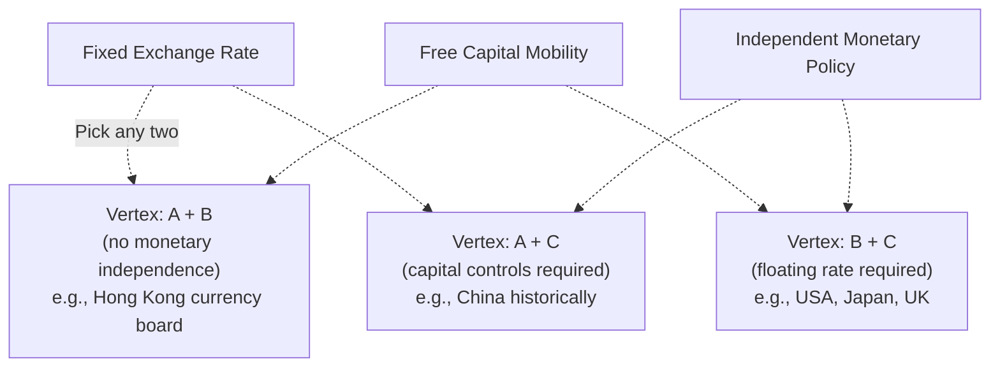

## Fixed versus Floating Exchange Rate Regimes

### Overview

An exchange rate regime is the system a country's monetary authority uses to manage its currency's value against other currencies. Regimes span a spectrum from hard fixes (no independent currency at all) to free floats (no official intervention), with numerous intermediate arrangements in between. The choice of regime shapes a country's capacity to run independent monetary policy, its exposure to external shocks, and its vulnerability to speculative attacks, and is a central topic in open-economy macroeconomics.

### The Exchange Rate Regime Spectrum

#### Hard Pegs

**Currency union / dollarization**: A country adopts another country's currency outright (e.g., Ecuador and El Salvador using the U.S. dollar) or shares a common currency with other nations (e.g., the euro area). There is no separate national currency and therefore no bilateral nominal exchange rate to manage among union/dollarization members.

**Currency board**: The domestic currency is issued only against foreign reserve backing at a fixed rate, with the monetary authority legally committed to full convertibility (e.g., Hong Kong's currency board pegging the Hong Kong dollar to the U.S. dollar). This is more rigid than a conventional peg because domestic money supply is directly tied to reserve holdings.

#### Conventional Pegs and Intermediate Regimes

**Conventional fixed peg**: The central bank commits to buying and selling the domestic currency at a fixed rate (or within a narrow band) against a single foreign currency or basket, using foreign exchange reserves to defend the rate.

**Crawling peg**: The fixed rate is adjusted periodically according to a pre-announced formula or in response to indicators (such as inflation differentials), allowing gradual, controlled depreciation or appreciation.

**Pegged/managed float within a band**: The currency is allowed to fluctuate within an announced or implicit band around a central rate, with intervention at the margins.

**Managed float**: The exchange rate is market-determined but the central bank intervenes periodically, without a pre-announced target, to smooth volatility or influence the level.

#### Free Float

**Independent float**: The exchange rate is determined by market supply and demand with no official target and only rare, exceptional intervention (e.g., during disorderly market conditions). Major floating currencies include the U.S. dollar, euro, Japanese yen, and British pound.

The IMF publishes an annual *Annual Report on Exchange Arrangements and Exchange Restrictions* (AREAER) that classifies member countries' de facto exchange rate regimes into this spectrum. [Unverified] De facto classifications by the IMF sometimes differ from countries' de jure (officially announced) regime, since some governments manage their currency more actively than officially stated — a phenomenon researchers have termed "fear of floating."

### The Impossible Trinity (Mundell-Fleming Trilemma)

The central theoretical framework for understanding exchange rate regime choice is the trilemma: a country cannot simultaneously maintain all three of the following:

1. **A fixed exchange rate**
2. **Free capital mobility** (open capital account)
3. **An independent monetary policy**

At most two of the three can be achieved simultaneously. This is because, under free capital mobility, uncovered interest parity links domestic and foreign interest rates to expected exchange rate movements:

$$i = i^* + \frac{E[e_{t+1}] - e_t}{e_t}$$

If the exchange rate is fixed, expected depreciation is (approximately) zero, forcing $i \approx i^*$ — the domestic interest rate must track the foreign (anchor currency) rate, eliminating independent monetary policy. To maintain both a fixed rate and monetary independence, capital mobility must be restricted (via capital controls).

#### Trilemma Configurations

| Configuration | Exchange rate | Capital mobility | Monetary independence | Example |
| --- | --- | --- | --- | --- |
| A | Fixed | Free | None | Hong Kong (currency board), Eurozone members (vs. each other) |
| B | Fixed | Restricted | Yes | China (historically, managed float with capital controls) |
| C | Floating | Free | Yes | United States, Japan, United Kingdom |

### Illustrative Diagram: The Trilemma

### Fixed Exchange Rate Regimes: Mechanics and Trade-offs

#### Defense Mechanism

A central bank defends a fixed rate primarily through **foreign exchange market intervention** — buying domestic currency with reserves when there is depreciation pressure, or selling domestic currency (accumulating reserves) when there is appreciation pressure. When intervention alone is insufficient, authorities may raise domestic interest rates to attract capital inflows and support the currency, or, in extremis, impose capital controls.

**Advantages**

- **Price stability and inflation anchor**: Pegging to a low-inflation currency imports credibility and can rapidly reduce domestic inflation expectations, historically important for economies with a history of high or hyperinflation.
- **Reduced exchange rate uncertainty**: Facilitates trade and investment planning by eliminating exchange rate risk on transactions with the anchor currency/bloc.
- **Fiscal and monetary discipline**: A credible peg can act as a external constraint against inflationary financing of deficits.

**Disadvantages**

- **Loss of independent monetary policy**: The country cannot use interest rates to respond to domestic-specific shocks (per the trilemma).
- **Vulnerability to speculative attacks**: If markets doubt the sustainability of the peg (due to inadequate reserves, current account deficits, or inconsistent domestic policy), the regime can collapse in a currency crisis, as in the UK's 1992 exit from the European Exchange Rate Mechanism ("Black Wednesday") and the 1997–98 Asian financial crisis.
- **Asymmetric shock absorption**: Without exchange rate adjustment, the burden of adjusting to asymmetric shocks (relative to the anchor economy) falls on wages, prices, and output — a concern central to Optimum Currency Area theory, particularly relevant to Eurozone member states.
- **Reserve requirements**: Sustaining a peg requires substantial and readily deployable foreign exchange reserves, which carries an opportunity cost.

### Floating Exchange Rate Regimes: Mechanics and Trade-offs

Under a free float, the exchange rate adjusts continuously to equilibrate currency supply and demand, driven by trade flows, capital flows, interest rate differentials, and market expectations.

**Advantages**

- **Automatic external adjustment**: The exchange rate acts as a shock absorber — a negative terms-of-trade or demand shock leads to depreciation, which helps restore external balance by boosting export competitiveness (real exchange rate channel) without requiring painful internal wage/price adjustment.
- **Preserved monetary independence**: The central bank retains full ability to set interest rates according to domestic objectives (e.g., inflation targeting, output stabilization).
- **No reserve requirement for defense**: Reserves are not needed to maintain a target rate (though many floating-regime central banks still hold reserves for other purposes, such as crisis buffers).

**Disadvantages**

- **Exchange rate volatility**: Can introduce uncertainty for trade and investment, particularly costly for economies with significant foreign-currency-denominated debt (the "original sin" problem in some emerging markets, where depreciation raises the domestic-currency burden of foreign debt).
- **Potential for overshooting**: Nominal exchange rates can move well beyond levels justified by fundamentals in the short run due to sluggish goods-price adjustment relative to fast-moving asset markets (the Dornbusch overshooting model).
- **Imported inflation/deflation risk via pass-through**: Sharp depreciation can raise imported input and consumer prices, complicating inflation control.

### Intermediate Regimes and the "Impossible Trinity" in Practice

Many economies operate intermediate regimes attempting to capture partial benefits of both fixed and floating systems, though the trilemma implies inherent tension and fragility in such arrangements when capital mobility is high. [Inference] The empirical literature on exchange rate regimes (including work associated with economists such as Barry Eichengreen and Jeffrey Frankel) broadly finds that intermediate regimes have historically been more prone to crisis than either hard pegs or genuinely free floats when capital mobility is significant — sometimes summarized as the "bipolar view" or "hollowing out of the middle" hypothesis — though this remains a debated generalization rather than a universal rule, and many countries continue to successfully operate managed or intermediate regimes, particularly with capital controls in place.

### Historical and Institutional Context

#### Bretton Woods System (1944–1971)

The post-WWII international monetary system fixed member currencies to the U.S. dollar, which was in turn convertible to gold at $35/ounce. This adjustable-peg system (allowing occasional realignments) collapsed in 1971 when the United States suspended dollar-gold convertibility, ushering in the modern era of predominantly floating major currencies.

#### European Exchange Rate Mechanism (ERM) and the Euro

European countries operated the ERM as a managed peg system among European currencies from 1979, which experienced a major crisis in 1992 (including the UK's exit) and ultimately evolved toward the adoption of a single currency, the euro, in 1999 (physical circulation from 2002) — effectively resolving the trilemma for euro area members by eliminating separate national currencies among members, though preserving a single floating rate for the bloc as a whole against outside currencies.

#### Emerging Market Experience

Many emerging markets have shifted over recent decades from hard or conventional pegs toward managed or inflation-targeting floats following crisis episodes (Mexico 1994, Asia 1997–98, Russia 1998, Argentina 2001–02), reflecting lessons about the vulnerability of rigid pegs combined with open capital accounts and imperfect fiscal/financial discipline. [Unverified] The precise mix of regimes currently in use across emerging markets evolves over time and should be verified against current IMF AREAER classifications for any specific country-level claim.

### Key Points Summary

**Key Points**

- The trilemma establishes that fixed exchange rates, free capital mobility, and independent monetary policy cannot all be sustained simultaneously — regime choice is fundamentally a choice about which constraint to accept.
- Fixed regimes offer credibility and reduced exchange rate uncertainty at the cost of monetary independence and vulnerability to speculative attack.
- Floating regimes preserve monetary independence and provide automatic shock absorption via the exchange rate, at the cost of volatility and potential overshooting.
- Intermediate regimes attempt to balance these trade-offs but have historically shown elevated crisis vulnerability under conditions of high capital mobility, per the "bipolar view," though this remains an empirical generalization rather than an absolute law.
- Regime sustainability depends critically on consistency with underlying fiscal and monetary policy; a peg unsupported by disciplined macroeconomic policy is a common precursor to currency crises.

### Worked Example: Trilemma Application

**Example**

Consider a small open economy that pegs its currency to the U.S. dollar and also maintains full capital account openness (foreign investors can freely move funds in and out). Suppose the domestic economy enters a recession while the U.S. economy is booming and the Federal Reserve is raising interest rates.

Under the trilemma, this economy's central bank must also raise domestic interest rates to match the Fed and defend the peg (avoiding capital outflows that would pressure the currency), even though higher domestic interest rates are counter-cyclical and inappropriate for its own recessionary conditions. This illustrates the core cost of the "A + B" trilemma configuration (fixed rate + free capital mobility): domestic monetary policy becomes hostage to the anchor country's policy stance regardless of domestic cyclical conditions. If this economy instead floated its currency, it could set interest rates independently — appropriate for its own recession — while allowing the currency to depreciate, which would also help cushion the recession via improved export competitiveness.

**Next Steps**

- The impossible trinity / Mundell-Fleming trilemma in depth
- Optimum Currency Area theory and the Eurozone
- Currency crises: speculative attacks and first/second-generation models
- Foreign exchange intervention: sterilized versus unsterilized
- Capital controls: rationale, design, and effectiveness
- Dornbusch overshooting model
- "Original sin" and foreign-currency-denominated debt in emerging markets
- Inflation targeting as a monetary framework under floating regimes
- IMF exchange rate regime classification (AREAER) methodology