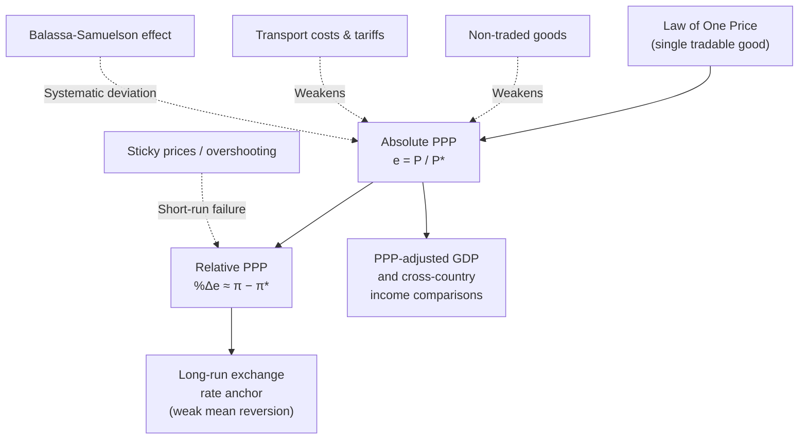

## Purchasing Power Parity Theory

### Overview

Purchasing power parity (PPP) is a theory of long-run exchange rate determination holding that, in the absence of trade frictions, exchange rates should adjust so that an identical basket of goods costs the same amount when expressed in a common currency across countries. PPP serves both as a benchmark for assessing whether a currency is overvalued or undervalued and as a building block for open-economy macroeconomic models linking nominal exchange rates to relative price levels.

### Theoretical Foundations

#### The Law of One Price

PPP is built on the **law of one price (LOOP)**, which states that, absent transport costs, tariffs, and trade barriers, an identical tradable good must sell for the same price in all locations when expressed in a common currency:

$$P_i = e \times P_i^*$$

where $P_i$ is the domestic price of good $i$, $P_i^*$ is the foreign price of the same good, and $e$ is the nominal exchange rate (domestic currency per unit of foreign currency). If this equality did not hold, riskless arbitrage (buying the good where cheap, selling where expensive) would be profitable, and such arbitrage activity should, in principle, drive prices back into alignment.

#### Absolute PPP

Absolute PPP extends the law of one price from a single good to an entire basket of goods (a general price index):

$$e = \frac{P}{P^*}$$

where $P$ and $P^*$ are the domestic and foreign general price levels (e.g., CPI baskets). Under absolute PPP, the real exchange rate $q = eP^*/P$ is always equal to 1.

#### Relative PPP

Relative PPP is a weaker condition, requiring only that the *rate of change* of the nominal exchange rate offset the *inflation differential* between countries, even if absolute PPP does not hold in levels (due to persistent factors like transport costs or non-traded goods):

$$\%\Delta e \approx \pi - \pi^*$$

where $\pi$ is domestic inflation and $\pi^*$ is foreign inflation. Relative PPP implies the real exchange rate remains constant over time, even if it is not equal to exactly 1.

### Big Mac Index and Practical PPP Illustrations

A well-known informal application of absolute PPP is *The Economist*'s Big Mac Index, which compares the price of a McDonald's Big Mac (a broadly standardized product) across countries, converted at market exchange rates, to give a rough-and-ready gauge of currency over/undervaluation relative to PPP. [Unverified] The Big Mac Index is explicitly designed as an accessible illustrative tool rather than a rigorous PPP estimate, since it reflects only a single good with substantial non-tradable input costs (local rent, labor, and regulatory costs embedded in the price), and specific country valuations from the index change with each periodic update, so current figures should be checked directly rather than assumed.

### Why Absolute PPP Fails Empirically

**Key Points**

Empirical tests consistently reject strict absolute PPP, for several well-documented reasons:

- **Non-traded goods**: Many components of a typical price basket (housing, most services, local labor) are not internationally tradable, so their prices are not disciplined by cross-border arbitrage and can differ persistently across countries.
- **Transport costs and trade barriers**: Tariffs, quotas, and shipping costs create a "band" within which price differences can persist without triggering profitable arbitrage.
- **Product differentiation and market segmentation**: Firms can price-discriminate across national markets (pricing-to-market behavior), especially in the presence of imperfect competition and local distribution costs.
- **Different consumption baskets**: National price indices weight goods differently based on domestic consumption patterns, so even fully tradable goods with the same price won't produce identical aggregate price indices across countries.
- **Balassa-Samuelson effect**: Systematic productivity differences between countries, particularly between tradable and non-tradable sectors, generate persistent real exchange rate differences unrelated to any arbitrage failure (detailed below).

### The Balassa-Samuelson Effect

This is the leading structural explanation for why PPP fails systematically between richer and poorer countries, developed independently by Bela Balassa and Paul Samuelson in 1964.

**Mechanism**:

1. Higher-income countries tend to have higher productivity in the **tradable goods sector** (manufacturing) relative to lower-income countries, while productivity differences in the **non-tradable sector** (services) are smaller across countries.
2. Competition for labor within a country equalizes wage growth across tradable and non-tradable sectors domestically.
3. Since non-tradable sector productivity has not risen as much as tradable sector productivity, but wages have risen economy-wide, **non-tradable goods prices rise faster** in the higher-productivity country.
4. This raises the overall domestic price level $P$ relative to $P^*$ even though the law of one price continues to hold for tradable goods, producing a real exchange rate appreciation (higher $q$-implied price level) that is not a "misalignment" but a structural equilibrium outcome of productivity convergence.

This effect is a key reason why price levels (converted at market exchange rates) tend to be systematically lower in poorer countries than in richer countries — a pattern documented extensively in cross-country price level comparisons such as the World Bank's International Comparison Program (ICP), which underlies PPP-adjusted GDP statistics.

### Empirical Evidence on PPP

#### Short-Run and Medium-Run Deviations

Real-world exchange rates exhibit large and persistent deviations from PPP-implied levels over horizons of months to several years, driven by capital flows, interest rate differentials, speculative activity, and sticky goods prices relative to fast-adjusting financial markets (the mechanism underlying the Dornbusch overshooting model).

#### The PPP Puzzle

A substantial body of empirical research finds that while PPP deviations do eventually shrink over long horizons (consistent with weak, long-run mean reversion toward PPP), the estimated speed of this convergence is surprisingly slow given the volatility of nominal exchange rates — a discrepancy termed the "PPP puzzle" by economist Kenneth Rogoff. [Unverified] Commonly cited estimates in the literature put the half-life of PPP deviations at roughly three to five years, but such estimates vary considerably depending on the country sample, time period, price index used, and econometric methodology, and should not be treated as a single settled figure.

#### Long-Run PPP as an Anchor

Despite short-run failures, many empirical studies find some support for PPP as a long-run equilibrium anchor — real exchange rates tend to be mean-reverting over sufficiently long horizons (often requiring decades of data to detect statistically), even though they can deviate substantially and persistently from that anchor at any given time. [Inference] This mixed evidence — strong rejection in the short run alongside weaker long-run support — is the standard characterization in international finance textbooks and survey literature, though the precise strength of long-run mean reversion remains an active area of empirical debate.

### PPP versus Market Exchange Rates in Economic Comparisons

A major practical application of PPP theory is adjusting cross-country GDP and income comparisons. Comparing countries' GDP converted at *market* exchange rates can be misleading because it does not account for differences in the cost of non-traded goods and local price levels (per Balassa-Samuelson). **PPP-adjusted GDP** (also called GDP at PPP or international dollars) instead converts national output using PPP conversion factors, which better reflect the actual purchasing power and living standards within each country. Organizations such as the World Bank, IMF, and Penn World Table maintain PPP-adjusted international comparison datasets for this purpose.

**Example**

If a haircut costs $30 in the United States and the equivalent haircut costs 100 pesos in a country where the market exchange rate is 20 pesos/$, then:

- At the **market exchange rate**, the haircut costs $100/20 = \$5$ when converted — appearing far cheaper than the U.S. haircut.
- If this pattern holds broadly across the non-traded goods basket, that country's GDP converted at the market exchange rate will understate its real purchasing power and living standards relative to the United States, because market exchange rates are primarily disciplined by trade in tradable goods and capital flows, not by non-traded services.
- **PPP-adjusted comparisons** correct for this by using a conversion factor based on relative purchasing power across the full consumption basket rather than the market exchange rate, typically narrowing (though rarely eliminating) the gap between market-exchange-rate GDP and PPP GDP for lower-income countries relative to higher-income countries. [Inference] The direction of this adjustment (PPP-adjusted GDP typically exceeding market-exchange-rate GDP for lower-income countries) follows directly from the Balassa-Samuelson mechanism and is a well-established empirical regularity in cross-country income comparisons.

### Illustrative Diagram: PPP Theory Structure

### Econometric Testing Approaches

Empirical tests of PPP commonly use:

- **Unit root tests** on the real exchange rate series: if $q_t$ is stationary (mean-reverting), this supports long-run PPP; if $q_t$ follows a random walk (non-stationary), this is evidence against mean reversion to PPP.
- **Panel unit root tests**: pooling data across multiple countries to increase statistical power, since single-country time series tests often have low power to reject the null of a random walk even when true mean reversion is moderate.
- **Cointegration analysis**: testing whether nominal exchange rates and relative price levels move together in a stable long-run relationship, even amid short-run deviations.

[Unverified] Results from these tests are sensitive to the specific time period, country sample, and price index chosen, and the literature has not converged on a single definitive verdict regarding the statistical significance or economic magnitude of long-run PPP reversion — this remains an active empirical research area.

### Summary Comparison

**Output**

| Version | Condition | Empirical support |
| --- | --- | --- |
| Law of one price | Single good price equalized (in common currency) | Weak even for individual tradable goods, due to trade costs and market segmentation |
| Absolute PPP | $e = P/P^*$ holds in levels | Strongly rejected in general; persistent price level differences across countries |
| Relative PPP | $\%\Delta e \approx \pi - \pi^*$ | Rejected in short/medium run; weak support as a long-run tendency |
| PPP-adjusted GDP | Used for cross-country living-standard comparisons | Widely adopted methodology (World Bank, IMF, Penn World Table) despite underlying PPP theory's short-run empirical weaknesses |

**Next Steps**

- Real exchange rates and the real/nominal distinction
- Balassa-Samuelson effect: formal model and cross-country evidence
- Dornbusch overshooting model and short-run exchange rate dynamics
- Uncovered and covered interest rate parity
- PPP-adjusted GDP and the International Comparison Program (ICP)
- Exchange rate pass-through and pricing-to-market behavior
- Unit root and cointegration testing in international finance
- Monetary models of exchange rate determination