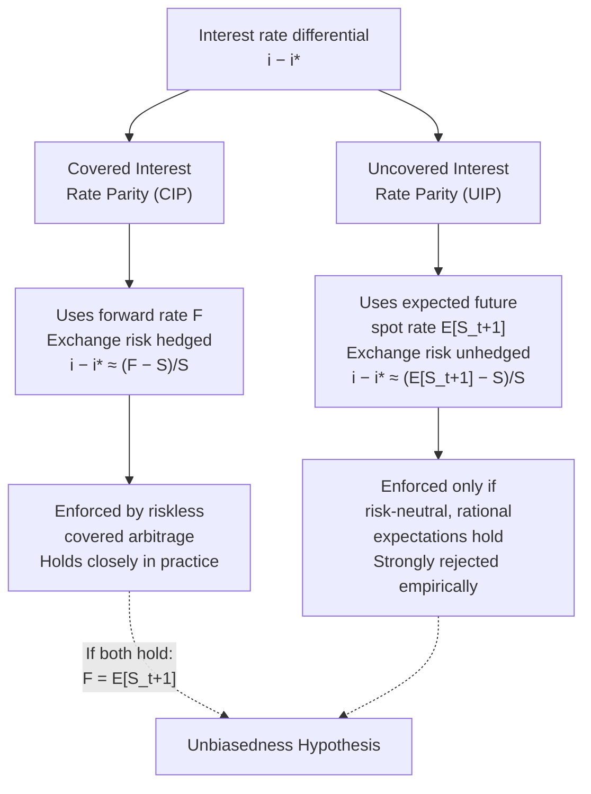

## Interest Rate Parity: Covered and Uncovered

### Overview

Interest rate parity (IRP) describes the equilibrium relationship between interest rates in two countries and the spot and forward (or expected future) exchange rates between their currencies. It is one of the foundational no-arbitrage conditions in international finance, linking money markets and foreign exchange markets. There are two principal forms: **covered interest rate parity (CIP)**, which uses forward contracts to eliminate exchange rate risk, and **uncovered interest rate parity (UIP)**, which relies on the expected future spot rate and therefore leaves exchange rate risk unhedged.

### Covered Interest Rate Parity (CIP)

#### Theoretical Condition

CIP states that the interest rate differential between two currencies must equal the forward premium or discount on the exchange rate between them, once exchange rate risk is fully hedged using a forward contract. The no-arbitrage condition is:

$$(1 + i) = \frac{F}{S}(1 + i^*)$$

where $i$ is the domestic interest rate, $i^*$ is the foreign interest rate, $S$ is the spot exchange rate (domestic currency per unit of foreign currency), and $F$ is the forward exchange rate for the same maturity as the interest rates.

Rearranging and taking a linear (first-order) approximation:

$$i - i^* \approx \frac{F - S}{S}$$

This states that the interest rate differential approximately equals the forward premium (if $F > S$) or forward discount (if $F < S$) on the foreign currency.

#### Arbitrage Mechanism

CIP is enforced by **covered interest arbitrage**. Consider an investor with domestic currency who can either:

1. Invest domestically at rate $i$, or
2. Convert to foreign currency at the spot rate $S$, invest at the foreign rate $i^*$, and simultaneously lock in a forward contract at rate $F$ to convert the foreign-currency proceeds back to domestic currency at maturity.

If the returns from these two strategies differ, riskless arbitrage profit is available (since the forward contract eliminates exchange rate risk), and arbitrageurs' trading activity should, in principle, drive prices back until the two strategies yield equal returns.

#### Empirical Status

Unlike most parity conditions in international finance, CIP holds very closely in practice for major freely convertible currencies under normal market conditions, because it is enforced by low-risk, high-volume arbitrage among large financial institutions with ready access to money and forward markets. [Unverified] Notably, research following the 2008 global financial crisis (including work by Claudio Borio and colleagues at the Bank for International Settlements documenting a persistent "CIP basis") found that measurable and persistent deviations from CIP emerged and continued in major currency pairs after the crisis, generally attributed to increased balance-sheet costs, regulatory capital constraints on bank arbitrage activity, and differential credit/liquidity risk premia across currencies — the precise magnitude and persistence of this "CIP basis" is an active area of empirical research and varies by currency pair and period, so any current figures should be checked against up-to-date sources.

### Uncovered Interest Rate Parity (UIP)

#### Theoretical Condition

UIP replaces the forward rate with the *market's expectation* of the future spot exchange rate, leaving the position exposed to exchange rate risk (uncovered/unhedged):

$$i - i^* \approx \frac{E[S_{t+1}] - S_t}{S_t}$$

This states that the interest rate differential between two countries should equal the expected rate of depreciation of the higher-interest-rate currency. Intuitively, if a currency offers a higher interest rate, UIP predicts that currency must be expected to depreciate by roughly the same amount, so that expected returns are equalized across currencies once exchange rate risk is (notionally) accounted for via unbiased expectations.

#### Relationship Between CIP and UIP

Combining CIP and UIP yields the **unbiasedness hypothesis**: if both hold, the forward rate should be an unbiased predictor of the future spot rate, i.e., $F_t = E[S_{t+1}]$. This follows because CIP pins $F$ to the interest differential, and UIP pins $E[S_{t+1}]$ to the same interest differential, so — if both conditions hold simultaneously — the two must be equal.

### Illustrative Diagram: CIP versus UIP Structure

### Why UIP Fails Empirically: The Forward Premium Puzzle

**Key Points**

Unlike CIP, UIP is strongly and persistently rejected in empirical tests across most currency pairs and time periods — a finding so robust it is often called the **forward premium puzzle** or **UIP puzzle**. Standard regression tests of UIP (regressing realized exchange rate changes on the interest differential or forward premium) frequently find:

- A coefficient that should theoretically equal 1 (if UIP held) is instead frequently estimated to be close to zero or even **negative** in many currency pairs and sample periods.
- A negative coefficient implies that higher-interest-rate currencies tend to **appreciate**, not depreciate, on average over the sample — the opposite of the UIP prediction, and the basis for the well-documented **carry trade** strategy (borrowing in low-interest-rate currencies to invest in high-interest-rate currencies, profiting both from the rate differential and, historically, from the tendency of high-yield currencies not to depreciate as UIP would predict, at least until periods of sharp reversal).

[Inference] This general pattern — UIP regression coefficients frequently near zero or negative rather than the theoretically predicted value of 1 — is one of the most robustly replicated findings in international finance, documented across many studies and currency pairs since the 1980s, though the precise estimated coefficient varies by currency pair, sample period, and estimation method, so no single number should be cited as universally applicable.

#### Proposed Explanations for the UIP Puzzle

- **Time-varying risk premia**: UIP assumes risk-neutral investors; if investors demand a risk premium that varies over time and is correlated with interest differentials, realized returns will deviate systematically from the simple UIP prediction.
- **Peso problem**: Small-sample distortions arising when investors rationally price in a low-probability, high-impact event (e.g., devaluation or crisis) that does not occur within the sample period, biasing statistical estimates.
- **Irrational expectations / behavioral explanations**: Survey-based measures of exchange rate expectations often deviate from model-consistent rational expectations, suggesting market participants may not form expectations in the way UIP assumes.
- **Liquidity and funding constraints**: Especially relevant post-2008, limits to arbitrage arising from balance sheet constraints on the financial intermediaries who would otherwise enforce the parity condition.

### Practical Applications

#### Covered Interest Arbitrage in Practice

CIP is heavily used by multinational corporations and financial institutions for **hedging** foreign currency exposure (locking in known future exchange rates for international transactions) and by traders to identify (typically small and short-lived) arbitrage opportunities when the condition is temporarily violated.

#### UIP and Monetary Policy Analysis

Despite its poor empirical performance as a precise predictive tool, UIP remains a standard building block in open-economy macroeconomic models (including the Mundell-Fleming-Dornbusch framework and modern New Keynesian open-economy models) because it provides a tractable theoretical link between interest rate differentials and exchange rate expectations, useful for qualitative and structural analysis even where it fails as a precise quantitative predictor. [Inference] Its retention in standard textbook models despite well-documented empirical rejection is generally justified in the literature on tractability and qualitative-directional grounds rather than a claim of strong quantitative predictive accuracy, a distinction which should be noted when applying the framework to real-world forecasting.

### Worked Example: Covered Interest Arbitrage

**Example**

Suppose the one-year U.S. interest rate is $i = 5\%$, the one-year eurozone interest rate is $i^* = 2\%$, and the current spot exchange rate is $S = \$1.10$ per euro.

Under CIP, the one-year forward rate should satisfy:

$$F = S \times \frac{1+i}{1+i^*} = 1.10 \times \frac{1.05}{1.02} \approx \$1.1324 \text{ per euro}$$

If the actual quoted one-year forward rate in the market is instead $1.15 per euro, an arbitrage opportunity would exist: an investor could borrow dollars at 5%, convert to euros at the spot rate, invest at 2% in euros, and simultaneously sell euros forward at the higher-than-CIP-implied $1.15 rate, locking in a riskless profit once accounting for the borrowing cost. In liquid, well-functioning markets for major currencies, such divergences are typically small and transient, as arbitrage activity should act to close the gap toward the CIP-implied forward rate of approximately $1.1324. [Unverified] The actual magnitude and persistence of any such gap in current market conditions depends on prevailing balance-sheet and regulatory constraints on arbitrageurs and should be verified against live market data rather than assumed to close instantly or completely.

### Summary Comparison

**Output**

| Feature | Covered Interest Rate Parity (CIP) | Uncovered Interest Rate Parity (UIP) |
| --- | --- | --- |
| Exchange rate used | Forward rate $F$ (contractually locked) | Expected future spot rate $E[S_{t+1}]$ (uncertain) |
| Risk exposure | Hedged / riskless | Unhedged / exposed to exchange rate risk |
| Enforcement mechanism | Riskless covered arbitrage | Requires risk-neutral, rational expectations |
| Empirical support | Holds closely for major currencies (with post-2008 basis deviations) | Strongly and persistently rejected (forward premium puzzle) |
| Primary use | Hedging, arbitrage pricing of forwards | Theoretical modeling of exchange rate expectations |

**Next Steps**

- The forward premium puzzle and carry trade strategies
- Post-2008 CIP deviations and the cross-currency basis swap
- Peso problem and small-sample bias in exchange rate expectations testing
- Dornbusch overshooting model and exchange rate dynamics
- Risk premia in foreign exchange markets
- Purchasing power parity versus interest rate parity: complementary frameworks
- Forward and futures markets in foreign exchange
- Limits to arbitrage and financial intermediary balance sheet constraints