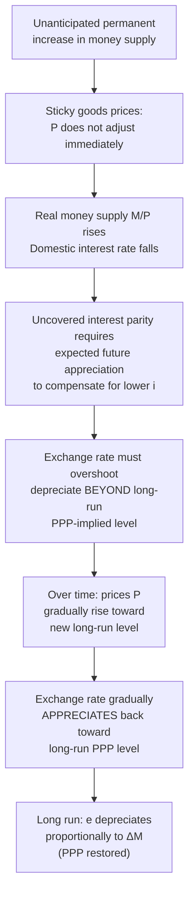

## Exchange Rate Determination Models

### Overview

Exchange rate determination models attempt to explain how nominal exchange rates are set and how they evolve in response to macroeconomic fundamentals, monetary policy, and market expectations. No single model fully explains observed exchange rate behavior — a persistent challenge in international finance known broadly as the "exchange rate disconnect puzzle," where exchange rates often appear to move independently of the macroeconomic fundamentals that theory suggests should drive them, especially over short horizons. This document surveys the major theoretical frameworks, from purchasing-power-based approaches through monetary and portfolio-balance models to modern microstructure and behavioral perspectives.

### Purchasing Power Parity (PPP) Approach

The simplest exchange rate model ties the nominal exchange rate directly to relative price levels:

$$e = \frac{P}{P^*}$$

PPP-based models predict exchange rates adjust to equalize purchasing power across countries. As detailed in the dedicated PPP topic, this approach performs poorly at short and medium horizons but retains some support as a very long-run anchor. Because of its weak short-run performance, PPP is typically used as a component within richer models rather than as a standalone predictive framework.

### The Monetary Approach

The monetary approach treats the exchange rate as the relative price of two national monies, determined by the relative supply and demand for those monies, combined with PPP.

#### Flexible-Price Monetary Model

Assuming continuous PPP and money market equilibrium in both countries, with money demand of the standard form $M/P = L(i, Y)$ (increasing in real income $Y$, decreasing in the interest rate $i$), the flexible-price monetary model implies:

$$e = \frac{M/L(i,Y)}{M^*/L(i^*,Y^*)}$$

**Key predictions**:

- An increase in domestic money supply $M$ (relative to foreign) causes proportional currency **depreciation**.
- An increase in domestic real income $Y$ (raising money demand, all else equal) causes currency **appreciation**, since more money is demanded to support the higher transaction volume at the existing price level.
- An increase in the domestic interest rate $i$ causes currency **depreciation** in this model — because higher $i$ reduces real money demand, and with fixed money supply, the price level $P$ must rise to clear the money market, which by PPP depreciates the currency.

[Inference] This last prediction — that higher domestic interest rates cause depreciation via the monetary channel — is frequently noted in textbooks as counterintuitive relative to everyday financial-market intuition (where higher rates are often associated with currency appreciation via capital inflows), and reconciling the two requires distinguishing between real and nominal interest rate changes and their underlying causes, a point taken up directly in the sticky-price extension below.

#### Sticky-Price Monetary Model (Dornbusch Overshooting)

Developed by Rudiger Dornbusch (1976), this model relaxes the assumption of continuous PPP by allowing goods prices to be "sticky" (slow to adjust) in the short run, while financial markets (including the exchange rate) adjust instantaneously. This single modification produces a fundamentally different — and more empirically resonant — set of short-run predictions.

**Mechanism**: Consider an unanticipated permanent increase in the domestic money supply.

1. In the **long run**, PPP holds and the exchange rate depreciates in proportion to the money supply increase (consistent with the flexible-price monetary model).
2. In the **short run**, because goods prices are sticky, the real money supply $M/P$ rises more than in the flexible-price case, pushing the domestic interest rate down (via standard liquidity-effect money market equilibrium).
3. Under uncovered interest rate parity, a lower domestic interest rate relative to the foreign rate requires the domestic currency to be *expected to appreciate* going forward to equalize returns — but with a permanently higher long-run money supply implying a permanently more depreciated long-run exchange rate, the *only* way the currency can be expected to appreciate from the current level *toward* that depreciated long-run level is for the exchange rate to **overshoot** its long-run value in the short run, then gradually appreciate back toward the long-run PPP-consistent level as prices slowly adjust upward.

This generates the model's signature prediction: nominal exchange rates should be **more volatile than the underlying fundamentals that drive them**, since the exchange rate must jump discontinuously in response to news while goods prices adjust only gradually — a result widely credited with providing a theoretically coherent explanation for the empirically observed excess volatility of floating exchange rates. [Inference] The Dornbusch overshooting result is a celebrated theoretical mechanism and a staple of graduate international macroeconomics, but direct empirical confirmation of overshooting magnitudes for specific historical episodes is harder to establish cleanly than the qualitative logic of the model, since isolating "unanticipated permanent money supply shocks" from other simultaneous disturbances in real-world data is econometrically difficult.

### Illustrative Diagram: Dornbusch Overshooting Dynamics

### Portfolio Balance Model

The portfolio balance model extends the monetary approach by treating domestic and foreign bonds as **imperfect substitutes** (unlike the monetary approach, which implicitly assumes perfect substitutability under UIP). Investors allocate wealth across domestic money, domestic bonds, and foreign bonds based on relative expected returns and risk.

**Key features**:

- Because domestic and foreign bonds are imperfect substitutes, a risk premium can exist between them, so UIP need not hold exactly even with rational expectations — investors require compensation for holding the riskier or less liquid asset.
- Current account imbalances matter directly: a current account deficit implies the domestic economy is accumulating net foreign liabilities (or foreign residents are accumulating domestic assets), which changes the relative stock of domestic versus foreign bonds available in investors' portfolios, in turn affecting the risk premium and equilibrium exchange rate.
- This provides a channel through which the **stock of net foreign assets/liabilities**, not just money supply flows, influences the exchange rate — a feature absent from the pure monetary approach.

[Unverified] The portfolio balance model was influential in academic international finance particularly through the 1980s but has faced criticism regarding the empirical size of estimated risk premia relative to observed exchange rate volatility, and it has been relatively less prominent in mainstream policy modeling compared to monetary and New Keynesian open-economy approaches in more recent decades; the precise current standing of the model within the literature is a matter of ongoing academic assessment rather than settled consensus.

### New Open Economy Macroeconomics (NOEM) / New Keynesian Models

Modern dynamic stochastic general equilibrium (DSGE) models of open economies, building on the Redux model of Obstfeld and Rogoff (1995) and subsequent New Keynesian extensions, incorporate:

- **Sticky prices with explicit microfoundations** (monopolistic competition, staggered price-setting)
- **Intertemporal optimization** by households and firms
- **Explicit welfare analysis**, allowing evaluation of exchange rate regime and monetary policy choices in terms of household utility
- **Pricing-to-market and exchange rate pass-through** as endogenous, model-derived outcomes rather than assumed parameters

These models form the basis of much contemporary central bank and academic open-economy macroeconomic analysis, including the study of optimal monetary policy under alternative exchange rate regimes. [Inference] While technically rich and widely used in central bank research departments, NOEM/DSGE open-economy models share the broader empirical challenge common to structural macro models: fitting high-frequency exchange rate volatility remains difficult, and the "exchange rate disconnect puzzle" persists as an active research problem even within these more sophisticated frameworks.

### Asset Market / Efficient Markets Approach

A broader perspective treats the exchange rate as an **asset price**, determined like other asset prices by the discounted present value of expected future returns, and therefore highly sensitive to changes in expectations about future fundamentals (news), not just current fundamentals. This view, closely associated with the "asset market approach" popularized alongside models like Dornbusch's, helps explain why exchange rates can move sharply on news releases (e.g., unexpected central bank announcements) even absent any contemporaneous change in current money supply, income, or trade flows — the market is repricing expectations of the future path of fundamentals.

### Microstructure and Order Flow Approaches

More recent research, associated with economists such as Richard Lyons and Martin Evans, examines exchange rate determination through the lens of **market microstructure** — focusing on order flow (the net of buyer-initiated versus seller-initiated currency trades) as a proximate driver of short-run exchange rate movements, on the theory that order flow aggregates and transmits dispersed private information about fundamentals that is not otherwise directly observable to all market participants. [Unverified] Microstructure/order-flow models have shown relatively better short-horizon statistical explanatory power for exchange rate movements in some empirical studies compared to traditional macro fundamentals models, but their use as a *forecasting* tool (as opposed to a contemporaneous explanatory framework) and their generalizability across different currency pairs and time periods remains a topic of ongoing research rather than settled practice.

### The Meese-Rogoff Puzzle

A landmark and still highly influential empirical finding, from Richard Meese and Kenneth Rogoff's 1983 study, showed that standard structural exchange rate models (monetary and related approaches) using *actual realized values* of fundamentals **failed to outperform a naive random walk** in out-of-sample exchange rate forecasting, particularly at short and medium horizons. This result — that "the exchange rate today is the best predictor of the exchange rate tomorrow" better than sophisticated macroeconomic models — has proven remarkably durable in subsequent research and remains a central benchmark and cautionary finding in the exchange rate forecasting literature. [Inference] While some later studies have found conditions (certain currency pairs, longer horizons, or specific model specifications and estimation techniques) under which structural models can outperform a random walk, the broad Meese-Rogoff finding of the difficulty of beating a random walk at short horizons is still widely regarded as a robust stylized fact, and no single model has achieved consensus status as a reliable short-horizon forecasting improvement over the random walk benchmark.

### Comparative Summary

**Output**

| Model | Key mechanism | Price flexibility | Main strength | Main limitation |
| --- | --- | --- | --- | --- |
| PPP | Relative price levels | Flexible | Simple, long-run intuition | Fails badly short/medium run |
| Flexible-price monetary | Relative money supply/demand, PPP | Flexible | Clean comparative statics | Ignores capital flows/sticky prices; can mispredict interest rate effects |
| Sticky-price monetary (Dornbusch) | Money market + sticky goods prices + UIP | Sticky (short run) | Explains exchange rate overshooting/excess volatility | Hard to test cleanly; simplified UIP assumption |
| Portfolio balance | Imperfect asset substitutability, net foreign asset stocks | Flexible | Incorporates current account/asset stock effects | Empirically demanding; less prominent recently |
| NOEM/DSGE | Microfounded sticky prices, intertemporal optimization | Sticky | Welfare analysis, policy evaluation | Still faces short-run forecasting/disconnect challenges |
| Asset market / news | Present value of expected future fundamentals | N/A (expectations-driven) | Explains news-driven jumps | Difficult to test directly; expectations unobservable |
| Microstructure/order flow | Order flow as information aggregator | N/A | Better short-horizon statistical fit in some studies | Limited established forecasting track record; generalizability unclear |

### Key Points Summary

**Key Points**

- No single exchange rate model dominates empirically across all horizons; different frameworks are suited to different questions (long-run anchors versus short-run dynamics versus policy welfare analysis).
- The Dornbusch overshooting model remains the canonical explanation for why floating exchange rates are more volatile than the macroeconomic fundamentals that theoretically drive them.
- The Meese-Rogoff finding — that structural models generally fail to beat a random walk in short-horizon out-of-sample forecasting — is one of the most robust and influential empirical results in international finance and continues to shape how seriously exchange rate forecasts from any model should be treated.
- The "exchange rate disconnect puzzle" (the apparent weak short-run link between exchange rates and observable macroeconomic fundamentals) remains an active and unresolved area of research across monetary, portfolio balance, and modern DSGE frameworks alike.

**Next Steps**

- Dornbusch overshooting model: full derivation and diagrammatic analysis
- Meese-Rogoff puzzle and subsequent forecasting literature
- Uncovered interest rate parity and the forward premium puzzle
- New Open Economy Macroeconomics: the Redux model and extensions
- Exchange rate pass-through and pricing-to-market
- Market microstructure theory in foreign exchange
- Exchange rate disconnect puzzle: proposed resolutions
- Behavioral finance approaches to currency markets