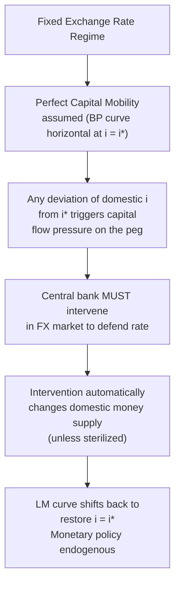
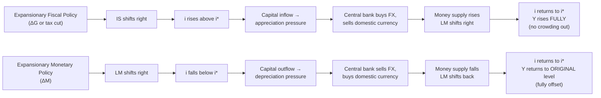

## Mundell-Fleming Model Under Fixed Exchange Rates

### Overview

The Mundell-Fleming model extends the closed-economy IS-LM framework to an open economy with international trade and capital flows, developed independently by Robert Mundell and Marcus Fleming in the early 1960s. Under a fixed exchange rate regime, the model demonstrates a striking and counterintuitive result: fiscal policy becomes highly effective at influencing output, while monetary policy becomes largely powerless — the reverse of the standard predictions under a floating exchange rate. This result follows directly from the mechanics of defending a currency peg under international capital mobility.

### Model Structure

#### The Three Curves

The open-economy Mundell-Fleming model combines three equilibrium relationships in output-interest rate ($Y$, $i$) space:

**IS curve (goods market equilibrium)**:

$$Y = C(Y-T) + I(i) + G + NX(e, Y, Y^*)$$

where net exports $NX$ depend negatively on the exchange rate $e$ (a stronger/more appreciated domestic currency reduces net exports), positively on foreign income $Y^*$, and negatively on domestic income $Y$ (via import demand). The IS curve slopes downward in $(Y, i)$ space, as in the closed economy, but its position also depends on the exchange rate.

**LM curve (money market equilibrium)**:

$$\frac{M}{P} = L(i, Y)$$

Real money supply equals real money demand, which is increasing in income and decreasing in the interest rate. The LM curve slopes upward in $(Y, i)$ space.

**Balance of payments (BP) / external equilibrium curve**: Under perfect capital mobility, this reduces to the interest rate parity condition. With a fixed exchange rate and no expected devaluation, uncovered interest parity requires:

$$i = i^*$$

The domestic interest rate must equal the world interest rate. Under perfect capital mobility, the BP curve is a **horizontal line** at $i = i^*$ — any domestic interest rate above $i^*$ triggers unlimited capital inflows, and any rate below $i^*$ triggers unlimited capital outflows, both of which put pressure on the fixed exchange rate that the central bank must accommodate.

### Illustrative Diagram: IS-LM-BP Under Fixed Rates

### Fiscal Policy Under Fixed Exchange Rates: Highly Effective

#### Mechanism

Consider an expansionary fiscal policy — an increase in government spending $G$ or a tax cut.

1. **Initial effect**: Higher $G$ shifts the IS curve rightward, which in a closed economy (or under floating rates) would raise both output $Y$ and the interest rate $i$.
2. **Interest rate pressure**: As the IS curve shifts right, the domestic interest rate begins to rise above the world rate $i^*$, since higher income raises money demand at the initial money supply, pushing along the LM curve to a higher $i$.
3. **Capital inflow pressure**: With $i > i^*$ and perfect capital mobility, capital flows in immediately, seeking the higher domestic return, which creates **appreciation pressure** on the domestic currency.
4. **Central bank intervention**: To defend the fixed exchange rate against this appreciation pressure, the central bank must **sell domestic currency and buy foreign currency**, which **increases the domestic money supply**.
5. **LM curve shifts right**: The rise in money supply shifts the LM curve rightward, which further **lowers the interest rate back toward $i^*$** and **raises output further**.
6. **New equilibrium**: This process continues until the interest rate returns exactly to $i^*$ (restoring the BP condition) — at which point output has risen by the **full extent of the IS shift with no offsetting interest rate increase (no crowding out via the interest rate channel)**.

#### Key Result

Under fixed exchange rates with perfect capital mobility, **fiscal policy is maximally effective** — there is no crowding out of private investment via higher interest rates (unlike the closed-economy or floating-rate case), because the money supply automatically expands to accommodate the fiscal expansion and keep the interest rate pinned at the world rate. The full multiplier effect on output is realized.

### Monetary Policy Under Fixed Exchange Rates: Ineffective

#### Mechanism

Consider an expansionary monetary policy — an increase in the money supply $M$.

1. **Initial effect**: Higher $M$ shifts the LM curve rightward, which in a closed economy would lower the interest rate and raise output.
2. **Interest rate pressure**: The interest rate begins to fall below the world rate $i^*$.
3. **Capital outflow pressure**: With $i < i^*$, capital flows out immediately, seeking the higher return available abroad, creating **depreciation pressure** on the domestic currency.
4. **Central bank intervention**: To defend the fixed exchange rate against this depreciation pressure, the central bank must **buy domestic currency and sell foreign currency reserves**, which **reduces the domestic money supply**.
5. **LM curve reverses**: The loss of reserves and the associated money supply contraction shifts the LM curve back toward its original position, undoing the initial expansionary monetary action.
6. **New equilibrium**: This process continues until the money supply — and therefore the LM curve, interest rate, and output — return **exactly to their original levels**.

#### Key Result

Under fixed exchange rates with perfect capital mobility, **monetary policy is completely ineffective at influencing output** — any attempt to expand or contract the money supply independently is automatically reversed by the reserve flows required to defend the peg. This is the direct application of the trilemma: **a fixed exchange rate combined with free capital mobility eliminates independent monetary policy.**

### Illustrative Diagram: Fiscal versus Monetary Policy Outcomes

### Sterilization: A Partial Qualification

**Key Points**

Central banks can attempt **sterilized intervention** — offsetting the effect of foreign exchange intervention on the domestic money supply through simultaneous open market operations (e.g., selling domestic bonds to absorb the liquidity injected by an FX purchase). If fully effective, sterilization would allow the central bank to influence domestic monetary conditions independently while still defending the peg.

However:

- Sterilized intervention only works to the extent that domestic and foreign bonds are **imperfect substitutes** (as in the portfolio balance model); under the strict Mundell-Fleming assumption of perfect capital mobility and perfect asset substitutability, sterilization is ultimately ineffective, since any sterilization-induced interest rate gap simply reopens the capital flow pressure that forces further reserve intervention.
- In practice, sterilization can provide **temporary** monetary autonomy, particularly for economies with capital controls or less than perfectly mobile capital, but is generally understood as unsustainable indefinitely against persistent, large-scale capital flow pressure. [Inference] The effectiveness and sustainable duration of sterilized intervention is empirically variable across countries and episodes, depending on capital account openness, the depth of domestic bond markets, and the credibility of the peg, so this should be treated as a matter of degree rather than a strict binary outcome.

### Imperfect Capital Mobility: A More Realistic Case

The stark "fiscal fully effective, monetary fully ineffective" result depends on the assumption of **perfect** capital mobility (an infinitely elastic, horizontal BP curve). With **imperfect capital mobility** — where capital flows respond to interest rate differentials but not infinitely — the BP curve has a positive (upward) slope rather than being perfectly horizontal, since even without full capital mobility, some capital inflow is still induced by a higher domestic interest rate, financing a larger current account/trade deficit associated with higher income.

Under imperfect capital mobility with a fixed exchange rate:

- Fiscal policy remains effective at raising output, but less than in the perfect-mobility case, since the interest rate does rise somewhat, generating partial crowding out.
- Monetary policy remains largely ineffective but the precise degree depends on the slope of the BP curve relative to the LM curve. [Unverified] The specific comparative-statics outcome in the imperfect-mobility case depends on the relative steepness of the LM and BP curves, a standard textbook extension exercise, and the exact quantitative degree of policy effectiveness is model- and parameter-specific rather than a single fixed result.

### Comparison with Floating Exchange Rates

**Output**

| Policy | Fixed exchange rate (perfect capital mobility) | Floating exchange rate (perfect capital mobility) |
| --- | --- | --- |
| Fiscal expansion | **Highly effective**: full multiplier, no crowding out (money supply endogenously expands) | **Ineffective**: interest rate rises, currency appreciates, net exports fall, fully offsetting the initial demand boost |
| Monetary expansion | **Ineffective**: reserve outflows force money supply back to original level | **Highly effective**: interest rate falls, currency depreciates, net exports rise, reinforcing the initial expansionary effect |

This reversal of relative policy effectiveness between fixed and floating regimes is one of the most important and frequently tested results in open-economy macroeconomics, directly illustrating the trilemma's practical policy implications.

### Worked Example

**Example**

A small open economy pegs its currency to a major reserve currency and maintains an open capital account (perfect capital mobility assumption). The government implements a large fiscal stimulus package (increased infrastructure spending).

- **Step 1**: The IS curve shifts right; absent any offsetting force, this would push $Y$ up and $i$ above the world rate $i^*$.
- **Step 2**: Foreign investors, seeing the domestic interest rate temporarily above $i^*$, move capital into the country to capture the higher yield, creating upward (appreciation) pressure on the domestic currency against the peg.
- **Step 3**: The central bank, committed to the fixed rate, must sell domestic currency (buy foreign currency reserves) to absorb this pressure and prevent appreciation, which mechanically expands the domestic money supply.
- **Step 4**: The expanded money supply pushes the interest rate back down to $i^*$, and in doing so raises output further, since the LM curve has shifted right without any deliberate monetary policy action by the central bank — it was purely the automatic consequence of defending the peg.
- **Result**: The fiscal expansion achieves its full intended effect on output, with the central bank's foreign exchange reserves rising as a byproduct, and no independent monetary tightening or loosening was possible during this process — the money supply adjustment was entirely endogenous to defending the fixed rate, not a policy choice.

**Next Steps**

- Mundell-Fleming model under floating exchange rates
- The impossible trinity / trilemma in depth
- Imperfect capital mobility and the sloped BP curve
- Sterilized versus unsterilized foreign exchange intervention
- IS-LM model in the closed economy (foundational review)
- Fixed versus floating exchange rate regimes: trade-offs
- Currency crises and speculative attacks on pegs
- Optimum Currency Area theory