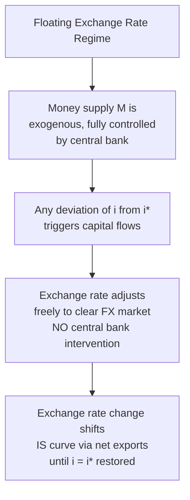
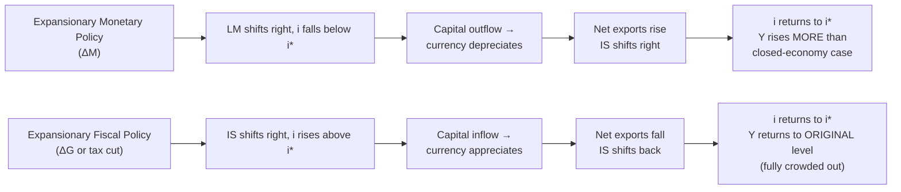

## Mundell-Fleming Model Under Floating Exchange Rates

### Overview

Under a floating exchange rate regime, the Mundell-Fleming model produces predictions that are the mirror image of the fixed-rate case: monetary policy becomes highly effective at influencing output, while fiscal policy becomes largely ineffective. This reversal follows from allowing the exchange rate to adjust freely to clear the foreign exchange market, removing the need for central bank intervention and the associated automatic money supply adjustments that characterize the fixed-rate case.

### Model Structure Under Floating Rates

The same three building blocks from the fixed-rate model apply, with one critical difference in how equilibrium is restored:

**IS curve**: $Y = C(Y-T) + I(i) + G + NX(e, Y, Y^*)$, where net exports depend negatively on the exchange rate $e$.

**LM curve**: $M/P = L(i, Y)$, now exogenously set by the central bank, since there is no obligation to intervene in the foreign exchange market.

**BP curve (interest parity)**: Under perfect capital mobility, $i = i^*$, horizontal in $(Y, i)$ space — but under a float, deviations from this line are corrected not by reserve flows and money supply changes, but by **movements in the exchange rate itself**, which shift the IS curve until equilibrium is restored at $i = i^*$.

This is the fundamental mechanical distinction from the fixed-rate case: the exchange rate is now the **endogenous adjustment variable**, while the money supply is **exogenous and under full central bank control**.

### Illustrative Diagram: Adjustment Mechanism Comparison

### Monetary Policy Under Floating Exchange Rates: Highly Effective

#### Mechanism

Consider an expansionary monetary policy — an increase in the money supply $M$.

1. **Initial effect**: Higher $M$ shifts the LM curve rightward, lowering the domestic interest rate below $i^*$ and raising output along the new LM curve.
2. **Capital outflow pressure**: With $i < i^*$, investors move capital abroad seeking the higher foreign return, increasing the supply of domestic currency on the foreign exchange market.
3. **Currency depreciation**: With no central bank intervention, this capital outflow pressure causes the domestic currency to **depreciate** freely.
4. **Net export boost**: The depreciation makes domestic goods cheaper relative to foreign goods, **increasing net exports** ($NX$ rises as $e$ depreciates, given the standard assumption of sufficiently elastic trade responses, e.g., satisfying the Marshall-Lerner condition).
5. **IS curve shifts right**: The improvement in net exports shifts the IS curve rightward, **reinforcing** the initial expansionary effect of the monetary policy on output.
6. **New equilibrium**: The IS curve continues shifting until the interest rate returns to $i^*$ — output has risen by **more than it would have** in a closed economy, because the exchange rate depreciation channel adds a second expansionary force (higher net exports) on top of the initial interest-rate-driven boost to investment.

#### Key Result

Under floating exchange rates with perfect capital mobility, **monetary policy is highly effective** — it operates through both the traditional interest rate channel (lower $i$ stimulating investment) and an additional exchange rate channel (depreciation stimulating net exports), which reinforce one another.

### Fiscal Policy Under Floating Exchange Rates: Ineffective (Crowded Out)

#### Mechanism

Consider an expansionary fiscal policy — an increase in government spending $G$.

1. **Initial effect**: Higher $G$ shifts the IS curve rightward, which would raise both $Y$ and $i$ absent any exchange rate adjustment.
2. **Interest rate pressure**: As income rises, money demand rises, pushing the interest rate above $i^*$ along the fixed (unchanged) LM curve.
3. **Capital inflow pressure**: With $i > i^*$, capital flows in seeking the higher domestic yield, increasing demand for the domestic currency on the foreign exchange market.
4. **Currency appreciation**: With no central bank intervention to absorb this pressure, the domestic currency **appreciates** freely.
5. **Net export decline**: The appreciation makes domestic goods more expensive relative to foreign goods, **reducing net exports**.
6. **IS curve shifts back**: The decline in net exports shifts the IS curve back toward its original position, **offsetting** the initial fiscal expansion.
7. **New equilibrium**: This process continues until the interest rate returns exactly to $i^*$ — at which point output has returned **fully to its original level** (under perfect capital mobility), since the money supply has not changed and the LM curve therefore pins down a unique level of output consistent with $i = i^*$.

#### Key Result

Under floating exchange rates with perfect capital mobility, **fiscal policy is completely ineffective at influencing output** — the crowding out that occurs via currency appreciation and the resulting decline in net exports exactly offsets the initial fiscal impulse. This is sometimes described as fiscal policy being crowded out through the **trade balance / exchange rate channel** rather than the traditional closed-economy interest rate/investment channel.

### Illustrative Diagram: Fiscal versus Monetary Policy Outcomes

### Comparison with Fixed Exchange Rates

**Key Points**

- The fixed-rate and floating-rate results are exact mirror images of one another under the perfect-capital-mobility assumption: whichever policy tool is effective under one regime is ineffective under the other.
- Under **fixed** rates: fiscal policy effective, monetary policy ineffective (money supply is endogenous, exchange rate is fixed).
- Under **floating** rates: monetary policy effective, fiscal policy ineffective (money supply is exogenous, exchange rate is the adjustment variable).
- This reversal is a direct, mechanical consequence of the trilemma: which variable is "free" to adjust (money supply under floats, versus reserves/money supply under fixed rates) determines which policy tool retains traction.

**Output**

| Policy | Floating rate (perfect capital mobility) | Fixed rate (perfect capital mobility) |
| --- | --- | --- |
| Monetary expansion | **Highly effective**: lower i → depreciation → higher NX, reinforcing effect | **Ineffective**: reserve outflows force money supply back |
| Fiscal expansion | **Ineffective**: higher i → appreciation → lower NX, fully offsetting effect | **Highly effective**: money supply endogenously expands, no crowding out |

### Imperfect Capital Mobility

As in the fixed-rate case, relaxing the assumption of perfect capital mobility (giving the BP curve a finite positive slope rather than being perfectly horizontal) moderates these stark results:

- Fiscal policy under floating rates with imperfect capital mobility retains **some** positive effect on output, since the appreciation-driven crowding out is less than complete.
- Monetary policy under floating rates with imperfect capital mobility remains effective but the precise magnitude of the reinforcing exchange rate channel depends on the relative slopes of the LM and BP curves. [Unverified] As with the fixed-rate imperfect-mobility case, the exact quantitative degree of policy effectiveness under intermediate capital mobility assumptions is parameter- and model-specific, a standard extension in graduate open-economy macroeconomics texts rather than a single universal result.

### Exchange Rate Overshooting Connection

The floating-rate Mundell-Fleming framework, when combined with the assumption of sticky goods prices (as in the Dornbusch model), helps explain why monetary policy shocks can generate exchange rate **overshooting**: because financial markets (including the exchange rate) adjust instantly while goods markets adjust slowly, the exchange rate may initially move by more than its eventual long-run change, then partially reverse as prices gradually catch up — a short-run dynamic elaborated in the dedicated exchange rate determination models and Dornbusch overshooting topics.

### Worked Example

**Example**

A large, financially open economy operating a fully floating exchange rate faces a domestic recession. The central bank responds by cutting its policy interest rate (expansionary monetary policy), while the government simultaneously debates a fiscal stimulus package but does not act on it.

- **Monetary policy path**: The rate cut lowers domestic yields below the world rate, prompting capital outflows and currency depreciation. The cheaper currency boosts export competitiveness, adding a second wave of demand stimulus on top of the direct effect of lower borrowing costs on domestic investment — the model predicts this combined effect should be substantial in raising output back toward potential.
- **Hypothetical fiscal alternative**: Had the government instead pursued fiscal stimulus alone (with the central bank holding rates unchanged), the model predicts the resulting rise in domestic interest rates would attract capital inflows, appreciate the currency, and erode net exports — largely offsetting the intended demand boost, illustrating why, in this framework, monetary policy is the preferred and more potent counter-cyclical tool under floating exchange rates with high capital mobility, while unilateral fiscal expansion is a comparatively weak lever.

**Next Steps**

- Mundell-Fleming model under fixed exchange rates
- The impossible trinity / trilemma in depth
- Dornbusch overshooting and the sticky-price extension
- Marshall-Lerner condition and the J-curve effect
- Imperfect capital mobility and BP curve slope
- Fixed versus floating exchange rate regimes: trade-offs
- Monetary policy transmission in open economies
- Twin deficits and fiscal-current account linkages