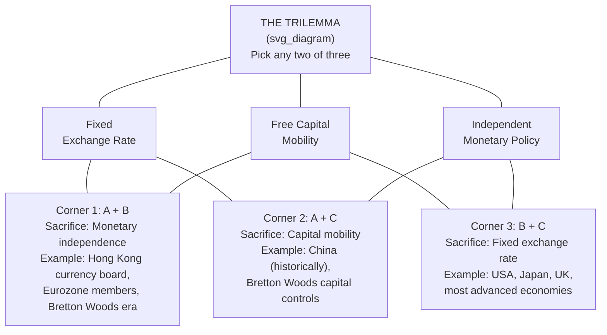

## Impossible Trinity (Trilemma) of Open Economy Policy

### Overview

The impossible trinity, also known as the trilemma or the Mundell-Fleming trilemma, is a foundational proposition in open-economy macroeconomics stating that a country cannot simultaneously achieve all three of the following policy objectives: a fixed exchange rate, free international capital mobility, and an independent monetary policy. At most two of the three can be sustained at once; pursuing the third necessarily requires sacrificing one of the other two. The trilemma provides the organizing logic behind exchange rate regime choice, capital account liberalization decisions, and the structure of currency unions.

### The Three Corners

**Fixed exchange rate**: The government or central bank commits to maintaining the currency's value at (or very near) a specific level against another currency, basket of currencies, or commodity.

**Free capital mobility**: Residents and non-residents can move financial capital across the country's borders without restriction — no capital controls on inflows or outflows.

**Independent monetary policy**: The central bank sets interest rates and controls the domestic money supply according to domestic objectives (inflation control, output stabilization) without being constrained by the need to maintain a particular exchange rate.

### Theoretical Basis: Interest Rate Parity

The trilemma follows directly from uncovered interest rate parity (UIP), which links domestic and foreign interest rates through expected exchange rate movements:

$$i = i^* + \frac{E[e_{t+1}] - e_t}{e_t}$$

If the exchange rate is credibly fixed, the expected rate of depreciation $\frac{E[e_{t+1}] - e_t}{e_t}$ is approximately zero, which forces:

$$i \approx i^*$$

Under free capital mobility, this equality must hold continuously — any gap between $i$ and $i^*$ triggers capital flows large enough (in principle, unlimited under perfect mobility) to either force a change in the domestic interest rate or break the fixed exchange rate. The only way to sustain a fixed rate with an interest rate that diverges from $i^*$ is to prevent the arbitrage-driven capital flows that would otherwise force convergence — i.e., to restrict capital mobility.

### Illustrative Diagram: The Trilemma Triangle

### The Three Corner Solutions in Detail

#### Corner 1: Fixed Rate + Free Capital Mobility (Sacrifice Monetary Independence)

Countries in this corner peg their currency and allow capital to move freely, accepting that domestic interest rates must track the anchor currency's rates.

**Examples**: Hong Kong's currency board (pegged to the U.S. dollar since 1983), Eurozone member states relative to each other (with the European Central Bank setting a single monetary policy for the entire currency union), and most participants in the Bretton Woods system during periods of relatively open capital accounts.

**Implication**: The domestic central bank effectively imports the monetary policy stance of the anchor country or currency union, regardless of whether that stance suits domestic economic conditions. As illustrated in the Mundell-Fleming fixed-rate framework, monetary policy becomes ineffective as an independent domestic stabilization tool.

#### Corner 2: Fixed Rate + Independent Monetary Policy (Sacrifice Capital Mobility)

Countries in this corner maintain a fixed or managed exchange rate while retaining some domestic monetary policy autonomy, achieved by restricting cross-border capital flows through capital controls.

**Examples**: China maintained extensive capital controls for decades while managing its exchange rate and retaining meaningful monetary policy autonomy; many countries during the Bretton Woods era (1944–1971) combined fixed rates with capital controls, which was an explicit and accepted feature of that system's design.

**Implication**: Capital controls can take many forms — taxes on capital inflows/outflows, quantitative restrictions, dual exchange rate systems, or administrative approval requirements for cross-border transactions. [Unverified] The effectiveness of capital controls at genuinely preserving monetary autonomy varies considerably based on their comprehensiveness, enforcement capacity, and the sophistication of markets in finding circumvention channels, and is a subject of ongoing empirical debate in the international finance literature.

#### Corner 3: Free Capital Mobility + Independent Monetary Policy (Sacrifice Fixed Exchange Rate)

Countries in this corner allow capital to move freely and retain full monetary policy independence, accepting that the exchange rate must float and absorb the resulting adjustment pressure.

**Examples**: The United States, Japan, the United Kingdom, and most major advanced economies since the collapse of Bretton Woods in the early 1970s operate in this corner, with independent central banks setting policy based on domestic mandates (e.g., inflation targeting) and exchange rates determined by market forces.

**Implication**: As illustrated in the Mundell-Fleming floating-rate framework, monetary policy becomes highly effective as a domestic stabilization tool, while the exchange rate serves as an automatic shock absorber, though at the cost of potential volatility and uncertainty.

### The Trilemma in Historical Practice

**Key Points**

- **Gold standard era (pre-WWI)**: Broadly resembled Corner 1 — countries maintained fixed convertibility to gold with relatively open capital markets, sacrificing independent monetary policy (interest rates were largely governed by gold flow "rules of the game").
- **Bretton Woods system (1944–1971)**: Designed explicitly as Corner 2 — an adjustable peg system to the U.S. dollar (itself convertible to gold), combined with widespread capital controls that were considered a legitimate and even necessary feature to allow member countries some domestic policy autonomy.
- **Post-Bretton Woods era (1971–present)**: A gradual, uneven shift toward Corner 3 among advanced economies, as capital account liberalization proceeded through the 1980s–1990s alongside the adoption of floating or independently managed exchange rates and, in many cases, formal inflation-targeting monetary frameworks.
- **European Monetary Union**: Represents an extreme version of Corner 1 among member states — rather than merely pegging currencies, the euro area eliminated separate national currencies altogether for its members, resolving the trilemma definitionally at the national level (since there is no longer a national exchange rate to manage) while the currency union as a whole occupies Corner 3 relative to the rest of the world (a single floating currency with the ECB setting one monetary policy).

### Intermediate Regimes and Partial Trade-offs

In practice, few countries occupy the pure corners exactly. Many operate with:

- **Partial capital account openness**: Some restrictions on certain capital flows (e.g., limits on short-term "hot money" while allowing long-term foreign direct investment), yielding partial rather than complete monetary autonomy.
- **Managed floats with intervention**: Central banks that do not commit to a fixed rate but intervene periodically, achieving a degree of exchange rate stability while retaining substantial, though not unconstrained, monetary independence.

[Inference] The empirical literature on exchange rate regimes (notably associated with economists such as Barry Eichengreen and Jeffrey Frankel) has documented a broad historical tendency for intermediate regimes — combining partial fixity with partial capital openness — to be more crisis-prone than the pure corner solutions when capital mobility is substantial, sometimes summarized as the "bipolar view" or "hollowing out of the middle" hypothesis, though this remains a debated generalization with numerous documented exceptions rather than a strict law, and many countries continue to successfully manage intermediate arrangements, particularly when supported by capital controls or strong policy credibility.

### Trilemma versus "Dilemma": The Rey Critique

A prominent extension to the classic trilemma framework, associated with economist Hélène Rey, argues that in a world of highly integrated global financial markets, even countries with **floating exchange rates** may find their monetary policy autonomy constrained by the **global financial cycle** — a common factor in cross-border capital flows, credit growth, and asset prices driven substantially by conditions in major financial centers (particularly U.S. monetary policy and global risk appetite). This perspective suggests the trilemma may effectively collapse toward a "dilemma": free capital mobility may undermine monetary independence regardless of exchange rate regime, unless capital account restrictions are used to manage the associated volatility. [Unverified] This "dilemma, not trilemma" thesis remains an actively debated proposition within international macroeconomics and monetary policy research rather than a settled consensus replacing the classical trilemma framework, and its practical policy implications continue to be examined across different country contexts and time periods.

### Policy Implications and Applications

**Output**

| Objective prioritized | What must be sacrificed | Common policy tools involved |
| --- | --- | --- |
| Exchange rate stability + open capital markets | Monetary independence | Currency board, currency union, hard peg |
| Exchange rate stability + monetary independence | Capital mobility | Capital controls, dual exchange rate systems |
| Monetary independence + open capital markets | Fixed exchange rate | Floating or managed float, inflation targeting |

The trilemma is frequently invoked in policy discussions regarding:

- Whether emerging markets should liberalize capital accounts, and at what pace and sequencing relative to exchange rate regime and financial sector development
- The design and constraints of currency unions (most prominently the Eurozone, and academic discussions of dollarization or regional monetary unions elsewhere)
- Central bank responses to large, volatile capital flows ("hot money") even under nominally floating exchange rate regimes
- The appropriate use of macroprudential policy and capital flow management measures as a complement to, or partial substitute for, traditional capital controls

### Worked Example

**Example**

Consider a small emerging-market economy that wishes to maintain a stable exchange rate against the U.S. dollar (for import price stability and investor confidence) while also wanting to use domestic monetary policy to combat a domestic recession by lowering interest rates below the U.S. federal funds rate.

Under the trilemma, if this economy also maintains a fully open capital account, this combination is unsustainable: lowering domestic rates below U.S. rates would trigger capital outflows (investors seeking the higher U.S. return), placing depreciation pressure on the currency that is inconsistent with the fixed-rate commitment. The economy has three options:

1. **Abandon the fixed rate** and allow the currency to depreciate as domestic rates are cut (moving toward Corner 3).
2. **Abandon the rate cut** and keep domestic interest rates aligned with the U.S. rate to preserve the peg (staying in Corner 1, accepting no monetary independence).
3. **Impose capital controls** to prevent or limit the outflow response to the lower domestic rate, allowing the rate cut and the peg to coexist (moving toward Corner 2).

There is no policy combination available that achieves the stable peg, the independent rate cut, and unrestricted capital mobility simultaneously — this is the trilemma in direct practical application.

**Next Steps**

- Mundell-Fleming model under fixed exchange rates
- Mundell-Fleming model under floating exchange rates
- Fixed versus floating exchange rate regimes: trade-offs
- Capital controls: rationale, design, and effectiveness
- Optimum Currency Area theory and the Eurozone
- Global financial cycle and the Rey "dilemma" hypothesis
- Currency crises and speculative attacks on pegs
- Bretton Woods system: history and collapse