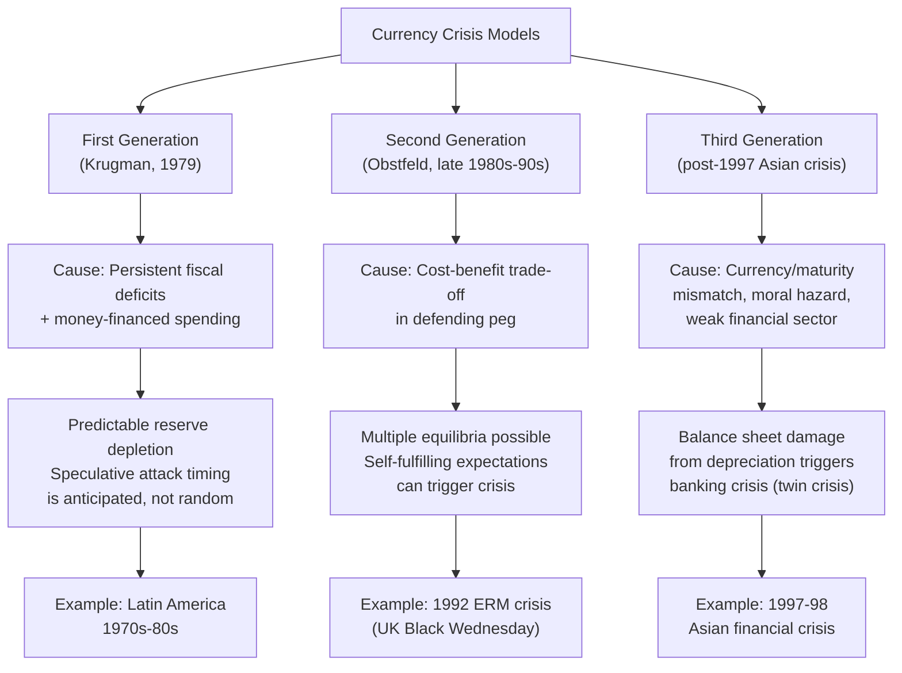

## Currency Crises and Speculative Attacks

### Overview

A currency crisis occurs when a fixed, pegged, or heavily managed exchange rate collapses abruptly, typically forcing a sharp devaluation or a shift to a floating regime, often accompanied by severe economic disruption. Speculative attacks are the market mechanism through which such collapses are frequently triggered — coordinated or independent selling pressure by investors betting that a peg is unsustainable, which can become self-reinforcing. The theoretical literature on currency crises is generally organized into three "generations" of models, each capturing different underlying mechanisms and historical episodes.

### First-Generation Models: Fundamentals-Driven Crises

#### Theoretical Framework

First-generation models, developed initially by Paul Krugman (1979) building on earlier work by Stephen Salant and Dale Henderson on commodity price speculation, explain currency crises as the inevitable, predictable outcome of **inconsistent domestic policy** — specifically, persistent fiscal deficits financed by money creation, which is fundamentally incompatible with maintaining a fixed exchange rate over time.

**Mechanism**:

1. The government runs persistent budget deficits financed by domestic credit expansion (money creation) by the central bank.
2. This continuous money creation is inconsistent with the fixed exchange rate, since it would, under a float, cause continuous depreciation; under a peg, it instead causes a **steady, gradual depletion of the central bank's foreign exchange reserves**, as the central bank must continuously sell foreign currency to absorb the excess domestic money creation and defend the peg.
3. Reserves decline steadily over time in a predictable path.
4. Rational, forward-looking speculators anticipate that once reserves fall to some critical minimum threshold, the central bank will be unable to continue defending the peg and will be forced to abandon it (either running out of reserves entirely, or reaching a level considered a minimum acceptable buffer).
5. Because speculators can predict this outcome, they attack the currency (selling it, buying reserves) **before** reserves are literally exhausted, since waiting until the last moment would mean buying the last available foreign currency at the still-fixed (and, they anticipate, about-to-be-devalued) rate — an attractive, essentially riskless arbitrage opportunity available to whoever moves first.
6. This anticipatory attack causes reserves to fall to the critical threshold **discretely and suddenly**, rather than gradually as would occur without speculative behavior, precipitating an abrupt collapse of the peg that occurs earlier than the "natural" reserve exhaustion date implied by fundamentals alone.

**Key insight**: The timing of the collapse is determined by rational speculation, not simply by the mechanical exhaustion of reserves — the crisis is a predictable consequence of an underlying fiscal/monetary policy inconsistency, and speculators merely accelerate an outcome that was fundamentally inevitable given the policy stance.

**Historical association**: First-generation models are commonly associated with Latin American currency crises of the 1970s–1980s, where persistent fiscal deficits and monetary financing were prominent features preceding peg collapses.

### Second-Generation Models: Self-Fulfilling Crises

#### Theoretical Framework

Second-generation models, developed primarily by Maurice Obstfeld (late 1980s–1990s), depart from the assumption that crises are driven solely by deteriorating fundamentals. Instead, they emphasize that a government's decision to defend or abandon a peg involves a **cost-benefit trade-off**, and that this trade-off can generate **multiple possible equilibria** — meaning a crisis can occur even when underlying fundamentals are not obviously unsustainable, purely because market expectations shift and become self-fulfilling.

**Mechanism**:

1. The government faces a cost to defending the peg (e.g., raising interest rates to attract capital and defend the currency depresses domestic output and employment, or raises debt-servicing costs) and a cost to abandoning it (loss of credibility, disruption to trade and investment planning, potential balance-sheet damage if there is significant foreign-currency debt).
2. If markets believe the peg will hold, they do not attack, defense is relatively cheap (low speculative pressure to counter), and the government indeed maintains the peg — a "good" equilibrium.
3. If markets believe the peg is vulnerable and begin selling the currency in anticipation of devaluation, the government faces a much higher cost of defense (needing sharply higher interest rates or larger reserve sales to counter the pressure), which may make abandoning the peg the government's rational choice — validating the market's expectation and producing a "bad" equilibrium.
4. Because both outcomes can be consistent with the same underlying fundamentals, the crisis is **self-fulfilling**: a shift in market expectations and coordinated (or uncoordinated but correlated) speculative behavior can itself cause a crisis that would not have occurred absent that shift in expectations.

**Key insight**: Multiple equilibria mean that currency crises under this framework are not fully predictable from fundamentals alone — market sentiment, coordination among investors, and even seemingly small triggering events can push an economy from a "no-crisis" equilibrium to a "crisis" equilibrium.

**Historical association**: Second-generation models are widely associated with the 1992 European Exchange Rate Mechanism (ERM) crisis, including the UK's forced exit from the ERM on "Black Wednesday" (September 16, 1992), where the UK's underlying fundamentals were debated as not obviously catastrophic, yet sustained, large-scale speculative pressure (prominently including activity by hedge fund manager George Soros) made continued defense of the pound's ERM parity costly enough that the UK government chose to abandon it. [Unverified] The precise characterization of UK fundamentals in 1992 as "sound" versus "vulnerable" remains a subject of some historical and academic debate, and the episode is generally cited as illustrative of self-fulfilling dynamics rather than as a case with a single, uncontested fundamentals assessment.

### Third-Generation Models: Balance Sheet and Financial Sector Crises

#### Theoretical Framework

Third-generation models, developed in response to the 1997–98 Asian financial crisis, incorporate the role of **financial sector fragility, balance sheet mismatches, and moral hazard** in generating currency crises, moving beyond the pure fiscal/monetary or speculative-expectations focus of the first two generations.

**Key mechanisms**:

- **Currency mismatch / "original sin"**: Firms, banks, or governments borrow heavily in foreign currency (often because domestic currency long-term borrowing is unavailable or expensive) while earning revenue primarily in domestic currency. A depreciation sharply raises the domestic-currency value of foreign debt service, potentially triggering widespread insolvency even among firms with otherwise sound operations.
- **Maturity mismatch**: Banks or firms borrow short-term (often in foreign currency) to fund longer-term domestic investments, creating vulnerability to sudden stops in short-term capital flows and rollover risk.
- **Moral hazard and implicit guarantees**: Perceived (even if not formally stated) government guarantees for the banking sector can encourage excessive risk-taking and overborrowing in foreign currency, since lenders and borrowers may not fully price in currency and rollover risk if they expect to be bailed out.
- **Twin crises**: Currency crises under this framework frequently coincide with or trigger **banking crises**, since currency depreciation directly damages bank and corporate balance sheets carrying foreign-currency liabilities, which in turn can trigger credit contraction, capital flight, and a self-reinforcing downward spiral affecting both the currency and the domestic financial system simultaneously.

**Historical association**: Third-generation models are closely associated with the 1997–98 Asian financial crisis (Thailand, Indonesia, South Korea, and others), where extensive short-term, foreign-currency-denominated corporate and bank borrowing, combined with pegged exchange rates, created severe vulnerability once capital flow sentiment reversed.

### Illustrative Diagram: Three Generations of Currency Crisis Models

### Sudden Stops and Capital Flow Reversals

A closely related concept, particularly relevant to emerging market crises, is the **sudden stop** phenomenon (a term associated with economist Guillermo Calvo) — an abrupt, severe reduction or reversal of capital inflows, often triggered by a shift in global investor risk appetite, contagion from crises elsewhere, or a reassessment of country-specific risk. Sudden stops can precipitate currency crises even in the absence of an explicit fixed exchange rate to defend, as the abrupt reversal of financing forces sharp exchange rate depreciation, import compression, and often a severe recession, particularly damaging for economies with significant foreign-currency liabilities.

### Contagion

**Key Points**

Currency crises frequently exhibit **contagion** — the spread of crisis pressure from one country to others, even those with seemingly different fundamentals, through several channels:

- **Trade linkages**: A crisis and devaluation in one country improves that country's export competitiveness, potentially pressuring trading partners and competitors to face reduced competitiveness, generating speculative pressure on their currencies.
- **Financial linkages**: Common creditors (e.g., regional or global banks with exposure across multiple emerging markets) may reduce lending broadly in response to losses or heightened risk perception in one country, transmitting pressure to other borrowers.
- **Wake-up call / reassessment effects**: A crisis in one country can prompt investors to reassess risk in other countries perceived to share similar vulnerabilities (e.g., similar exchange rate regimes, current account deficits, or financial sector weaknesses), even without direct trade or financial linkages.

The 1997–98 Asian financial crisis is frequently cited as a prominent example of regional contagion, spreading from Thailand to Indonesia, South Korea, Malaysia, and the Philippines in rapid succession. [Inference] The relative weight of these different contagion channels in specific historical episodes remains a subject of ongoing empirical research, and the extent to which contagion reflects genuine fundamental interlinkages versus purely sentiment-driven spillovers is debated across specific crisis episodes.

### Defending Against Speculative Attacks: Policy Responses

Governments and central banks facing speculative pressure on a peg have several potential responses, each with significant trade-offs:

- **Raising interest rates sharply**: Attracts capital inflows and raises the cost of short-selling the currency, but can severely damage domestic economic activity and worsen the fiscal position (higher debt servicing costs) if maintained for an extended period.
- **Direct foreign exchange intervention**: Selling reserves to meet the excess demand for foreign currency, but limited by the size of available reserves.
- **Capital controls**: Restricting the ability of investors to move funds out of the currency, which can buy time but may also damage investor confidence for future capital access and violate existing commitments (e.g., IMF Article VIII obligations for current account convertibility, or regional trade/investment agreements).
- **Abandoning the peg (devaluation or float)**: Accepting the costs of abandoning the fixed rate commitment (credibility loss, balance sheet damage if foreign-currency debt is significant) in exchange for regaining monetary policy flexibility and halting the reserve drain.
- **IMF and international financial assistance**: Emergency financing to bolster reserves and support defense of the currency or manage an orderly transition, typically conditioned on policy adjustments (the IMF's traditional "conditionality" framework), which has itself been a subject of significant debate regarding appropriate design, particularly following criticism of the fiscal and monetary conditionality attached during the Asian financial crisis. [Unverified] The specific terms and conditionality frameworks the IMF applies have evolved considerably since the 1997–98 crisis in response to this criticism, so any characterization of current IMF crisis-lending practice should be checked against up-to-date IMF policy documentation rather than assumed to mirror 1990s-era conditionality.

### Worked Example: A Stylized First-Generation Attack

**Example**

Consider a country with a fixed exchange rate and $10 billion in foreign exchange reserves. The government runs a persistent fiscal deficit financed by $500 million per month in new domestic money creation, which under the fixed rate translates into a corresponding steady reserve outflow of $500 million per month as the central bank absorbs the excess domestic currency to defend the peg.

- **Without speculation**: Reserves would decline by $500 million monthly, reaching zero after 20 months.
- **With rational speculation**: Investors anticipate that the government will be forced to abandon the peg once reserves fall to some minimum critical level — say, $2 billion (a level below which the central bank is judged unable to credibly continue defense). Rather than waiting passively, speculators recognize that whoever sells the currency first, just before this threshold is reached, can buy the remaining reserves at the still-fixed, soon-to-be-devalued rate — an attractive proposition. This dynamic causes a sudden, discrete speculative attack that exhausts reserves down to the critical threshold **well before** the 16-month mark implied by simple linear extrapolation to the $2 billion level, causing the peg to collapse earlier and more abruptly than the underlying fiscal deficit alone would have implied.

**Next Steps**

- Fixed versus floating exchange rate regimes: trade-offs
- The impossible trinity / trilemma in depth
- Sudden stops and capital flow reversals (Calvo)
- Twin crises: currency and banking crisis linkages
- The 1997-98 Asian financial crisis: case study
- The 1992 ERM crisis: case study
- IMF conditionality and crisis lending frameworks
- Capital controls: rationale, design, and effectiveness
- "Original sin" and foreign-currency-denominated debt