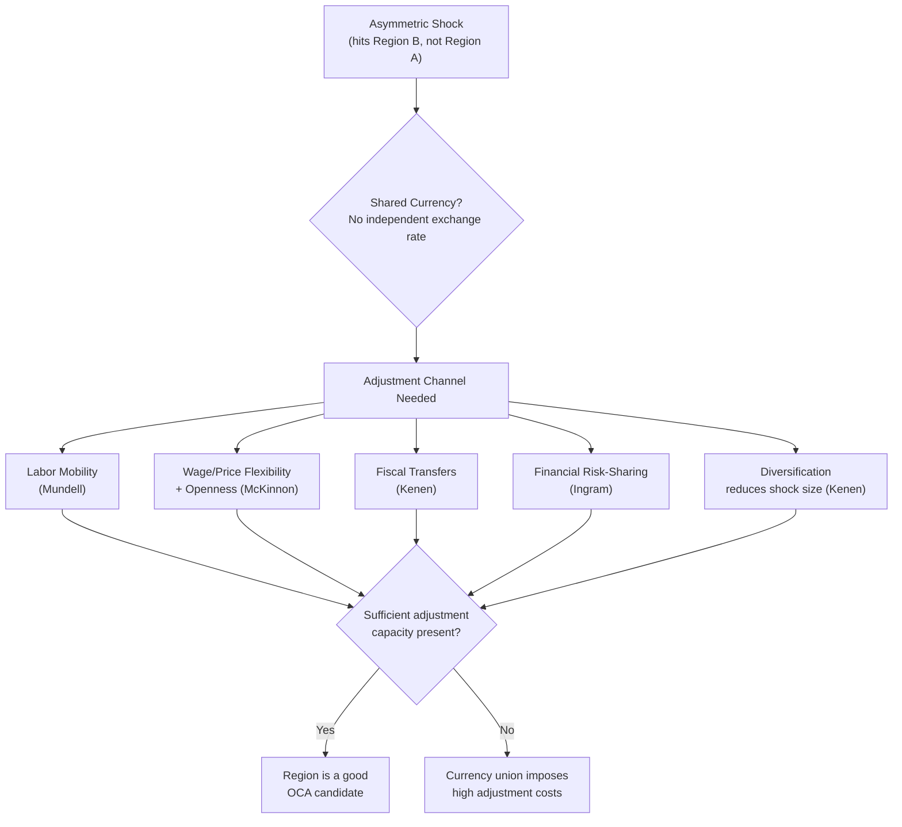

## Optimal Currency Areas Theory

### Definition and Core Concept

An optimal currency area (OCA) is a geographic region for which it would be economically optimal to share a single currency, or equivalently, to permanently fix exchange rates among its constituent parts. The theory addresses a fundamental trade-off: adopting a common currency (or a fixed exchange rate) eliminates the ability of individual regions or countries within the area to use independent monetary policy and nominal exchange rate adjustments as tools to respond to region-specific ("asymmetric") economic shocks.

The theory was pioneered by Robert Mundell (1961), with foundational contributions from Ronald McKinnon (1963) and Peter Kenen (1969). Mundell's original insight was that the optimal domain of a currency is not necessarily a nation-state; it could be smaller than a country (if regions within it are very different) or larger than a country (if several countries are sufficiently similar/integrated).

### The Core Trade-Off

**Benefits of joining a currency union:**

- Elimination of transaction costs from currency conversion
- Elimination of exchange rate uncertainty/risk for trade and investment
- Enhanced price transparency, which intensifies competition across the union
- Potential credibility gains for monetary policy (importing the discipline of a stable anchor currency or a shared central bank)
- Deeper financial and capital market integration

**Costs of joining a currency union:**

- Loss of independent monetary policy (cannot set interest rates for local conditions)
- Loss of the nominal exchange rate as a shock absorber
- Loss of seigniorage (revenue from issuing one's own currency)
- Vulnerability to asymmetric shocks with no country-specific policy lever to respond

The OCA criteria specify the conditions under which the benefits are likely to outweigh the costs — that is, when the cost of losing independent monetary policy is low because alternative adjustment mechanisms exist.

### Mundell's Framework: The Adjustment Problem

Consider two regions, A and B, that share a currency (or a fixed exchange rate) and experience an **asymmetric demand shock**: demand shifts from B's output to A's output.

- Region A experiences excess demand → inflationary pressure, low unemployment
- Region B experiences deficient demand → recession, high unemployment

Under flexible exchange rates (if A and B had separate currencies), B could depreciate its currency to restore competitiveness and shift demand back. Under a shared currency, this option is unavailable. The theory identifies what conditions allow the region to adjust to such a shock *without* the exchange rate tool.

$$\text{Adjustment} = f(\text{Labor Mobility}, \text{Wage/Price Flexibility}, \text{Fiscal Transfers}, \text{Diversification})$$

### The OCA Criteria

**1. Labor Mobility (Mundell, 1961)**

If workers can move freely and costlessly from the depressed region (B) to the booming region (A), unemployment in B falls and wage pressure in A eases, restoring equilibrium without needing an exchange rate change. Labor mobility acts as a substitute adjustment mechanism.

- **Key Points**
  - Mobility must be sufficient in magnitude, speed, and direction to offset the shock
  - Barriers include: language, culture, legal/immigration restrictions, licensing/credential recognition, housing costs, and social ties
  - This is often cited as the primary reason the U.S. dollar area functions relatively well as a currency area (high interstate labor mobility) versus the Eurozone (lower labor mobility across countries due to language and cultural barriers)

**2. Openness and Trade Integration / Price-Wage Flexibility (McKinnon, 1963)**

McKinnon focused on the **degree of openness** of an economy, measured as the ratio of tradable-to-nontradable goods production (or trade-to-GDP ratio).

- In a very open economy, exchange rate depreciation is a *less effective* and *more costly* tool: a large share of consumption is imported, so depreciation quickly raises the domestic price level (pass-through), eroding the real competitiveness gain it was meant to deliver and instead just generating inflation.
- Therefore, small, highly open economies have *less to lose* from giving up their own currency — depreciation was not going to help them much anyway — making them better OCA candidates.
- Conversely, large, relatively closed economies (where trade is a small share of GDP) benefit more from retaining exchange rate flexibility.

**3. Product/Output Diversification (Kenen, 1969)**

Kenen argued that a well-diversified economy (many industries/products) is less exposed to asymmetric shocks in the first place, because a shock to any single sector or export good is averaged out across many others.

- Highly diversified economies experience fewer and smaller region-specific shocks → less need for independent monetary policy
- Highly specialized economies (e.g., a region dependent on a single commodity or industry) are more vulnerable to asymmetric shocks and thus benefit more from retaining an independent currency/exchange rate

**4. Fiscal Transfers / Fiscal Federalism (Kenen, 1969; Eichengreen)**

A fiscal transfer mechanism — such as a federal tax-and-transfer system — can substitute for exchange rate adjustment. If region B is in recession, an automatic fiscal channel (e.g., lower federal tax collection from B, higher unemployment insurance payouts to B, funded implicitly by region A) cushions the shock.

- This requires a **political union** or at least a shared fiscal authority with the capacity and willingness to redistribute across regions
- Widely cited as a major structural gap in the Eurozone relative to the United States: the U.S. has an automatic federal fiscal transfer system across states; the Eurozone, historically, has lacked an equivalent central fiscal capacity

**5. Similarity of Economic Structure / Business Cycle Synchronization**

If regions/countries have similar economic structures and their business cycles are highly correlated, then shocks tend to be **symmetric** rather than asymmetric — a single, one-size-fits-all monetary policy set by a common central bank will suit all members simultaneously.

- Measured empirically via correlation of GDP growth, correlation of industrial output, or correlation of shocks (using structural VAR decomposition into supply and demand shocks, following Bayoumi and Eichengreen's work applying this to Europe)
- High correlation → good OCA candidate; low correlation → poor OCA candidate

**6. Financial Market Integration (Ingram, 1969)**

Deep financial integration allows private capital flows to substitute for adjustment: a region hit by a negative shock can draw down savings, borrow, or receive investment inflows from other regions, smoothing consumption even without an exchange rate change or fiscal transfer. This is sometimes called "private risk-sharing" as distinct from the public fiscal risk-sharing above.

**7. Similar Inflation Preferences / Political Compatibility**

Members should have similar tolerances for inflation versus unemployment trade-offs and similar political commitment to price stability, since a shared central bank can only pursue one monetary policy stance for the entire union.

### Endogeneity of OCA Criteria: The Frankel-Rose Hypothesis

A major theoretical development (Frankel and Rose, 1998) argued that OCA criteria are **endogenous** — that is, joining a currency union can itself *create* the conditions that make it optimal, even if they did not hold ex ante.

- **Mechanism**: A common currency lowers trade costs → increases trade integration → increases business cycle synchronization (via intra-industry trade and shared demand shocks) → makes the OCA criteria progressively more satisfied over time
- **[Inference]** This implies static, pre-entry evaluation of OCA criteria may understate the long-run suitability of a currency union, since the act of unification changes the underlying economic structure
- Counter-view: increased trade integration could also increase *specialization* (per Krugman), which would *increase* asymmetric shock exposure, so the net effect on synchronization is theoretically ambiguous and treated as an empirical question

### Application: The Eurozone Debate

The Eurozone is the most extensively studied real-world test case for OCA theory.

**Arguments that the Eurozone is not (or was not) an optimal currency area:**

- Low cross-country labor mobility (language, cultural, and legal barriers) compared to the U.S.
- No centralized fiscal transfer mechanism comparable to U.S. federal fiscal federalism (though the European Stability Mechanism and post-2020 instruments like NextGenerationEU represent partial, more recent steps in this direction)
- Divergent economic structures between core (e.g., Germany) and periphery (e.g., Greece, Portugal, Spain) economies
- The 2010–2012 Eurozone sovereign debt crisis is frequently cited as an illustration of OCA costs materializing: peripheral countries experiencing severe recessions and high unemployment had no exchange rate or independent monetary policy tool available, and fiscal transfers were limited and politically contentious

**Arguments/considerations in favor:**

- High trade openness among member states, consistent with McKinnon's criterion
- Frankel-Rose endogeneity: euro adoption itself increased trade integration and, to some degree, synchronization among members
- Financial market integration deepened substantially post-adoption

**[Unverified]** The extent to which endogenous convergence has closed the gap with U.S.-style OCA characteristics remains actively debated among economists and is sensitive to the time period and methodology used.

### Diagram: OCA Adjustment Mechanisms

### Illustrative Numerical Example

Suppose Region B suffers a demand shock reducing output by 5% and raising unemployment by 3 percentage points. Compare two adjustment paths:

**Path 1 — Independent currency (no OCA membership):**

Region B depreciates its currency by, say, 10%, restoring export competitiveness and shifting demand back within roughly 1–2 years, with the primary cost being one-time imported inflation.

**Path 2 — Currency union member, weak alternative mechanisms:**

No depreciation available. Adjustment must occur through **internal devaluation** — nominal wages and prices in B must fall until relative competitiveness is restored. Because wages are typically downward-sticky, this process can take considerably longer (empirically observed as multi-year, high-unemployment adjustments in several Eurozone periphery cases in the early 2010s), and unemployment may remain elevated for an extended period before full adjustment occurs.

**[Inference]** The relative cost of Path 2 versus Path 1 rises as wage/price flexibility falls and as labor mobility and fiscal transfer capacity are more limited — this is the central quantitative implication of OCA theory, though actual magnitudes are highly context- and country-dependent.

### Criteria Summary Table

| Criterion | Author | Favorable Condition for OCA | Mechanism |
| --- | --- | --- | --- |
| Labor mobility | Mundell (1961) | High interregional mobility | Workers relocate, easing unemployment/wage pressure |
| Openness | McKinnon (1963) | High trade-to-GDP ratio | Exchange rate depreciation is ineffective anyway; little lost |
| Diversification | Kenen (1969) | Diversified production/exports | Shocks are smaller and less frequent |
| Fiscal integration | Kenen (1969) | Centralized fiscal transfer system | Transfers substitute for exchange rate adjustment |
| Financial integration | Ingram (1969) | Deep cross-border capital markets | Private risk-sharing smooths consumption |
| Business cycle correlation | Bayoumi & Eichengreen | High shock/cycle correlation | Shocks are symmetric; one policy fits all |
| Endogeneity | Frankel & Rose (1998) | N/A (dynamic effect) | Union membership itself increases integration/synchronization over time |

### Related Topics

- Mundell-Fleming model (IS-LM-BP) and the monetary policy trilemma
- Fixed vs. floating exchange rate regimes
- Purchasing power parity and real exchange rate adjustment
- Internal devaluation and downward wage rigidity
- Fiscal federalism and automatic stabilizers
- European Monetary Union institutional architecture (ECB mandate, Stability and Growth Pact)
- Structural VAR decomposition of supply and demand shocks (Blanchard-Quah methodology)
- Balance of payments crises and speculative attacks (Krugman first-generation currency crisis models)
- Dollarization and currency boards as alternative fixed-rate arrangements